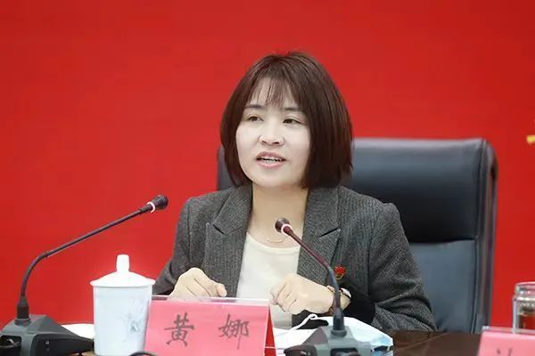
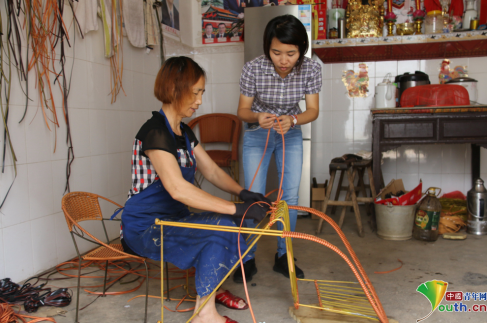

# 33岁任镇党委书记的她，递补为省委委员

**撰文 | 刘艺龙**

据《江西日报》消息，7月22日，中共江西省委十五届四次全体（扩大）会议圆满完成各项任务，在南昌胜利闭幕。全会按照党章规定，决定递补汤立新、孙朝辉、姚格平、钱昀、徐兰宾、涂琼理、黄娜等7名同志为省委委员。

政知君注意到，新递补的省委委员黄娜出生于1988年10月，今年35岁，现任江西省抚州市临川区抚北镇党委书记。

公开资料显示，黄娜毕业于江西理工大学，研究生学历。2013年研究生毕业后，黄娜加入大学生村官队伍，先后任抚州市临川区唱凯镇东湖村书记助理、村党支部书记、村委会主任，唱凯镇党委副书记、镇长、团委书记。

2021年7月，33岁的黄娜出任江西省抚州市临川区抚北镇党委书记，同年11月，当选省委候补委员。

黄娜曾获江西省“优秀大学生村官”，抚州市“优秀党务工作者”、“优秀团干”、第二届“抚州青年五四奖章”等荣誉。

2021年6月，黄娜被中共中央授予“全国优秀党务工作者”称号。同月，她被江西省委授予“江西省优秀党务工作者”称号。

黄娜还是中共十九大代表。

据中国江西网报道，2014年，抚州市临川区唱凯镇东湖村“两委”面临班子人难选、党员作用难发挥、干群关系矛盾突出、村级集体经济负债累累等困境，时任大学生村官的黄娜挑起村党组织书记的重担。

面对村党员干部“庸、懒、散”等现状，黄娜规范了村干部管理制度，修订完善了班子分工责任制、民主议事制等制度，通过明确村干部分工定权、责，村内事务例会商议决策，在干部管理做到“三分三合”，即职责上分、思想上合；岗位上分、力量上合；工作上分、目标上合，充分发挥班子成员的工作主动性和积极性，大家一起干、一起拼的干事氛围，逐步把一盘散沙的班子凝聚了起来。

2014年以来，黄娜还通过向上级申请项目资金，村民理事会向乡贤筹集资金近四千万元，用于村级基础设施建设。目前，4个自然村已全部完成新农村建设，新建3个文化休闲广场，村内外30多公里道路全部实现硬化、亮化、绿化，自来水、天然气、有线电视、电话和宽带全部入户。

作为大学生村官，黄娜并非学农出身，种养殖业一窍不通，但是黄娜始终认为，“一个村子要发展，肯定得有自己的产业。”

通过一年的广泛调研，黄娜决定依托水稻种植全机械化的巨大市场需求及村级农机现有资源优势，提出由村党总支牵头成立唱凯东湖农机专业合作社，吸收本地农机户带设备入社，走合作化订单道路，开始了村集体经济发展的“破冰之路”。

此外，村里还成立了抚州市临川区绿湖农业发展有限公司，重点攻克育秧技术，实现水稻生产“四化”服务，即：种子良种化、育秧标准化、供秧商品化、插秧机械化，补齐合作社机插秧服务的短板，2020年完成1.08万亩育秧订单作业。同时，50余名弱劳力者、半劳力者或妇女在公司实现家门口就业。2020年集体经济收入102万元。

**资料｜江西日报 中国江西网 大江网 中国青年网等**

**【版权声明】本文著作权归政知新媒体独家所有，未经授权，不得转载。**

