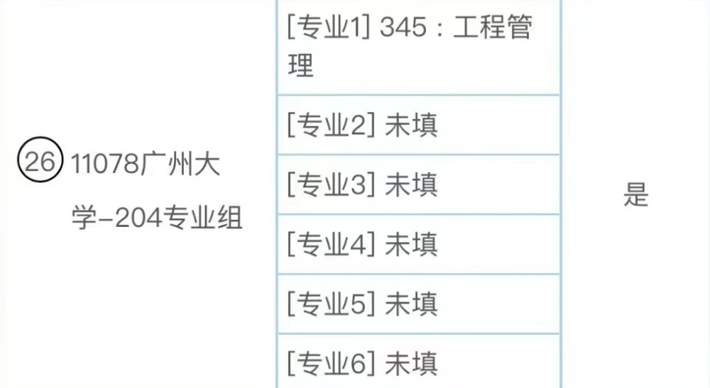

# “大家都在赌”：453分捡漏上广州大学，校方“措手不及”

_广州大学校园。（广州大学官网/图）_

有那么一刻，苏铭忘记了自己有没有报考过广州大学204专业组，当初帮忙参谋志愿的哥哥也想不起来了，因为哥俩填报广州大学这一志愿时，实在太过漫不经心。

苏铭高考成绩551分，在广东省排名7万多。按照以往，这是怎么也不会被广州大学录取的位次。但2023年7月19日晚8:10，家族群里突然弹出一条消息，是母亲发来一张截图：广州大学当日公布的最低投档排名到了21万，比去年下降了整整15万位。

哥哥苏勇催促他赶紧确认是否填报过204专业组，苏铭还懵着，回了一句“我感觉那个是假的”。

长这么大，没有比这次更破天荒的好运气了。他看到自己志愿填报单的第26栏，正是广州大学204专业组，工程管理，服从调剂。

“最低排名21万也太疯狂了，我还是不相信，但我后来又看了一眼，确实有那么狠，我绝对稳了。”说不开心是假的，当得知土木工程专业是广州大学的王牌专业时，苏铭还是抑制不住地笑出声来。

次日，广州大学就因这一王牌专业遭遇史上最冷寒流登上微博热搜榜。普通物理类204专业组（规划建筑与土木工程组）招生最低分453分，这个成绩，还不如刚刚从专科跻身本科的深圳职业技术学院，后者物理科招生最低分555分，高出广州大学一百多分。

有网友将广州大学与深圳职业技术学院对比，戏称深圳职业技术学院是专升本，而广州大学却是“本升专”。据官网介绍，广州大学是广东省高水平大学建设计划重点建设高校，在2022软科世界大学学术排名榜中位列中国内地高校第78位。

“今年确实也让我们措手不及。”广州大学宣传部的工作人员对南方周末记者说。网络上的话题讨论度高涨，他们不得不一次次对外解释学校门槛降低的原因。“应该理性看待广州大学土建类专业招生异常，这里面也有行业发展的周期性问题。”

事实上，近年来土建类等专业遇冷已不是个别事件，很多高校都有类似遭遇。这也让不少考生在报志愿时，有了“赌一把”的野心，最终成功“捡漏”。

_苏铭第26个志愿填报广州大学204专业组。（受访者供图/图）_

**楼市低迷拖累土建专业？**

“我们这次分低，主要是204这一个专业组，其他专业组都是正常的。”广州大学招生办的工作人员告诉南方周末记者，“跟招生人数有关系，招生组计划这一组招651人，而且这个专业组里面都是比较冷门的专业吧，报考的学生比较少。”

规划建筑与土木工程专业组最终招生652人，最高分590分，最低分453分，平均分549.18分。

“为什么要招一名计划名额之外的低分考生？”不少网友产生质疑。广州大学宣传部回应，多一个档属于正常现象，“我们使用了预留计划，所以广东省考试院就给我们多投了一个档”。

另一边，深圳职业技术学院招生办工作人员告诉南方周末记者，深圳职业技术学院于2023年1月专升本，招生质量和数量均有明显提升，往年招的都是专科生，今年全是本科生。“今年这个分数，我们所有老师也很惊讶，因为是本科嘛，比较多的人报，投档分数高的可能把分数线给拉上去了。”

之所以与广州大学的204专业组造成较大差距，该工作人员称，学院内整个物理科招生170人，最低分555分所在的203专业组总计招生62人，所以整体分数区间偏高。“其他院校招收本科的年份比我们久，招收人数也在我们之上，可能他们按照招生人数录取，最后一名就排到那么低的分数了。”

“与往年相比，今年的专业组设置不一样。”广州大学招生办的工作人员补充。南方周末记者注意到，今年是广东实行“院校+专业组”投档方式的第三年，在过去两年，广州大学的土木类专业属于“工程技术组”，该组还包括教育技术学（师范）、材料科学与工程、机器人工程等数十个相关专业。2023年，土木类、建筑学、城乡规划、风景园林和工程管理五个领域相近的专业，组合为“规划建筑与土木工程组”。

对此，广州大学官方信息显示：为按学科类别持续优化专业组设置，细分学科相近或类别相同专业设置院校专业组，新设“规划建筑与土木工程组”，将土木工程类专业集中，更能契合考生兴趣特长，减少考生调剂，便于有志从事该行业的学生精准选择。

“广州大学以前是大类招生，热门、冷门专业混合成一个专业组，报的人还多，考生像拆盲盒，因为很可能被调剂到自己不喜欢的专业；现在分得细了，一个专业组内全都是土木工程，偏偏这个专业太冷，分数好一点的考生都不愿意报。”从事高考志愿辅导工作十余年的乐云向南方周末记者分析。

土木专业冷到什么程度？“同济大学土木工程专业位数全国第一，以前分数很高的，现在录取分数也降下来了。”乐云举例说。

从事志愿填报辅导工作两年的周培钰也有同感：“高考填报志愿季，主动找我咨询的同学有800名左右，其中咨询土木建筑专业的只有一两个。”

“任何行业的发展都有其周期。近二三年楼市低迷，让传统土建类专业陷入发展固化和认知偏差的迷局。”广州大学宣传部的工作人员认为，一些家长和社会人士对土建行业需求的专业认知存在误区，导致社会面和网络宣传出现诸多信息不对称的问题。“广州大学等高校今年的土建类专业招生异常，可解读为部分家长、考生们对行业发展不确定性的担忧。”

冷门专业招生人数居高不下，报考人数却持续减少。这种情况下，“捡漏”现象愈发普遍。不少考生在分数不够的条件下，抱着“赌一把”的心态，将名校的冷门专业放在志愿填报单前列。

广东本科投档数据公开第二天，一位高考487分的广东考生跟乐云留言，自己成功“捡漏”广州大学204专业组。“他的分数不占优势，随便冲了个好学校的冷门专业，没想到冲上了。”

据乐云了解，四百多分“捡漏”上广州大学的考生不在少数。“这是什么概念？土木是广州大学的王牌专业啊，现在只要专科水平的成绩就可以上。”

**“反正有45个志愿可以报”**

7月21日下午4:16，苏铭收到了广州大学的录取通知信息。

一天之内，7位亲友向他发讯息表达祝福。其中一位好友的祝福，让苏铭有点说不上来是什么滋味儿。那是一个成绩比自己高出9分的同学，省内排名比自己提前8000名，最后被一个普通二本录取了。“如果他报广大，肯定能进的。”

大多数考生不会将明知自己考不上的学校填进志愿填报单，但苏铭敢填，“前面填清华北大都可以，反正有45个志愿可以报。”

“捡漏”的主意是哥哥苏勇提出的。高考结束后不久，苏勇参加了弟弟学校举办的志愿填报说明会，得知如今志愿填报的方式与前几年大不相同。“2019年，我们填报志愿的时候，需要先确定学校，每个学校可以填报6个志愿，现在是可以填报45个专业组，每个专业组可以填写4个专业。”

“灵机一动，把华南农业大学、广东工业大学、广东外语外贸大学和广州大学作为冲击院校，填报这4所大学中，除中外合作办学项目外的全部专业组，都服从调剂。”苏勇将4所学校均填在志愿填报单靠前的位置，以此提高弟弟“捡漏”成功率。

“我报的专业有好多，前面那些能冲好学校的专业，我几乎都报了，也不觉得那些专业冷。”当被问及土木工程是什么时，苏铭想了想说，“感觉好像跟工地是挂钩的吧，我没什么概念。”

与对冷门专业知之甚少的苏铭不同，浙江考生程琳提前盯准冷门专业可能会断档的机会，决定趁机冲一回重点学校。

程琳高考成绩为607分，全省排位45000名左右。这比她平日里的成绩，低了将近20分。查到这个成绩时，她就知道，报考“梦校”宁波大学，应该是没戏了。

填报志愿的那段时间，程琳知道了专业有热冷之分。“我父母喜欢看张雪峰的视频，他们说现在财会、工商管理等专业的就业前景好，但是小语种、新传等专业差一些。”于是，程琳动了通过报冷门专业“捡漏”的念头。

当她用某志愿填报软件分析成绩和排名时，宁波大学的德语专业赫然出现在推荐冲刺名单之列。“如果我报这个专业，说不定可以‘捡漏’，虽然几率很小，但可以赌一把。”

在没有详细了解德语专业的前提下，她抱着争取进“梦校”的最后一丝希望，将宁波大学的德语专业填进志愿填报单的第21栏。

7月20日中午，浙江省投档分数线公布。程琳的分数高于宁波大学德语专业的最低录取线。“往年宁波大学德语专业的最低录取位次一般在3万名左右，我的排名基本不可能，完全没有想到自己能被录取。”

**“大家其实都在赌”**

“如果想冲名校，像新闻传播、土木工程、小语种这些都是非常好‘捡漏’的机会，只要是有这些专业的专业组，都可以大胆报。”乐云此前在辅导志愿填过程中，这样提醒一些成绩处于中后水平的考生。

之所以存在大量“漏”可以捡，多位从事辅导志愿填报的人士告诉南方周末记者，这与考生整体报考志愿的态度发生转变密不可分。

“最近几年考生‘捡漏’机会很多，因为大家更注重专业，对学校的执念没有以前那么强了，就空出来一些好学校的冷门专业录取名额。”今年乐云接待过的考生家长，10个里面有9个都明确表达要专业优先，“这个变化真的很大”。

“保专业的同时，势必不能太看重学校。”周培钰也见过这样大把的学生，明明可以选更好的985、211，但为了保专业，主动降低报考学校的档次。“他们会宁愿去上那些普通双非学校的热门专业，也不去中流或末流的211读冷门专业。”

据周培钰观察，全国除实行“专业+院校”模式的5个省份之外，其他地区的考生优先专业而采取稳健填报倾向更加明显。

“假如我是一个文科生，要保住现在热门的法学专业，那我宁愿去降20分往下填。”周培钰介绍，考生填志愿有一个策略——服从调剂，否则没通过就会滑档。“如果你既要服从调剂，又想确保专业，就必须把学校档次往下降，这也会导致很多名校的‘天坑’专业几乎无人问津，提档线也随之下行。”

多位受访人士告诉南方周末记者，相对于文科院校及文科专业的低迷，工科院校及热门工科专业如电器、计算机等专业，如今成了“香饽饽”。

例如山东理工大学的电气工程专业，2023年在山东招生录取排位暴涨15000位、广东工业大学集成电路专业，普通批录取排位较去年继续上升，达到2.9万位。这一排位，已经超过身为211院校的暨南大学和华南师范大学录取分数线。电气专业在工科里热度变高，周培钰分析其原因是：电气未来有一个出路，可以进电网。

“今年的卫生专项、师范专业，公费师范生，包括临床医学这些专业都是大热门，而且录取分数线还在持续提高。”乐云补充道。

也就是说，如今的学生填报志愿，选择专业的出发点主要分为两类：冲着薪酬待遇高的行业，或者冲着稳定的体制内工作。

对比之下，刚刚实现梦想的程琳很快高兴不起来了。“很多人说，德语以后就业比较困难。如果考公，对口岗位少；进外企，招聘人数少；留校当老师，学历门槛高。确实很冷门。”

还没有入校，她就已经开始评估转专业的可行性。“网上全是劝退信息，现在真的非常迷茫，不知道以后就业能干嘛。”

另一位志愿报考规划师满路则认为，目前很多考生和家长对“热门”和“冷门”专业的认知存在偏差。“大部分人获取信息的渠道是社交媒体，现在我们谈到的就业形势，大部分都是基于个体的经验，缺乏展现各个专业真实就业形势的权威数据，这就产生了幸存者偏差，让很多家长误以为某些专业很好就业、非常热门，有些专业则是‘天坑’，这些信息的真实性其实有待考究。”

乐云也担心，考生一窝蜂地跟风式报考所谓的热门专业，长此以往会导致整个行业水涨船高，“一方面分数越抬越高，另一方面，这些领域从业人员变多，将来竞争也会激烈”。

“反倒冷门的专业，大家都不愿意报，说不定几年后会时来运转，这个很难说，所以大家其实都在赌。”乐云说。

（应受访者要求，苏铭、苏勇、程琳、周培钰为化名）

南方周末记者 郑丹 南方周末实习生 张筝 韩艳燕

