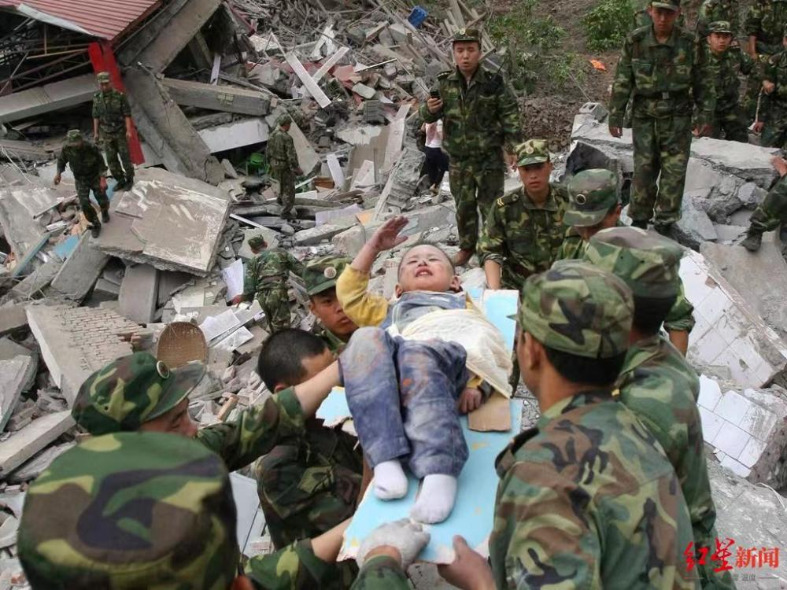
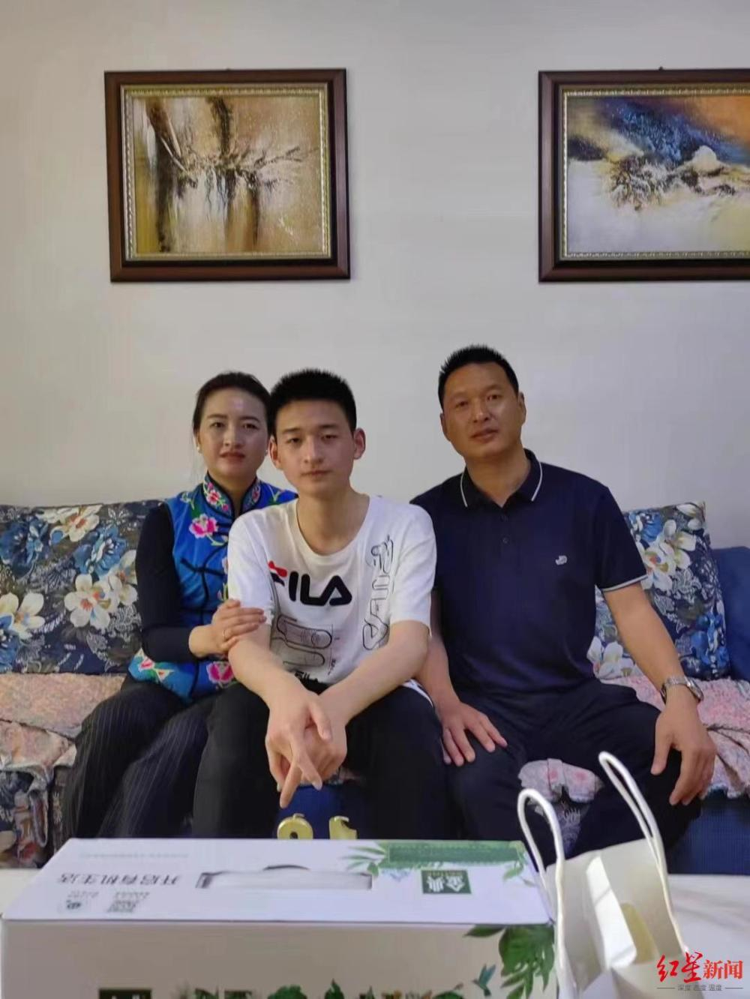

# “敬礼娃娃”郎铮被北大国际政治专业录取 父亲：将送他8月19日去报到

_▲2008年，时年3岁的郎铮在汶川地震中获救后向解放军战士敬礼。图/ICphoto_

7月23日上午10时左右，曾在汶川大地震中感动全国“敬礼娃娃”郎铮和家人通过查询得知，郎铮已被北京大学国际政治专业录取。郎铮的爸爸郎洪东告诉红星新闻记者，郎铮将于8月19日去北京大学报到，他会和妻子一起送孩子去学校。

23日上午，郎铮一家回到了老家北川禹里镇，上午10时左右，他们通过查询得知，郎铮已经被北京大学录取。记者从郎洪东发来的查询录取结果看到，录取专业为国际政治。“应该是8月19日报到，到时我们都会去送他。”郎洪东说。

 _▲郎铮（中）和爸爸妈妈。受访者供图_

郎铮之前在接受采访时表示，他喜欢国际政治，作出了报考北大国际关系学院的选择。他说，如果可以的话，希望经过自身努力，能为自己的国家发声，能捍卫国家的利益，也能够建立更好的国际秩序。

“希望他能通过自己努力，实现自己的愿望。”郎洪东说。

红星新闻记者 汤小均

编辑 潘莉 责编 冯玲玲

