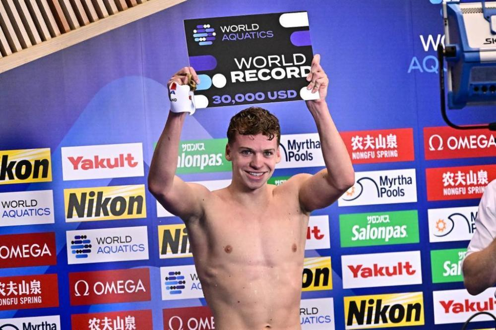

# 人类游泳历史最长寿的世界纪录破了！法国选手马尔尚超越菲尔普斯

 _马尔尚。_

人类游泳历史最长寿、最难破的一项世界纪录在23日晚的福冈作古！

**在福冈游泳世锦赛中，法国选手马尔尚打破了菲尔普斯在2008年北京奥运会创造的男子400米混合泳世界纪录，新纪录为4分02秒50。**

在2008年8月10日的北京奥运会男子400米混合泳决赛中，菲尔普斯以4分03秒84创造世界纪录，正式开启八枚金牌的疯狂之旅。

 _菲尔普斯。_

而在今晚目睹了马尔尚的表现后，菲尔普斯在现场也是起立为他鼓掌。

