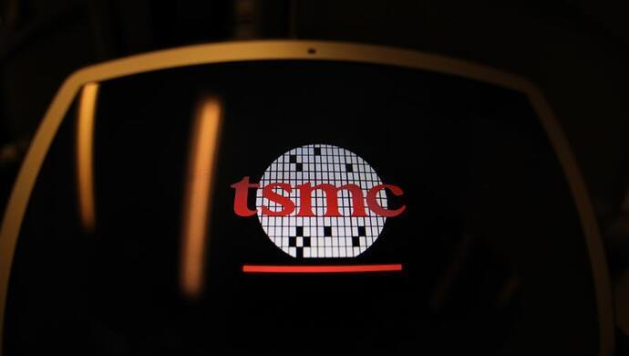

# 台积电推迟在美投产计划，拜登“雄心遇挫”

近日，台湾地区集成电路领军企业台积电证实，由于缺乏专业人员，其在美国亚利桑那州的工厂原定于2024年投产的计划将被推迟一年。有评论称，这凸显出台积电在海外扩张面临的挑战，以及美国政府试图重塑半导体供应链所面临的阻碍。

遇到挑战

台积电2020年5月宣布在亚利桑那州设厂，一年后动工，原计划于2024年投产。

台积电董事长刘德音20日在财报发布会上表示，建厂进程正进入安装专业设备的关键阶段。但是，人员短缺造成进度延误。

“我们遇到了一定的挑战——在半导体级设施中安装设备时缺乏专业人员。”刘德音预计，4纳米制程芯片的量产时间将从原计划的2024年推迟至2025年。

刘德音补充说，为加快建厂进度，台积电正从台湾地区派遣经验丰富的技术人员赴美，对当地技术工人进行短期培训。

上月便有媒体报道了这一消息。《日经亚洲评论》援引知情人士的话说，台积电及其供应商正与美国政府就非移民签证的办理进行谈判，以期最早于7月派遣500多名有经验的工人赴美，以加快无尘室、管道等设备的安装进度。

台积电方面强调，特派人员只会在美停留有限的时间，不会对每天在现场的约1.2万名工人以及该公司在美国的招聘造成影响。

知情人士称，特派人员旨在“提高工作效率，帮助弥补施工过程中失去的时间。”此前，由于在建造半导体生产设施方面具有一手经验的美国工人不足，而且许多人不熟悉工厂要求，多个安装工程延误。

知情人士还表示，美国工人的工资比台湾地区工人的工资高“好几倍”，但其效率不那么有保障。台积电及其供应商已派遣额外力量来监督和促进建设进度。据悉，在完成设备安装后，可能还需要一年时间才能建成合格的生产线。

意料之中

此次台积电在美投产计划遭推迟，可谓意料之中。据台湾媒体此前报道，台积电原本就对赴美设厂反应冷淡，原因在于成本过高。美国芯片制造人才短缺，也缺乏原材料、IC设计、封装测试等上下游业者。

那么，台积电为何非去不可？台积电创办人张忠谋曾直言，台积电是在美国政府敦促下才选择这样做。

舆论注意到，近年来，在大国竞争背景下，美国政府在高科技和尖端前沿领域持续发力。

例如，美国总统拜登去年8月签署总额高达2800亿美元的《芯片与科学法案》，试图通过对本土芯片产业提供巨额补贴，吸引更多资金、生产活动以及就业岗位转移至美国。

去年10月，美国政府还颁布全面限制措施，旨在遏制中国芯片行业发展。据报道，上述措施预计会在今年7月底前进一步扩大。

与此同时，作为全球规模最大的半导体制造企业，台积电难免引起美国的目光。舆论注意到，以“台海安全风险”为由，要求台积电将人才和产能转移美国，符合其自身利益。

据悉，台积电原本计划在美投资120亿美元，此后提高至400亿美元。有评论称，这是美国历史上规模最大的海外投资之一。

不过，一家亚洲企业要将生产业务转移至大洋彼岸，难免“水土不服”。2022年2月，有消息称，受新冠疫情和劳动力紧缺影响，台积电亚利桑那工厂的建设进度比预期晚了三到六个月。

贝恩公司合伙人彼得·汉伯里（Peter
Hanbury）注意到，台积电在台湾地区开展生产活动较为顺利，但要在海外建立生产能力并非易事，涉及不同工作方式、经营管理模式以及法律环境等。而美国当前的劳动力紧缺可谓雪上加霜。

《日经亚洲评论》称，台积电在台湾地区开设的芯片工厂通常可以在30个月内投产，但要让美国工厂投产可能需要三年多的时间。

眼下，台积电在美投产计划被推迟至2024年美国总统选举之后，也被视为拜登的雄心遇挫。尤其考虑到拜登已发起竞选连任，而亚利桑那州预计将在明年大选中成为“战场州”。

接下来，在为竞选奔走的过程中，拜登能否说服选民他的经济政策将推动当地经济发展，出现了变数。此外，尚不清楚新一届政府上台后，《芯片与科学法案》会否发生变化。

荷兰光刻机生产企业阿斯麦警告称，政界人士似乎低估了建造新芯片厂的复杂性。

