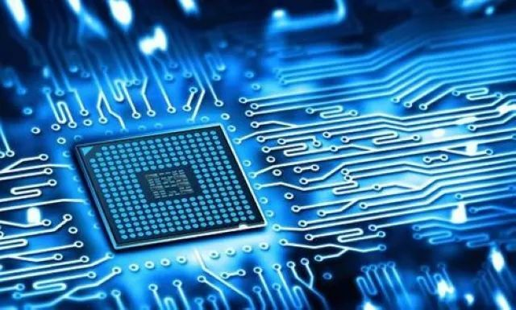

# 日本半导体出口管制正式生效，专家：日方“共输”行径损人不利己

继美国与荷兰之后，7月23日，日本限制半导体制造设备出口的新规正式生效。

此前，在经过一个多月的意见征询后，5月23日，日本经产省公布《外汇法》修正案，将先进芯片制造所需的23个品类的半导体设备列入出口管制对象。

在7月13日举行的商务部例行新闻发布会上，新闻发言人束珏婷表示，希望日方从维护自身利益和中日经贸合作大局出发，信守自由贸易和市场经济承诺，遵守国际经贸规则，避免对两国经贸合作进行政治干扰、限制企业正常自主经营和企业间公平竞争。

上海对外经贸大学教授、日本经济研究中心主任陈子雷告诉第一财经，此次日本出台半导体设备的出口管制法规，冷战意识严重，有违世贸组织下自由贸易原则，与经济全球化和多边主义背道而驰。“日方‘一意孤行’推动实施这一法规，不但对中日两国，也对整个东亚区域乃至全球的半导体领域的产业链、供应链都会带来一定的冲击，而日本企业也将为此承受巨大损失，这种‘共输’行径实在是损人不利己。”

**美国影响不可忽略**

日本此次限制出口的23种半导体材料和设备中包括了多种关键性材料，例如氟化氢、蚀刻液、聚酰亚胺和高纯度氮等。

**具体而言，涉及光刻/曝光领域的有4项，即先进制程的光刻机/涂胶显影机/掩膜及制造设备；涉及刻蚀领域的有3项，分别是湿法/干法/各向异性的高端刻蚀；涉及清洗领域的有3项：即铜氧化膜、干燥法去除表面氧化物、晶圆表面改性后单片清洗。涉及最多的是薄膜领域，达11项。此外，涉及热处理和测试领域的各1项。**

日本政府规定，新增的23个品类产品除了面向友好国家等42个国家和地区之外，向其他地区的出口都需要获得个别许可。据陈子雷了解，这意味着今后日本企业在涉及该领域产品对华出口时，必须获得经日本经济产业大臣审批的单独许可证后方可对华实施出口；
**而单独许可证所需申请文件类型及手续将极为繁杂，其中包括需要追加提交证明用户业务资质、出口产品用途、用户承诺文件等诸多附件资料。“这使该领域产品的对华出口形成壁垒，严重损害了世贸组织机制下奉行的贸易自由化和便利化原则，对中日两国的贸易往来带来诸多负面影响。”他说道。**

日本半导体制造装置协会（SEAJ）在致第一财经的独家回复中表示，去年10月美国政府宣布的半导体制造设备出口管制（对日本）产生了很大影响，“由于美国针对半导体出口设备限制的影响，日本企业在中国市场的布局不得不做出改变。”

今年年初，美国、荷兰、日本三国政府达成协议，将对中国芯片制造施加新的设备出口管制和限制。6月30日，荷兰宣布将部分光刻机等半导体相关产品纳入出口管制。对此，中国半导体协会当时回应称，此举如果成为现实，在对中国半导体产业造成巨大伤害的同时，也将对全球产业及经济造成难以估量的伤害，对全球最终消费者的利益造成长期伤害。中国半导体行业协会反对这一破坏现有全球半导体产业生态的行为。反对这一干涉全球贸易自由化、扭曲供需关系和供需平衡的行为。反对这一试图将中国半导体产业排除在全球产业体系及市场自由竞争之外的行为。

陈子雷也告诉第一财经，日本此次生效半导体设备出口管制法案，正是其配合美国所谓的“经济脱钩”战略的一部分，具有浓厚的冷战色彩，与现有中日经贸格局形成了鲜明的反差，“虽有日本政府官员曾出面试图撇清此举与美国的关联，声称是为了阻止先进技术被用于军事目的。但就出台管制的内容和性质而言，毫无疑问就是对美国‘封杀’和打压我高科技产业发展战略的具体落实和响应，是今年初美日荷三国芯片协议的主要体现。”

**“中国市场对于日企依旧重要”**

不少媒体认为，虽然日本明面上没有提及“中国”，但此举很明显是在配合美国。这直接导致日企涉及上述领域相关产品今后很难再向中国市场出口了。

对此，
**日本半导体制造装置协会在回复第一财经时表示，协会也非常关注日本政府的表态，“关键在于是否会有任何‘额外’的冲击。2022年，中国是全球最大的半导体设备市场。我们相信，中国市场对于日本企业而言依旧重要”。**

中日在半导体领域的经贸合作有多密切？

目前，在半导体制造设备市场上，日本企业占据约30%的全球市场份额，拥有非常大的竞争优势。中国是日本半导体设备主要的出口对象国，占其出口比重接近40%。联合国国际贸易中心的统计显示，日本2021年向中国大陆出口的制造设备约120亿美元，出口额占出口到全世界的设备的近四成，在所有地区中最高，也是美国对华设备出口的近两倍。日本企业来自中国大陆的营收占企业全部营收占比达20%至30%。

陈子雷告诉第一财经，其实，在半导体产业合作上，日本企业非常重视来华投资和生产合作，“多年来，两国企业的合作做到优势互补、错位竞争、共同发展。可以说，中日半导体产业领域的合作高度符合两国利益。”

在一众与半导体行业相关的日企中，主营半导体制造前道工序设备、全球排名第三的半导体设备厂商东京电子（TEL）在给与第一财经的独家回复中表示，作为企业，无法就涉及双边或多边的政策决策做出回应。

东京电子2022财年的财报显示，受经济形势以及美国对华出口管制新规影响，将该年度（2022年4月-2023年3月）的业绩目标全面下调，这也是东京电子近4年来首次下修财测目标。其中，合并营收目约下调2500亿日元（约合人民币126.2亿元），下调幅度为10.6%。东京电子社长河合利树曾对媒体表示，“营收下修金额（2500亿日元）中，约一半左右来都是来自于美对中国大陆半导体产业的出口管制新规的影响。”

此外，主营半导体检测设备、全球排名第六的爱德万测试（Adavantest）并未回复。第一财经从在特殊曝光设备占据主导的几家日企了解到，他们都希望与中国市场保持合作。

5月底，中国贸促会新闻发言人王琳洁应询表示，日本政府出台半导体制造设备出口管制措施未审慎考虑中日双方各界担忧，将冲击半导体产业链供应链安全稳定，严重损害中日两国企业利益。

日本半导体制造装置协会发布预测称，2023年度日本生产的半导体设备销售额将比上年度下滑23%，降至3.02万亿日元（约合1535亿元人民币）。对此，协会给出的理由是，需求低迷，且短期内难以看到好转的迹象。这已是日本半导体制造装置协会进入2023年来第二次调降设备销售预期。不过，对于未来，日本半导体制造装置协会认为，从中长期来看，全球市场对半导体设备的需求仍会进一步增长。

