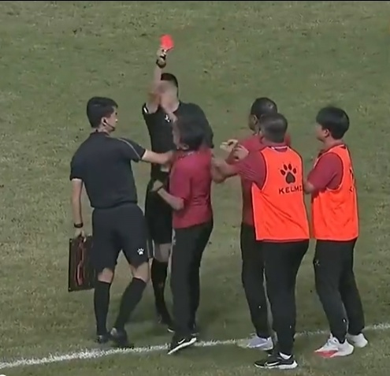
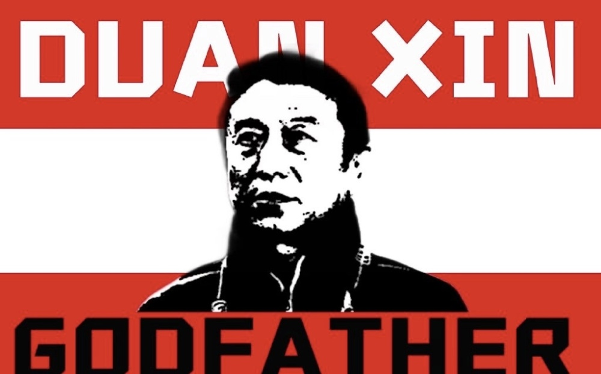
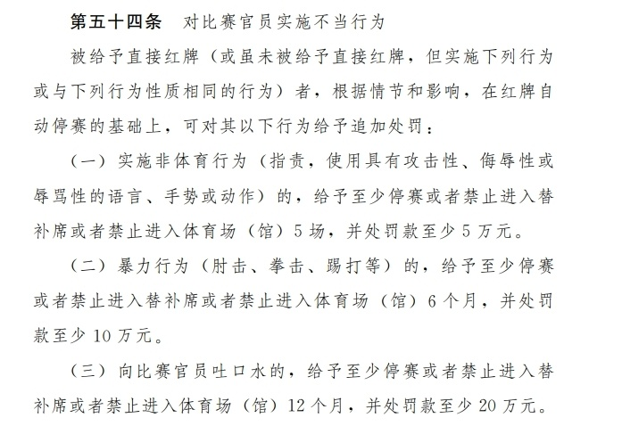

# 活久见！中甲主帅不满判罚，被直红罚下后掌掴主裁+气晕，恐禁赛半年

在北京时间7月23日晚进行的中甲第15轮南京城市与辽宁沈阳城市的比赛中，辽宁沈阳城市主帅段鑫因不满裁判判罚，被主裁陈浩出示红牌罚下后，一怒直接掌掴裁判的脸。

当时比赛进行到伤停补时阶段，主场作战的南京城市依靠外援梅西-
保利的进球，1-0领先于辽宁沈阳城市。补时阶段，沈阳城市后卫罗安东被主裁出示黄牌警告，而这也引发了沈阳城市主帅段鑫的强烈不满。

他在场边不断向主裁抱怨，主裁先是向段鑫出示黄牌，但后者情绪依然十分激动，最终主裁选择直接将段鑫红牌罚下。而已经暴走的段鑫，盛怒之下一掌打在了主裁的脸上。若不是随后段鑫被球员和场边工作人员拉住，否则他可能会对主裁做出更多争议行为。值得注意的是，段鑫在掌掴主裁染红后，他还被气晕，救护赶忙进场对其救治。

1961年出生的段鑫出生于沈阳，曾执教过绍兴、黑龙江冰城和辽宁沈阳城市等多支低级别联赛球队。他曾在2003年带领沈阳市青年足球队获得全国青年联赛总冠军，2005年带领辽宁省足球获得第十届运动会第三名，2013年带领哈尔滨毅腾获得甲级联赛亚军，第十三届全运会男足城市组比赛获得全运会银牌。

因为不冷静掌掴主裁，按照规则段鑫可能会遭到中国足协至少停赛半年的重罚。他的执教生涯，恐怕也将因此受到重大影响。

