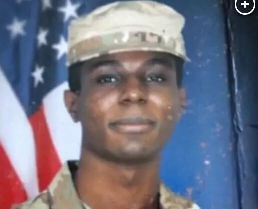
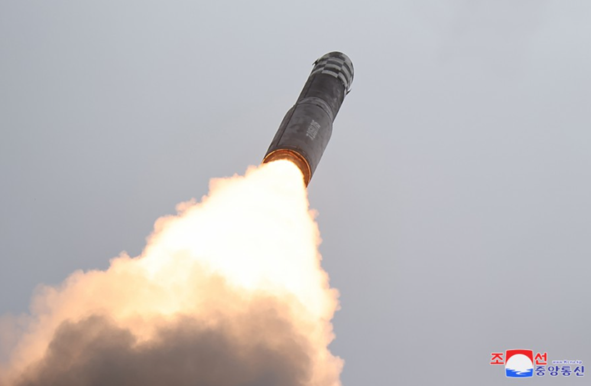

# 美军士兵越境朝鲜，专家：是朝美对话接触的契机 朝方处理有两种可能

美军士兵特拉维斯·金（Travis King）放声“哈哈哈”大笑越境朝鲜后，朝鲜对此只字不提，美国一时陷入困境。

美韩举行声势浩大军演、朝鲜多次发射导弹、美战略核潜艇时隔40年停靠朝鲜、朝鲜军政高官连续发表强硬讲话……在朝鲜半岛局势新一轮升级背景下，特拉维斯·金越境朝鲜成为紧张局势下的出人意料的
“插曲”，这个“插曲”如何影响半岛局势引人关注。

 _美军士兵特拉维斯·金（Travis
King）_

**士兵越境：美国愕然，朝鲜沉默**

特拉维斯·金越境朝鲜后，朝鲜官方对此只字不提，美方目前则动用多种手段接触朝鲜。美国有线电视新闻网（CNN）7月20日报道称，美国试图通过联合国军司令部与朝鲜取得联系，并要求韩国政府提供协助。同时，美国也将尝试通过代表美国利益的瑞典驻朝鲜使馆与朝鲜进行接触。

当地时间7月19日，美国国务院发言人马修·米勒在新闻发布会上表示，“昨日（18日）美国国防部试图联系朝鲜人民军方面，但据我所知，朝鲜并未作出回应。”米勒表示：“美国正在积极收集相关信息，寻找特拉维斯的下落。政府将持续采取积极行动，确保其人身安全与遣返。”

23岁的美军二等兵特拉维斯·金在7月18日越境朝鲜。美国国防部发布的信息称，特拉维斯·金在2021年入伍，目前正面临纪律处分。此前，他因殴打韩国人涉嫌袭击罪名被拘押47天，还曾因踢破到场的韩国警察巡逻车门被罚款，释放后在驻韩美军某基地受到一周禁闭处分，军衔因此未能晋升。越境之前，特拉维斯·金被要求遣返回国接受进一步纪律处分，但在被送到机场后没有登机，并自行报名参加一个旅行团前往共同警备区参观，随后越过军事分界线，进入朝方一侧。

CNN报道称，共同警备区韩方一侧的韩军士兵在发现特拉维斯·金走向朝方一侧时大喊“抓住他”，导游曾试图追赶该名士兵，但没有抓住他，有人看到他被朝鲜士兵拘留。目前尚不清楚特拉维斯·金是否计划叛逃。驻韩美军发言人艾萨克·泰勒上校称，这名士兵“在未经授权的情况下故意越过军事分界线进入朝鲜”。

白宫发言人卡琳·让-皮埃尔也在新闻发布会上表示:“我们正在尝试收集相关信息。要还原事实经过需要花费一段时间。”之后，皮埃尔又补充道:“美国国防部正在与朝鲜方面的朝鲜人民军进行联系。”

朝鲜如何处理擅自越境的特拉维斯·金备受外界瞩目，但截至目前朝鲜官方未对此事进行回应，朝鲜媒体也尚未对越境事件做任何报道。

值得关注的是，朝鲜国防相强纯男7月20日发表谈话回应美战略核潜艇停靠韩国，强纯男警告美“俄亥俄”级战略核潜艇停靠韩国对朝鲜是直接的核威胁，此举可能符合朝鲜使用核武器的条件。强纯男谈话中没有提及任何关于美军士兵越境朝鲜的信息。

韩联社刊文称，据推测朝方可能正在调查这名美国士兵的身份，审问他越过韩朝非军事区的动机和背景，以及是否真心投奔。

辽宁大学国际关系学院副教授李家成接受澎湃新闻（www.thepaper.cn）采访时表示，朝鲜至今对此事保持沉默是因为美国士兵越境的话题相对敏感，朝鲜需要时间制定预案，其次与朝鲜半岛的安全局势有关，近期美国派出战略导弹潜艇停靠朝鲜半岛，朝鲜对此颇为不满。

_美军战略核潜艇“肯塔基”号停靠韩国釜山作战基地。_

**局势紧张：氛围不利，或成博弈筹码**

据韩国《民族日报》报道，2018年5月，为准备当年6月举行的首次朝美首脑会谈而访问平壤的时任国务卿蓬佩奥将3名美国公民带回美国，前总统比尔·克林顿也于2009年与两名被朝鲜扣留的美国记者一起回国，第二年前总统吉米·卡特带着一名美国人返回。

报道称，最近一次发生的美国人故意越界的事件是2018年10月，布鲁斯·拜伦·劳伦斯通过中朝边境非法进入朝鲜后被捕。当年6月朝美首脑会谈后，朝鲜与美国继续讨论无核化问题，一个月后将其遣返，美国政府对此表示感谢。

值得一提的是，之前的情况要么是朝美关系正在缓和，要么朝鲜在积极试图缓和期间，时任美国总统等高官会见朝鲜最高领导人，作为友好对话表达的“诚意”——让美国国民一起随美国来访人员回国，而最近朝鲜与美韩关系不但没有缓和，反而关系不断紧张。围绕韩美联合军演、朝鲜发射新型洲际导弹以及美核潜艇停靠韩国等事件，朝鲜半岛局势再度紧张，甚至有滑向失控边缘的危险。

美国海军“俄亥俄”级战略核潜艇“肯塔基”号在韩美核磋商小组（NCG）举行首次会议的18日驶入釜山作战基地，这是继自1981年的“罗伯特·李”号潜艇后美国战略核潜艇时隔42年再次停靠韩国。

韩国总统尹锡悦在7月19日登艇参观了“肯塔基”号，在登艇前发表的致辞中称，访问世界最强的战略资产之一——美军战略核潜艇“肯塔基”号非常有意义，且令人踏实放心。尹锡悦表示，此举充分体现出韩美两国通过定期出动美国战略资产加强延伸威慑执行力的坚定意志。

正在韩国访问的美国国家安全委员会印太协调员库尔特·坎贝尔则在18日表示，“这是美国核战略潜艇几十年来首次在釜山港停靠，随着美韩核咨商小组（NCG）的成立，跨部门合作与努力将长期开展。”“我们相信，体现美方的相关意志与承诺至关重要。”

据韩联社报道，韩国军方7月19日称，韩军方当天凌晨3时探测到朝鲜在顺安一带向朝鲜半岛东部海域发射2枚短程弹道导弹，导弹分别飞行约550公里后落入日本海。分析人士认为，顺安到釜山作战基地距离550公里左右，此次导弹发射针对性很强，警告意味浓厚。

_朝鲜第二次试射“火星炮”-18固体洲际导弹。_

7月22日，韩国军方发布消息称，22日凌晨，朝鲜向朝鲜半岛西部海域发射了多枚巡航导弹。这是本月朝鲜第三次导弹发射活动，朝鲜曾在7月12日试射了“火星炮-18”新型固体洲际导弹，在朝鲜发射洲际导弹后第二天，美国B-52H战略轰炸机现身朝鲜半岛，与韩国空军进行联演，7月16日，美日韩三国“宙斯盾”战舰又在日本海举行联合反导演练。

李家成分析认为，朝美关系自拜登政府上台之后，双方基本算是零接触，而最近围绕美韩延伸核威慑以及战略核潜艇停靠韩国，朝鲜反应强烈，双方军事层面的交锋非常激烈，朝鲜和美韩关系更加紧张，没有一个比较好的处理越境事件的氛围。

南开大学亚洲研究中心副主任李春福告诉澎湃新闻，对于美军士兵越境事件，美国是着急的一方，有求于朝鲜，朝鲜不需要着急，可以暂时冷处理，静观变化。“美国要把越境朝鲜的士兵带回就得接触朝鲜，这是朝美对话接触的一个契机，事态后续发展值得关注。”李春福补充说。

李家成表示，此次事件是朝鲜半岛紧张局势下的“意外”事件，朝鲜处理此事两种可能性：一是在较短的时间内归还美国士兵，二是作为朝美之间一个长期博弈的谈判筹码。

美国士兵越境进入朝鲜对拜登政府很可能是一次危机。分析认为，拜登政府会面临更大的压力，为释放美国士兵而花费心思。按照先例，美国应该会派高级别官员前往朝鲜进行谈判，但美国官员能不能见到美国士兵，能不能到朝鲜探访，涉及一连串复杂的外交。

李家成认为，美军士兵越境事件意外让朝美开启对话接触，但朝美双方目前在围绕一些重大核心问题分歧严重，即使接触对话很可能也是围绕美军士兵越境事件就事论事，很难保证对话会延续下去并扩展到解决朝美矛盾的层面上。

若特拉维斯·金在朝鲜寻求政治避难，留在朝鲜，那此次越境事件可能就陷入长期化，此前有美军士兵越境朝鲜，之后在朝鲜长期工作生活，甚至有越境士兵在朝鲜结婚，生育的孩子还加入了朝鲜军队。

**背景资料：6名投靠朝鲜的美军士兵**

根据公开资料显示，自1953年朝鲜战争停战到冷战结束，有6名美国士兵投靠了朝鲜，最后一次发生在1982年，目前6名投靠朝鲜的美军士兵都已去世。

**纳赖瑞·艾布什尔（1962年）**

第一位越境投靠朝鲜的美军士兵是来自伊利诺伊州的赖瑞·艾伦·艾布什尔（Larry Allen
Abshier）。1962年5月28日，19岁的艾布什尔悄悄离开韩国的驻军基地，穿过非军事区域，进入朝鲜。

艾布什尔共有过两段婚姻，前任妻子是朝鲜人，后任据悉是来自泰国，她们都没有与其生育孩子。艾布什尔于1983年7月11日因心脏病去世，享年40岁，朝鲜政府承办了葬礼。

**詹姆斯·约瑟夫·德雷斯诺克（1962年）**

在赖瑞·艾布什尔投靠朝鲜3个月后，一等兵詹姆斯·约瑟夫·德雷斯诺克（James Joseph
Dresnok）也投靠朝鲜，成为第二个投靠朝鲜的美军士兵。他因一句“就算你往桌子上放10亿美元的黄金，我也不想离开朝鲜。”被人熟知。

德雷斯诺克后来在英国制作的纪录片《越过边界》，讲述他当年是如何穿过雷区进入朝鲜，还描述他在进入朝鲜后与查尔斯·罗伯特·詹金斯（Charles Robert
Jenkins）及另两名美国投靠朝鲜的士兵——赖瑞·艾伦·艾布什尔和杰瑞·韦恩·帕里什（Jerry Wayne
Parrish）数年来一直过着与世隔绝的生活。这四名士兵在1972年终于获分配独立的寓所，并得到朝鲜国籍。德雷斯诺克后来在大学教授英语，并为朝方翻译文章。德雷斯诺克后来在描写1968年“普韦布洛号事件”的朝鲜电影《对决》中饰演美军参谋长联席会议主席，在朝鲜有一定的名气。

德雷斯诺克在朝鲜先后结过两次婚，生下三个儿子。2016年，被称为“朝鲜最后一名在世的美国逃兵”的德雷斯诺克于平壤去世，终年74岁。

**杰瑞·韦恩·帕里什（1963年）**

来自肯塔基州的杰瑞·韦恩·帕里什（Jerry Wayne
Parrish）于1963年12月越过边境投靠朝鲜。在1965年詹金斯出现之前，人们对帕里什在朝鲜的经历知之甚少。对于帕里什出逃的动机，詹金斯在他的书中描述称，“他没有详细说明这些原因，只是说如果他回家的话，他的岳父会杀了他。”德雷斯诺克则在他的纪录片中表示，帕里什收到了来自继父的死亡威胁，继父指控他与继姐妹发生性关系。

帕里什后来与黎巴嫩女子西哈姆·施赖特(Siham
Shraiteh)结婚，并育有三个儿子。1998年8月25日，帕里什因肾病去世。西哈姆和他们的孩子仍留在朝鲜。

**查尔斯·罗伯特·詹金斯（1964年）**

查尔斯·罗伯特·詹金斯（（Charles Robert
Jenkins）是6名投靠朝鲜美军士兵中比较出名的。1964年，詹金斯在执行例行巡逻任务时，以“察看前方不寻常的声音”为由中途脱队，之后就没有再归队。两周后朝鲜公布了詹金斯“投诚”的消息，詹金斯并在朝鲜的宣传广播中宣称自己已在朝鲜找到了他的“香格里拉”。

1980年，詹金斯在朝鲜官方拍摄的朝鲜战争相关电影《无名英雄》中，主演一名美军军官。同时詹金斯亦在平壤外国语大学教授英语，同年詹金斯与“被绑架”到朝鲜的日本女子曾我瞳结婚，并育有二女。

2002年，曾我瞳等五名被绑架的日本人得以返日，但詹金斯与两个女儿继续留在朝鲜。2004年7月，詹金斯与女儿离开朝鲜，在印度尼西亚与曾我瞳团聚，随后赴日治病。

同年9月，詹金斯前往东京驻日美军座间基地投案自首，以认罪换取降级为二等兵、开除军籍及30天监禁轻罚。后来詹金斯一家在曾我瞳的家乡新潟县定居。詹金斯于2017年去世，终年77岁。

**郑罗伊（1979年）**

郑罗伊（Roy
Chung）是在美国军队服役的韩裔美籍士兵，1973年，郑罗伊和他的家人从韩国移民到美国。1979年6月5日，22岁的郑罗伊在西德拜罗伊特附近随部队服役时失踪，并被报告擅离职守。30天后，他被列为逃兵。

三个月后，朝鲜平壤广播电台（现为朝鲜之声）宣布他已投诚，称他“无法再忍受在美帝国主义侵略者中过着民族侮辱和虐待的可耻生活”。五角大楼和美国务院坚称这可能是真的，他们没理由怀疑朝鲜的说法，也不会对此事进行重大调查，因为郑罗伊无法接触到机密信息，也不构成安全威胁。

**约瑟夫·T·怀特（1982年）**

约瑟夫·怀特（Joseph T
White）是冷战时期最后一名投靠朝鲜的美国士兵。1982年8月28日凌晨2点左右，他开枪摧毁了通往朝鲜非军事区的一扇大门，从开城附近的哨所走过非军事区，向即将成为新好友的朝鲜喊道“我来了”。

朝鲜当局拒绝了联合国军司令部代表会见怀特并询问他叛逃原因的请求。朝鲜当局随后发布了一段怀特的视频，他在视频中谴责美国的“腐败、犯罪、不道德、软弱和享乐主义”，并证实他的叛逃是为了表明“美国向韩国派兵是多么不合理”。

詹金斯在回忆录中写道，他只在政府宣布怀特叛逃后不久的新闻发布会上见过他。据詹金斯的政府看护人员称，怀特因某种癫痫发作导致瘫痪。此后，詹金斯就再也没有听到关于他的消息。

