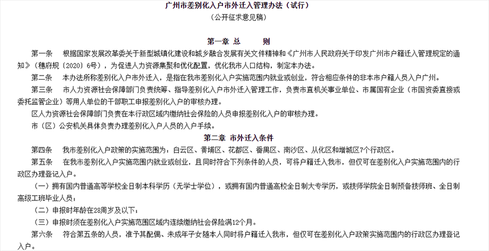
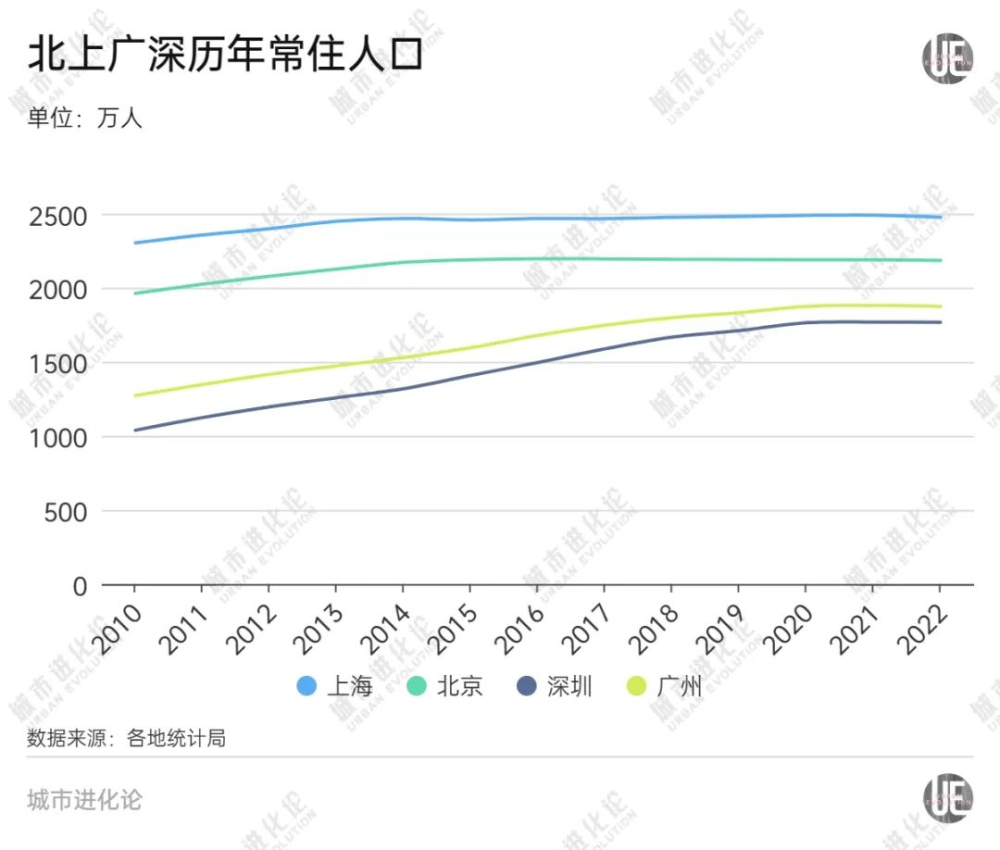

# 20年来首次人口负增长，广州放宽落户

近日，广州市人力资源和社会保障局发布了一份关于公开征求《广州市差别化入户市外迁入管理办法》意见的通告。根据征求意见稿，同时满足全日制大专学历等三个条件，即可入户广州。

具体来看，这三个条件分别是：

**拥有国内普通高等学校全日制本科学历（无学士学位），或拥有国内普通高校全日制大专学历，或技师学院全日制预备技师班、全日制高级工班毕业人员；**

**申报时年龄在28周岁及以下；**

**申报时须在差别化入户实施范围区域内连续缴纳社会保险满12个月。**

需要注意的是，差别化入户政策，仅限增城、从化、花都、南沙、黄埔、白云、番禺等7个区域。天河、越秀、海珠、荔湾不支持。

据悉，在广州市差别化入户实施范围内就业或创业，且同时符合入户条件的人员，可将户籍迁入广州市， **其配偶、未成年子女亦将被准许随本人同时入户广州**
。值得注意的是，符合条件者及其家人仅可在差别化入户实施范围内的行政区办理登记入户。

**常住人口减少7.65万**

**广州20年来首次出现人口负增长**

广州市统计局发布的数据显示， **2022年广州常住人口1873.41万人，广州20年来首次出现人口负增长** 。

据了解，在2010年至2021年间，广州市常住人口总量增加了610.10万人，年均增长3.63%。

值得注意的是，2022年末广州市常住人口相比2021年末减少7.65万人，下降0.41%，其他一线城市同样出现了常住人口负增长的趋势。

另据城市进化论，此前深圳统计局公布的数据显示，2022年末，深圳常住人口为1766.18万人，而2021年末，深圳全市常住人口为1768.16万人，
**一年时间减少1.98万人** 。

此外，2022年， **上海人口减少13.54万人，北京人口减少4.3万人** 。这也意味着， **四座一线城市去年常住人口均出现负增长**
，合计减少超约27.5万人。

而深圳、广州的负增长，似乎有更多“转折”意味。要知道，六普到七普的十年间，深圳、广州常住人口分别增长713.65万人、597.58万人，是全国增量最高的两座城市。2022年的负增长，是深圳自1979年建市以来常住人口首次下降，对广州同样罕见。

**放宽外围城区落户门槛**

**利好广州产业人才结构**

公开资料显示，2022年，广东制造业总产值突破16万亿元，全部制造业增加值4.4万亿元，占全国的八分之一强。同年，广州市规模以上工业总产值超过2.3万亿元。中国工业十强城市中，珠三角占了四席，广州是其中之一。如何在制造业资源“争夺战”中力争上游，吸纳更多的年轻劳动力？对坚持“制造业立市”的广州至关重要。

而除传统制造业和高技术制造业外，广州高端服务业也面临人才缺口。今年5月，广州市人社局发布“2023年第一季度广州需求大于求职‘最缺工’的30个职业排行”，其中社会生产服务和生活服务岗位占比超三分之二。

**外围城区承载着广州市众多传统制造业和高技术制造业，对年轻劳动力特别是青年技能人才的需求较大**
。相较城市化率已达100%的中心城区，外围城区有更大的承载能力。其更低的生活成本，也便于外地年轻人安家落户。对人才的需求缺口，也能为年轻人提供较大成长空间。

据第一财经报道，广州市社会科学院城市管理研究所所长黄石鼎表示，
**这次广州市放宽外围城区落户门槛，对整个广州产业人才结构是大利好，同时对城市人口年龄结构也有改善作用** 。

黄石鼎称，广州无论是传统制造业还是新兴产业，亦或是高端服务业，现在都需要大量的技能型工作者。大量年轻人的到来，会产生非常好的集聚效应。一方面会为产业发展提供稳定的人才来源，另一方面会推动更多新产业、新活动的诞生。从广州人口分布来看，外围城区人才储备相对薄弱。吸引青年技能人才落户，能为外围城区带来新活力，助力广州城市建设发展。
**但想要在人才竞争中获得优势，放宽落户限制仅仅只是第一步** 。

“从制造大市迈向制造强市，广州高质量发展离不开人才的支撑，城市间的竞争也是如此。”据上证报，此前多次向广州提议放宽人才落户政策的专家表示，
**此次广州放松落户政策，有助于吸引更多年轻人才聚集**
。同时，打开广州7个外围城区的落户恰逢其时。广州外围城区近期服务水平不断提升。这些区域招商引资、新创企业不断，也给年轻人带来了就业条件。

**各地争相取消或放宽落户门槛**

近几年，很多城市如武汉、西安、长沙、成都、郑州、济南等先后掀起了“抢人”大战，通过放宽落户条件、提供购房补贴等方式吸引人口迁入。

早在去年，长沙便已放宽人才落户限制，具有大专及以上学历在长沙就业人员可即时申报落户，享受在长沙购房资格。

今年4月12日，泰安市全面取消城区、城镇落户的条件，以群众申请为主，不附加任何条件，按照自有住房、近亲属房屋、单位（人才）集体户、租赁房屋、社区集体户的顺序分类进行登记常住户口。5月27日，沈阳市发布新政，新毕业的高校毕业生，在省内其他市就业并缴纳社会保险的，可以将户口落在沈阳市。

5月20日，上海市委组织部常务副部长、市委人才办常务副主任曹远峰在上海创业青年50人论坛上提到，上海市近年来一直在优化人才落户政策，这样来提高对青年人才开放度和集聚度。其中包括留学生直接落户、博士生直接落户、优秀人才直接落户等政策。

而近日，浙江省放开放宽农业转移人口落户条件，全省（杭州市区除外）全面取消落户限制政策，确保外地与本地农业转移人口进城落户标准统一，试行以经常居住地登记户口制度，落实合法稳定住所（含租赁）落户及配偶等直系亲属随迁政策。

杭州市区进一步完善积分落户政策，确保社保缴纳年限和连续居住年限分数占主要比例，逐步取消年度落户名额限制。推行全省范围内社保缴纳、居住时间等户籍准入年限累计互认，逐步拓展到长三角区域内累计互认。

“抢人大战”进入白热化，大城市如何才能吸引年轻人？“新一代的年轻人对于工作、生活平衡性的追求使得单单提供就业和创业机会还不够。”上海财经大学教授周照表示，“
**一是持续提供高质量的就业和创业机会，二是需要打造宜居生活环境** 。”

 _图片来源：视觉中国_

“不仅仅是破土而出，而是要长成参天大树。”上海财经大学劳帼龄教授表示，“在选择就业创业的时候，青年人更多的是考虑能够在合适的土壤中‘破土而出’，将来还要有机会长成参天大树。”

“年轻人口比重、青年的活力，是衡量城市活力最重要的指标之一。”上海社科院社会学所研究员杨雄说。善借时代之力，方能在道阻且长的前途中乘风破浪。

**编辑|** 段炼 杜波

**校对|** 何小桃

每日经济新闻综合自广州市人力资源和社会保障局、上证报、城市进化论、第一财经、中新网、公开资料等

