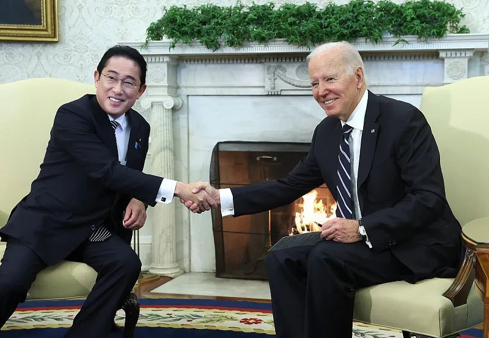
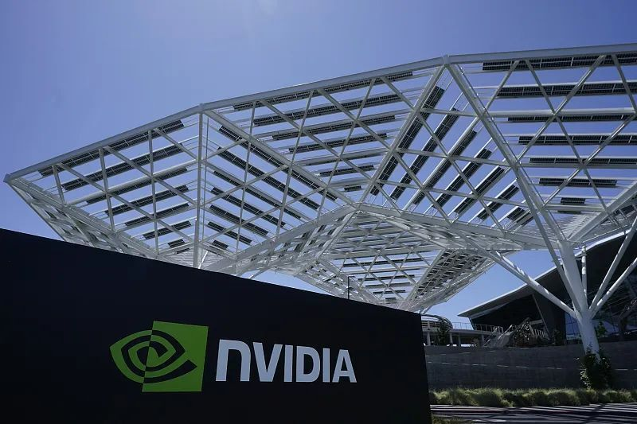

# 不顾中方反复警告，日本配合美国遏华新规施行

**不顾中方反复警告，日本配合美国遏华的新规于7月23日正式施行。**

据共同社报道，日本经济产业省当天开始施行修改后的《外汇及外国贸易法》，将尖端半导体领域的23个品类追加为出口管制对象。

新规施行后，除美国和韩国等42个“友好国家及地区”外，23个品类向中国等国出口时每次都需要获得日本经济产业大臣许可，东京电子等约10家日本企业的对华出口预计将受到影响。

报道称，虽未点名特定国家及地区，但可以看出意在“防止中国将技术用于军事”，尖端半导体相关产品对华出口门槛变高。

报道指出，日本力图将中国排除出半导体供应链，与美国保持了步调一致，“或将进一步加剧全球的分裂”。

长安街知事（微信ID：Capitalnews）注意到，去年10月，美国政府在半导体制造等领域对华升级出口管制措施，并要求日本与荷兰配合对华围堵。今年1月，美、日、荷三国就限制向中国出口部分先进芯片制造设备达成协议。

_1月13日，美国总统拜登(右)和日本首相岸田文雄在白宫举行会谈。图源：视觉中国_

3月底，日本经济产业省提出一项计划，即“新增23类禁止出口的尖端半导体生产设备”的政令，计划在5月修改该政令，并于7月正式实施。

5月23日，日本政府正式发布了半导体制造设备出口管制措施，将于7月23日起限制23种关键芯片制造设备出口，其中包括极紫外光（EUV）相关产品的制造设备，以及用于三维堆叠存储元件的蚀刻设备，这些设备均属于制造电路线宽在10-14nm以下的尖端芯片产品。

日方表面上没有提及中国，还拒绝承认此举是追随美国步伐，可谓是“此地无银三百两”。日本经济产业大臣西村康稔此前表示，“这与去年10月美国出台的措施并不一致，没有针对特定国家。”

_西村康稔资料图。图源：视觉中国_

**在日方新规正式施行前，中方已多次作出警告。**

5月26日，中国商务部部长王文涛在美国底特律参加亚太经合组织（APEC）第二十九届贸易部长会议期间，与西村康稔举行会谈，就日方执意出台半导体出口管制措施等提出严正交涉。

王文涛指出，日方罔顾中方强烈反对和业界意见呼声，执意出台半导体出口管制措施，严重违反国际经贸规则，严重破坏产业发展基础。中方对此强烈不满，敦促日方纠正错误做法，切实维护全球产业链供应链稳定。

6月2日，中国驻日本大使吴江浩应邀出席日本国际贸易促进协会时发表演讲指出，如果日方执意对中日半导体合作设限，失去的不仅是中国巨大的市场，更是日本自身的商业信誉和半导体产业的未来。

吴江浩直言，美国的目的是重新确立半导体霸权，如果按美国设计的套路走下去，结果只会有一个，那就是中日“双输”，而美国独赢。

事实上，已有诸多分析指出，日方配合美国在半导体产供链上限制对华出口，必遭反噬。

**日媒指出，日本对华半导体制造设备出口额几乎是美国对华出口额的两倍。**

2022年，日本向中国大陆出口的半导体制造设备金额超过8200亿日元（约合424.21亿元人民币），中国大陆是日企在该领域的第一大出口目的地，约占出口总额的30%。

“这将破坏日本公司的市场拓展，从监管的角度讲，肯定会降低他们的竞争力。”日本大商社丸红商事的中国经济调查总监铃木贵元接受BBC采访时表示，日本国内缺乏一个足够大的芯片市场，这些出口限制对日本芯片设备制造商而言，将是一个打击。

长安街知事（微信ID：Capitalnews）注意到，日本亦步亦趋追随美国政府的同时，美国的芯片巨头却在集体对白宫说“不”。

当地时间7月17日，包括英特尔、高通和英伟达在内的美国芯片公司的高管，与美国商务部长雷蒙多、美国国家经济委员会主任布雷纳德以及美国总统国家安全事务助理沙利文等政府高级官员进行了会晤。

这些美国芯片企业高管在会面中对美国政府考虑进一步限制芯片对华出口表示反对，认为芯片出口限制将损害美中两国建立更有成效的双边关系。

_英伟达公司标志。图源：视觉中国_

同一天，美国半导体工业协会（SIA）也发表声明，反对美国政府限制美国企业对中国出口芯片。

声明强调，中国是“全球最大的半导体商业市场”，对美国企业而言“至关重要”。声明指出，反复采取过于宽泛、模糊不清的单方面限制措施，会严重削弱美国半导体行业的竞争力，破坏供应链，引发重大的市场不确定性。

一段时间以来，日本在防务、经贸等多个领域积极配合美国围堵中国，导致中日关系陷入复杂困难局面。

今年5月，G7峰会在广岛举行，日本作为G7轮值主席国配合美国等大肆抹黑攻击中国，声称要共同应对来自中国的“经济胁迫”。然而历史清晰地证明，日本恰恰是美国“经济胁迫”的受害者。

防务方面，日本加速推动国家军事战略朝着主动进攻方向演变，妄图跟随美国在亚太地区构建军事霸权，在大幅增加防卫费的同时，积极与北约相互勾连，并计划在东京开设北约在亚洲的首个联络办事处。

值得注意的是，就在日本实施半导体制造设备出口管制措施的前一天，7月22日，日本首相岸田文雄就中日关系表态，称“中日关系密不可分”。

当天岸田文雄在公开演讲中称，中日关系虽然“现在原地踏步”，但“中国是日本的邻国和最大贸易伙伴国，两国关系密不可分，希望能在维持对话的同时保持建设性的稳定关系”。

当前中日关系形势严峻复杂，特别是美国因素已经成为影响中日关系稳定发展的最大外部挑战。日本若真想同中方保持建设性的稳定关系，就应展现诚意，作出理性、独立的决策，而不是走入为虎作伥、以邻为壑的歧途。

