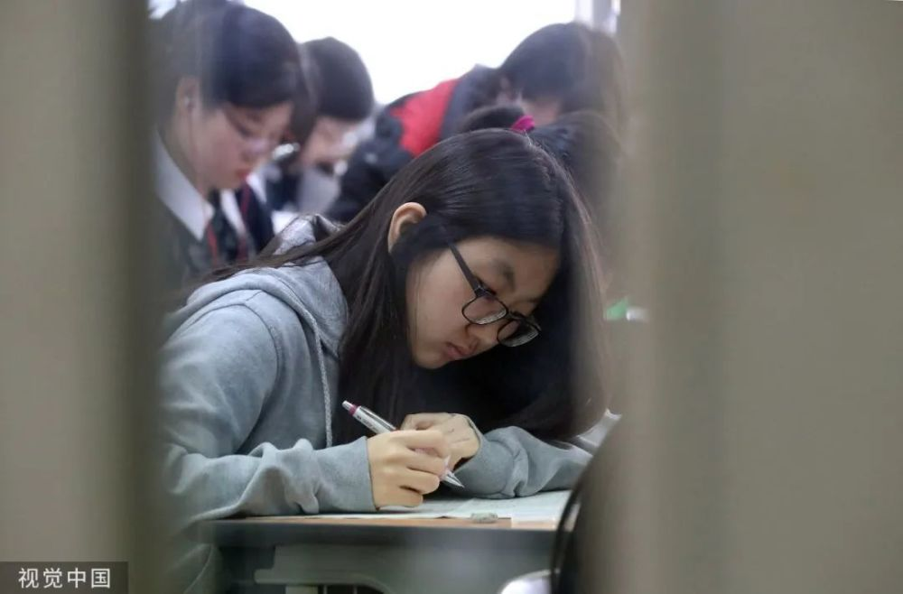
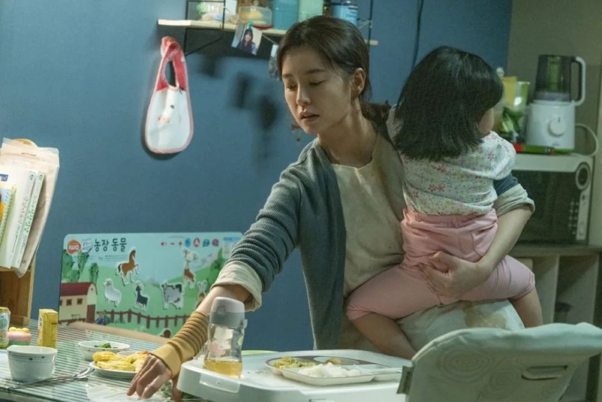
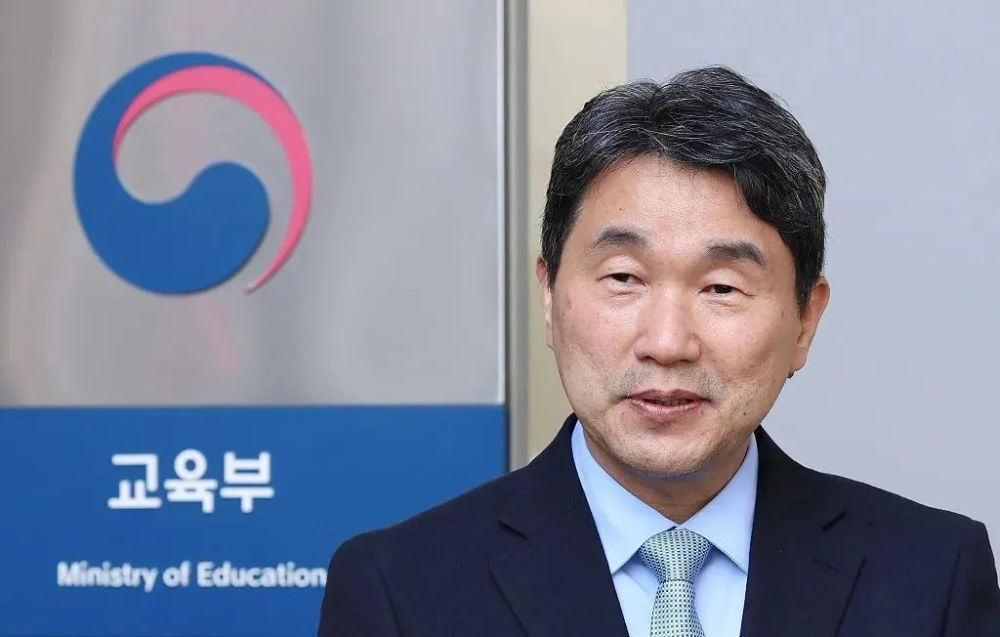
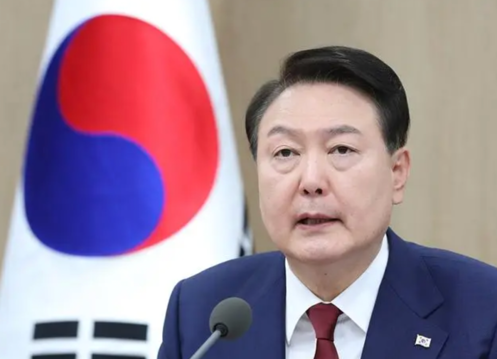
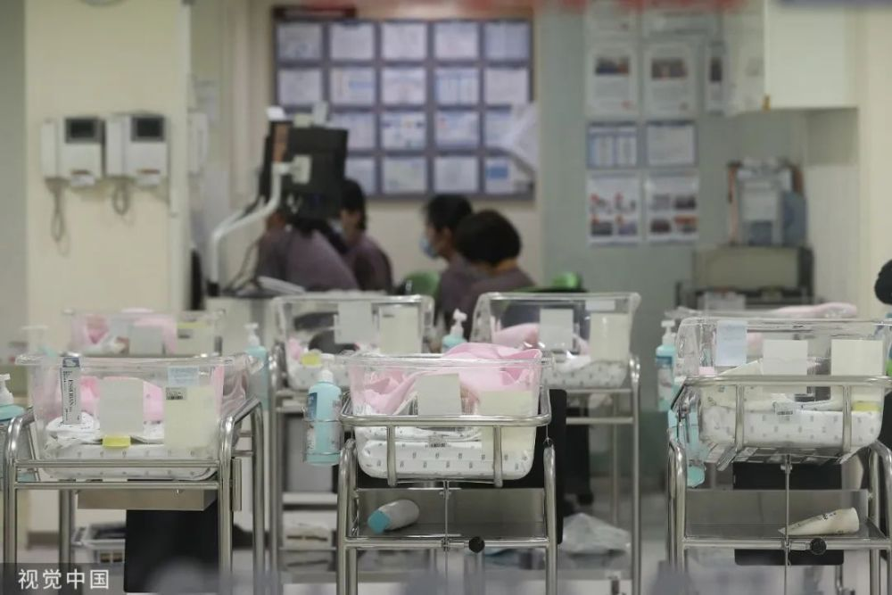

# 为拯救生育率，韩国对高考动手了

**作者 | 贺一**

在距离韩国大学修学能力考试（即韩国高考）仅剩150多天时，韩国总统尹锡悦做了一次“即兴”发言，引发了一场关于高考的风暴——高考内容出现重大调整，曾让韩国高中生闻风丧胆的“杀手题”将成为历史。

所谓“杀手题”，指的是出现在韩国高考卷面上，却超过公立教育体系范畴的题目。在尹锡悦看来，这是造成学生过度依赖私立教育的主要原因。

简言之，就是高考题太难了，不得不依靠补习班来“卷”。

_《请回答1988》剧照_

即便受新冠疫情影响，韩国经济下行压力加大，韩国课外补习产业依旧热度不减。根据韩国教育部和统计厅的数据，2022年韩国学生课外补习率高达78.3%，韩国家庭在补习班上的花费接近26万亿韩元（近200亿美元）——这几乎相当于海地（210亿美元）和冰岛（250亿美元）等国家的GDP。

这一畸形的私立教育产业链，也被普遍视为导致年轻人心理健康恶化，以及生育率不断下降的重要原因。

韩国自杀率多年居经合组织国家之首，青少年抑郁问题呈现越发严重的态势。与此同时，韩国总和生育率已连续两年在198个国家中位列倒数第一。就业形势惨淡、育儿成本过高、社会流动性低，以及性别不平等问题，已成为年轻人不愿生育的主要原因。

_《82年生的金智英》剧照_

尹锡悦并非第一个在教育公平问题上拿私立教育开刀的总统，然而，如果尹锡悦真如自己所表现的那样关注教育问题，那他应该明白，只取消“杀手题”，并不能真正抑制私立教育产业的发展，并为学生减压。

有专家指出，由于教育极度“内卷”，普通人对未来不抱有期待，政府真正需要做的，是培育有竞争力的公共教育体系，并解决高校金字塔结构与劳动力市场二元结构的问题。

作为一个极端但又典型的样本，韩国何以走到了今天？其教育与生育陷阱，值得所有国家警惕。

01

即兴发言？

所谓“即兴发言”，其实暗藏玄机，不亚于一场政治大戏。

事情发生在6月15日，尹锡悦在听取韩国副总理兼教育部长官李周浩汇报教育改革工作时，“意外”谈及与汇报内容并无关系的高考议题。

当天，李周浩在新闻发布会上传达了尹锡悦的意见：“公共教育课程中不涉及的问题，应该被排除在高考内容之外，不然将会造成学生无条件地依赖私立教育。”

_李周浩 资料图_

言论一出，韩国社会一片哗然。

四个小时后，韩国总统室对此划清界限，表示“这只是尹锡悦总统要求李周浩减轻课外辅导所作出的原则性发言，旨在通过公正高考使公共教育正常化，减少课外教育负担。”

与此同时，由于韩国6月举行的一场全国模拟考中，仍出现了所谓的“杀手题”，外界争议再次发酵。

事件变得更加跌宕起伏。

紧接着，教育部于16日对主管高考的教育课程评价院院长李圭民下达了“待命”命令，此时距离李圭民上任仅过去六个月。

6月18日，尹锡悦向李周浩发出了警告，认为是李周浩随意解释了自己的话语，导致了这次争议。然而，就在第二天，事情又起了变化。韩国政府和执政党国民力量党在国会开会决定，高考将排除“杀手题”，这一决定将从9月模拟考开始适用。

 _韩国总统尹锡悦 资料图_

当天下午，李圭民以“对6月模考负责”为由，主动辞了职。

据韩联社报道，韩国国会教育委员会国民力量籍干事李泰珪当天在记者会上表示，党政一致认为，“杀手题”是助长课外补习的根本原因。为确保高考公平公正，高考题目不会出现公共教育课程以外的内容。

针对这一相对混乱的决策过程，韩国总统室对此的解释是，从去年开始，尹锡悦就下达相关指示，只是教育部在此期间并未执行。

然而，韩国诸多政界人士对此并不买账，认为尹锡悦只是想在涉高考言论引发争议后推卸责任。在反对党看来，不具备教育专业知识的总统，干预高考内容是“不合适的”，这一毫无征兆的举措，只会让考生和家长陷入恐慌状态。

 _当地时间2022年11月17日，韩国首尔，学生们在高考开始前等待_

根据《韩国先驱报》报道，一位公立高中生说，“即使我们上的是公立学校，但现在学习的内容也很大程度上是基于课外补习，我对如何准备可能决定我人生命运的考试感到困惑。”

一位高中四年级学生的母亲则表示，在这个时间点，降低高考的难度，只会刺激更多的私立教育支出。

与此同时，社交网络上，层出不穷的帖子，也宣泄着韩国学生对这一举措的不满。毕竟，在这场前期投入巨大的备考战役中，任何的变动，都可能改变这些年轻人的人生走向。

02

教育与生育

韩国高度内卷的教育模式，是个老生常谈的话题。只是如今，更加危险的情况正在发生。

在韩国，围绕教育开展的这场长达十余年的“军备竞赛”，让学生和家长身心俱疲。在韩国中学生之间，甚至流行着“四当五落”的说法，即每天只睡四个小时就能考取理想院校，而睡五个小时则很可能会落榜。

根据《朝鲜日报》发布的统计数据，2021年，韩国高中毕业生的大学升学率为73.7%。在经合组织国家之中，这一比例远高于美国（51%）、英国（57%）等其他一些发达国家。然而，其中只有2%的学生进入了名牌大学，并且几乎都来自私立学校。

_《天空之城》剧照_

韩国最著名的三所大学“SKY”（被称为“天空之城”）——首尔大学（S），高丽大学（K），延世大学（Y），是大企业招聘的“后花园”，因此也被普通人视为能改变命运的跳板。由于无力负担私立学校费用，更多的家庭选择投身于课外补习班。

据韩国《中央日报》报道，对于很多低收入家庭，花在初中以及高中课外补习费用，已相当于饮食费用和物业费用的总和。

即便当前韩国经济形势低迷，普通家庭被迫缩减生活支出，有关调查显示，多数受访者的教育支出，依然纹丝不动。

针对这一现象，有韩国大学教授在接受采访时表示，韩国国内存在一种看法，即除了一些令人羡慕的职业群体之外，其他人都是“失败者”。在这种背景下，考上一个好学校，争取一份好工作，成为衡量普通人存在意义的唯一标准。

_《天空之城》剧照_

在畸形的教育竞争与唯分数论成败的社会压力下，很多韩国青少年饱受心理问题困扰，2019年发布在SCI期刊《亚洲精神病学杂志》的研究显示，自杀已成为韩国青少年死亡的主要原因。其中，学业压力是导致这一现象的主要因素，它与抑郁症高度相关。

新冠疫情，更是加剧了这一点。

与此同时，韩国年轻人的生育意愿，还在不断下降。

去年，韩国的出生率创下历史新低，总和生育率仅0.78。这是韩国自1970年有统计记录以来的最低水平，远远达不到为确保韩国人口稳定所需的2.1。

韩国消亡论，早已不再是危言耸听。早在十多年前，人口学家大卫·科尔曼发出预警，韩国将是地球上首个因生育更替而消亡的国家。

_当地时间2019年2月27日，在韩国首尔某医院，新生儿室里的空床盖着床罩_

相关研究表明，育儿成本的上升，可能是韩国生育率下降的核心原因。根据韩国卫生和社会事务研究所（KIHASA）2020年进行的一项调查，在2000名受访的韩国成年人中，已婚和未婚的，都将选择“经济不稳定”和“育儿成本高”，作为不生孩子的首要原因。

据《南华早报》报道，韩国是世界上抚养一个孩子到18岁成本最高的国家，是人均国内生产总值的7.79倍。

第二高的是中国，其成本是人均GDP的6.9倍。

03

治标不治本

尹锡悦此举，被乐观者视为韩国高考的改革新方向，有声音表示，这可能是韩国解决人口危机的一种尝试。

但这有效吗？目前来看，尹锡悦政府并未拿出一个有实质意义的解决方案。韩国教育专家批评道，调整高考难度的举措，只是最表面的应对方式。

在教育改革中，尹锡悦从未主张将降低私立教育开支。无论是其竞选期间的教育承诺，还是其他工作报告，都找不到任何关于给私立教育降温的内容。

_《继承者们》剧照_

有韩国《中央日报》专栏作者对此表示，韩国目前最紧迫的问题，是使公立教育正常化，因为现在的公立教育已沦为私立教育的补充。劳动力市场的二元结构问题、学历至上的社会文化，也需要改变。

在韩国，财阀企业或公务员、国企以及事业单位工作，主导了第一劳动力市场，中小企业或劳务派遣、打零工等非正规雇佣工作，构成了第二劳动力市场，两者之间的流动性极其有限，在工资待遇与发展前景上存在巨大差距。

正因如此，韩国家庭热衷于投资高等教育，这也造成了受过高等教育的劳动力供过于求。而财阀企业提供的“金饭碗”，着实有限——即便韩国前十大财阀企业的收入占了国内生产总值的近60%。

_《学习的背叛》剧照_

根据经济合作与发展组织（OECD）2022年出具的报告，即使韩国小企业存在严重的用工短缺问题，但劳动力市场二元结构，迫使年轻人在大企业或是公共部门的赛道上疯狂内卷，这也导致韩国年轻人的就业率，远低于经合组织的平均水平。

与此同时，受经济下行影响，拥有非正式工作的年轻人受到冲击。据韩国数字媒体Seoulz报道，在疫情期间，18-24岁的韩国人成为失业率最高的群体。

有韩国网友在社交媒体上发帖称，“年轻人真正需要的，是无论你的教育背景如何，你都可以在安全的地方工作，获得足够的工资，并得到基本权利的保障。”

现实是，多数年轻人对生活并不抱有期待。教育内卷背后，是就业市场的惨淡、对未来的焦虑，迫使年轻人不得不谨慎审视自身的存在。

_《下一个素熙》剧照_

生孩子？反而是最次等的需求。

生育，是一个自我镜像的过程，当下的生存境况，也映照着孩子的未来。

据美国媒体报道，韩国儿童保育政策专家李贞元表示，“人们如今不仅仅关心养育孩子的成本。”“要想有意愿生育，人们需要相信，当孩子长大了，他们也能幸福地生活。”

如果人们认为自己的孩子不可能过上比他们更好的生活，他们又何苦再生孩子。

文中配图部分来源于视觉中国，部分来源于网络

编辑｜阿树

排版 | 八斤

