# 华为最新鸿蒙系统马上到！AI加持更好玩，体验感拉满

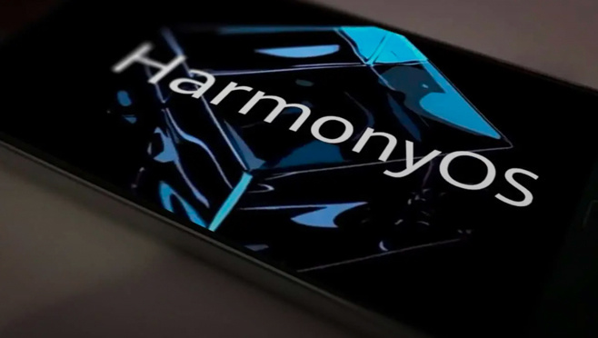

说到国产手机操作系统，就不得不提到鸿蒙。

短短三年多，鸿蒙从1.0走到3.0，覆盖设备超3亿。根据Counterpoint的最新数据报告，华为鸿蒙系统在中国的市场份额已经成为继安卓、iOS之后的第三大手机操作系统。

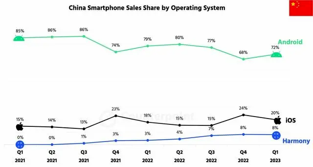

去年10月鸿蒙3.0推送后，紧接着便传出了鸿蒙4.0系统的消息，时至今日，各种细节爆料依旧是手机圈的热门话题。而近日，华为官方发布的一张神秘代码海报，把外界对鸿蒙4.0系统的期待值推向顶峰。

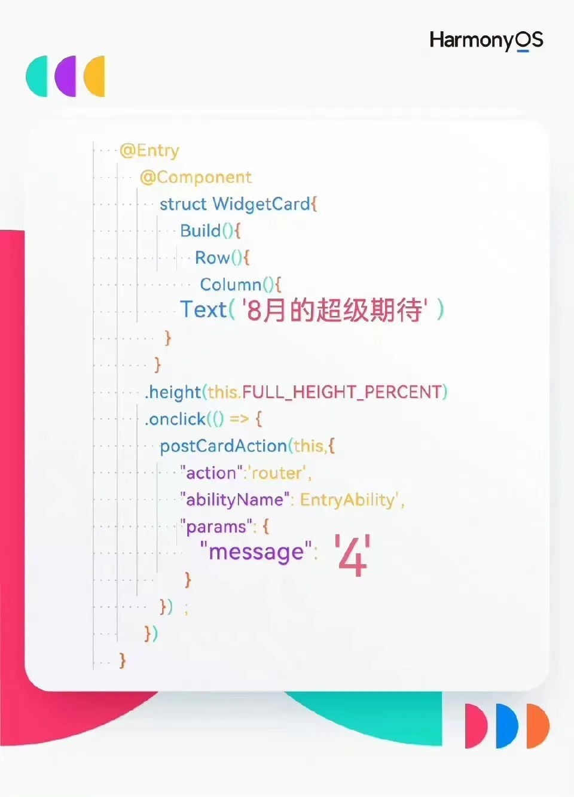

细看海报，里边有两个关键信息，一个是“8月的超级期待”，一个是“4”。嗯，大胆推算下，8月，正是华为开发者大会(HDC
2023)要办的日子，而这个数字4，也有点东西，似乎在暗示鸿蒙OS 4.0。

毕竟，现在已经有不少开发者升级了鸿蒙OS 4.0，并且给出了不错的反馈。

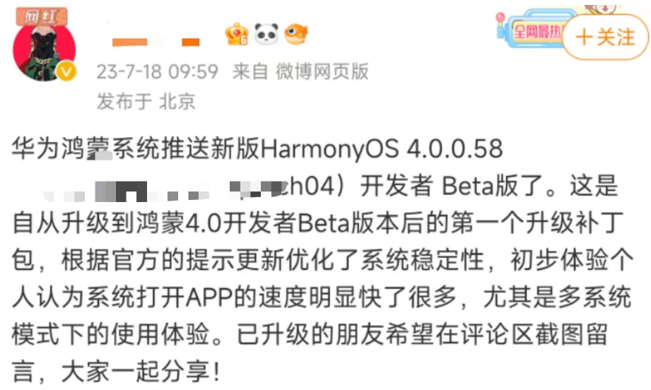

_图片来源网络_

根据市场爆料来看，新系统卖点很足，鸿蒙OS 4.0的车机系统将于今年秋季推出，手机端预计在AI方面迎来功能上的爆发...不出意外，鸿蒙OS
4.0可能会由Mate 60系列首发搭载。

但具体表现会如何，还是需要了解到系统本身的吸引力。

废话不多说，先来看鸿蒙系统在手机端的表现。根据此前消息，鸿蒙OS 4.0将在设计层面、AI场景、设备协同等方面迎来显著升级。

具体来看，鸿蒙OS 4.0将采用全新微内核设计，系统更简洁、流畅，同时系统安全性和稳定性也得到提升。目前大部分内测用户都给出了高度肯定，甚至有华为Mate
50 Pro机主激动表示，升级鸿蒙4.0后发生了天翻地覆的改变，相当丝滑。

 _图片来源网络_

可见，系统流畅性这块优化越来越好了。除此之外，鸿蒙OS 4.0的UI界面设计也有所改变。前几天，华为终端BG CTO李小龙在微博互动时，意外曝光了鸿蒙OS
4.0的部分设计，最明显的就是状态栏设计，新的状态栏与鸿蒙3.0存在明显不同。

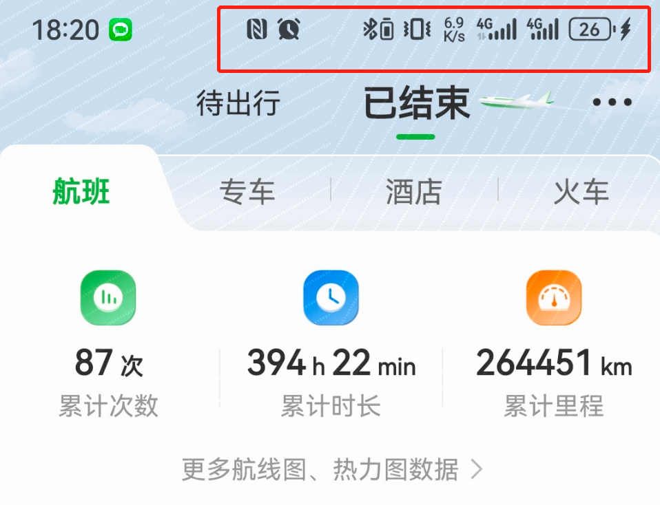

进一步来看，鸿蒙OS 4.0的状态栏设计成了三段式布局，分别是时间和App通知、NFC和闹钟、以及信号和电量。

而上一代鸿蒙3.0的状态栏，仅遵循左右两个维度的布局。

_鸿蒙3.0状态栏_

两者相比之下，新状态栏的布局，不仅比鸿蒙3.0显示的内容更多更高效，而且图标样式也更加醒目，在低分辨率下能有更好的表现。

_图片来源网络鸿蒙4.0Beta版状态栏_

这些细小的优化升级，也得到了内测机主的肯定。

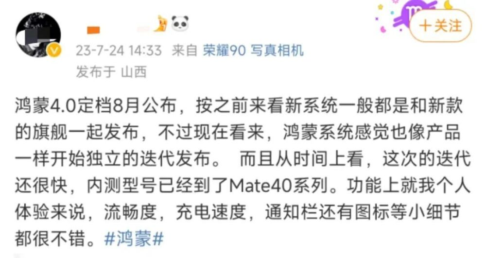

 _图片来源网络_

而除了基础升级外，鸿蒙OS 4.0还对于语音交互、识别和合成等AI技术也进行了全面融合。

在鸿蒙系统4.0下，用户可以更自然的和IoT设备进行互动，例如在手机中使用方言录入文字，系统会自行识别并转换。不止文字的识别，新系统还将集成智能AI图像处理技术，带来更精准的图像识别、更强大的图像处理等功能。

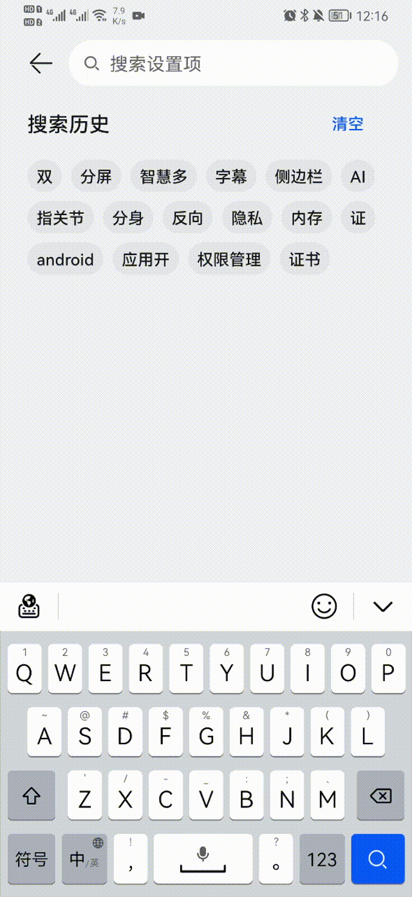

在生态方面，鸿蒙系统一直认为，自己和安卓iOS最大的区别是适配更多的智能穿戴设备。

根据爆料，鸿蒙OS 4.0将与华为旗下的华为平板、智能手表、智能音箱等诸多终端设备，实现更好的无缝协调和设备协同，例如用户可通过鸿蒙OS
4.0操控家里所有的智能设备，让家居管理更加智能化。

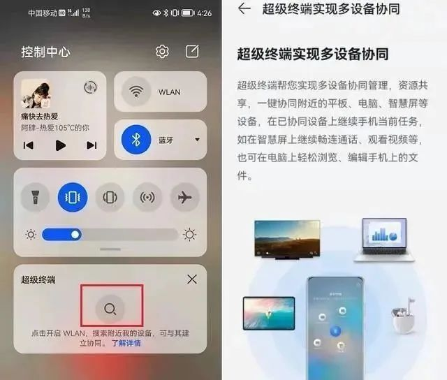

整体看下来，鸿蒙OS 4.0系统更流畅，体验更简洁，同时语音交互的增加，也让设备更懂用户。而根据体验者反馈来看，电池的耐用性也有所提升，这无疑是一个好消息。

总之，这次的新系统版本全面升级，将大幅提升用户使用效率。

话说回来，作为面向万物互联的操作系统，鸿蒙OS 4.0还将“上车”，和配套的车机系统联动，给用户带来全新体验。

大致来看，鸿蒙OS
4.0车机系统的主要亮点包括：六音区声源定位、多人多屏多音区并发控制、舱内眼球位置追踪及眼部状态识别、多屏多通道双向流转、多屏跨设备投屏。

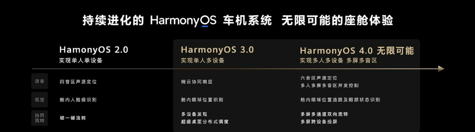

首先是六音区声源定位功能，可以通过空间音频计算技术，实现了3D立体声场，并且用户可以根据自己的位置和喜好，调整六个音区的声源定位，以此让声音从不同方向传来。

还能通过超级终端界面，支持多人多屏多音区并发控制，带来全新体验，例如主驾可以专心导航，副驾可以用来听歌，后排孩子可以专注学英语，进一步提高实用性。

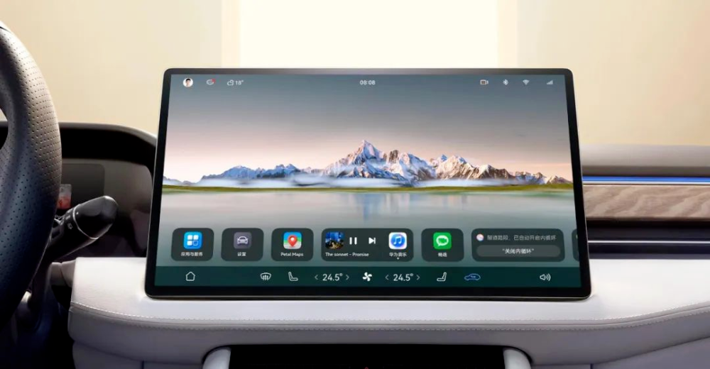

这下，无论是车主还是坐车的用户，都能享受车机系统的优化。

甚至是在鸿蒙OS 4.0车机系统的加持下，还能通过眼球追踪和眼部识别，实现舱内的智能交互，比如调节空调、导航、娱乐等操作。

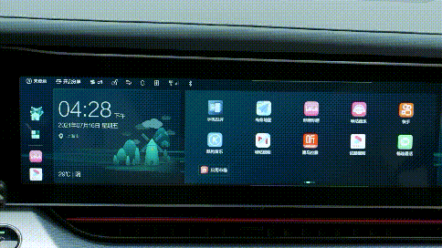

最后说说多屏跨设备投屏…在更新鸿蒙4.0车机系统后，用户可通过超级终端界面，轻松地将手机、平板、智慧屏等设备的画面投屏到车机上，或者将车机的画面投屏到其他设备上。

总之一句话，智能、高效、好玩，鸿蒙OS 4.0“上车”后的体验值得期待。

整体看下来，鸿蒙OS 4.0的核心依然是围绕其分布式能力和全场景的流畅体验进行改进和深化，尤其面向更多人的手机端部分。

由于爆料有限，我们目前还无法了解到鸿蒙OS 4.0的完整更新细节，但从当下诸多体验者反馈来看，该版本在流畅性、界面改进和新功能方面，都给人留下了深刻印象。

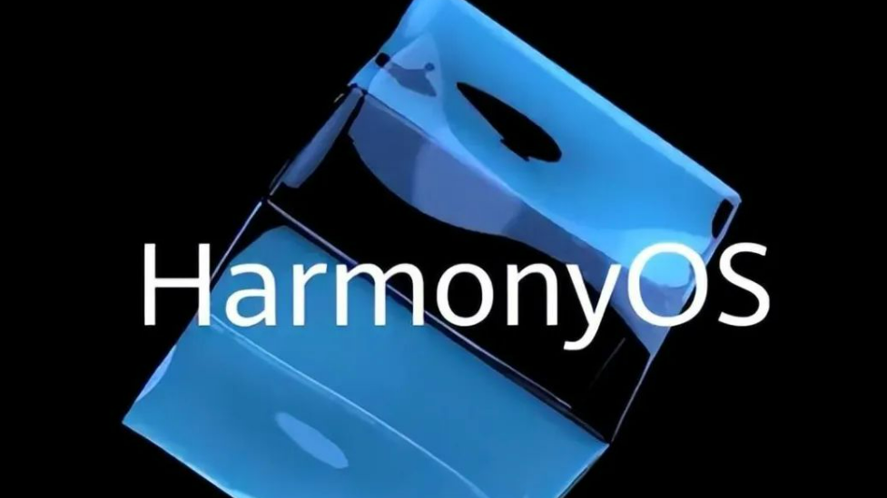

说到提前体验，没记错的话，今年6月鸿蒙OS 4.0开发者Beta版进行首批机型测试，首批开发者Beta版招募支持华为P60、P60 Pro、 Mate
50、Mate 50 Pro等8款机型。

而近日，华为开启了第二批开发者Beta版招募，并新增包括华为Mate50E、华为Mate40系列、华为Mate
X2系列等10余款测试机型。如果刚好是这部分机型的手机用户，可以申请体验下。友情提示，鉴于目前是测试版，测试的过程中可能会有不稳定的情况，因此建议大家用备用机。

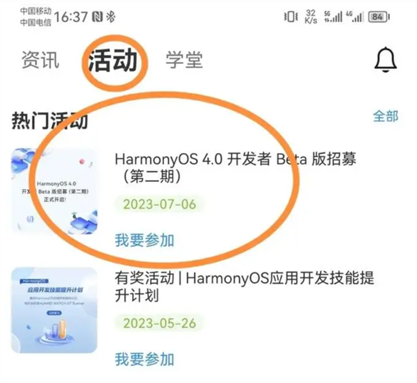

_图片来源网络_

话说回来，如此密集的内测招募，在以往手机圈并不多见，这也证明鸿蒙OS
4.0的推进速度正不断加快，各项功能体验也在不断完善。毕竟只有好的改善，才能让消费者的体验变好，不然的话，用户的使用体验只会变差，甚至会影响到口碑。

总之，最快下月初鸿蒙OS 4.0就会在华为开发者大会（8月4日至6日）上正式亮相，期待一下吧。话说回来，大家的机型在内吗？都升级体验过了吗？评论区说说呗。

