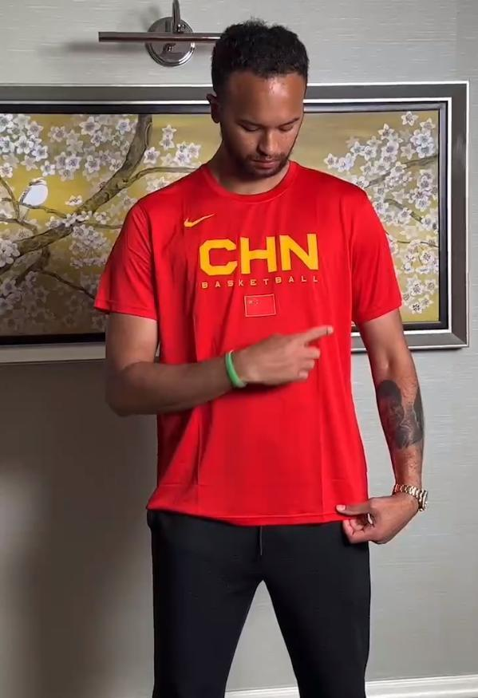
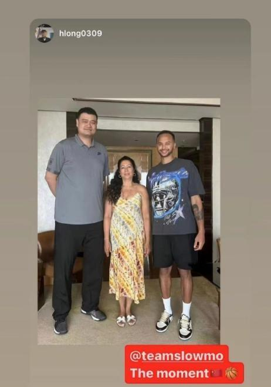
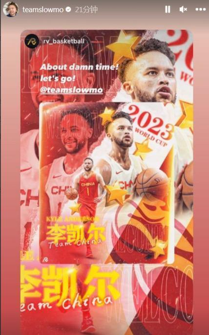
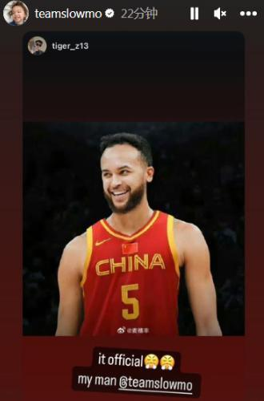

# 难掩兴奋！李凯尔入籍中国后 狂发身穿中国男篮战袍动态

北京时间7月24日，中国篮协官方宣布李凯尔正式获得中国国籍后，他将会加入中国男篮备战最新一期的男篮世界杯，对于这个历史性的时刻，吸引大量的球迷和媒体围观，乔尔杰维奇能否带领男篮获得小组赛出线权？

李凯尔本人除了携带母亲前往上海见证入籍时刻，他本人也难掩兴奋，在IG社媒狂发身穿中国男篮战袍的动态：配文表示：走吧，是时候了。

众所周知，李凯尔是拥有8分之1血统的中国人，他也在多年前携带家人回归深圳寻亲，这种自发性的活动可以看出李凯尔家人对于血缘是非常看中，而他的母亲也在接受采访，直言表示：希望李凯尔能代表中国而战。

李凯尔在NBA的合同接近千万美金级别，但此次归化费用，有媒体人爆料是不足一个顶级CBA外援的一半，考虑到一个月左右的备战时间和需要出战男篮世界杯的正规大赛，还可能会参加杭州亚运会，这个费用是相对比较低。

要知道不少NBA球员都拒绝出战男篮世界杯，希望获得更多的休息和调整时间，甚至有约基奇那样，拒绝国家队的征召，就算是主教练和队长单独开小灶也希望休息，李凯尔能代表中国男篮出战，某种程度是证明个人合同方面并不是主要的推动力。

根据媒体人“三土带刺”的爆料，李凯尔的首秀很有可能会是欧洲拉练的某场比赛，并不一定是国内的团结杯，从时间的层面，距离男篮世界杯正赛开打还有一个月左右时间，按照乔帅对于高大前锋的青睐程度，李凯尔很有可能短时间就成为男篮核心前锋，各方面达到承担重任的状态，而男篮随着归化球员加盟综合实力有望大幅度上升，借此达到冲击巴黎奥运会的范畴。

