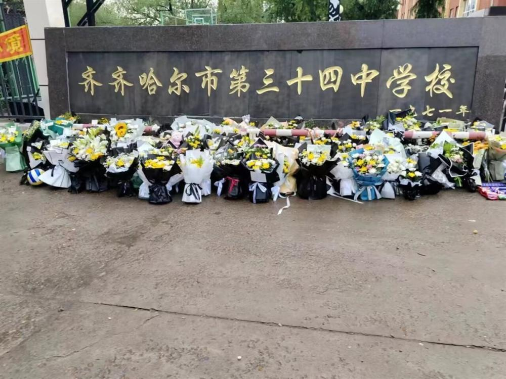
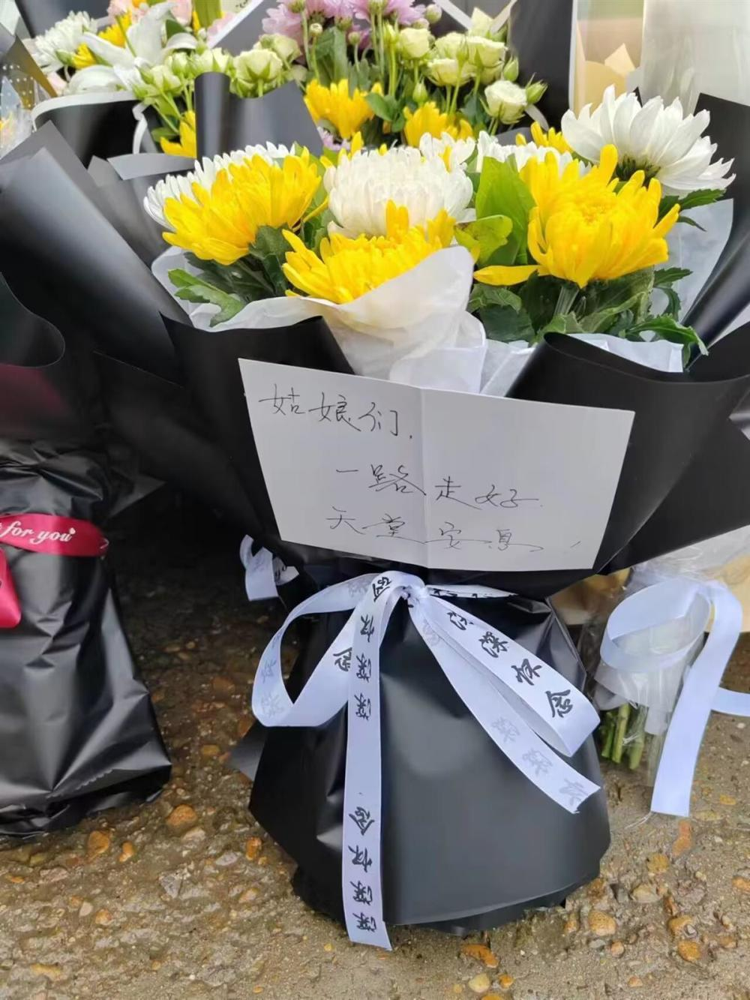

# 齐齐哈尔市民献花哀悼遇难者，网友订花祭奠，留言让人泪奔

极目新闻记者 舒隆焕 张万军 见习记者 李迎 唐佳燕

7月24日上午10时，黑龙江省齐齐哈尔市第三十四中学校体育馆楼顶坍塌事故最后一名被困学生已搜救到，已无生命体征。此次事故共造成11人死亡，事故调查工作正在全面推进中。事故发生后，多位市民自发前往齐齐哈尔三十四中门口献花祭奠。

_现场图片（知情人供图）_

齐齐哈尔市龙沙区三十四中附近一家花店老板介绍，24日中午以来，已接到十余个订购悼念花束的订单，目的地都是三十四中学。订花的人有本地的，也有外地的。多位购花者在订单上留言要求花店附上悼念卡片，“姑娘们，一路走好，天堂安息。”“愿你们变成天使飞到更远的地方，愿天堂没有痛苦，都是欢乐。”

_感人留言（知情人供图）_

_感人留言（知情人供图）_

7月24日下午4时30分，市民刘女士在三十四中门口看到，现场有很多学生前来献花，献花的人群中还有头发花白的老人。

（来源：极目新闻）

