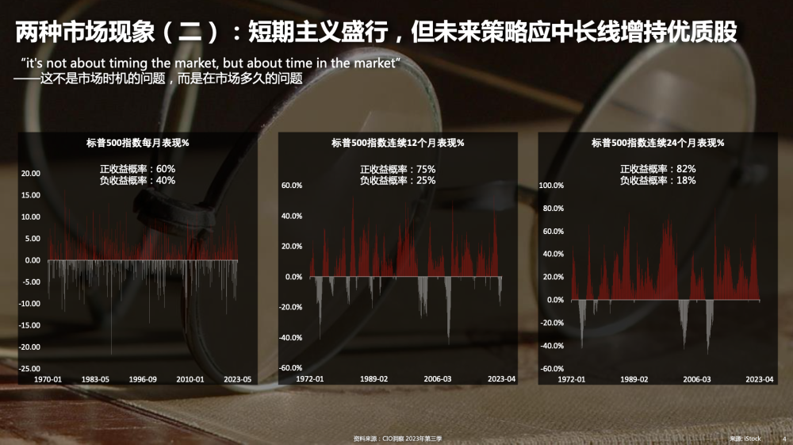
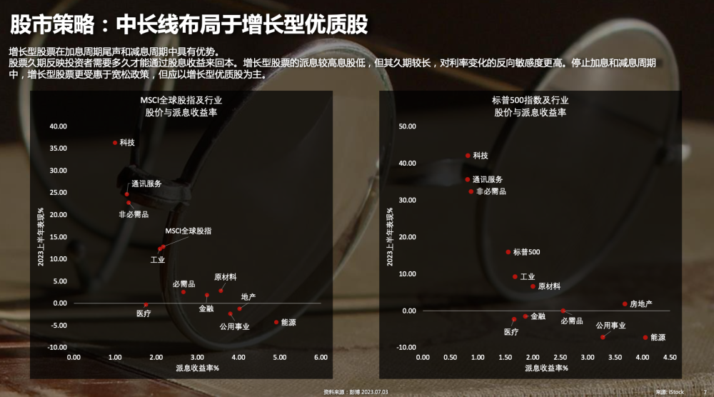
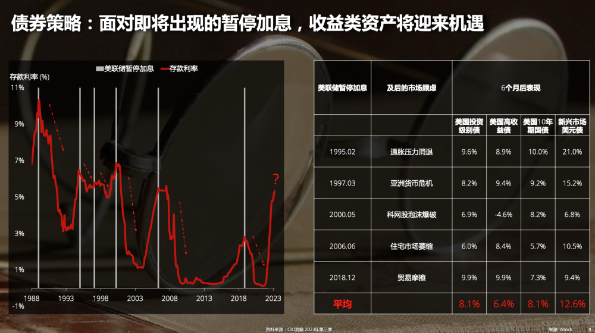
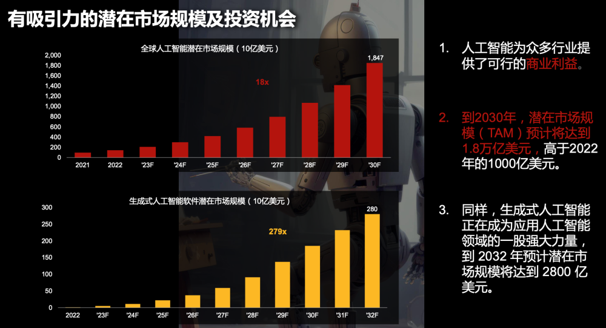
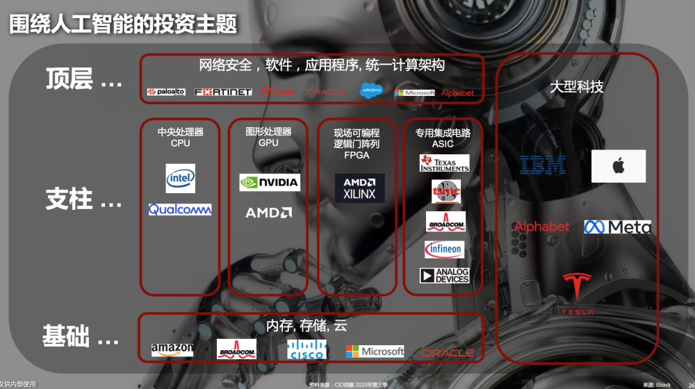
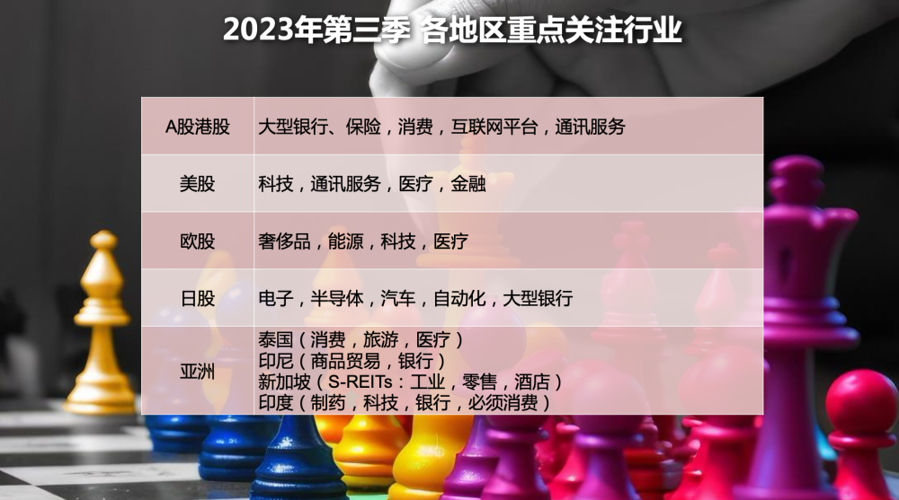
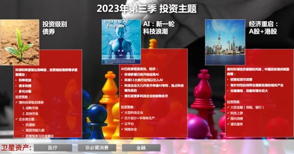

# 三季度炒股买什么？星展银行：美股继续投AI A股看好大型银行、保险

**文 | 腾讯财经 祝玉婷**

近日，在星展银行2023年第三季展望及策略会上，星展银行（中国）有限公司投资策略师邓志坚谈及三季度投资策略时表示，建议采用“60%+40%”的投资组合，其中“60%”是指按照60%的比例配置增长型资产，即股票类资产；另一方面，40%的比例主动增持收益型资产，比如债券、REITs等。

股市投资要从“高息股”转到“增长型股票”

分析当前全球经济背景，邓志坚指出，美联储货币政策虽然仍偏鹰派，但预期美联储利率将于2023年第三季度达到峰值，并锁定5.50%，星展认为美联储将在2024年开始降息，但如果下半年经济数据表现较好，需求反弹，不排除四季度再多加息一次。

邓志坚表示，目前市场上存在两种投资现象：一是股市和经济出现严重的两极分化；二是短期主义盛行。出现“短炒”现象的原因主要是由于投资者对市场未来的判断缺乏一定的信心，使得不敢把股票一直拿在手上；另一方面，市场上的资金充裕，很多投资者都是投机为主。

因此，邓志坚指出：在风险依然存在的环境中，股债混合配置策略尤为重要。

在股市方面，邓志坚指出，根据市场变化，股票市场逻辑要从“高息股”转变到“增长型股票”。当然不一定所有行业和个股都涉及，关键是选择增长型里的优质股。选择优质股有三大指标，分别为股本的回报率、利润率以及股本负债比率或者资产负债率。

他认为，增长型股票在加息周期尾声和降息周期中具有一定的投资优势。“股票久期反映投资者需要多久才能通过股息收益来回本。增长型股票的派息较高息股低，但其久期较长，对利率变化的反向敏感度更高。停止加息和减息周期中，增长型股票更受惠于宽松政策，但应以增长型优质股为主。”他进一步解释。

在债市方面，邓志坚认为，面对即将出现的暂停加息，派息型资产将迎来机遇。具体到投资策略方面，迎优先增持投资级债券，重点关注成熟市场、亚洲市场。“这些债券在过去的减息周期内都有不错的表现。”他补充到。

人工智能潜在市场规模将达1.8万亿美元 看好AI板块

谈及科技浪潮带来的投资机遇，邓志坚建议，可以关注大型科技企业、芯片设计+半导体生产、云平台、网络安全等。他表示看好AI板块，科技行业领军者正在投入巨资，以期获得人工智能竞赛的主导地位。

“人工智能为众多行业提供了可行的商业利益。”对于未来的市场规模，邓志坚预计， **到2030年全球的人工智能潜在市场规模** （TAM）
**将达到1.8万亿美元，高于2022年的1000亿美元。**
同样，生成式人工智能正在成为应用人工智能领域的一股强大力量，到2023年预计潜在市场规模将达到2800亿美元。

此外，大型科技企业正在抢占AI市场份额，收购合并交易愈发频繁。为了保持领先地位，技术领导者通过并购，加快在人工智能领域的步伐。例如，在2010年至2021年期间，苹果、谷歌、微软、Facebook和英特尔已经完成了80多笔与人工智能相关的并购交易，并以财务实力为后盾。

邓志坚强调，我们讲AI不是为了投AI去投AI，而是希望在科技股里找出新一轮科技热潮里的热点。当前人工智能市场大部分专门做人工智能的企业都是中小企业，人工智能投资背后最重要的硬件和软件。围绕人工智能的投资主题可关注以下环节：

三季度重点看好A股、港股市场 大型金融机构盈利增长巨大

三季度有哪些行业值得关注？邓志坚介绍，不同地区需要重点关注的行业有所不同。具体来看， **A股港股** 看好大型银行、保险、消费、互联网平台、通讯服务行业；
**美股** 看好科技、通讯服务、医疗和金融； **欧股** 看好奢侈品、能源、科技、医疗行业； **日股**
看好电子、半导体、汽车、自动化、大型银行行业； **亚洲市场方面** ，看好泰国的消费、旅游和医疗行业，同时看好新加坡的S-
REITs，特别是其中的工业、零售和酒店行业。

总体来看，未来3个月到12个月环球股票市场维持在中性水平。短期内美股市场存在隐忧，维持中性，不需要增持太多但不可以没有；欧洲和日本市场需要小心，如果货币政策从非常宽松变得紧缩，市场可能出现套利倒挂行为；看好亚太市场，重点在A股和港股市场。

具体到A股和港股，邓志坚看好经济重启带来的机遇。“看好大型金融（保险、银行）、科技上游、国内消费、通讯服务等，他们估值偏低，但盈利增长巨大。”

据透露，如果单纯从银行股方面来讲，星展的态度是非常看好，国内大型银行的股票属于派息型资产，不是增长型资产，应划归到40%派息型资产配置当中，需要中长线去增持。

因为国内银行尤其是四大银行派息水平非常高，他们从盈利中抽取的派息率达到30%，甚至有些超过40%，这意味着他们的利息回报率也很高。

他认为，长期来看，银行股投资价值凸显，尤其适合长期稳健的资金，如基金公司、保险公司、退休养老基金等机构的资金，会更加青睐银行股。“随着这些机构投资者的进入，四大银行高息股的数量将会增加。”

长期以来，银行股一直被低估，但邓志坚认为这是它们正常的估值水平。他指出，银行板块的估值不应过高，因为银行的资产、物业和债券等都是透明的，很少出现被高估的情况。“银行股的市盈率（PE）在3到4倍左右是非常合理的，投资金融板块时应该关注市盈率增长比（PEG）。然而，PEG只能作为参考，用来评价估值高低以及未来盈利和价格是否同步上涨。”

另外，在国内保险业务方面，邓志坚认为，其未来的成长性非常巨大。“人口老龄化越来越严重导致国家福利紧张，更多的保障需要个人在社会上进行承保，保险机构的成长性很强。不过，这需要一个长期的过程。”

另一方面，对于金融板块而言，邓志坚表示同样看好保险板块。“随着人口老龄化加剧，国内保险业务的成长性非常巨大。保险股和银行股一样具有很大的投资价值，但都属于‘细水长流’式投资，可能需要5到6年甚至更长的时间。”

