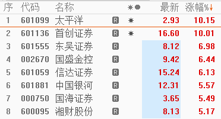
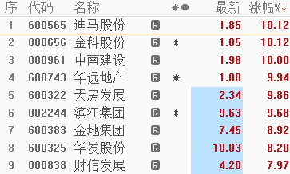
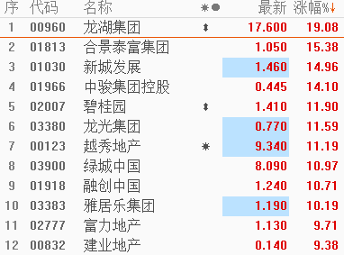
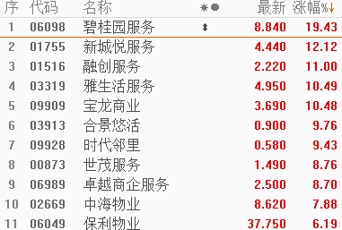
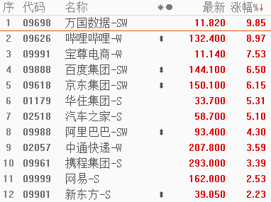
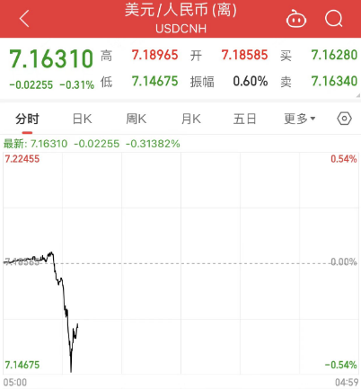

# 中国资产全线爆发：A股、港股联袂上攻 地产、券商板块暴涨

金融界7月25日消息
中共中央政治局7月24日召开会议，分析研究当前经济形势，部署下半年经济工作。会议强调，要活跃资本市场，提振投资者信心。25日早间，中国资产开启狂欢模式，A50持续上行，A股、港股市场纷纷跳空高开，人民币汇率强势反弹。与此同时，亚太市场亦有出色表现。

中共中央政治局会议提出，“要保持人民币汇率在合理均衡水平上的基本稳定”、“要活跃资本市场，提振投资者信心”、“适时调整优化房地产政策”等内容。

**A50大涨，A股、港股走强**

今日富时中国A50指数期货高开高走，目前大涨2.9%。

随后开盘的A股、港股纷纷跳空高开，截至目前，沪指涨1.49％，报3211.2点，深成指涨1.77％，报10938.16点，创业板指涨1.37％，报2176.3点，科创50指数涨0.93％，报959.35点。港股恒生指数涨2.83％，报19196.1点，恒生科技指数涨4.45％，报4193.74点，国企指数涨3.69％，报6502.72点，红筹指数涨3.65％，报3735.93点。

A股市场中，券商股迎来了久违的爆发，截至目前，太平洋、首创证券涨停，国盛金控一度涨停，东吴证券、信达证券、中国银河等多股涨超5%。

房地产板块亦有出色表现，金科股份、中南建设、迪马股份、华远地产、锦和商业等纷纷涨停。产业链上的装修建材、装修装饰、家电行业等同样崛起，皮阿诺、正源股份、兔宝宝、志邦家居、蒙娜丽莎、箭牌家居等集体封板。

港股市场中，内房股领涨，龙湖集团涨超19%，合景泰富集团、新城发展、中骏集团控股、龙光集团、碧桂园等集体涨超10%。

内地物管股受提振，碧桂园服务涨近20%，新城悦服务、融创服务、雅生活服务等涨超10%。

与此同时，科网股纷纷走强，万国数据涨近10%，哔哩哔哩涨近9%，百度集团、京东集团涨超6%，华住集团等涨超5%，阿里巴巴涨超4%。

**在岸、离岸人民币兑美元均涨破7.15关口**

与此同时，人民币也强势反弹，在岸、离岸人民币兑美元均一度涨破7.15关口，日内大涨近400点。截至发稿，离岸人民币报7.1631。消息面上，今日人民币对美元中间价调升45个基点，报7.1406。

**隔夜美股中概股指数涨超4%**

隔夜美股市场中，中概股集体狂飙，纳斯达克金龙中国指数大涨逾4%，创五个月最大涨幅。

中概股普遍大涨，B站、蔚来汽车大涨近11%，小鹏汽车大涨10%，百度涨超5%，阿里巴巴涨4.5%，拼多多、美团ADR涨近4%，京东涨3.5%，理想汽车涨超3%，腾讯ADR涨超2%。

