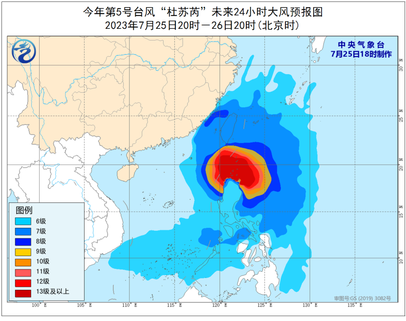

# 国家级预警即将最高！超强台风“杜苏芮”已锁定登陆，特大暴雨将至

7月25日傍晚，台风杜苏芮仍是17级以上的超强台风——在西斜的阳光下，可见光卫星云图特写可见，即将进入巴士海峡的杜苏芮，台风眼依然深邃浑圆，显示出它仍具有超强台风的强大威力。按照目前台风杜苏芮的路径，它非常可能避开菲律宾吕宋岛的高山，一手台风登陆广东福建的可能性持续增强​​​。

一、国家级预警即将最高

7月25日晚20时的定位显示，台风杜苏芮已经来到了巴士海峡口，即将进入我国24小时警戒线。进入24小时警戒线意味着，台风24小时内对我国有显著影响，并可能于24小时内登陆，进入24小时警戒线以后，气象部门会每个小时对台风进行监测，密切注视台风动向，并随时通报台风的实际情况。

因此，中央气象台今天傍晚将台风黄色预警升级为台风橙色预警，逼近最高等级的台风红色预警，中央气象台指出，超强台风杜苏芮将以每小时15公里左右的速度向西北方向移动，即将进入巴士海峡，强度变化不大，明天夜间进入南海东北部海面，强度逐渐减弱。

二、台风杜苏芮已锁定登陆

从这一预报上看，台风杜苏芮目前路径的关键点之一便是巴士海峡。多年来大规模台风路过几十余次，强弱灾害难以论说，但大家无不注意到，正是在这个海峡中，决定了多少台风的盛衰兴亡、路径走向，所以古来就有“坐巴士”之说。今天杜苏芮在吕宋岛高山前不断北偏，绕过吕宋岛的可能性已经相当大，接下来吕宋岛地形将给台风一个向西向南拉力，如果杜苏芮继续保持不被陆地
吸入，那么杜苏芮很可能保留中心，从而以高强度进入南海，东南沿海防台压力会骤增。

中央气象台认为，台风杜苏芮将于7月28日早晨到上午在福建中部到广东东部一带沿海登陆，登陆时中心附近最大风力为13-15级（40-48米/秒，台风级或强台风级）。而超级计算机集合预报中来看，台风杜苏芮的路径要稍微偏西一些，但总体上要穿过巴士海峡并对准了福建南部和广东东部沿海一线。综合来看的话，台风杜苏芮确实已经锁定我国，登陆形势已经高度确定。

三、特大暴雨将来

随着台风杜苏芮即将进入24小时警戒线，对我国的影响即将开始加强。中央气象台预报认为，25日20时至26日20时，巴士海峡、台湾以东洋面、南海东部和南部海域、台湾海峡、台湾岛及其沿海、福建沿海将有6-8级风、阵风9-10级，其中巴士海峡、南海东北部偏东海域、南海中东部偏东海域风力可达9-12级、阵风13-15级，台风中心经过的附近海域风力可达13-17级，阵风17级以上。

而台风杜苏芮吸纳的大量水汽，也要逐渐化为暴雨在东南沿海洒下。比如25日20时至26日20时，浙江东南部沿海、福建东北部沿海、台湾岛等地的部分地区有大到暴雨，其中台湾岛东部的部分地区有大暴雨（100-200毫米）。在7月26日-7月27日，浙江中南部沿海和台湾东南部降雨将进一步增强，将出现更大范围大到暴雨，台湾南部局部可达特大暴雨。

到7月28日前后，随着台风杜苏芮将在我国福建广东一带登陆，巨量暴雨将到来，在降水预报图上，闽南粤东更是出现了一片特大暴雨区。

由于台风的影响，中央气象台也已经发布了暴雨预警。超级计算机的预报中认为，从7月25日至30日，广东、福建、江西、湖北、安徽等地将出现大到暴雨，其中广东东部、福建南部等地将是暴雨中心，部分地区累计雨量可超过300毫米，这样的强降雨可能会引发山洪、滑坡、泥石流等灾害，对交通、农业、水利等造成严重影响。

总而言之，杜苏芮很可能是2023年以来我国遭遇的最大的台风，还请粤东、闽南的朋友以最高标准准备防御。

