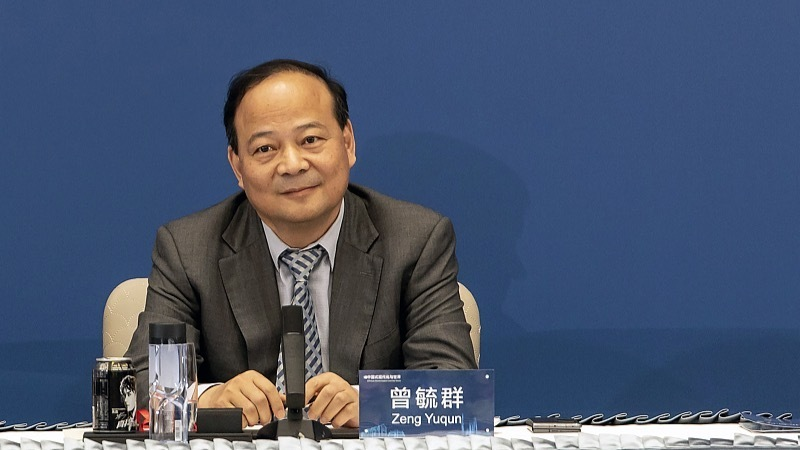
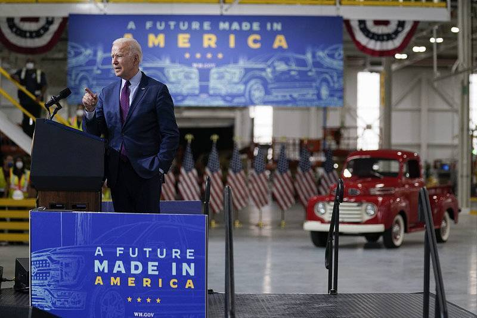

# 宁德时代突遭调查，曾毓群出海路断

出品｜虎嗅科技组

作者｜包校千

编辑｜廖影

题图｜视觉中国

用技术换市场，宁德时代“曲线赴美投资”的策略，遭到了美国的百般阻挠。

7月22日，路透社的一则报道称，美国众议院两个委员会正在对福特汽车与宁德时代的合作关系展开调查。消息一出，这家电池龙头企业迅速被推到风口浪尖之上。

事件缘起于今年2月，福特宣布斥资35亿美元（约合人民币超250亿元）在密歇根州建立电池工厂。该工厂虽然由福特全资控股，但宁德时代以独家技术合作伙伴的身份参与其中。概括来说就是，福特出钱，宁德时代出技术，赚的钱一起分。

彼时，宁德时代选择的合作模式，被视作战略性破局的绝妙之选。美国新能源汽车产业是以赶超中国为目标确立的发展战略，在市场规模和生产制造方面大幅落后于中国的情况下，中国企业若单枪匹马杀入美国市场，无异于案板上的鱼肉——任人宰割。而宁德时代采取轻资产的策略，既避免了前期高额投入带来的巨大风险，又能绑定本土车企拿到相应补贴。对于福特而言，也能从中汲取技术，填补电池产业链的经验空白。

谁也没想到，这项双赢的合作，现在突遭来自美国方面施加的阻力。24日，宁德时代对外界回应，与福特汽车的项目仍在正常推进，暂时未受影响。而福特方面正在等待美国财政部的指引，以确保这一合作关系不违反要求，尽可能往下推进。

**谁在拆台**

本次事件的起因，始于美国众议院筹款委员会(House Ways and Means Committee)和中国问题特别委员会(Select
Committee on
China)的一封联署信。信件的核心诉求是，查清福特电池工厂与宁德时代合作的具体细节，是否违反《通胀削减法案》(IRA)的相关规定。

委员会对该项目的质疑主要有以下几点：

首先，他们认为合作协议所规划的大部分高薪岗位并没有完全提供给美国人，而是由数百名宁德时代的中国员工填补，负责设备的安装和维护，而且这些员工可能会在福特工厂一直干到2038年，因此最初承诺创造的2500个就业岗位，非但没有全部兑现，反而有可能长期依赖这些中国员工。

此外，委员会还怀疑，二者的合作可能不会促进美国电池技术的进步和研发，而是将中国控制的电池技术、原材料带到美国，同时通过技术许可得到税收抵免，并将资金回流到宁德时代。

对于第一项指控，福特立即进行了反驳，称确实将有一定数量来自宁德时代技术专家在工厂工作，但是这些雇员不会计入到电池工厂2500个新工作岗位中。

而宁德时代方面则表示，公司不拥有工厂股权，只是向福特进行有偿的技术许可。后续宁德时代的员工将帮助工厂开始建造和运营，部分设备将来自中国。

_路透社报道_

尽管双方主动进行了一部分澄清，不过福特仍需要在8月10日前，提供和宁德时代授权合同的副本、附件，和有关宁德时代合作的所有通信往来，并且对于上述问题予以正面回答，包括雇用的中国员工数量、以何种签证进入美国、计划停留的时常，以及密歇根电池工厂采购的正极，有多少比例将来自中国，宁德时代是否为主要供应商等。

一切的一切都指向了同一个问题，即福特如何确保宁德时代是可靠的合作伙伴。

事实上，这并非美国政客第一次反对福特与宁德时代的“结盟”。自今年2月以来，多位美国参议员就公开对二者的合作进行发难和质疑。帮助起草《通胀削减法案》税收抵免部分的美国参议员乔·曼钦（Joe
Manchin）就是其中一员。

在今年3月举办的CERAWeek能源大会上，曼钦在接受路透社的采访时表示，若按照宁德时代与福特合作收取的12%技术许可费比例计算，宁德时代将获得每辆电动汽车7500美元税收抵免中的900美元。他认为宁德时代通过与福特合作的主要目的，并直言：“无法容忍从7500美元中拿出900美元补贴给中国企业。”

可是与宁德时代的合作，是福特用了两年时间极力促成的。除了基于《通货膨胀削减法案》，福特电池工厂生产的电池将有资格获得联邦政府每千瓦时电芯35美元、每个电池包10美元的补贴；更重要的是，宁德时代的磷酸铁锂CTP电池技术，能够填补美国目前在这一技术领域的空白，帮助福特汽车大幅削减动力电池的成本。

一直以来，拜登政府致力于推动美国新能源制造业的复兴。特别是在电动汽车市场，尽管有特斯拉这样的企业独霸全球，但不可否认中国在全球电动汽车市场的产业链优势，几乎已无人能敌。

_2021年5月18日，拜登参观福特汽车公司总部的电动汽车中心后发表演讲_

早在2021年5月，拜登在视察福特汽车公司的密歇根工厂时，就公开把中国企业视作美国电动汽车产业的威胁。但他又承认，美国在电动汽车市场规模和电池生产方面均落后于中国。若要重新光复本土制造业，不可缺少中国企业的参与。

前不久，福特执行董事长比尔·福特接受路透社采访时还表示，美国尚未准备好在电动汽车生产方面与中国展开竞争。

可以说，福特非常期盼与宁德时代牵手。在此次合作之前，福特和宁德时代已于2022年就达成协议：从2023年起，未来10年福特将从宁德时代获得稳定的电池供应。而这座初期产能计划35GWh、预计2026年投产的电池工厂，将直接帮助福特提高电动汽车的产量和利润率。

鉴于双方的合作目前遭遇众议院的设卡阻挠，倘若宁德时代与福特的合作关系，因这次风波最终出现裂痕，最受伤害的，其实还是本土企业和产业链。

**美国市场，有多重要**

当然，美国作为全球第一大消费市场，对于宁德时代和其他中国企业来说，仍然是未来的兵家必争之地。

正如宁德时代董事长曾毓群一再强调的：“美国市场，宁德时代是一定要进的。”

美国是全球第一大消费国，自2021年以来就与中国、欧洲成为了全球最重要的纯电动汽车销售中心。放眼全球动力电池市场，北美地区都颇具诱惑力。

数据显示，2022年美国新能源汽车销量达到99.2万辆，临近百万大关，同比增长近52%。其中，新能源汽车的渗透率只有6.9%，远低于中国的27.6%，正处于上升冲刺阶段。

此前，宁德时代一直把尚未破冰的美国市场当成其对抗比亚迪等一众追赶者、确保绝对市场领先地位的关键。来自Marlines的数据显示，宁德时代计划在2023年实现“0的突破”，全年在美出货量达到1GWh。接下来的两年，出货量将提高到14GWh和70GWh，对应5%和15%的市场份额。

原本在电池赛道显得志得意满的宁德时代，却因美国《通胀削减法案》的影响，感受到了地缘政治和保护主义的越演愈烈。由于法案规定了在美销售的电动汽车，不能采用中国制造的电池，否则就不能享受7500美元的购车补贴，原计划在美国弗吉尼亚州斥资35亿美元建厂的宁德时代，在去年下半年立即取消了这项投资。

与传统产业不同，美国新能源汽车产业是以赶超中国为目标确立的发展战略。行业人士认为，美国通过对中国企业设置障碍并释放消极信号，以达到强行与中国电动汽车产业链“解绑”的目的。如今的全球电动汽车产业已远超企业间竞争的范畴，而是受到国家行为体介入的影响。未来围绕电动汽车的角逐将是大国间竞争的重要体现，已成为行业共识。

根据韩国能源市场调研机构SNE
Research发布的数据，2022年全球动力电池生产厂商CR5企业均来自中国、日本和韩国，总市场份额高达76.9%，其中宁德时代以37%的市场占有率大幅领先，比亚迪则与LG新能源并列第二，分别瓜分了13.6%的市场，在这方面美国企业并无存在感。海外市场，正在成为中国动力电池企业的重要增长点。据中国动力电池产业创新联盟数据显示，今年上半年，国内动力电池企业电池累计出口达56.7GWh，约占总产量的19.3%。

但眼下，宁德时代通过纯技术绑定美国车企的路径，正遭受最直接的挑战。面对市场非理性地打压和排挤，从产业竞争的长期趋势而言，宁德时代的全球市场份额或将被逐步削弱。随之而来的是LG
新能源、丰田等外来厂商大举进军美国市场。

例如LG新能源和通用合资的三座电池厂中，两座已经投产并获得了美国能源部的25亿美元贷款，未来还将与本田、Stellantis合作在美国本土建设电池厂；三星SDI将与Stellantis合作；SKI将与现代汽车、福特汽车进行合作；日本松下将与特斯拉在内华达州合作生产电池，并计划在2025年在堪那斯州再设立一家电池厂……

当市场的天平向另一侧倾斜，市场对宁德时代的前景也产生了一定的担忧。6月7日，宁德时代遭摩根士丹利50页研报全面唱空。这份研报认为，地缘政治因素可能会推迟中国电池厂商的全球扩张计划，宁德时代作为龙头在海外面临更多限制，海外业务将严重受阻。

受上述事件影响，宁德时代市值一天之内缩水549亿，总市值一度跌下9000亿。

