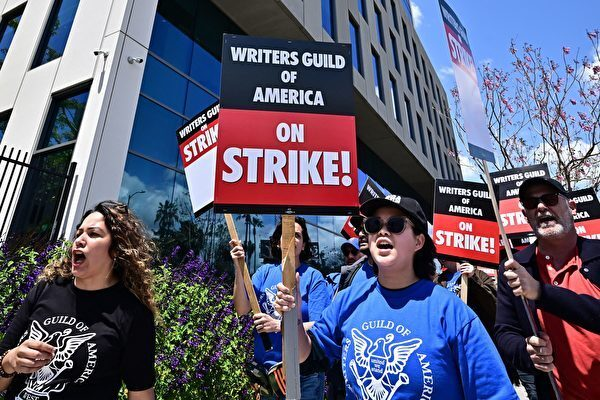
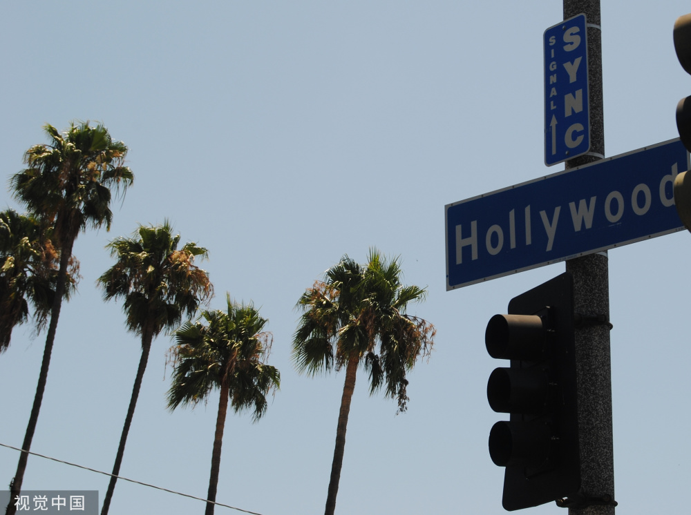
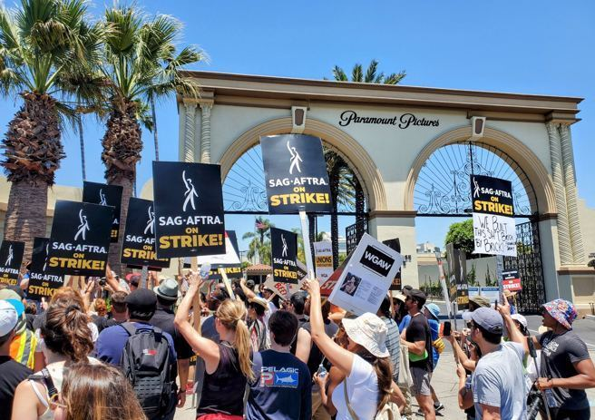

# 对话前传奇影业CEO高群耀：好莱坞正在失去中国 | 创变者

**腾讯新闻《创变者》主笔 徐昙 编辑 杨布丁**

**编者按：**
《创变者》系列聚焦那些基于专业、勇气和梦想，创造无限可能的人。本期人物高群耀，在微软、新闻集团、万达等从业经历见证了近年IT、传媒、互联网、电信四个产业的融合，曾驻守好莱坞，对其商业模式的变迁有深刻认知。

7月22日，中美合拍片《巨齿鲨2》在沈阳举行了全球首站路演，这恐怕是好莱坞大片最冷清的一次路演了，只有吴京一个主创人员站台，因为美方主创还在参加好莱坞如火如荼的大罢工。

这个暑期档，好莱坞大片的票房集体沦陷，7月17日上映的《碟中谍7》被好莱坞称为“近十年来最好的动作片”，但是上映6天，票房仅2.32亿，落后于国产片《长安三万里》、《茶啊二中》、《八角笼中》、《消失的她》。

2023年，中国内地对美国影片全部放开，但是好莱坞大片的票房反而遭遇滑铁卢——好莱坞大罢工的深层原因或许能解释美国大片内地票房之谜。

好莱坞历史上发生过两次最大规模的罢工，一次是1960年，一次是2023年5月开始的编剧、演员的大罢工。这两次大罢工有一个共同点，就是都处在一个新技术革命的节点，从而引发了好莱坞商业模式和内容形态的剧变。

1960年的罢工源于电视对电影的冲击，当时的“工运领袖”、后来的美国总统罗纳德·里根，为好莱坞编剧演员们争取到了一项重要的“二次分配”(Residual
Payments)权益：参与持续播放的影视剧的分账。这让好莱坞的编剧演员过了半个世纪的好日子。

直到21世纪初流媒体巨头奈飞（ **Netflix**
）的壮大，数字化的发展，乃至2022年ChatGPT的出现和进化，这项分账逐年递减到编剧演员认为已经威胁到了生存的地步，罢工爆发了。其最大目的是让底层工作者能加入流媒体的后期分红之中。

代表制片商利益的AMPTP（美国电视电影制片公司协会）在谈判中态度强硬，因为他们的日子也不好过。新冠疫情让娱乐业很多公司遭受了重创——迪士尼的主题公园陷入困境、华纳的大片暂时停播，AMC关闭了影院——而Netflix等流媒体平台却迎来了高光时刻。同时，新技术的迅猛发展瓦解了好莱坞整个商业生态，没人可以独善其身。

参与、见证好莱坞近些年商业变化的中国企业是万达。2012年，万达以26亿美元收购了AMC公司（美国电影院线）100%的股权，随后用数十亿美元连续收购欧美三家大型电影院，组建了全世界最大的电影院线AMC。2016年又斥资35亿美元收购了好莱坞传奇影业公司。直到2021年万达抛售了AMC绝大部分股权，退出了AMC董事会。

时任万达文化国际部CEO的高群耀，兼任传奇影业的CEO，驻扎在好莱坞，主导了万达文化集团在欧美影视和体育领域的资本运作和综合管理，连续两年被《好莱坞报道》评选入围“好莱坞最有权力的100人”。

那是好莱坞比较有活力的时期，各大制片商对大片的投入不惜血本。比如观看传奇影业制作的《环太平洋2》、《长城》、《魔兽》等大片时不能眨眼，因为每一秒的后期制作费用都可能高达数万美元。高群耀说：“每一次决策签字都硬着头皮，因为每一笔基本的花销都是数百万美元，贵得吓人。”

但现在，整个好莱坞的大制片商已失去了冒险精神。
**高群耀认为，“好莱坞商业大片的高光时刻已成为历史，新技术变革让电影产业的商业模式和内容形态都将改变。”**

高群耀曾担任过微软中国区总裁、美国新闻集团副总裁，现任移动电影院CEO，经历过IT、电信、互联网、传媒四个产业的融合，又熟悉好莱坞的生态。腾讯新闻《创变者》栏目就这次好莱坞大罢工的深层原因与高群耀进行了一场对话。

技术的发展革了好莱坞的“命”

**腾讯新闻《创变者》：** 好莱坞WAG（Writer American Guild，美国编剧工会）和SAG（Screen Actors
Guild，美国演员工会）的罢工应该是好莱坞有史以来最大规模的一次罢工了，这应该会对好莱坞造成巨大的经济损失吧？

**高群耀：**
好莱坞是一个巨大的完美运转的工业化体系，一个基于契约的精密协同系统。一群神龙不见首尾的“水牛”在一部电影的召唤下，像燕子一样有序地飞起来，电影项目结束后又散做无形。平时个个都是自由人，偶尔会为了一个项目临时组合在一起。这些个体的“水牛”加入WAG（美国编剧工会）和SAG（美国演员工会）以保护他们的权益。如果有两家工会同时罢工，整个好莱坞基本就瘫痪了。

WAG在2007年11月-2008年2月罢工过一次，当时我还在新闻集团任职（旗下有21世纪福克斯影业），那时候好莱坞的制片商损失了约21亿美元。因为只要编剧不写，制作的剧目当场就停了，周末的脱口秀节目立即就没有吸引和娱乐观众的段子了。

WAG和SAG两个工会同时罢工，这在历史上是非常罕见的。编剧工会现在大概有13万人，演员工会约有16万人。虽然只是编剧和演员罢工，但导演、制片、灯光，化妆师等等工种也没法工作，好莱坞数以百万人的工作都停滞了。好莱坞基本上就是停摆了。

**腾讯新闻《创变者》：** 导致这次大罢工的深层原因是什么？

**高群耀：**
在过去这些年中，好莱坞编剧演员的日子过得还不错，因为一方面他们有工作收入，另外一部分收入就来自于上世纪60年代大罢工所争取到的“二次分配”。这个“二次分配”来源于受雇的影片的长尾收益。

这次好莱坞大罢工有这么几个最主要的原因：一是，对整个演员编剧群体来说，二次分配的收入越来越少；二是，拍摄的时长越来越短，只有多拍长拍才有钱赚；第三就是AI的影响。这些影响主要源于三个冲击：一个是流媒体，一个是数字化的发展，一个是AI的进化。

但谈判的一方AMPTP（美国电视电影制片公司协会）的态度相当强硬。

**腾讯新闻《创变者》：** AMPTP为什么表现得如此强硬？

**高群耀：**
如果在以前，编剧不写，制片方就傻眼了。今天你不写，还有ChatGPT等人工智能AI的援助。ChatGPT等AI虽然做不到100分，但80分也OK。换句话说，在这场争执中，演员编剧处于劣势地位。如果罢工持续一段时间，有些人可能会倾家荡产。

所以谈判当中AMPTP态度强硬，意见不合，站起来就走人。因为它的理由也特别清楚，今天AMPTP，特别是传统好莱坞五大电影制片商（迪士尼、华纳、环球、派拉蒙、索尼）的日子也不好过，有几个最主要的原因：第一，技术的发展，硅谷的流媒体公司也制作内容，挑战好莱坞影视公司。仅仅奈飞（Netflix）一家流媒体平台近期在影视内容方面的投资就高达153亿美元，已经远超过好莱坞迪斯尼、华纳、环球、索尼和派拉蒙的投入；第二，票房模式在崩塌。票房模式就是通过电影院放映零售分成的模式，现在越来越多地被以奈飞为首的流媒体播放平台所取代。流媒体模式不是原来的2C票房分账模式，而变成2B订阅制和会员模式。流媒体的订阅模式把电影院票房的模式打得落花流水。尤其这几年实体电影院受到几个要命的打击，第一，疫情；第二，流媒体；第三，短视频的冲击。

更重要的是奈飞等全球流媒体平台在慢慢地“去好莱坞化”。这几年在奈飞最火的内容中“韩流”的比例越来越大。2022年全球收视率最高的《鱿鱼游戏》就是典型的案例。奈飞现在在韩国又一次性投了23亿美元。这种不断加大对韩国、日本、印度、中国台湾等非好莱坞内容生产地投资的行为很有战略性。

媒体大亨 IAC董事长Barry Diller声称，传统的电影产业正在崩塌，好莱坞就走到头了。

**腾讯新闻《创变者》：**
万达2012年收购美国AMC公司。你在2016年任职万达国际部CEO时，以AMC为代表的院线和以奈飞为首的流媒体有过票房模式的争执？

**高群耀：** 好莱坞之所以能够做出《阿凡达》这样的划时代电影是因为有强大的风险资本支持，资本支持的原因，是高风险、高回报。高回报的主要核心来源是票房。

一部电影最重要的收入是在电影院“放映窗口期”产生的票房。电影在电影院下线之后与流媒体的交易叫做版权交易，大多数电影版权交易能卖多少钱也取决于其在电影院票房的高低，票房就是电影是否赢利的命根子。

如果把电影院“放映窗口期”的票房模式取消了，最初始电影风险投资的动力就消失了。这就是我最基本的商业逻辑：如果挑战票房模式，就是从根本上在扼杀电影的制作体系，结果将没有人会大笔投资和赌更高端和更有视觉效果的电影。

这是过去十年以AMC为代表的电影院线阵营和以奈飞为代表的流媒体阵营之间的商业模式之争。我本人一直坚持票房模式，并在2018年合伙创建“中国试点，世界首创”的移动电影院，是想用移动互联的技术网赋能于电影院，坚守票房模式。

**腾讯新闻《创变者》：** 一个有趣的现象是，流媒体势力的扩大是好莱坞的大制片商也开始做平台？

**高群耀：** 2014年，迪士尼突然宣布它所有的内容不给奈飞播放了，它自己做了个流媒体平台Disney+
，好莱坞其他四大电影公司也开始效仿，比如华纳兄弟上线了HBO
Max。奈飞则开始做电影。你看，那些做渠道的人开始做内容，做内容的人开始做渠道。“渠道+内容”为王！美国市场就出现了“军阀割据”的状态。对一个客户来说，你得买一堆会员，订阅十几个平台，才能保证想看的内容都能看得到。

奈飞2019年也挤进了美国电影协会（MPAA），成为继好莱坞制片商迪士尼、华纳、环球、福克斯、派拉蒙、索尼之外的第七位成员，在制定政策上开始发挥作用。

**腾讯新闻《创变者》：** 你说的第二个影响好莱坞的是数字化？

**高群耀：**
数字化带来最重要的影响是影视业很多制作流程被缩短了，拍片时间缩短了，更重要的是电影人原有的IP可能没有了。比如今天你帮我拍一天的电影，我把你的形象和表演记录下来，通过AI生产其数字孪生，在不需要你的情况下就可以拍摄新的内容了。所以，编剧和演员在电影里发挥的作用被数字化的产品慢慢在取代。

假设拍《智取威虎山》需要1500多个“夹皮沟”群众演员，今天有了数字化，那1500个群众演员完全可以用技术自动生成。当好莱坞“撞上”数字化，龙套演员们就遭遇了“存在危机”。

**腾讯新闻《创变者》：** 还有一个是AI的冲击。这次罢工工会还对AI可能取代演员和编剧的威胁表达不满。AI对编剧和演员的威胁已经成为现实？

**高群耀：**
2022年底ChatGPT出世之后，AI更强大了，带来的影响更强烈。借用ChatGPT可以在给出必要提示的情况下写剧本、填内容。随后有一个不确定因素还没出来呢，如果GPT-5面世后，在自动产生视频和视频编辑搜索等方面如果有进一步突破的话，那对影视行业的冲击就会更加沉重。换句话说GPT-5就能把这部电影给你自动生成了。

所以，制片商的挣钱商业模式和生产内容方式变了，他们不得不换一个活法。

**腾讯新闻《创变者》：** 这表明技术的发展逐步对以传统好莱坞为代表的内容产业的瓦解，革命？

**高群耀：** 对，被革命了。

总结一下，今天好莱坞出现的这种大规模的罢工是我五年前就意料之中的事。它是好莱坞传统商业模式因为数字化等综合因素的冲击，以及全球多元化的结果。

数字化，特别是AI的出现，彻底改变了内容的制作过程和原来的模式，是不可阻挡的。这个过程是脱胎换骨的一个重塑过程，一定非常痛苦。或许经过激烈冲突的过程，会有新的模式出现。总而言之，基本上可以认为好莱坞商业大片的高光时刻已经过去了。

**腾讯新闻《创变者》：** 这些现象的出现，会导致一个什么样的结果？

**高群耀：** 两个，一个最主要的说法就是“好莱坞还有明天吗”？是不是真的好莱坞末日到来了？有人认为好莱坞的宿命到了。

另一种看法，今天好莱坞影视行业还是一个1340亿美元的行业，并且盈利。

好莱坞正在失去中国

**腾讯新闻《创变者》：**
这10年好莱坞大片在中国的票房发生了巨变。2012年有6部好莱坞大片进入内地票房前十，13部进入前二十。2023年，好莱坞十几部大片只有《速度与激情10》票房超过10亿，其他的都表现惨淡。在中国票房的变化与好莱坞这些年受到的冲击是否相关？

**高群耀：**
好莱坞的一大核心是内容，可是今天，好莱坞大片的内容多是脱离生活的。当年好莱坞特别火的经典，跟生活离得很近。比如《音乐之声》、《魂断蓝桥》、《乱世佳人》等。可是今天好莱坞的内容越来越脱离生活，充斥着marvel（漫威宇宙），DC
universe（DC宇宙），就是各种各样的宇宙；以及batman（蝙蝠侠）、Spider-Man（蜘蛛侠）等。很多的内容不复当年了。

原来的影片具有唯一性，每部片子都很独特，今天都开始趋同。一大堆超人、超女，《复仇者联盟》、《哥斯拉》、《金刚》等越来越趋同，观众甚至会把一堆超人，数个宇宙弄混，就是唯一性在下降。以前靠内容，今天是靠特效。

好莱坞的黄金时代指的是20世纪20年代～50年代，那段时间里，好莱坞的大制片厂制作了美国约90%的电影，在二战期间，他们更是控制了全球80%的电影院。
《乱世佳人》、《卡萨布兰卡》、《费城故事》等无数荧幕经典，无数个响亮的名字，它们不会随着时间的流逝而被人们淡忘。那时候，好莱坞不做，全世界几乎都没大片看。好莱坞几乎垄断了全世界的电影消费。如今这种现象基本上在崩塌。

**腾讯新闻《创变者》：** 这却是市场的自然选择？

**高群耀：**
对好莱坞来说，很大的一个冲击是它原来垄断全球，今天好莱坞似乎正在失去中国。而中国市场在全球范围内非常大。2019年，全球范围内大约是400亿美元的票房，北美票房是110亿美元，中国是95亿美元，也就是说北美和中国加起来占了全世界一多半的票房，中国的权重非常大。

而今天的现实是，好莱坞正在失去中国，这个事已经发生了。虽然疫情这3年有大环境的问题，但从2023年年初，中国对好莱坞的电影全部放开，其票房结果却是好莱坞大片在中国一片哀嚎。

**腾讯新闻《创变者》：** 今年都放开了吗？

**高群耀：**
全放开了。你看电影院每周都有美国好莱坞的大片。可是遗憾的是，好莱坞大片在中国的票房神话几乎是全军覆没，到目前没有特别成功的。7月17号那天汤姆·克鲁斯（Tom
Cruise）的《碟中谍7》上映。我邀请几位朋友一起去看了，因为我跟克鲁斯曾经多次私下见面，在他伦敦和洛杉矶的家我们做过交流。他今年61岁了，在片子里非常拼命，不过《碟中谍7》在中国内地的票房还没有陈思成《消失的她》的一个零头。好莱坞失去中国就意味着高度垄断全球这件事正在成为历史。

**腾讯新闻《创变者》：** 好莱坞大片为什么会失去中国？

**高群耀：**
在一定程度上我认为有这几个原因，一是疫情三年大家已经习惯了，不看大片咋了，不去电影院又咋了？因为有Youtube，有AIGC，有这么多的短视频平台，正在大规模地分散原来消费者观影的时间，整个电影业都受到了影响。所以，电影院的观影人次在全球范围内都在逐渐下降。

另外一个，这几年好莱坞几大制片商生产电影的个数越来越少，每个片子的投资越来越多，这是一个趋势。以前好莱坞10家大的制作公司，每家一年生产几十部电影，但现在一年做不到10部大片。这样的话，它就把大规模的钱都集中在几个片子上，但又怕出问题，所以策略就要保守，保守的结果就是尽可能地去做已有大IP的续集片。

《蜘蛛侠1》—《蜘蛛侠4》，《谍中谍1》—《谍中谍7》，但给现在中国这一代年轻人来看，这些片子老态龙钟，故事老、形式老、情节老、演员老，脱离现实生活，在中国票房越来越低。

**腾讯新闻《创变者》：** 为什么好莱坞大制片商的电影越来越少，而集中于老IP上，好莱坞好像越来越不敢冒险了？

**高群耀：**
好莱坞的制片商有两类：一个是传统“六大”为首的大制片商，包括迪士尼、华纳兄弟、环球、21世纪福克斯、派拉蒙、索尼，2019年迪斯尼收购了福克斯之后变成“五大”了；另一类是数以千计的小制片公司。

六大的收入来自于三方面：制片收入，发行收入和版权收入。通过发行和版权盈利是六大基本的生存之道，因为只有六大控制着全球的发行渠道，即便是传奇和狮门这样大的影业公司的电影也要交予六大来发行。发行的费用约占到电影票房的15%，有的甚至高达20%。所以对六大来说，想赔钱是很不容易的一件事。

所以，六大才敢赌大电影。这几年出品的电影个数变少，但是投资增加了，都用在IP打造上。这么做很重要的原因也是因为市场越来越敏感，他们失败的容错度越来越低，就导致了一定是老演员、老故事、老IP，几个IP不停地推。这就是今天的状态。

**腾讯新闻《创变者》：** 好莱坞电影在中国票房的变化，会影响内容吗？

**高群耀：**
好莱坞过去近30年影响全世界的大片几乎全部都是比较亲中的，这是自检的结果。在全世界范围内，好莱坞电影里的中国形象是相对正面的。如果影片里非得有个坏蛋是亚洲人，也不会是中国人。

过去这么多年来，这是因为中国市场的票房，因为欧美AMC电影院线为中国公司拥有所决定的，这是中国的软实力。今天AMC的股权又已经回到美国人手里，好莱坞在中国的电影票房在递减。所以，可以预计到，好莱坞全球化的内容，或许会发生微妙的变化。

