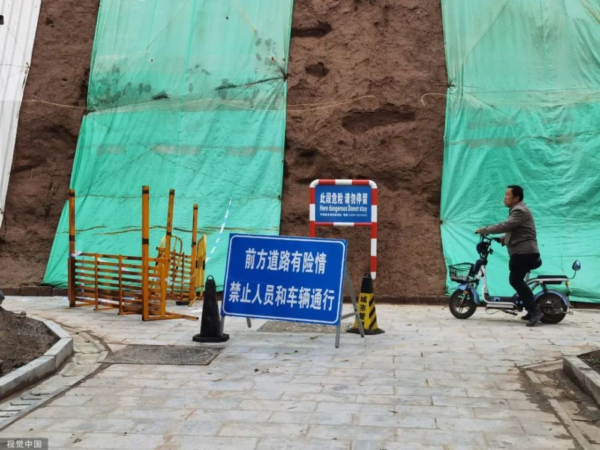
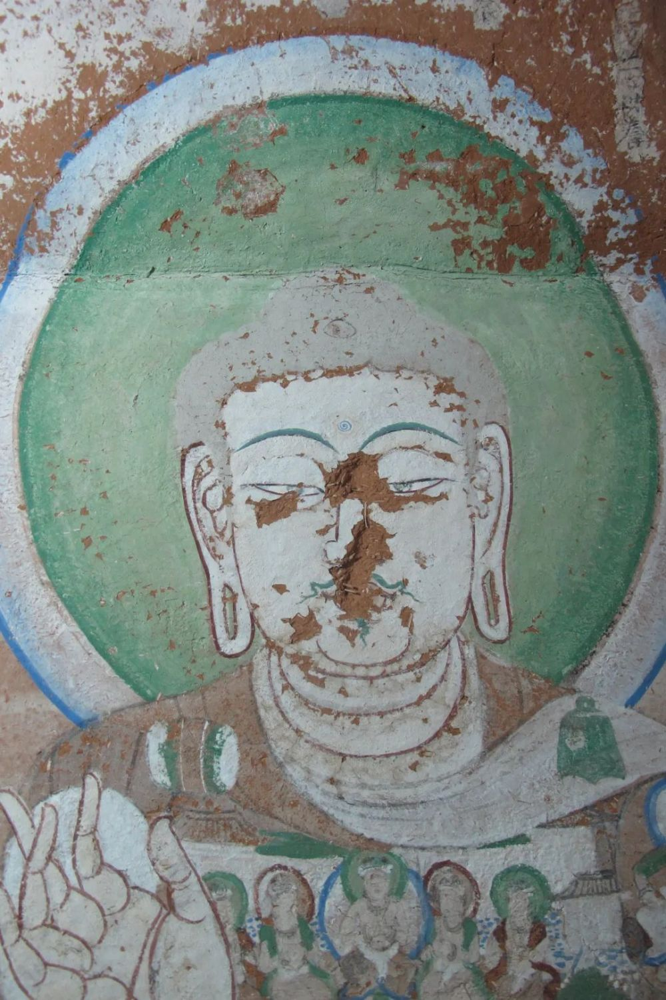
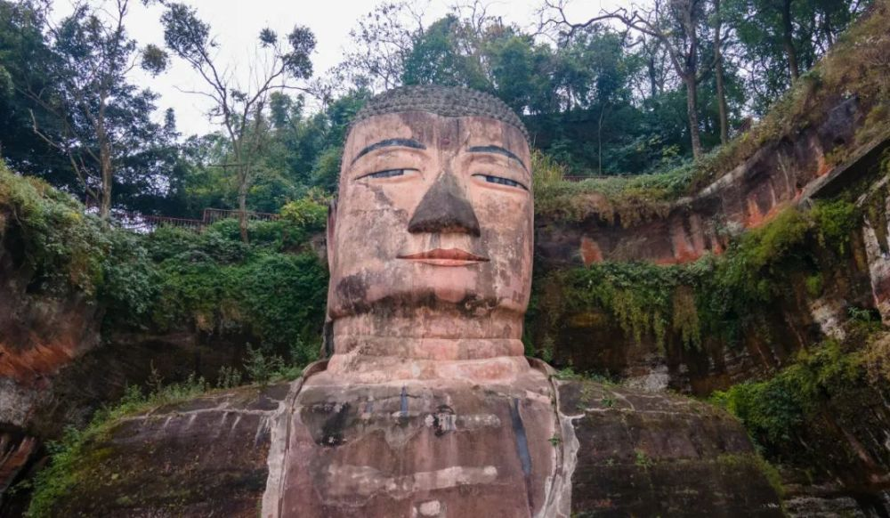
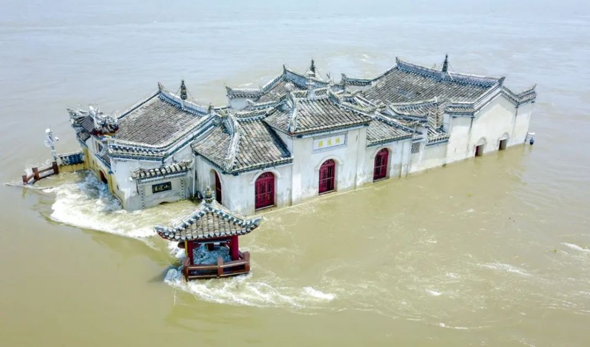

# ​敦煌壁画脱落、乐山大佛变黑，气候变化正在威胁我们的国宝

气候变化成为全球文化遗产保护的新挑战。

_2021年10月，山西晋中持续降雨，多地发生山体滑坡，平遥古城多处房屋倒塌、古建筑受损。_

随着全国各地陆续进入雨季，文物古建的处境又开始令人捏一把汗。犹记得两年前的10月，山西省大部分地区遭遇罕见的持续强降雨，造成多处古建筑受损。大雨两周后国家文物局公布数据：山西共有1783处文物不同程度地出现屋顶漏雨、墙体开裂坍塌、地基塌陷及周边护坡、围墙坍塌等险情。

这是气候变化导致的另一个恶果。不仅是极端天气短时间的冲击会威胁到古建古迹的安全，长时段内气候的缓慢变化，同样会在不知不觉间逐渐损伤文物。在有较多古迹的甘肃、山西、陕西等干旱、半干旱气候的西北省份，生态环境本就较为脆弱，也使得它们受气候变化的影响更加显著。

**缓慢但不可忽视的破坏**

7月8日，中国气象局发布了《中国气候变化蓝皮书（2023）》。其中指出，全球变暖趋势仍在持续，且21世纪极端天气将继续增加；中国升温速率高于全球同期水平，且我国也是全球气候变化的敏感区和影响显著区。

类似的变化趋势在更小的地域气候研究中也有体现。国际环保NGO绿色和平2021年起在甘肃开展气候变化对当地文化遗产保护等领域的研究。其所提供的数据显示，甘肃省1961年至2021年的年平均气温增速达0.28°C/10年，远超同期全球平均升温水平。另外，省内极端天气频次增加且极端性增强，21世纪初极端高温日数比2000年以前增加了约5.5天，省内极端降水量也持续波动上升。

_2014年9月，新疆阿克苏地区库车市阿艾石窟一处起甲壁画修复后的效果。新疆克孜尔石窟研究所共完成了41个洞窟壁画的保护修复。_

长时段内的气象因子变化，会对文物古迹造成缓慢但不可忽视的破坏。甘肃当地最多的遗址类型，是以莫高窟为代表的石窟群。石窟内温湿度的变化与降雨密切相关，而温湿度的频繁变化则是导致酥碱、起甲、壁画脱落等病害的重要影响因素。简单来说，干燥气候会让壁画表面返盐或起皮，而更湿的环境则会容易导致墙体里的黏土矿物吸水膨胀，湿度下降时则可能让壁画中间空鼓、剥落。

已列入世界遗产名录的莫高窟，在上世纪末就开始应对气候变化对石窟、壁画、塑像造成的威胁。1998年，莫高窟与美国盖蒂研究所合作，选取壁画病害严重的第85窟，开始在洞内应用全自动气象监测系统，来实时掌握温度、相对湿度、墙温、二氧化碳浓度等；双方同时合作了环境监测项目，建立起洞窟空气温、湿度变化与壁画病害的关联，成为此后数十个洞窟的环境监测的理论框架。

不同地区的文物有着不同的烦恼。在今年频繁发生沙尘暴的北京，针对故宫内的内装陈设和木制品、壁画等，需要制定沙尘与干燥的对策；南方的一些古建则需要担心白蚁、微生物、潮湿发霉的威胁。媒体曾报道过乐山大佛“变黑”的消息，这也是因为多雨的天气为微生物在石像表面的繁衍提供了环境。

_2021年12月，乐山大佛九曲栈道区域正在搭建脚手架，即将开展危岩体抢险加固前期勘察工作。_

**极端天气的猛烈冲击**

短时间内的极端天气则会对文物造成更严重更显性的冲击，而这样的天气正变得越来越多发。在2021年的山西暴雨中，主要受灾的是地上的古建筑、古城墙等。历史上，山西的气候以干旱半干旱型为主，干燥的天气为木质结构建筑等提供了良好的保存环境，也让山西成为全国古建筑最为集中的地区之一。但这同时意味着，在极端降水天气增多的情况下，山西的古建变得非常脆弱。

莫高窟也多次面临洪水的威胁，为此周边的桥与水坝数次提升了标准以加固。作为全国重点文物保护单位，莫高窟的修复与防护工作在近年得到了更为充足的国家资金支持。但对于省、市、县甚至未被划入保护级别的更多文物来说，应对气候风险的资金和机制建设仍然存在缺位。

如2021年10月的山西暴雨，共有1783处文物上报受灾险情。其中有176处属于全国重点文物保护单位，占到受灾文物的9.8%，其他是省、市、县及未核定的保护文物，省级文物保护单位143处，市县级文物保护单位661处，尚未核定公布为文物保护单位的不可移动文物803处。

村庄里的古迹大多缺乏系统维护。致力于古村和古建筑保护的社会组织“古村之友”负责人汤敏表示，国内恐有约20万文物在三年内将面临因暴雨而垮塌损毁的危险。古村之友也在那次暴雨时展开了一次“撑伞行动”，发起互联网募捐，为山西暂未获得修缮资金支持的情况危险的古迹搭建雨棚，减少雨水带来的冲刷破坏。字节、腾讯、阿里等企业均有千万级别的捐款，驰援当地古建的抢险修复工作。

_2020年7月，湖北省鄂州市长江江心上的观音阁被淹没大半。_

**预防性保护需加强**

早在2007年，联合国教科文组织世界遗产中心发布了《气候变化与世界遗产案例分析》报告，概述了气候变化对冰川、海洋及陆地生物多样性、考古遗址和古城等世界遗产带来的影响。当年，世界遗产委员会通过了关于文保应对气候变化的第一个政策性文件，给出了三个行动方向。

首先是预测预防，加强全球及各区域内的环境监测和报告，来减轻气候变化的影响。其次，是转向与纠正，要求全球和各个国家层面进行气候变化脆弱性和风险评估，并将气候变化因素纳入文化遗产保护政策的考虑范围。第三是全球合作，包括鼓励国际组织向气候脆弱地区提供可能的文保政策或资源的支持，在研究和实践、教育、培训、网络建设等方面进行全球性的沟通与援助。

针对我国西北地区，绿色和平在相关研究中也提出了文保领域应对气候变化风险的路径，包括科学评估西北地区气候风险，关注脆弱区域、产业及人群；建立健全气候变化监测体系，因时因地落实风险管理机制；加强对西北气候脆弱区域的政策、资金和机制支持。

联合国教科文组织亚太地区世界遗产培训与研究中心（北京）主任助理李光涵在接受采访时强调，未来，预防性保护仍需加强。“目前大量的保护技术还是在所谓的‘反应性保护’上，即发生了病害之后我们去治病害，”李光涵说，“但是‘预防性保护’的重要性说了很多年，真正投入的资金和实力却相较比较少，还是被动式的。我们文物保护工作者做了很多长期的技术工作，但我们还没有很系统地把它跟气候变化现象量化地联系在一起。要往这个方向去努力。”

作者：龚怡洁

图片来源：中国新闻图片网、视觉中国

图片编辑：张旭

值班编辑：邱宇

