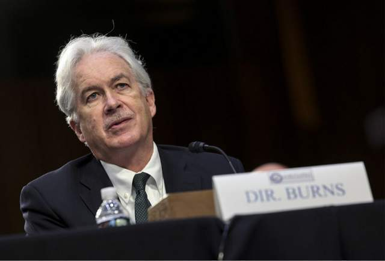
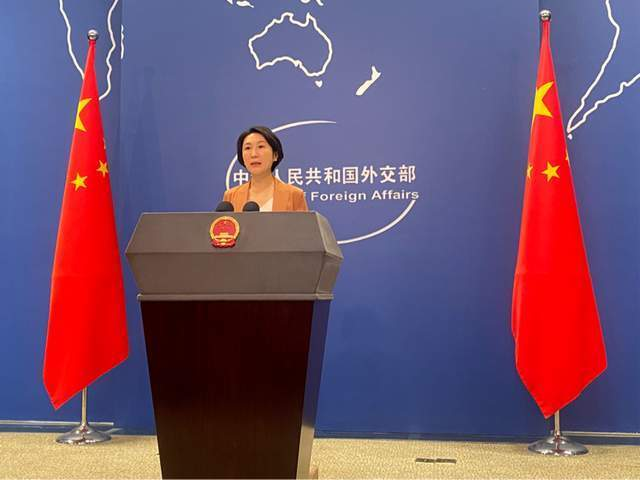
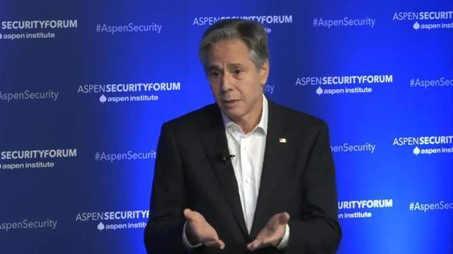
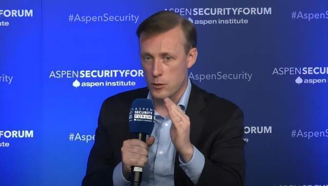
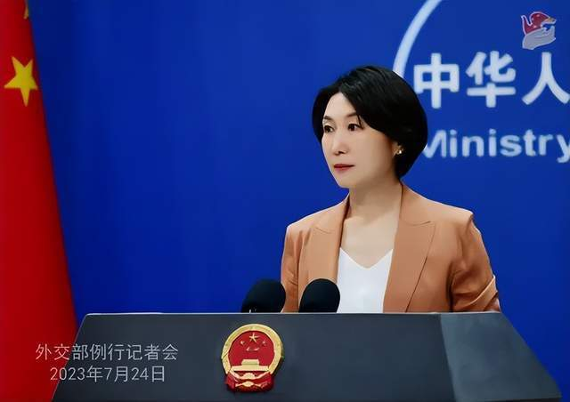

# 美国不装了？“对华情报网”摆上台面

**【直新闻按】**
前些日子还在频频以“间谍论”抹黑中国的美国，最近却突然“摊牌”。外媒报道，美国中央情报局局长伯恩斯7月20日在出席阿斯彭安全论坛时应询称，美在华情报网络重建已取得进展，正努力构建强劲的人力情报收集能力，以补充其他情报的获取渠道。消息一出，立刻引发国际社会的高度关注。这番突如其来的表态也让很多人感到疑惑，美方此时“自曝”意欲何为？美方究竟是彻底“不装了”，还是虚张声势让中国紧张？

美“对华情报网”摆上台面？

直新闻记者注意到，在24日的外交部例行记者会上，“中美关系”再次成为被关注的焦点。

据台媒报道，美国中央情报局局长伯恩斯20日在美国科罗拉多州举办的“阿斯彭安全论坛”上对与会者表示，CIA（美国中央情报局）目前在中国设有特工。他声称“我们已经取得了进展，近年来我们一直在努力确保我们拥有强大的人类情报网，以补充我们通过其他方式获得情报的能力。”

更荒谬的是，面对“CIA能否像俄乌冲突那样提前发出关于中国台湾的消息？”的疑问，伯恩斯表示，这是CIA“在努力的事”。

_7月24日，外交部发言人毛宁主持例行记者会。_

在24日的外交部例行记者会上，发言人毛宁对此作出回应，“中方对此表示关切，将采取一切必要措施坚决维护国家安全。”毛宁表示，“我们注意到有关报道，对此表示关切。美方一边反复散布所谓中国间谍、网络攻击的虚假信息，一边毫不掩饰地宣称要针对中国开展大规模的情报活动。这本身就很说明问题。中方将采取一切必要措施，坚决维护国家安全。”

伯恩斯的表态，是否意味着美国将“对华情报竞争”摆上了台面呢？

中国社会科学院亚太与全球战略研究院副研究员孙西辉，接受直新闻记者采访时表示，这种情况哪怕是冷战时期的美苏之间也实属少见。伯恩斯的表态应当说是虚虚实实，目前还是真假难辨。孙西辉认为其中有几个要点值得推敲，“首先大家对于所谓的情报网络的理解可能有所出入，比如说这到底是指什么类型、级别的情报，是什么样的规模和搜集能力等等。”

针对此次公开宣扬“对华情报网”建立，孙西辉分析，美方可能有两个目的，“第一个就是对中国施加一些压力，尤其是心理上的压力，通过这种方式来谋求中国内部出现一些混乱。第二个目的可能就是以‘阳谋’的方式来展现美国所谓的公开透明，以此表明它依然是一个实力超群的国家。中国和其他的国家，无论是在信息情报搜集，还是在安全防护等领域，都无法与之匹敌。”

“中美关系”再成阿斯彭安全论坛高频词

_美国国务卿布林肯出席阿斯彭安全论坛。_

值得注意的是，美国国务卿布林肯在出席阿斯彭安全论坛讨论对华政策时表示，美中关系恢复稳定至关重要，两国应继续开展持续性对话。“我们以前谈得不多。现在我们谈得很多。我们有不同的小组就不同的问题进行接触或即将进行接触。在我们（两国）的关系中，我认为我们可以找到解决方案。”

_白宫国家安全顾问沙利文出席阿斯彭安全论坛。_

此外，白宫国家安全顾问沙利文在阿斯彭安全论坛上谈及对华政策时也表示，“尽管美中存在固有竞争和持续紧张关系，但只要瞄准核心实际的问题，两国‘真的有可能’建立一种稳定的关系。”沙利文还表示，美国将不得不无限期与中国共存，这会是未来国际格局的特点，与大国共存将是美国施策的基本战略前提。

直新闻注意到，尽管美国方面对于两国关系发出了对话沟通积极信号，但是在推动中美关系向好发展的方向上却并没有什么实质性的举动。

据俄罗斯卫星社报道，美国务卿布林布林肯在美国新闻频道中表示，美方并不认为对中国军事领导层的制裁应是两国国防部门接触的绊脚石，声称中方不愿进行此类接触是一种“政治决定”。布林肯还妄图再将责任推向中方，宣称“美方已经向中方明确表示，保持双边军事接触，是避免任何误判和错误认知的责任”。

事实上，中国外交部发言人此前就指出，对当前中美两军对话面临困难的原因，美方是清楚的。中国国防部发言人也明确强调，对话不能没有原则，沟通不能没有底线。美方一方面口口声声要加强沟通，另一方面又不顾中方关切人为制造障碍，严重破坏两军互信，这不是致力于沟通的应有态度。

中美接触是“僵尸”外交吗？

有分析指，在美国有这样一种声音，包括国会议员在内的一些人认为美中官员接触是“僵尸”外交。

孙西辉告诉直新闻记者，结合布林肯、沙利文两位高官的表态和近期美方的一系列言行来看，引发僵局的原因有三。第一，美国首先想要表明的是不想跟中国发生军事冲突或者是战争。而拜登政府也多次宣称要为中美关系建立护栏，“美国人说的建立护栏实际上就是指稳定双边关系的大局，防止发生冲突”。

“第二，当前中美之间的军事沟通交流机制实际上已经被取消。2022年8月2号佩洛西窜台之后，中方在8月5号就公布了8项反制措施，其中前三项都是与军事交流机制有关，美国方面一直在呼吁中方恢复这些军事交流机制，”孙西辉说，“第三，美方既想要跟我们恢复军事交流，又不取消对中国防长的制裁。我认为它们是想要凸显美国所谓的实力地位的优势，其实这是一种强权政治的逻辑，本质上表现的就是可以继续制裁你，但是你还得配合我。”

至于这种僵持的局面能持续多久，孙西辉表示，具体时间不好判断，但是可以从两个角度来理解，“一方面就是看中美近期或者今后一段时间接触和磋商的进展情况，如果双方谈得相对比较顺利，也许可以打破僵局。另一方面，如果谈不好，或者说谈不下去，就是比拼两国战略忍耐力的时候了，看谁先顶不住自己面临的各种压力，最先示弱或妥协。”

布林肯营造的假象

值得注意的是，布林肯在阿斯彭论坛中声称，他在世界各地走访时都听到了一种“明确的信号”，要求美国和中国负责任地管理两国关系，因为这将对世界各国产生影响。“这正是我们正在做的事情，我认为中方也听到了这一需求信号。”

孙西辉提醒，这实际上就是布林肯想要得到的结果，看似“公允”的表态，却着重强调中方也要作出努力，“营造所谓美国已经作出努力的假象，让世界认为如果中美关系没有很好的管控，那么责任不在美方。这种说法也把中国置于国际舆论的焦点之下，给中国带来压力，美方就是希望营造不管以后中美关系能不能变好，美国都没有责任，责任都在你中方。”

直新闻注意到，正是这样一番充满“语言艺术”的表述，让国际社会产生了中国应当在中美关系中“再努力”一点的错觉。在24日的外交部记者会上，彭博社记者就向发言人问询“美国国务卿布林肯上周末称，国际社会急切希望美中负责任管控两国关系，他敦促中方作出努力。外交部对此有何回应？”

毛宁的回应就指出，“中方始终按照相互尊重、和平共处、合作共赢的原则来看待和发展中美关系，我们希望美方同中方相向而行，推动中美关系重回健康稳定的发展轨道。这不仅符合中美两国人民的利益，也是国际社会的普遍期待。”

实际上，这也正正切中问题的要害，真正需要对中美关系作出努力的，正是美方。

作者 | 丁舒航，深圳卫视直新闻驻京记者

