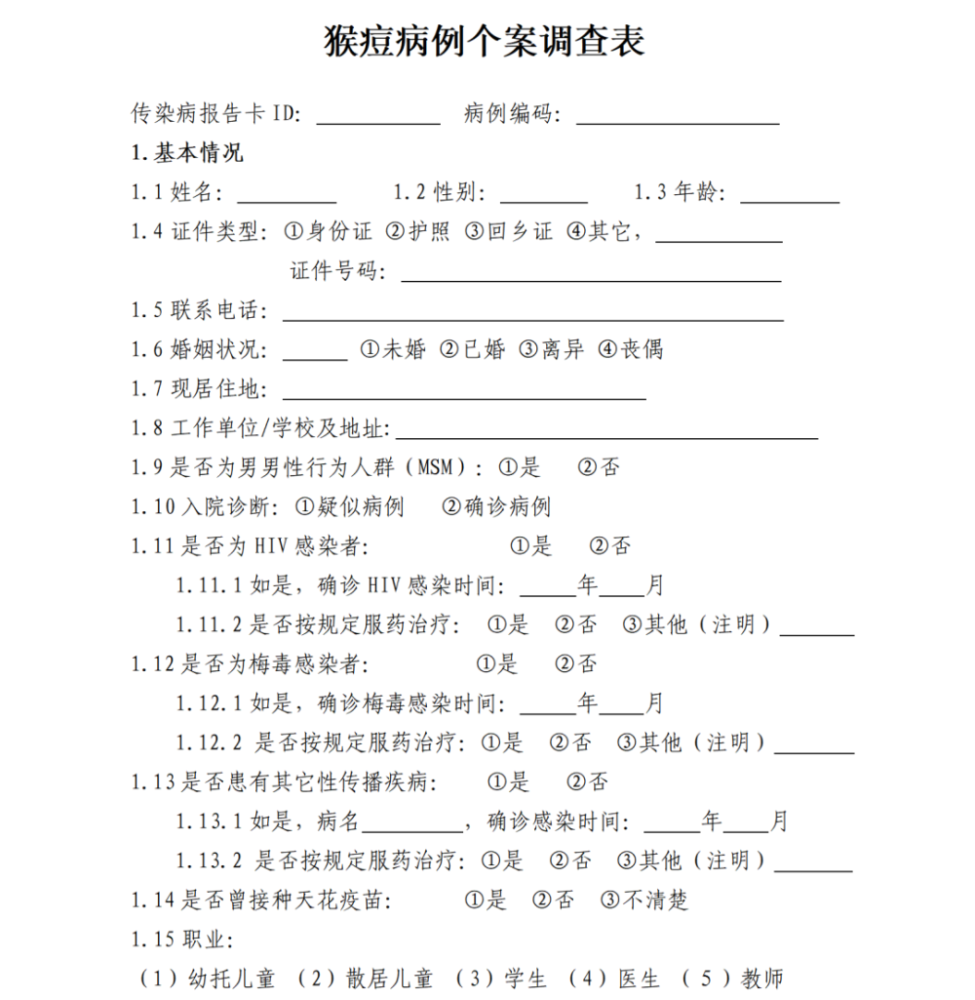
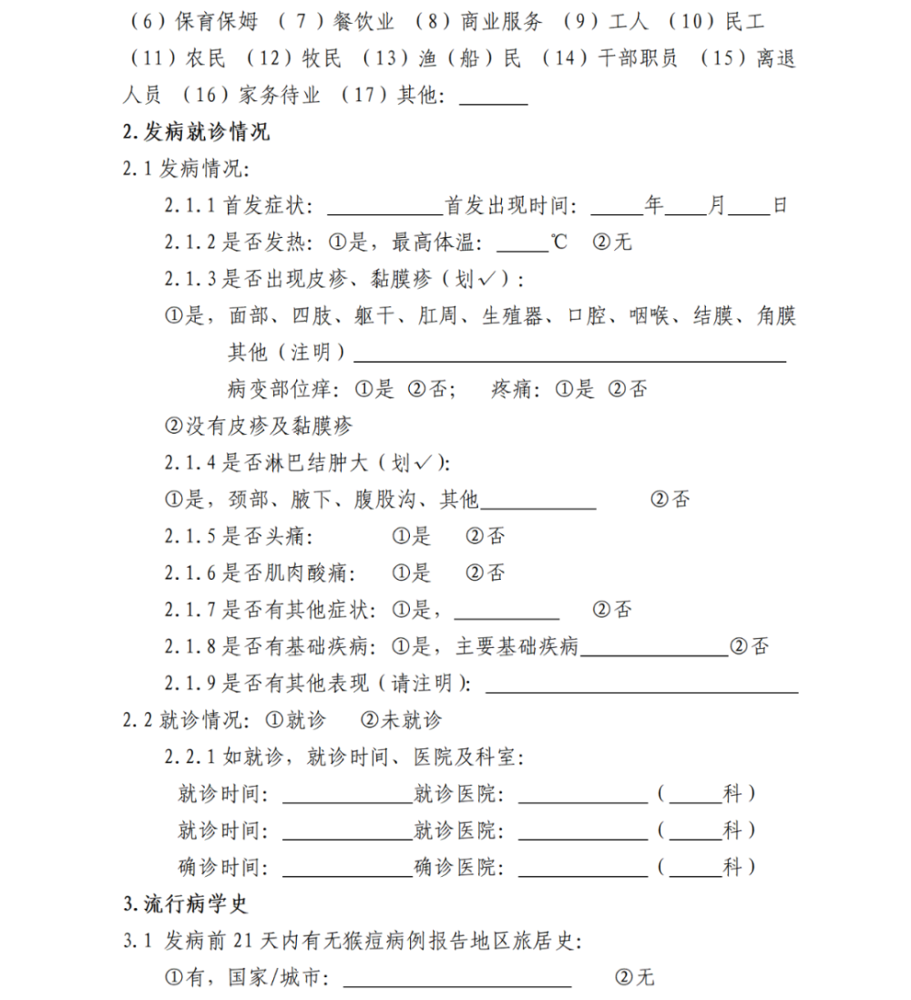
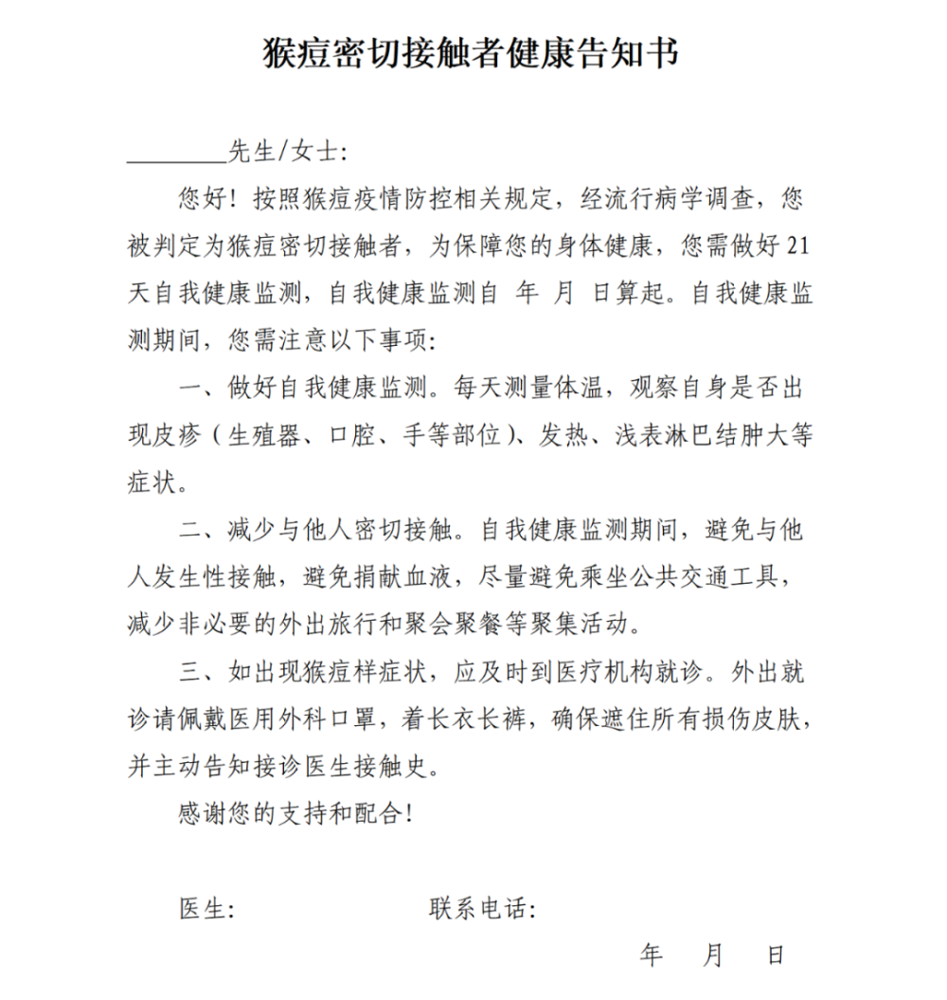
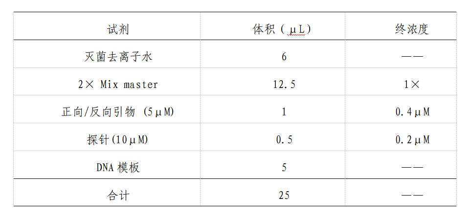
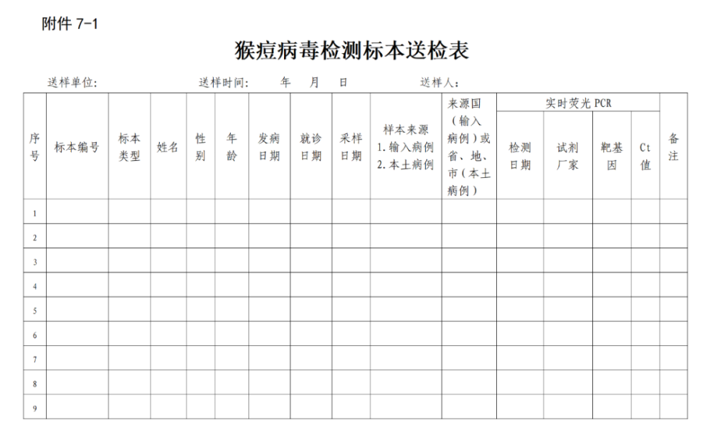
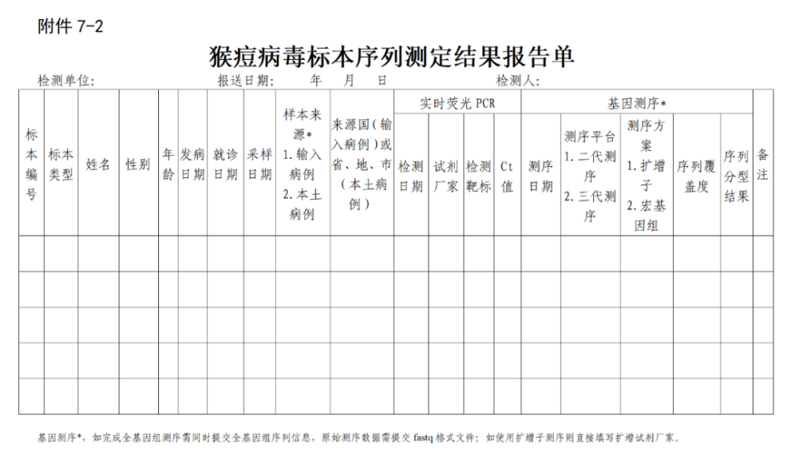

# 两部门印发《猴痘防控方案》

国家疾控局官微7月26日消息，进一步做好猴痘防控工作，及时有效应对猴痘疫情，提升猴痘防控工作的科学性、精准性和有效性，切实维护人民群众生命安全和身体健康，国家疾控局会同国家卫生健康委制定并印发《猴痘防控方案》。

《猴痘防控方案》解读问答

一、《猴痘防控方案》出台的背景是什么？

2023年6月以来，我国多个省份先后报告多例猴痘病例，引发新增本土续发疫情和隐匿传播的风险较高。为指导各地进一步科学精准做好猴痘防控工作，切实维护人民群众生命安全和身体健康，我们密切跟踪国内外猴痘疫情形势，持续开展猴痘防控政策研究，总结各地在应对猴痘疫情过程中积累的经验做法。综合病毒特点、疫情形势、研究进展及疫情处置经验等因素，在前期防控技术文件的基础上，进一步优化猴痘防控有关措施，以更好适应当前猴痘防控工作需要，进一步提升猴痘防控工作的科学性、精准性和有效性。

二、《猴痘防控方案》针对猴痘主要有哪些应对措施？

猴痘防控工作要坚持“预防为主、防治结合、精准防控、快速处置”原则，落实“早发现、早报告、早隔离、早治疗”措施。坚持发现一起、控制一起，及时阻断疫情传播。一是开展宣传教育与干预。针对重点人群、出入境人员和一般人群等不同风险人群分类开展宣传教育，有针对性地加强不同人群的风险防范意识和自我防护措施。二是实施多渠道监测。落实医疗机构、重点人群、入境人员监测，有条件的地区可根据疫情形势实施重点场所污水监测，确保疫情早期发现和及时处置。三是加强疫情应急处置。及时转运和诊疗猴痘疑似病例和确诊病例，掌握、追踪和管理密切接触者，及时发现潜在的疫情风险，做好被污染环境和物体表面的消毒，尽快遏制疫情传播扩散。四是分类实施人员培训。加强对各级疾控机构和医疗机构专业人员的培训，强化医务人员猴痘诊治意识，提升疾控人员猴痘疫情防控和应急处置能力。同时，各地在猴痘疫情防控过程中应注意保护病例、密切接触者和重点人群等个人隐私。

三、现阶段猴痘的主要传播途径是什么？哪些人是感染的重点人群？

猴痘病毒主要经黏膜和破损皮肤侵入人体，主要通过直接接触病例的病变皮肤或黏膜传播，接触方式包括性接触、抚摸、拥抱和亲吻等。亦可通过接触被病毒污染的物品、长时间近距离吸入病例呼吸道飞沫传播，接触感染动物的呼吸道分泌物、病变渗出物、血液及其它体液，或被感染动物咬伤、抓伤感染传播。

人群对猴痘病毒普遍易感，接种过天花疫苗对猴痘病毒存在一定程度的交叉保护力。现阶段猴痘的主要传播途径是在男男性行为人群中经性接触传播，男男性行为人群是感染猴痘的重点人群。目前一般人群感染猴痘病毒的风险较小，但需了解猴痘基本知识，做好健康防护。

四、针对不同人群如何有针对性地做好宣传教育？

《猴痘防控方案》明确指出，针对重点人群、出入境人员和一般人群及早开展宣传教育，加强人群防范意识和自我防护，积极配合做好防控工作。

一是针对重点人群。充分借鉴艾滋病防治综合干预经验和服务模式，在男男性行为人群经常出入的酒吧、会所、浴池等重点活动场所，开展同伴教育。借助大众媒体、社交网站等互联网平台，开展猴痘防控知识宣传教育，提高重点人群防范意识，减少高危行为。

二是针对出入境人员。提醒出境人员关注目的地国家和地区猴痘疫情信息，不接触猴痘样症状者及啮齿类、灵长类等动物。提醒来自猴痘疫情报告国家和地区的人员，如在境外有可疑接触史，入境后21天内应做好自我健康监测，避免与他人发生密切接触，一旦出现猴痘样症状，应主动就医。

三是针对一般人群。充分发挥新媒体以及广播、电视、报纸等传统媒体作用，开展猴痘疫情防控知识宣传教育，引导公众科学认识猴痘，了解猴痘基本知识，在日常生活和工作中提高防护意识，避免恐慌，养成健康文明的生活方式。

五、当前我们如何开展猴痘疫情监测？

按照《猴痘防控方案》要求，我们对猴痘实施多渠道监测，以便及早发现与处置疫情。

一是医疗机构监测。各级各类医疗机构尤其是皮肤（性病）科、肛肠科、艾滋病自愿咨询检测门诊等加强猴痘样症状鉴别诊断，发现猴痘样症状者及时询问流行病学史，采集标本送相关实验室进行猴痘病毒核酸检测，进一步核实诊断。

二是重点人群监测。各级各类医疗机构、疾控机构在对男男性行为人群等重点人群开展诊疗或检测咨询服务时，主动询问是否有猴痘样症状及其可疑接触史，及时发现猴痘病例。

三是入境人员监测。海关加强口岸卫生检疫，收到猴痘相关异常健康申报或检疫发现有猴痘样症状的入境人员，应及时进行核酸检测，发放《就诊方便卡》，指导尽快就医；对于核酸检测阳性人员，将相关信息及时通报辖区疾控机构。

四是重点场所污水监测。有条件的地区可根据当地疫情形势，经评估对男男性行为人群经常出入的酒吧、会所、浴池等重点活动场所开展污水监测，及时发现可能存在猴痘病例的场所。

六、《猴痘防控方案》对猴痘病例的管理有哪些要求？

按照《猴痘防控方案》有关规定，根据病例的不同情况分类实施医疗机构隔离治疗或居家隔离治疗。各地发现猴痘疑似病例和确诊病例后，应先及时转运至医疗机构进行隔离治疗，如病例临床症状明显好转，病变部位已结痂，可转为居家隔离治疗，直至皮疹结痂自然脱落，解除居家隔离。对病情较轻且具备居家隔离治疗条件的确诊病例，经医疗机构与疾控机构联合评估后，可直接采取居家隔离治疗。

确诊病例居家隔离治疗期间，为保障家人健康和防止疫情传播，应单人单间居住，避免与家人有皮肤或黏膜直接接触，做好被污染物品的消毒，非必要不外出，确须外出时穿长衣长裤、佩戴医用外科口罩，避免前往人群聚集场所，避免与其他人有皮肤或黏膜直接接触。居家隔离治疗期间，指定医疗机构安排专人负责上门或电话随访，对病例提供健康咨询和医疗指导。

七、猴痘密切接触者包括哪些人员？对密切接触者实施哪些管理措施？

猴痘密切接触者包括直接接触病例的病变部位及其被污染物品，或感染动物及其分泌物、渗出物等污染物；以及职业暴露或长时间近距离吸入病例呼吸道飞沫等，经评估有感染风险的人员。

对密切接触者主要实施以下措施：一是实施21天自我健康监测。健康监测期限为自最后接触之日算起21天，自我健康监测期间可正常生活与工作，需避免与他人发生性接触等密切接触，避免捐献血液等。二是定期随访。疾控机构或基层医疗卫生机构应在第7、14、21天电话或上门主动询问密切接触者自我健康监测情况，提供咨询指导建议。发现异常情况，及时调查处置。三是出现症状及时就诊。坚持每天做好体温测量和症状监测，主要症状包括发热（＞37.3℃）、皮疹、浅表淋巴结肿大等。密切接触者一旦出现相关症状应及时前往医疗机构就诊或与随访联系人取得联系，接受猴痘病毒核酸检测。

八、对发生疫情的场所如何科学规范开展消毒工作？

发生疫情的场所应根据流行病学调查结果，确定现场消毒的范围和对象。对病例居住或活动过的场所，如居住场所、工作场所、学习场所、诊疗场所、转运工具，及其他可能受到污染的场所，在其离开后进行终末消毒。尤其要做好病例衣物、毛巾、床单、餐具等个人用品，以及可能被病例分泌物、渗出物、体液等污染的环境和物体表面的终末消毒。

猴痘防控方案

猴痘是由猴痘病毒（Mpox
virus，MPXV）感染所致的一种人兽共患病。2022年9月，我国报告首例猴痘输入病例。2023年6月以来，我国多个省份先后报告多例猴痘病例，引发新增本土续发疫情和隐匿传播的风险较高。为指导各地科学精准做好猴痘防控工作，切实维护人民群众身体健康，制定本方案。一、总体要求

坚持“预防为主、防治结合、精准防控、快速处置”原则，落实“早发现、早报告、早隔离、早治疗”措施。开展医疗机构、重点人群、入境人员和重点场所等多渠道监测。加强疫情分析与风险研判，有针对性地开展重点人群健康教育和综合干预。落实病例隔离治疗、流行病学调查和密切接触者追踪管理等措施。坚持发现一起、控制一起，及时阻断疫情传播。二、疾病特征

（一）病原学特征。

猴痘病毒属于痘病毒科正痘病毒属，为基因组全长约197kb的双链DNA病毒。1958年首次在猴子中发现该病毒。1970年在刚果民主共和国一名疑似天花患者的标本中首次分离到猴痘病毒，为首例确诊的人类猴痘病例。

猴痘病毒分为两个进化分支：（1）分支I，曾称为中非分支或刚果盆地分支；（2）分支II，曾称为西非分支，进一步分为IIa和IIb分支。其中引发2022年全球非地方性流行区猴痘暴发疫情的毒株为IIb分支。IIb分支目前已出现较多亚分支，包括A.1、A.2和B.1等亚分支，2022年9月我国报告首例输入性猴痘病例以来，各地报送中国疾控中心病毒病所的毒株序列均属于IIb分支。

猴痘病毒耐干燥和低温，在痂皮、土壤和衣物、床上用品等物体表面可生存数月。该病毒对热敏感，加热至56℃30分钟或60℃10分钟即可灭活。75%乙醇、含氯消毒剂、过氧乙酸等常用消毒剂及紫外线可有效灭活病毒，对过氧化氢、次氯酸钠、戊二醛、邻苯二甲醛等敏感。

（二）流行病学特征。

1.传染源。猴痘病毒的宿主尚不明确，目前认为非洲啮齿类动物（非洲松鼠、树松鼠、冈比亚袋鼠、睡鼠等）可能为其自然宿主。传染源包括猴痘病例及感染的啮齿类动物、猴和猿等灵长类动物。

2.传播途径。猴痘病毒主要经黏膜和破损皮肤侵入人体，主要通过直接接触病例的病变皮肤或黏膜传播，亦可通过接触被病毒污染的物品、长时间近距离吸入病例呼吸道飞沫传播，接触感染动物的呼吸道分泌物、病变渗出物、血液及其它体液，或被感染动物咬伤、抓伤感染传播。

3.易感人群。人群普遍易感。接种过天花疫苗对猴痘病毒存在一定程度的交叉保护力。

4.疫情特征。2021年以前的猴痘疫情主要在中非和西非地区呈地方性流行，主要通过接触感染动物传播，所引发的人传人疫情传播链较短，主要为儿童及青壮年的散发病例及聚集性疫情，通过家庭或旅行方式偶尔播散至其他国家和地区。2022年5月以来全球多国暴发的疫情主要在男男性行为人群（Men
who have sex with
men，简称MSM，指与同性发生性行为的男性）中经性接触传播，大部分病例为青壮年男性，通过大型聚会以及后续在社区的MSM扩散，并传播至全球多个国家和地区。

（三）临床特征。

1.潜伏期：5-21天，多为6-13天。

2.传染期：病例出现症状后至皮疹结痂自然脱落并形成新皮肤前具有传染性。有调查提示一些病例可能在出现症状前1-4天存在传染性。

3.早期症状：可出现发热、头痛、背痛、肌痛和淋巴结肿大等。

4.皮疹和黏膜疹：通常在热退后出现，有些病例可出现在全身症状之前。皮疹发生常经过斑疹、丘疹、水疱、脓疱、结痂至痂皮脱落几个阶段，不同形态皮疹可同时存在，可伴有明显痒感和疼痛。可累及口腔咽喉黏膜、肛门、生殖器、结膜和角膜等。痂皮脱落后可遗留红斑或色素沉着甚至瘢痕，瘢痕持续时间可长达数年。

5.病程及严重程度。猴痘病程约2—4周，免疫力低下患者的病程可能较长。猴痘为自限性疾病，大多数病例症状会自行消失，也有重症和死亡发生，主要为儿童、孕妇和免疫力低下人群。

2022年以来全球多国猴痘暴发疫情中，大多数病例临床表现较轻，部分病例无全身症状，皮疹仅限于生殖器、肛门直肠黏膜部位，死亡病例主要为未得到治疗的艾滋病病毒感染者等免疫力低下人群。2022年以来全球非地方性流行区病例的病死率约为0.1%。三、宣传教育与干预

针对重点人群、出入境人员和一般人群等不同人群分类开展宣传教育，有针对性地加强不同人群的自我防范意识和个人防护措施，积极配合做好防控工作。

（一）重点人群。各地卫生健康与疾控部门联合相关社会组织，充分借鉴艾滋病防治综合干预经验和服务模式，在MSM经常出入的酒吧、会所、浴池等重点活动场所，开展同伴教育。借助大众媒体、MSM社交网站等互联网平台，开展猴痘防控知识宣传教育，提高重点人群防范意识，减少高危行为，引导有可疑接触史者自觉做好自我健康监测，增强主动就诊意识。

重点人群宣传干预要求详见附件1《重点人群宣传干预指南》。

（二）出入境人员。通过发放宣传资料等形式，加强出入境人员猴痘防控知识宣传教育。提醒出境人员关注目的地国家和地区猴痘疫情信息，不接触猴痘样症状者及啮齿类、灵长类等动物。提醒来自猴痘疫情报告国家和地区的人员，如在境外有可疑接触史，入境后21天内应做好自我健康监测，避免与他人发生密切接触，一旦出现发热、皮疹、淋巴结肿大等猴痘样症状，应主动就诊并如实报告流行病学史。

（三）一般人群。各地充分发挥新媒体以及广播、电视、报纸等传统媒体作用，开展猴痘防控知识宣传教育，提高公众科学防范意识。四、疫情监测和报告

（一）监测病例定义。

1.猴痘样症状者。不明原因急性皮疹（面部或口腔黏膜、四肢、生殖器或会阴、肛周等部位），伴发热（＞37.3℃）或淋巴结肿大者。

2.疑似病例。猴痘样症状者，发病前21天内具备以下流行病学史中的任何一项：（1）有猴痘病例报告地区旅居史；（2）有猴痘确诊病例或疑似病例接触史；（3）有同性性行为，或性伴有同性性行为史；（4）有地方性流行区可疑动物接触史。

3.确诊病例。猴痘样症状者、疑似病例及密切接触者，经实验室检测猴痘病毒核酸阳性或病毒分离阳性者。

（二）多渠道监测。

1.医疗机构监测。各级各类医疗机构要开展猴痘样症状监测，尤其是皮肤（性病）科、肛肠科、艾滋病自愿咨询检测门诊等要重点关注猴痘样症状者。发现猴痘样症状者，应主动询问流行病学史，记录患者现住址及联系方式，采集标本送疾控机构进行猴痘核酸检测。具备猴痘病毒检测能力及猴痘病毒实验活动资质的医疗机构也可开展检测。

2.重点人群监测。各级各类医疗机构、疾控机构在对MSM等重点人群开展诊疗或检测咨询服务时，应主动询问是否有猴痘样症状及其可疑接触史。如发现猴痘样症状者和疑似病例，应及时采集标本进行猴痘病毒核酸检测。

3.入境人员监测。海关收到猴痘相关异常健康申报或检疫发现有猴痘样症状的入境人员，应及时进行标本采集和核酸检测，并发放《就诊方便卡》，要求其尽快就诊；对于核酸检测阳性者，将相关信息通报辖区疾控机构，由相关部门进一步调查处置。

4.重点场所污水监测。有条件的地区可根据当地疫情形势，经评估对MSM经常出入的酒吧、会所、浴池等重点活动场所开展污水监测。

（三）病例报告。

相关医疗机构根据临床表现、流行病学和实验室检测结果，及时对患者进行诊断。

诊断的疑似病例和确诊病例应于24小时内通过中国疾病预防控制信息系统的监测报告管理模块进行网络直报。如为境外输入病例需填写输入来源国家或地区。不具备网络直报条件的医疗卫生机构，需在规定时限内将传染病报告卡信息报告属地乡镇卫生院、社区卫生服务中心或县级疾控机构进行网络报告，同时传真或寄送传染病报告卡至代报单位。负责病例网络直报的医疗卫生机构，要根据实验室检测结果、流调进展及时对病例信息进行复核、订正。

各县（市、区）出现首例猴痘确诊病例或者2例及以上存在流行病学关联的确诊病例，应当在2小时内通过突发公共卫生事件报告管理信息系统报告，事件级别选择“未分级”。五、疫情处置

（一）病例管理。

各地发现猴痘疑似病例和确诊病例应当及时转运至医疗机构进行隔离治疗，如临床症状明显好转，病变部位已结痂，可转为居家隔离治疗，直至皮疹结痂自然脱落，解除居家隔离。对病情较轻且具备居家隔离治疗条件的确诊病例，经医疗机构与疾控机构联合评估后，可直接采取居家隔离治疗。对于实行居家隔离治疗的确诊病例发放《猴痘病例居家隔离治疗健康告知书》（见附件2）。确诊病例居家隔离治疗期间，单人单间居住，避免与家人有皮肤或黏膜直接接触，做好被污染物品的消毒，非必要不外出，确须外出时穿长衣长裤、佩戴医用外科口罩，避免前往人群聚集场所，避免与其他人有皮肤或黏膜直接接触；指定医疗机构安排专人负责上门或电话随访，提供健康咨询和医疗指导。

（二）流行病学调查。

县（市、区）级疾控机构接到辖区疑似病例和确诊病例报告后，及时组织开展流行病学调查，查找感染来源，掌握、追踪和管理密切接触者，分析传播链及传播特征，及时发现潜在的风险人群及其范围、特征，有针对性地开展宣传教育和综合干预。调查过程中发挥多部门联防联控的协同作用，尽可能获取全面准确的流调信息。

调查内容主要包括病例基本信息、发病就诊情况、临床表现、转归及实验室检测；发病前21天内与可疑感染来源的接触史、接触场所及接触方式；发病后至隔离治疗前的具体活动地点、与其有皮肤或黏膜直接接触者，以及发病前4天内与其有性接触者。

猴痘疫情流行病学调查要求详见附件3《猴痘疫情流行病学调查指南》。

（三）密切接触者的判定和管理。

1.密切接触者定义。直接接触病例的病变部位及其被污染物品，或感染动物及其分泌物、渗出物等污染物；以及职业暴露或长时间近距离吸入病例呼吸道飞沫等，经评估有感染风险的人员。

2.密切接触者判定。根据流行病学调查及暴露风险评估结果，疾控机构负责及时对密切接触者进行判定。

3.密切接触者管理。疾控机构或基层医疗卫生机构指导密切接触者做好自我健康监测，健康监测期限为最后密切接触之日起21天。

密切接触者自我健康监测期间可正常生活与工作，需避免与他人发生性接触等密切接触，避免捐献血液等；坚持每天做好体温测量和症状监测，出现猴痘样症状应及时就诊并主动报告可疑接触史。辖区疾控机构或基层医疗卫生机构应在密切接触者自我健康监测第7、14、21天上门或电话对其进行随访，提供咨询指导，发现异常情况及时进行处置。

密切接触者判定管理要求详见附件4《猴痘密切接触者判定和管理指南》。

（四）消毒与人员防护。

做好病例衣物、毛巾、床单、餐具等个人用品，以及可能被病例分泌物、渗出物、体液等污染的环境和物体表面的消毒。从事病例诊治护理、流行病学调查、环境清洁消毒、标本采集和实验室检测等工作人员在工作期间做好个人防护。

消毒与人员防护要求详见附件5《猴痘消毒技术指南》和附件6《猴痘个人防护指南》。六、实验室检测

猴痘病毒核酸检测首选皮肤或黏膜病变部位标本，可同时采集口咽拭子标本。各省首例猴痘确诊病例标本应送中国疾控中心病毒病所进行复核；本土疫情中的首发或早期确诊病例、与早期病例有流行病学关联的关键确诊病例、感染来源不明的本土确诊病例、境外输入确诊病例阳性标本等，荧光定量PCR检测Ct值≤32时进行病毒基因测序。所有测序原始数据、组装序列及测序样本送检单应在获得序列48小时内报送中国疾控中心病毒病所进行汇总、分析。以上确诊病例应至少采集一套标本（包括核酸检测阳性者的皮肤或黏膜病变标本、口咽拭子标本以及发病急性期和恢复期双份血清）送中国疾控中心病毒病所。

实验室检测具体要求详见附件7《猴痘病毒实验室检测技术指南》。七、院内感染控制

医疗机构应当严格做好院内感染控制。疑似病例和确诊病例应安置在隔离病房，疑似病例单间隔离。医务人员执行标准预防，采取经接触传播和经飞沫传播疾病的隔离与预防措施，佩戴一次性乳胶手套、KN95/N95及以上级别的口罩、防护面屏或护目镜、一次性隔离衣等，同时做好手卫生。严格按照《医疗机构消毒技术规范》对病例的体液、血液、排泄物、分泌物等进行规范处理，做好诊疗环境（空气、物体表面、地面等）、医疗器械、病例使用物品等的清洁消毒。根据《医疗废物管理条例》《医疗卫生机构医疗废物管理办法》做好医疗废物的处置和管理。八、工作要求

（一）加强组织协调。各地卫生健康、疾控部门加强与海关等有关部门的密切协作和信息共享，及时发现与处置猴痘疫情，落实猴痘病例发现、疫情报告、诊疗隔离、密切接触者追踪管理等工作，防止疫情扩散和蔓延。各地在猴痘疫情防控过程中应注意保护病例、密切接触者和重点人群等个人隐私。

（二）加强宣传引导。各地要及时发布辖区猴痘疫情相关信息，做好政策解读和公众健康提示。通过多种方式和渠道开展猴痘防控知识宣传，加强重点人群宣传教育的针对性和实效性。及时回应社会关切，引导公众科学认识猴痘。

（三）加强人员培训。各地要加强对各级疾控机构和医疗机构专业人员的培训。对医务人员重点开展猴痘病例的识别与诊断、病例发现与报告、病例管理等相关知识培训，强化诊治意识。对疾控人员重点开展流行病学调查、密切接触者的判定和管理、实验室检测、重点人群宣传干预等相关知识培训，提高猴痘疫情防控和应急处置能力。附件：

1.重点人群宣传干预指南

2.猴痘病例居家隔离治疗健康告知书

3.猴痘疫情流行病学调查指南

4.猴痘密切接触者判定和管理指南

5.猴痘消毒技术指南

6.猴痘个人防护指南

7.猴痘病毒实验室检测技术指南

附件1

重点人群宣传干预指南

2022年5月以来，全球非地方性流行区发生的猴痘疫情以男男性行为人群（MSM）为主。为充分利用我国艾滋病防治综合干预服务体系，开展MSM等重点人群宣传干预，防范猴痘疫情传播扩散，形成常态化艾滋病与猴痘综合防控一体化应对机制，制定本指南。一、实施策略

在现有艾滋病防治综合干预服务体系基础上，综合运用行为学干预方法和手段，通过宣传教育、促进安全性行为、动员检测、外展服务、同伴教育和互联网干预等，从个体、群体和社会等多个层面为目标人群提供猴痘综合干预服务。二、组织实施

各级医疗机构和疾控机构要加强重点科室和艾滋病自愿咨询检测门诊工作人员猴痘知识培训，对重点人群提供猴痘防控知识宣传、检测咨询与动员、治疗和关怀等服务。各级疾控机构应当积极推动当地有能力、具有良好艾滋病防治经验的MSM志愿者或社会组织共同参与猴痘防治宣传工作，在工作过程中注意保护重点人群个人隐私。三、形势分析

各地要加强对重点人群猴痘疫情、防控现状、影响因素及出入境情况的调查，及时分析研判猴痘疫情形势，为制定本地高危行为干预工作计划提供依据。具体内容包括：1.重点人群基数、活动形式和特点、活动场所、出入境的时间及地区等；2.猴痘知识、态度和高危行为；3.猴痘疫情水平及其影响因素；4.猴痘防治政策及专业机构已开展的工作；5.包括志愿者在内的有关组织和个人已开展的干预活动；6.影响猴痘防治工作的困难和问题。四、宣传干预

（一）宣传教育。各级疾控机构或健康教育专业机构提供技术支持，社会组织参与，共同研究制定适合当地特点的猴痘预防宣传材料，加强警示宣传教育。通过大众媒体、MSM网站和以移动终端为载体的交友软件等平台，宣传国际、国内及本地猴痘疫情信息和防控知识，提高重点人群猴痘防范意识。

（二）同伴教育。各级疾控机构要加强同伴教育员挑选、招募和培训，组织和支持同伴宣传活动，增强人群猴痘风险防范意识，推动主动检测。定期组织同伴教育员工作例会，了解猴痘干预工作存在的困难和问题，有针对性地给予帮助和支持。

（三）外展服务。各级疾控机构干预工作人员定期到重点人群活动场所开展猴痘宣传、咨询、发放宣传材料等外展服务活动，提高重点人群猴痘防范意识和知识水平，推动重点人群加强自我健康管理，主动寻求检测咨询服务。

（四）检测咨询。各级疾控机构通过互联网、同伴教育、外展活动等多种形式动员有猴痘样症状或可疑接触史的重点人群进行猴痘检测。各级各类医疗机构皮肤（性病）科、肛肠科、艾滋病自愿咨询检测门诊发现猴痘样症状者，应主动询问其流行病学史及性接触史，记录患者现住址及联系方式，采集标本送疾控机构进行猴痘核酸检测，具备猴痘检测能力及猴痘病毒实验活动资质的医疗机构也可开展检测。对于已建立互联网+HIV检测平台的地区，可增加猴痘检测内容，实现互联网在线检测预约和结果查询。五、重点场所干预

重点活动场所包括实体和虚拟两类场所，实体场所包括酒吧、会所、浴池等经营性场所，虚拟场所包括移动互联网和社交媒体。

（一）实体场所干预。

各级疾控机构负责组织干预工作人员在当地MSM经常出入的酒吧、会所、浴池等活动场所，开展猴痘预防干预宣传，主要包括：

1.在MSM经常出入的酒吧、会所、浴池等实体场所，张贴醒目的健康教育宣传图片，设置健康教育资料公告栏；

2.强化个人健康责任意识，开展猴痘健康咨询，推动开展自我风险评估；

3.提供转介服务信息，告知明确的诊疗流程以及相关检测、医疗机构名称、联系人等信息。

各地要加强对猴痘确诊病例发病前21天内活动过的场所以及污水监测阳性场所的干预宣传，重视目标人群的个人隐私保护，加强对社会组织同伴教育员猴痘防治知识培训，建立规范的行为干预流程，提高自我防护技能。

（二）虚拟场所干预。

各级疾控机构负责组织指导当地有序开展猴痘线上宣传，在相关网站、社交媒体平台及时发布和更新猴痘宣传教育内容，形成面向重点人群的猴痘检测-咨询-
诊疗的线上宣传干预服务体系。

各级疾控机构支持社会组织或同伴教育员利用网站、信箱或社交媒体平台，组织开展在线咨询和交流。及时解答网友提出的各种猴痘相关问题。针对不同时期猴痘传播特点，定期或不定期组织专家、专业人员、同伴教育员利用互联网和社交媒体平台进行在线宣教。各级疾控机构要定期指导更新相关专业信息，确保宣传内容科学、有效。

附件2

附件3

猴痘疫情流行病学调查指南

为指导各地疾控机构规范开展猴痘疑似病例、确诊病例和聚集性疫情的流行病学调查，及时掌握病例暴露史、接触史等流行病学相关信息，落实密切接触者的追踪判定，防止疫情传播扩散，制定本指南。一、调查目的

（一）查找感染来源，掌握、追踪和管理密切接触者。

（二）分析传播链及传播特征。

（三）及时发现潜在的风险人群及其特征、范围，有针对性地开展宣传教育和综合干预。二、调查对象

疑似病例、确诊病例和聚集性疫情。三、调查方法和内容

通过查阅资料，询问病例、诊治医生、家属和知情人等进行流行病学调查。如病例的病情允许，调查时应先调查病例本人，再对其诊治医生、家属和知情者进行调查。

开展个案调查时，要认真、详细了解和记录病例基本信息、发病就诊情况、临床表现、转归及实验室检测信息；发病前21天内与可疑感染来源的接触史、接触场所及接触方式；发病后至隔离治疗前的具体活动地点、与其有皮肤或黏膜直接接触者，以及发病前4天内与其有性接触者。

（一）基本情况。如姓名、性别、年龄、住址、国籍、联系方式等。

（二）发病就诊情况。临床表现、实验室检测、发病就诊经过和病情变化与转归。

（三）感染来源调查。对病例发病前21天内的暴露史开展调查，包括境内外猴痘病例报告地区旅行史或居住史，对可疑的感染来源要详细询问接触时间、方式、频次、地点及接触时采取的防护措施等，特别是性接触史。调查时，若发现调查表中未列入，但具备重要流行病学意义的内容也应进行详细询问和记录。

（四）密切接触者调查及判定。对病例传染期的活动情况和人群接触情况进行追踪和排查后，判定其密切接触者。密切接触者判定和管理按照《猴痘密切接触者判定和管理指南》（附件4）执行。

详见附件3-1《猴痘病例个案调查表》。四、组织与实施

按照“属地化管理”原则，由病例现住址所在的县（市、区）级疾控部门组织辖区疾控机构开展猴痘病例的流行病学调查，就诊医疗机构提供诊疗信息。调查单位应根据调查计划和调查目的，确定调查人员组成和职责分工，及时开展病例流行病学个案调查。调查过程中发挥多部门联防联控的协同作用，尽可能获取全面准确的流调信息。调查期间，调查人员要做好个人防护。五、信息的上报与分析

疾控机构完成调查后，应做好病例分析总结，及时将流行病学个案调查表、调查报告等资料逐级报送上级疾控机构，并做好调查资料的保管和存档。病例流调信息要按有关规定，严格做好信息安全和个人隐私信息保护。

附件：3-1.猴痘病例个案调查表

附件4

猴痘密切接触者判定和管理指南

为指导各地做好猴痘密切接触者判定和管理，有效控制猴痘疫情的传播，制定本指南。一、密切接触者判定标准

密切接触者是指直接接触病例的病变部位及其被污染物品，或感染动物及其分泌物、渗出物等污染物的人员；以及职业暴露或长时间近距离吸入病例呼吸道飞沫等，经评估有感染风险的人员。具体情形包括：

1.与疑似病例或确诊病例发病后有皮肤或黏膜直接接触的人员，接触方式包括性接触、抚摸、拥抱和亲吻等；

2.与有皮疹症状的疑似病例或确诊病例共用衣物、被褥、餐具等物品的人员；

3.医疗诊疗、采样或实验室检测等操作过程中可能暴露于病毒，经评估有感染风险的医疗卫生工作人员；

4.与疑似病例或确诊病例发病前4天内有性接触，并经流行病学调查专业人员评估有感染风险的人员，亦可判定为密切接触者；

5.在狭小密闭空间与疑似病例或确诊病例长时间近距离接触（如长时间共处同一封闭空间），经流行病学调查专业人员评估有感染风险的人员，亦可判定为密切接触者；

6.接触感染猴痘病毒的动物及其分泌物、渗出物等污染物，而未采取有效个人防护的人员；

7.其他可能存在病毒暴露风险的人员。二、密切接触者管理

1.管理期限与方式。病例发现地疾控机构或密切接触者所在地疾控机构应于追踪到密切接触者当天及时开展猴痘病毒核酸检测，通知并指导密切接触者做好自我健康监测，健康监测期限为自最后密切接触之日算起21天。自我健康监测期间可正常生活与工作，需避免与他人发生性接触等密切接触，避免捐献血液等。

2.知情告知。实施健康监测时，疾控机构或基层医疗卫生机构应口头告知健康监测的缘由、期限、注意事项和疾病相关知识，以及负责随访疾控机构或基层医疗卫生机构联系人和联系方式，并发放《猴痘密切接触者健康告知书》。

3.定期随访。疾控机构或基层医疗卫生机构应在第7、14、21天电话或上门主动询问密切接触者自我健康监测情况，提供咨询指导建议。发现异常情况，及时调查处置。

4.自我健康监测。坚持每天做好体温测量和症状监测，主要症状包括发热（＞37.3℃）、皮疹、浅表淋巴结肿大等。密切接触者一旦出现相关症状应及时前往医疗机构就诊或与随访联系人取得联系，接受猴痘病毒核酸检测。

附件：4-1.猴痘密切接触者健康告知书

附件5

猴痘消毒技术指南

为进一步规范猴痘疫情相关的消毒工作，落实科学消毒、精准消毒，减少猴痘病毒对公众健康造成的危害，制定本指南。一、疫源地消毒

（一）适用范围。

适用于出现猴痘病例后，对其可能污染的场所和物品进行的随时消毒和终末消毒。

（二）消毒原则。

1.范围和对象确定。

根据流行病学调查结果，确定现场消毒的范围和对象。对病例在住院、转运期间可能污染的环境和物品，进行随时消毒。对病例居住或活动过的场所，如居住场所、工作场所、学习场所、诊疗场所、转运工具，及其他可能受到污染的场所，在其离开后（如住院、转院、出院、死亡）进行终末消毒。

2.方法选择。

（1）诊疗用品消毒。尽量选择一次性诊疗用品，非一次性诊疗用品应首选压力蒸汽灭菌，不耐热物品可选择化学消毒剂或低温灭菌设备进行消毒或灭菌。

（2）手消毒。建议使用手消毒剂揉搓双手进行消毒，也可选择75%乙醇、过氧化氢等消毒剂。

（3）环境和物体表面消毒。可选择含氯消毒剂、二氧化氯、过氧乙酸、过氧化氢等消毒剂擦拭、喷洒或浸泡消毒。

（4）衣物、床单等纺织品消毒。可选择热力消毒、含氯消毒剂或季铵盐类消毒剂浸泡等消毒方式。

（三）常见污染对象的消毒方法。

1.手消毒。

可选用速干手消毒剂，或直接选用75%乙醇进行擦拭消毒；醇类过敏者，可选择季铵盐类等有效的非醇类手消毒剂。有肉眼可见污染物时，应先使用洗手液（或肥皂）在流动水下按照六步洗手法清洗双手，然后按上述方法消毒。

2.皮肤、黏膜。

皮肤被污染物污染时，应立即清除污染物，再用一次性吸水材料沾取0.5%碘伏或过氧化氢消毒剂擦拭消毒3分钟以上，使用清水清洗干净；粘膜应用大量生理盐水冲洗或0.05%碘伏冲洗消毒。

3.床单、毛巾、衣服等纺织品。

病例使用的床单、毛巾、衣服等纺织品，无肉眼可见污染物时，若需重复使用，可用流通蒸汽或煮沸消毒30分钟；或用有效氯500mg/L的含氯消毒剂或1000mg/L的季铵盐类消毒剂浸泡30分钟后，按照常规清洗；或用其他有效的消毒方法。不耐湿的衣物可选用环氧乙烷或干热方法进行消毒处理。

有分泌物、渗出液、排泄物、血液、体液等污染物时，建议按医疗废物集中处理。

4.餐（饮）具。

病例所使用的碗、盘、筷、杯等餐（饮）具清除食物残渣后，煮沸消毒30分钟，或使用有效氯500mg/L的含氯消毒剂浸泡30分钟后，再用清水洗净。

5.污染物。

对病例分泌物、渗出液、排泄物、血液、体液等少量污染物可用一次性吸水材料（如纱布、抹布等）沾取有效氯5000-10000mg/L的含氯消毒剂（或能达到高水平消毒的消毒湿巾/干巾）小心移除。

对病例分泌物、渗出液、排泄物、血液、体液等大量污染物应使用含吸水成分的消毒粉或漂白粉完全覆盖，或用一次性吸水材料完全覆盖后用足量的有效氯5000-10000mg/L的含氯消毒剂浇在吸水材料上，作用30分钟以上（或能达到高水平消毒的消毒干巾），小心清除干净。清除过程中避免接触污染物，清理的污染物按医疗废物集中处置。

病例的分泌物等应有专门容器收集，用有效氯20000mg/L的含氯消毒剂，按物、药比例1:2浸泡消毒2小时。

清除污染物后，应对污染的环境和物体表面进行消毒。盛放污染物的容器可用有效氯5000mg/L的含氯消毒剂溶液浸泡消毒30分钟，然后清洗干净。

6.地面、墙壁。

有肉眼可见污染物时，应先完全清除污染物再消毒。无肉眼可见污染物时，可用有效氯1000mg/L的含氯消毒剂或500mg/L的二氧化氯消毒剂擦拭或喷洒消毒；不耐腐蚀的地面和墙壁，也可用2000mg/L的季铵盐类消毒剂喷洒或擦拭；消毒作用时间不少于30分钟。

7.物体表面。

诊疗设施设备表面以及床围栏、床头柜、家具、门把手、卫生洁具和家居用品等有肉眼可见污染物时，应先完全清除污染物再消毒。无肉眼可见污染物时，用有效氯1000mg/L的含氯消毒剂或500mg/L的二氧化氯消毒剂，不耐腐蚀的物体表面也可用2000mg/L的季铵盐类消毒剂进行喷洒、擦拭或浸泡消毒，作用30分钟后清水擦拭干净。

8.污水和粪便。

在进入市政排水管网前需进行消毒处理，消毒后污水应当符合《医疗机构水污染物排放标准》（GB18466-2005）。

9.病例生活垃圾。

病例生活垃圾按医疗废物处理。

10.医疗废物。

医疗废物的处置应遵循《医疗废物管理条例》和《医疗卫生机构医疗废物管理办法》的要求，规范使用双层黄色医疗废物收集袋封装后，按常规流程进行处置。

11.室内空气。

如经科学评估，需对室内空气进行消毒，则在无人情况下，可选择5000mg/L过氧乙酸、3%过氧化氢、二氧化氯（浓度按产品说明书）等消毒剂，按20mL/m3用超低容量（气溶胶）喷雾法进行消毒。也可采用经验证安全有效的其他消毒方法。二、注意事项

现场消毒应确保所用消毒产品合法有效，所选消毒方法科学可行。现场消毒时，根据现场情况和相关标准要求，选择合格有效的个人防护装备，在做好个人防护的前提下，严格按照工作方案实施消毒。

消毒实施单位应具备现场消毒能力，操作人员应经过消毒专业培训，掌握消毒和个人防护基本知识，熟悉消毒器械的使用和消毒剂的配制等。

每次开展消毒工作时均应做好消毒记录，包括消毒对象、消毒面积（体积）、消毒剂浓度（或消毒器械强度）、剂量、作用时间等。同时，相关部门和单位应做好消毒工作的监督管理和评价。

附件6

猴痘个人防护指南

为加强公众、疫情处置相关工作人员和医务人员的个人防护，避免猴痘病毒暴露感染，制定本指南。一、居家隔离治疗的病例等相关人员

（一）适用范围。

适用于居家隔离治疗的病例（疑似病例和确诊病例）、照护人员或共同居住者的个人防护。

（二）居家隔离区域要求。

1.应选择有自然通风、独立卫生间的房间作为隔离区域。

2.应配备专用的餐具，床单、毛巾等床上用品，消毒剂和口罩等个人防护用品，电视和平板电脑等电子设备。

3.卫生间宜配备专用的洗衣机，地漏应有水封。

（三）病例管理要求。

1.应能够进行自我照护。

2.应每天做好体温测量和症状监测，避免与他人共用个人物品。

3.避免与他人发生性接触，避免与免疫力低下人员、儿童、老人、孕妇及其他人员的直接接触，避免与宠物等动物接触，避免捐献血液等。

4.外出就诊时，应佩戴医用外科口罩，着长衣长裤，确保遮住所有损伤皮肤，避免与他人密切接触，避免乘坐公共交通工具。

（四）照护人员要求。

1.应每天做好体温测量和症状监测。

2.应尽量避免进入隔离区域。如需进入隔离区域，应佩戴医用外科口罩和一次性手套，与病例保持至少1米的距离。在离开隔离区域之后，应加强手卫生，并对脱下的口罩和手套进行消毒处理后废弃。

3.在拿放和清洗居家隔离治疗病例的床单、衣服和处理垃圾的过程中，应避免抖动。用湿拖布拖地，避免干扫。用湿抹布清洁家居用品表面，地毯应用蒸汽清洗，避免使用吸尘器。

4.应将居家隔离治疗病例的餐具、床单、毛巾和衣物单独洗涤和消毒，可选择热力消毒、含氯消毒剂或季铵盐类消毒剂浸泡等消毒方式。

（五）应急处置。

1.照护人员或共同居住者出现任何症状或不适表现，应当及时前往指定医疗机构就诊并主动报告可疑接触史。

2.对其接触的物品、活动的区域等结合风险评估结果进行消毒处理。二、疫情处置相关工作人员

（一）适用范围。

适用于猴痘疫情期间流行病学调查、环境清洁消毒人员的个人防护。

（二）流行病学调查人员防护要求。

1.个人防护装备。一次性乳胶手套、医用外科口罩、一次性隔离衣等。

2.个人防护要求。规范佩戴口罩，加强手卫生，与被调查人员保持至少1米的距离。

3.废物管理。调查结束后，废弃的个人防护装备暂存、处理和处置应按照《医疗废物管理条例》执行。

4.应急处置。如在调查过程中出现口罩脱落、直接接触了病例皮肤或分泌物等情况，要结合被调查人员的临床诊断结果、空间的密闭性、接触的时间和距离等进行风险评估，结合风险评估结果，采取相应的处置措施。

（三）环境清洁消毒人员防护要求。

1.个人防护装备。一次性乳胶手套、医用外科口罩、一次性隔离衣、防水靴套等。

2.个人防护要求。规范佩戴口罩，加强手卫生，尽量减少与被消毒物品的直接接触。

3.废物管理。清洁消毒结束后，废弃的个人防护装备暂存、处理和处置应按照《医疗废物管理条例》执行。

4.应急处置。如在清洁消毒过程中出现口罩脱落、皮肤损伤或直接接触排泄物、血液等情况，要结合被清洁消毒物品的类型、接触的时间和空间的密闭性等进行风险评估，结合风险评估结果，采取相应的处置措施。三、医务人员的个人防护

（一）适用范围。

适用于猴痘疫情期间医务人员及其工作环境的防护。

（二）基本要求。

1.个人防护装备要求。医务人员执行标准预防，采取经接触传播和经飞沫传播疾病的隔离与预防措施，佩戴一次性乳胶手套、KN95/N95及以上级别的口罩、防护面屏或护目镜、一次性隔离衣等。

2.环境防护要求。医院环境的清洁消毒应符合附件5的要求。应避免干除尘、清扫或吸尘等活动。首选湿式清洁方法。

3.废物管理。个人防护装备、病例敷料等暂存、处理和处置应按照《医疗废物管理条例》执行。

附件7

猴痘病毒实验室检测技术指南

为指导各级疾控部门和其他相关机构规范开展猴痘病毒实验室检测工作，快速、准确识别猴痘确诊病例，制定本指南。本指南主要介绍标本采集以及猴痘病毒核酸荧光定量PCR检测方法、生物安全要求等内容。一、检测对象

（一）猴痘确诊病例和疑似病例；

（二）密切接触者；

（三）感染或疑似感染猴痘病毒的动物；

（四）环境或其它生物材料。二、技术人员基本要求

（一）采样人员。从事猴痘病毒核酸检测标本采集的技术人员应当经过生物安全培训，培训合格后方可从事采样工作。采样人员应熟悉采集标本种类和采集方法，熟练掌握标本采集操作流程及注意事项，做好标本信息记录，确保标本质量符合要求、标本及相关信息可追溯。

1.采样人员个人防护装备要求：KN95/N95及以上级别的口罩、防护面屏或护目镜、一次性隔离衣、一次性乳胶手套（尽可能戴两层）、靴套；如果接触了病例血液、体液、分泌物或排泄物，应及时更换手套。污水采样人员可根据实际工作需要，适当降低防护级别。

2.住院病例的标本由所在医院医护人员采集，根据实验室检测工作的需要，可结合病程多次采样。

3.密切接触者标本由当地疾控机构或医疗机构专业人员采集。

4.感染或疑似感染猴痘病毒的动物由当地疾控机构协调动物疫控部门专业采样人员负责采集。

5.环境或其它生物材料标本由相关专业采样人员负责采集。

（二）检测人员。实验室检测技术人员应具备相关专业大专以上学历或具有中级及以上专业技术资格，并有2年以上实验室工作经历，接受过核酸检测相关培训，培训合格后方可从事检测工作。实验室配备的工作人员数量应与所开展检测项目及标本量相适宜，确保能够及时、熟练、准确地开展实验室检测和报告结果。三、标本采集、保存和运输

（一）标本采集种类。

1.首选标本是皮肤（黏膜）病变部位标本，包括病变表面拭子、痘疱液或痘疱渗出物拭子、痘痂或痘痂拭子等。

2.呼吸道标本，如口咽拭子，可用于病例急性期检测，也是密切接触者检测最常用标本。

3.发病急性期可采集EDTA抗凝血标本进行核酸检测。

4.采集发病后7天内（急性期）、3-4周后（恢复期）双份血清用于抗体检测。

5.直肠拭子、尿液、精液、唾液等其它标本仅用于研究，根据工作需要采集。

6.污水或其它环境生物材料标本根据实际工作需要进行采集。

（二）标本采集要求。

采集皮肤（黏膜）病变部位标本时应使用无菌聚酯纤维、尼龙或类似材质拭子，避免使用棉拭子。采集疑似病例的标本前应避免使用75%乙醇等消毒剂清洁病变部位。每种类型的皮肤（黏膜）病变应尽可能采集两个以上拭子，每个病例应同时采集身体不同部位或外观不同的2-3种病变标本。采集皮肤（黏膜）病变部位标本时应适当用力。皮肤（黏膜）病变部位、痘痂或分泌物等不同拭子标本应放置于不同的采样管中。进行病毒分离时应采集干拭子标本（无采样液）或以非灭活型病毒采样液保存。根据实验室活动资质确定使用非灭活型或灭活型采样液采集标本。

（三）标本采集方法。

1.斑疹、丘疹、水疱或脓疱等皮肤（黏膜）病变部位标本：一手紧握采样拭子尾部，手与拭子头部保持一寸以上距离。采样时适当用力下压拭子，在皮损表面来回擦拭至少2-3次，然后以拭子另一面再重复擦拭2-3次。如果在擦拭过程中痘疱破裂，要确保采集到痘疱液。采样后将拭子放置于无菌采样管中（可含病毒采样液或不含液体），折断拭子头，去除拭子尾部，盖上管盖，以消毒纸巾擦拭消毒采样管，以封口膜密封管盖后将采样管保存或送检。

2.痘痂或痘疱皮肤（黏膜）标本：采样前应确保实验室可检测此类标本。使用无菌镊子或其他钝头器械夹取全部痘痂或面积至少4mm×4mm大小的痂皮，放置于干燥、无菌的采样管中，采样完成后以创可贴覆盖患处。

3.口咽拭子标本：被采集人员头部微仰，嘴张大，露出两侧扁桃体，将拭子越过舌根，在被采集者两侧扁桃体稍微用力来回擦拭至少3次，然后再在咽后壁上下擦拭至少3次，将拭子头浸入含2-3mL病毒保存液的管中或置于不含液体（干拭子）的无菌管中，尾部弃去，旋紧管盖。

4.血液标本：尽量采集急性期（发病7天内）的血液标本，建议使用含EDTA抗凝剂的真空采血管采集5mL全血，可利用全血进行检测，或室温静置30分钟后，1500-2000rpm离心10分钟，收集血浆于无菌管中进行检测。

5.血清标本：用真空负压采血管采集血液标本5mL，室温静置30分钟，1500-2000rpm离心10分钟，收集血清于无菌螺口塑料管中。第一份血清应尽早（最好在发病后7天内）釆集，第二份血清应在发病后第3-4周采集，采集血液标本5mL后室温静置30分钟，1500-2000rpm离心10分钟，收集血清于无菌螺口塑料管中，用于猴痘抗体检测。

6.其他标本：依据设计需求规范采集。

（四）标本保存。

标本应在收集后1小时内冷藏（2-8℃）或冷冻（-20℃或以下），并尽快进行检测。可在1周内检测的标本可置于4℃环境中保存；1周内无法检测的标本，短期可置于-20℃环境中保存，长期应置于-70℃或以下环境中保存。全血分离血浆前冷藏（2-8℃），分离出的血浆置于-20℃或以下环境中保存。应设立专库或专柜单独保存标本，避免反复冻融标本。

猴痘病毒及其相关标本应由专人管理，准确记录病毒及标本的来源、编号、数量等信息，具体要求可参考《病原微生物菌（毒）种保藏数据描述通则》（T/CPMA
011-2020）。应采取有效措施确保病毒及标本安全，严防发生误用、恶意使用、被盗、被抢、丢失、泄露等事件。

（五）标本送检。

标本采集后应尽快在低温条件下（冰袋或干冰）送往实验室，如需长途运输标本，应采用干冰冷冻运输方式进行保藏。

1.送检标本：病例标本先由省级及以下疾控机构进行初步检测，各省首例猴痘阳性标本应送中国疾控中心病毒病所复核。每个阳性病例至少采集一套标本（皮肤或黏膜病变部位标本、口咽拭子标本及急性期、恢复期双份血清标本）送中国疾控中心病毒病所检测。各省级疾控机构根据实际情况制定省内样本送检、复核流程。

2.病原体及标本运输：

（1）国内运输。猴痘病毒或其他潜在感染性生物材料的运输包装分类属于A类，对应的联合国编号为UN2814，包装符合国际民航组织文件Doc9284《危险品航空安全运输技术细则》的PI602分类包装要求，通过其他交通工具运输的可参照以上标准包装。猴痘病毒或其他潜在感染性材料运输应按照《可感染人类的高致病性病原微生物菌（毒）种或样本运输管理规定》（原卫生部令第45号）办理《准运证书》。污水等环境标本暂按普通生物样本运输标准执行。

（2）国际运输。猴痘毒株或样本在国际间运输的，应规范包装，按照《出入境特殊物品卫生检疫管理规定》办理相关手续，并满足相关国家和国际相关要求。四、猴痘病毒核酸检测要求及流程

（一）实验室资质要求。

开展猴痘病毒核酸检测的实验室，应当符合《病原微生物实验室生物安全管理条例》（国务院令第424号）或《医疗机构临床基因扩增检验实验室管理办法》（卫办医政发〔2010〕194号）有关规定，具备设区的市级卫生健康部门备案的生物安全二级（BSL-2）实验室及以上实验室条件，并备案猴痘病毒相关实验活动。独立设置的医学检验实验室还应符合《医学检验实验室基本标准（试行）》《医学检验实验室管理规范（试行）》等要求。

开展猴痘病毒分离、培养、中和等涉及病毒扩增、使用等实验操作的实验室应具备国家卫生健康委批准的生物安全三级（BSL-3）实验室及以上实验室条件，且获得猴痘病毒实验活动批准。分离的猴痘病毒应送国家病原微生物保藏中心/国家病原微生物资源库病毒分库保藏。

（二）实验室生物安全要求。

根据2006年公布实施的《人间传染的病原微生物名录》（简称《名录》），猴痘病毒生物危害分类为第一类，是一种高致病性病毒。按照《名录》要求，猴痘病毒的分离、培养等涉及病毒扩增及使用的实验操作需在BSL-3及以上实验室的生物安全柜内进行；非灭活采样液采集的猴痘病例样本的灭活在BSL-3实验室进行；样本灭活后猴痘病毒DNA提取、检测可在BSL-2及以上实验室或PCR检测的专门区域或房间进行。如《名录》更新，开展猴痘病毒操作的实验室生物安全要求应按最新《名录》执行。污水样本的灭活参照普通生物样本。

（三）实验室分区要求。

原则上开展猴痘病毒核酸检测的实验室应当设置以下区域：试剂储存和准备区、标本制备区、扩增和产物分析区。三个区域在物理空间上应完全相互独立，空气应定向流通。各区功能分别是：

1.试剂储存和准备区：贮存试剂的制备、试剂的分装和扩增反应混合液的制备，以及离心管、吸头等消耗品的贮存和准备。

2.标本制备区：转运桶开启、标本灭活，核酸提取及加入至扩增反应管等。

3.扩增和产物分析区：核酸扩增和产物分析。

根据使用仪器的功能，区域可适当合并。如采用标本处理、核酸提取及扩增检测为一体的自动化分析仪，标本制备区、扩增和产物分析区可合并。

（四）主要仪器设备。

实验室应当配备与开展检验项目相适宜的仪器设备，包括：二级生物安全柜、高速台式离心机、干浴恒温器、荧光定量PCR仪、计时器、移液器。

（五）实验室猴痘病毒核酸检测流程。

实验室接到标本后，按照标准操作程序进行试剂准备、标本前处理、核酸提取、核酸扩增、结果分析及报告。实验室应当建立可疑标本和阳性标本复检流程。

1.试剂与材料。

（1）标本：包括病变表面拭子、痘疱液或痘疱渗出液拭子、痘痂或痘痂拭子、咽拭子、全血或血浆等标本。

（2）核酸提取试剂盒（基因组DNA提取试剂盒）：组织基因组DNA提取试剂盒或血液/细胞/组织基因组DNA提取试剂盒。

（3）核酸检测试剂：

①试剂：DNA聚合酶或预混的PCR反应试剂（PCR Master Mix）。

②猴痘病毒检测引物、探针:

③阳性对照：涵盖检测靶标序列的质粒。

（4）灭菌去离子水、无水乙醇

（5）消毒液

①75%乙醇：用于手部和物体表面常规消毒，开启后有效期为1周。

②含氯消毒液：现用现配，含有效氯1000mg/L的消毒液用于物体表面常规消毒，含有效氯5000mg/L的消毒液用于感染性材料溢洒时的应急处理。

（6）耗材：包括带滤芯的吸头、螺旋口的离心管、非螺旋口的离心管、含锆珠的粉碎管、PCR反应板和透明封膜或PCR反应管和透明盖。

（7）BSL-2个人防护用品：包括KN95/N95口罩及以上级别的口罩、一次性隔离衣、防护眼罩或面屏、一次性帽子、鞋套、靴套和手套。

2.实验前的标本接收。

（1）核对被检标本编号、姓名、性别、年龄及检测项目；

（2）待检标本的状态如有异常，需注明；

（3）待检标本长期存放在-70℃，短期存放可在-20℃，避免反复冻融。

3.核酸检测操作步骤及注意事项。

（1）病毒核酸（DNA）的制备

操作方法按DNA提取试剂盒相应说明书进行操作，具体如下：

①提取试剂准备：第一次开启试剂盒，在使用前先在漂洗液中加入无水乙醇，加入体积参照瓶上标签。所有试剂在使用前应平衡至室温；所有离心步骤应在室温下进行。

②处理样本：

A.痘疱液：干拭子标本需以适当体积的含PS的PBS或DMEM重悬后检测。取100μL样本，加入80μL缓冲液，总量为180μL；标本体积不足100μL时用缓冲液补足总体积至180μL；

B.病变皮疹或痘痂：取1块痂皮按质量/体积（1mg/50μL）加入相应体积含PS的PBS，研磨或匀浆处理，取80μL，然后加入100μL缓冲液；

C.咽拭子、其它拭子：从采样液中取200μL标本，干拭子标本可用3mL含PS的PBS或DMEM重悬，混匀后取200μL；

D.全血或血清：直接取200μL标本。

③加入20μL蛋白酶K溶液，混匀，溶液会变清亮。若样本为病变皮疹或其它组织时，加入蛋白酶K混匀后，在56℃放置，直至组织溶解，再进行下一步骤。

④加入200μL裂解缓冲液，充分混匀，70℃放置10分钟，或至溶液变清亮，简短离心以去除管盖内壁水珠。

需注意：加入裂解缓冲液后可能会出现白色絮状沉淀，在70℃放置后会消失。如溶液未变清亮，说明细胞裂解不彻底，可能导致提取DNA量少或提取出的DNA不纯。

⑤加200μL无水乙醇，充分混匀，此时可能会出现絮状沉淀，简短离心以去除管盖内壁水珠。

⑥将上一步骤所得溶液和絮状沉淀均加至吸附柱中（吸附柱放入废液收集管中），8000rpm离心1分钟，弃废液。

⑦加入500μL漂洗缓冲液1（使用前先检查是否已加入无水乙醇），8000rpm离心1分钟，弃废液。

⑧加入500μL 漂洗缓冲液2（使用前先检查是否已加入无水乙醇），最大转速13000rpm离心3min，弃废液。

⑨将吸附柱放回废液收集管中，最大转速13000rpm离心1分钟，尽量去除漂洗液。

⑩将吸附柱转入一根干净的离心管中(需自行准备，试剂盒中未提供)，加入50μL洗脱缓冲液或灭菌去离子水，室温放置2-5分钟，8000rpm离心1分钟。收集滤出液，做好标记，4℃或-20℃（短期）保存备用，-70℃长期保存。

（2）核酸检测：实时荧光定量PCR（qPCR）方法检测猴痘病毒核酸（PCR实验室进行）。

①反应体系的准备：每孔20μL，加入5μL样本DNA，共计25μL；每次PCR反应，除检测标本外，应加无DNA对照（用水代替DNA）、阳性对照；所有样本，包括对照，应设复孔。

②加样: 每根反应管中加入核酸或对照各5uL，盖紧管盖或封好透明膜，置于荧光定量PCR检测仪上。

③扩增条件设定：

④仪器检测通道选择:使用荧光定量PCR检测仪，选择Fam荧光信号检测通道，收集设在60℃。具体设置方法参照各仪器使用说明书。

⑤结果分析阈值设定:使用荧光定量PCR检测仪进行结果分析时，基线取3-10或6-15个循环的荧光信号，阈值设定原则为阈值线刚好超过正常阴性对照扩增曲线最高点，也可根据仪器噪音情况调整阈值。

（3）核酸检测结果判断

①Real-time
PCR反应系统的质量控制:反应结果应同时符合以下2个条件，否则试验结果无效，应重新开展检测。阴性对照无扩增，为阴性。阳性对照未出现阴性结果。

②结果判定：

A.阴性：双孔Ct值＞37，或无Ct值；

B.灰区：一孔Ct值＞37；

C.阳性：双孔Ct值＜37。

所有阳性和处于灰区的标本应重复检测或经序列分析进行确诊。需注意：当标本仅为咽拭子或血清、血浆，且检测结果为阴性时，应结合临床症状，慎重做出阴性诊断。

（4）表格记录

做好荧光定量实时PCR方法检测猴痘病毒核酸原始记录。

五、猴痘病毒全基因组测序

1.测序标本选取原则。本土疫情中的首发或早期病例、与早期病例有流行病学关联的关键病例、感染来源不明的本土病例、境外输入病例阳性标本等。以上标本在核酸荧光定量PCR检测Ct值≤32时进行测序（关键样本除外）。

2.测序要求。以省为单位确定开展猴痘病毒全基因组测序的机构。建议使用扩增子技术进行猴痘病毒全基因组测序。测序数据经质控合格后方可用于后续生物信息分析。二代测序平台覆盖深度应不低于10×，三代测序平台覆盖深度应不低于50×，全基因组测序覆盖度应不低于98%。数据比对分析推荐参考猴痘基因组NC_063383.1。

各省应建立本省输入、本土病例猴痘病毒基因组数据库，应具备序列对比分析能力。具备测序条件的省份要在接收标本后48小时内开展测序工作，关键样本要求实验室收到标本后1周内提供测序结果报告，所有测序原始数据(一般为fastq格式)、组装序列（一般为fasta格式）和标本序列测定结果报告单（见附件7-2）应在获得序列48小时内报送中国疾控中心病毒病所进行序列汇总、分析。病毒病所应将序列分析结果及时反馈各省，并将全国猴痘病毒序列汇总、分析结果及时上报国家疾控局。

3.分子分型。推荐使用在线分析工具Nextclade（https:// clades.nextstrain.org）对变异株进行分子分型。

附件：

7-1猴痘病毒检测标本送检表

7-2猴痘病毒标本序列测定结果报告单

