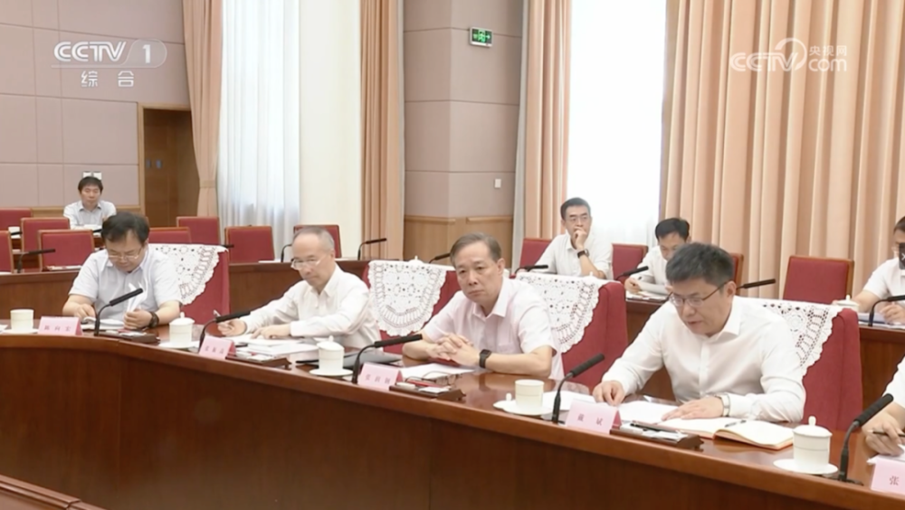

# 中央部署次日，国务委员谌贻琴和他们面对面

**撰文 | 孟亚旭 董鑫**

据新华社报道，7月25日，国务委员谌贻琴主持召开专家和企业负责人座谈会， **贯彻落实中央政治局会议部署要求**
，听取对进一步释放旅游消费潜力、推动旅游业高质量发展的意见建议。

政知君注意到， **这是中央政治局会议对下半年经济工作进行部署之后，国务院领导层召开的首场座谈会。**

7月24日召开的中央政治局会议提出，要积极扩大国内需求，推动体育休闲、文化旅游等服务消费。

**旅游市场恢复性增长**

促进消费既是当前恢复和扩大需求的关键所在，也关系着更好满足人民群众对美好生活的期待和向往。

为何政治局会议部署之后，国务院领导层的首场座谈会聚焦在旅游消费？

在7月25日的座谈会上，谌贻琴提到，今年以来，我国国民经济持续恢复、总体回升向好，群众旅游需求旺盛。

2023年的中国经济半年报显示，内需对经济增长的贡献稳步提升。

根据国家统计局最新发布的数据，上半年，社会消费品零售总额227588亿元，同比增长8.2%，最终消费支出对经济增长的贡献率达到77.2%，明显高于去年。

尤其是随着各类服务消费场景的恢复，居民服务消费支出增加，餐饮、交通、旅游消费增长较快。其中，旅游市场的恢复性增长成为2023年上半年消费领域的最大亮点，成为扩内需、促消费、拉动经济增长重要力量。

2023年上半年，国内旅游总人次、国内旅游收入（旅游总花费）分别为23.84亿、2.30万亿元，同比增幅分别为63.9%、95.9%。仅在6月份的端午假期，国内旅游人次、旅游收入就分别增长了32.3%、44.5%。

进入暑期以来，多地机场、火车站人潮涌动，热门景区、博物馆一票难求。《中国旅游报》刊文指出，“比天气更热的恐怕只有旅游市场了”。

**乘势而上促进旅游消费**

央视新闻报道画面显示，参加此次座谈会的国务院组成部门负责人有文化和旅游部部长胡和平以及副部长杜江，国家发改委副主任杨荫凯，商务部副部长盛秋平等。

参加座谈会的专家和企业负责人则包括中国旅游研究院院长戴斌，文化和旅游部“十四五”规划专家委员会委员、世界旅游城市联合会专家委员会副主任张辉，中国旅游集团有限公司暨香港中旅（集团）有限公司董事长陈寅等。

在认真听取大家发言后，谌贻琴指出， **要乘势而上促进旅游消费** ，推动旅游业实现 **质的有效提升和量的合理增长** 。

她强调，要适应人民群众日益品质化、多样化、个性化的旅游需求，着力推动文化和旅游深度融合，提升旅游产品和服务质量。

此前受到疫情影响，旅游行业遭到巨大冲击，一些企业生产经营资金面临很大困难。

今年以来，多地都在出台政策助力旅游产业恢复。

例如，江西省文旅领域设备购置更新贴息贷款投放金额达11.46亿元，居全国第一，并通过“文旅贷”“文企贷”等平台为全省中小微文旅企业发放贷款273.69亿元，暂退旅行社质保金2.56亿元；河南省旅游包机、旅游专列“引客入豫”有奖，全省已对旅游企业“引客入豫”补贴累计超过6000万元等。

在座谈会上，谌贻琴强调， **继续为旅游企业纾困解难** ，推动企业加大创新力度，不断激发发展活力。

此外，还要完善政策体系，提振旅游投资信心和消费信心，加快形成推动旅游业高质量发展的强大合力。

**规范秩序**

要让居民“能消费、敢消费、愿消费”，还有“痛点和堵点”需要解决。

在这次座谈会上，谌贻琴强调， **进一步规范旅游市场秩序，强化旅游安全保障，让群众旅游顺心安心放心。**

一个背景是，在旅游业蓬勃复苏的当下，一些旅游乱象也频频登上热搜。

以旅游热门目的地云南为例。

最近，云南相继出现“女子跟团旅游车上睡觉被叫停”“导游被举报辱骂游客’是不是人’”等多起负面新闻。“云南部分旅行社禁记者律师参团”等相关话题引发社会热议。

就在7月25日，云南省召开了全省旅游市场秩序整治和服务质量提升工作会议，云南省省长王予波出席。

在这次会议上，王予波强调， **要全力守护好云南旅游金字招牌。**

他提到，旅游是促进发展、改善民生、展示形象的支柱产业，要“从维护云南良好形象、推动产业高质量发展的高度，深入整治市场秩序”。

王予波强调，当前云南省旅游市场正处于强劲恢复期，更应该重品质、重品牌、重形象。

王予波还提到了几点具体要求，包括坚持“游购分离”、严格执法、标本兼治、安全第一、服务至上、主动发声等。

**坚决整治不合理低价、强迫购物等市场乱象。**

加强日常巡查， **严格依法办案，** 有力维护良好市场秩序。

**从根子上规范旅行社经营管理和导游执业行为。**

强化 **以游客为中心** 的导向，开展旅游服务创优提质专项行动， **以良好服务赢得业界认可和游客口碑。**

全方位、体系化开展宣传推广，及时回应社会关切等。

**资料 ｜ 央视 新华社 人民网 云南日报等**

**【版权声明】本文著作权归政知新媒体独家所有，未经授权，不得转载。**

