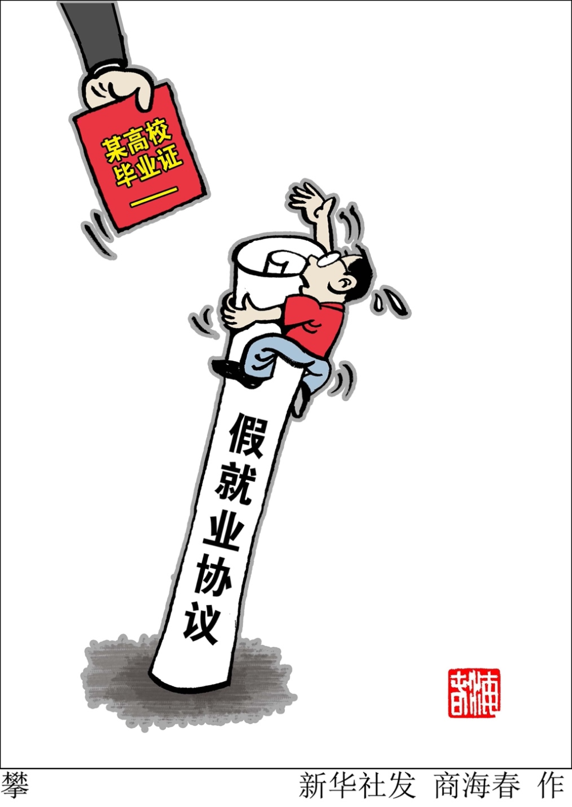
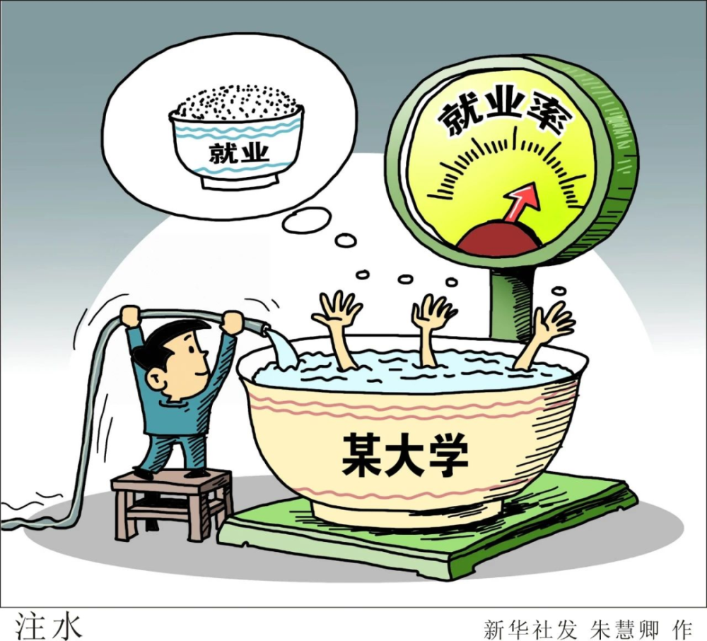
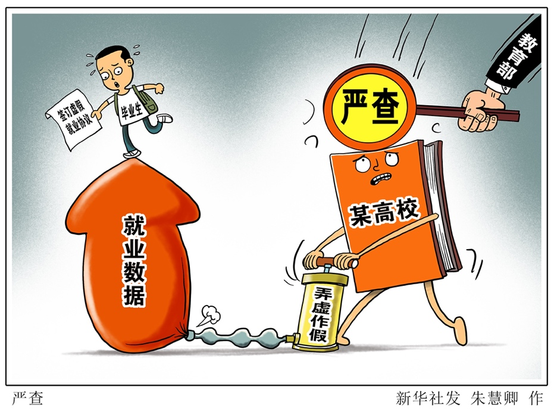

# 半月谈网：“盖了章就算就了业”，假就业糊弄了谁

眼下，2023届的高校毕业生就业“百日冲刺”行动正在开展，各地各高校纷纷采取措施帮助学生就业，教育部也明确要求加强就业数据的核查，严防就业数据失真。然而，我们的记者近日调查却发现，仍然有一些高校对就业率顶风作假。

有的学生告诉记者，所在班级的辅导员甚至在微信群里告诉他们，“找不到工作就在填表时写‘灵活就业’”“碰到调查就说在做自媒体”；还有的家长反映，孩子学校要求“如果‘就业三方协议’不盖章就拿不到学位证”；一位高校就业指导中心负责人透露，最近进入高招时间，学校对外宣称“90％的就业率”，但实际上今年只有20％的毕业生找到了工作。

如此作假，既掩盖了真实的就业信息，不利于精准施策，也是一次错误的诚信教育，危害不浅。有的学生说，“一边教我们堂堂正正做人，一边又教我们弄虚作假”，诚信教育“最后一课”就这样崩塌。值得关注的是，一些尚未就业的高校毕业生，不得已“找门路”来完成“被就业”的任务，滋生了网购平台上就业协议“盖章”的生意。

就业率失真背后，高校有自身的利益考量。一段时间以来，就业率是衡量高校办学水平的重要依据，其经费拨款、专业设置、招生规模、绩效考核等等都与之挂钩。就业数据“不好看”，不仅“不好跟上级教育主管部门交代”，也会直接影响高校考核。在利益驱使下，部分高校为了粉饰数据，不惜“注水”“作假”。

真实是做好就业信息采集的底线也是红线，就业率“注水”问题决不能听之任之，必须要严查严管。今年6月，国家统计局发布的数据显示，16至24周岁青年当中失业的总共有600多万人。新形势下，对毕业生的就业压力更应该感同身受。有关学校要本着对学生负责、对上级负责和对自身负责的态度，实事求是地规范就业信息采集，拿出更加务实之举，和全社会一道扎实地帮助学生就业创业。

策划：沈锡权

监制：李兴文

统筹：余贤红、刘彬

撰稿：黄浩然

出镜：刘彬

摄制：郭杰文

技术：何隆勤

制作：新华社江西分社星火工作室

出品：新华社江西分社 半月谈杂志社

