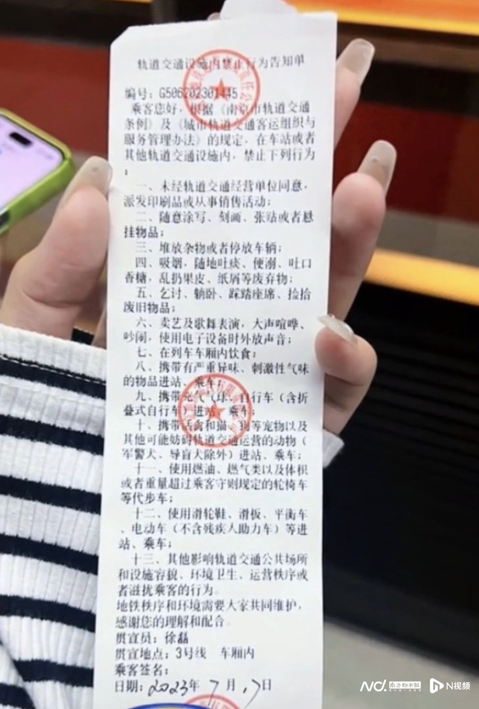

# 南京地铁是否禁止喝水，该有个清楚的结论

日前，一女子在南京地铁车厢内喝水被警告引发热议。地铁客服先是回应称，列车上禁止饮食，“喝水也是饮的一种”，发现后会做出相应处罚。之后，南京地铁官方发布通报，乘客喝的是瓶装果汁饮料，不是水。

那么，南京地铁究竟让不让喝水呢？南都记者拨通了南京地铁通报上的电话，工作人员回应：这个问题给您记录一下，3天内会有专人回复。所以，南京地铁究竟可不可以喝水，还是一个谜。官方通报留的电话，居然也搞不清楚，无法给出明确答复，堪称一绝。

按照此前的回应，喝水是“饮”的一种，语义角度看的确如此。但生活不是咬文嚼字，还要讲法理、道理与人情。

南京地铁车厢禁止饮食的规定源自2014年7月出台的《南京轨道交通条例》，明确了禁止在“列车车厢内饮食”，而且将其列在了“损害轨道交通设施和影响运营安全”的诸多行为之中。

因了这次的讨论，当地工作人员也有了一段更详尽的规则制定考虑：“在地铁上喝水、饮料等时如果水滴洒落到地面，容易使乘客滑倒，也担心会招来虫子咬断电路，影响行车安全”。

事实上，就在2014年这一地方性规范出台前，地铁里禁止饮食条款就有相当规模的一番讨论。甚至在草案几次征求公众意见时，一度还有过“从宽”的例外条款出现，有一个版本的草案就增加了因身体健康原因需要饮食的除外条件，只不过在后续的草案版本更迭过程中被取消。可见地铁车厢里禁止饮食的规则，在彼时也同样存在不少争议。

而即便到了近十年后，从外界对于此次传出的疑似“最严禁水令”的惊诧，还是可以看到真问题的现实存在。这恐怕不仅是“一代网友换旧人”的时过境迁、话题重复，而是地铁里“禁止饮食”如果真的直接把纯净水这种无色无味、用以维持基本生存需要的饮品也禁了，其中的尺度与边界起码是个问题，大有商榷余地。

至少，从《南京轨道交通管理条例》第38条禁止在“列车车厢内饮食”来看，禁止喝水不符合立法目的。因为该条明确指出的禁止行为是“影响轨道交通公共场所和设施容貌、环境卫生、运营秩序的行为”，也就是说，立法者希望禁止的这类行为是那些明显影响公共空间和他人权益的行为，第38条列明的禁止“乞讨、卖艺”“随意涂写、刻画”等情形突出了这一特征。而执行者若把水和饮料等同，随意扩大或机械解读“禁止饮食”的内涵，则偏离了立法目的。

水和饮料就是有本质不同，水是维系生命的基本物质，饮料是享受型消费，前者不涉及对公共秩序和他人权利的侵扰，一项地方性规范若禁止人们喝水，是不当限缩人们基本生活权利。换言之，这是公共管理需求是否有合理理由减损公民基本权利的问题。

地铁是否允许喝水，不应该连官方人员都无法给出一个确定的答案。同时，有必要搞清楚，彼时那个突然闪现、又突然神隐的特殊情况，究竟是如何进入地方立法考虑范畴，又是为何排除在了正式立法之外？而彼时地方立法的全过程，包括几次征求公众意见、每一项条款的存废，是否都有详尽的答疑解惑？这不该成为无法追溯的地方立法掌故，而需要一个更为清晰的说明。

从2014年到2023年，9年时间过去，南京地铁对喝水这件小事至少通过公开渠道还没有定论。现在需要深究的，是这背后的管理规范在制定过程中，是否充分保障了公众的知情、参与权，对于骤然消失的特例条款又是否有足够充分的解释？这是对现代城市治理细节的一点法治期待。

编辑：晏文龙

