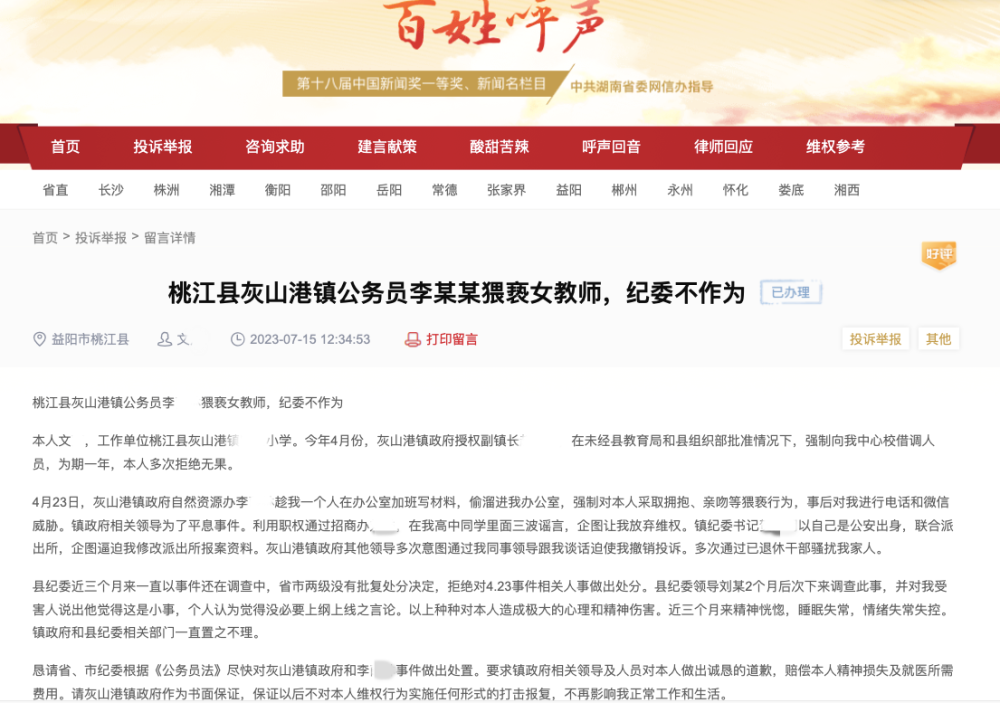
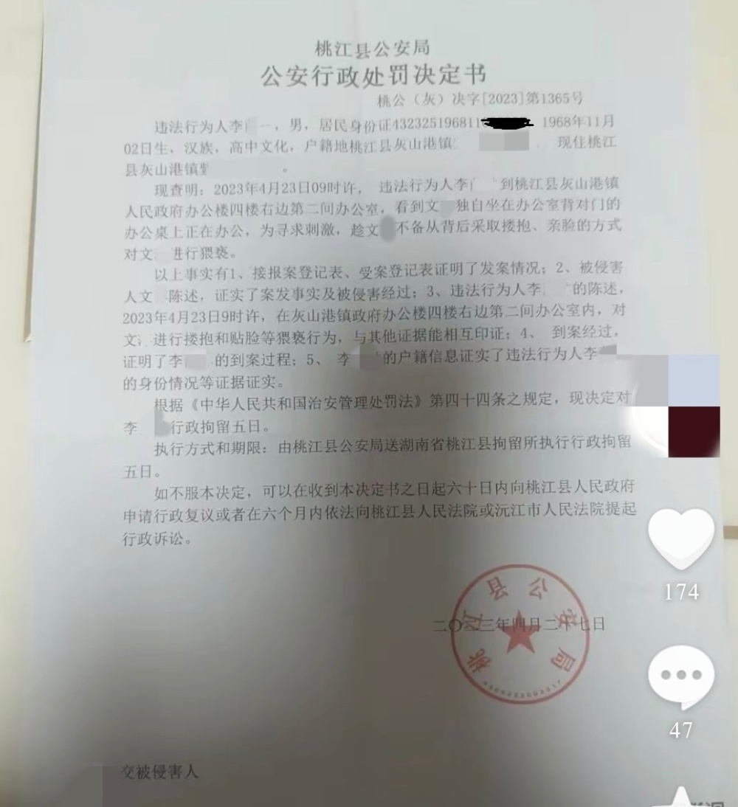
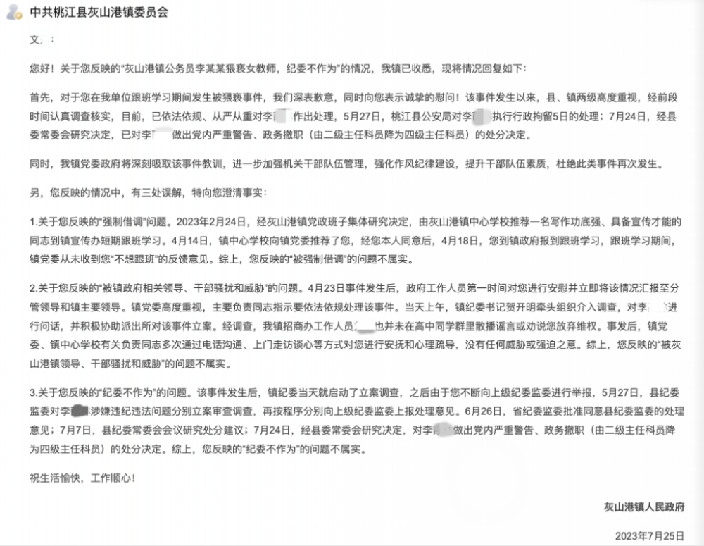

# 女教师借调期间被镇干部猥亵，官方：涉事干部被政务撤职、行拘5日

7月26日，九派新闻从问政湖南“百姓呼声”网站了解到，近日，有网友反映自己被益阳市桃江县灰山港镇干部李某某猥亵。

网友文某称，自己是桃江县灰山港镇某小学一名教师，今年4月被借调到镇政府工作。4月23日，灰山港镇政府自然资源办李某某趁其一个人在办公室加班写材料时进入办公室，强制对其采取拥抱、亲吻等猥亵行为。

文某还称，近三个月来县纪委一直还在调查中，没有批复处分决定，恳请省、市纪委根据《公务员法》尽快对李某某事件作出处置。

_图/问政湖南网站_

同时，文某出具的一份盖有桃江县公安局章的公安行政处罚决定书显示：公安机关查明，2023年4月23日9时许，违法行为人李某某到桃江县灰山港镇政府办公楼一间办公室，看到文某独自坐在办公室背对门的办公桌上正在办公，为寻求刺激，趁文某不备从背后采取搂抱、亲脸的方式对文某进行猥亵。李某某被行政拘留五日。

7月25日，灰山港镇政府作出回复：该事件发生以来，县、镇两级高度重视，经前段时间认真调查核实，目前，已依法依规、从严从重对李某某作出处理，5月27日，桃江县公安局对李某某执行行政拘留5日的处理；7月24日，经县委常委会研究决定，已对李某某做出党内严重警告、政务撤职（由二级主任科员降为四级主任科员）的处分决定。

回复同时称，文某反映的“被强制借调”“被灰山港镇领导、干部骚扰和威胁”“纪委不作为”等问题不属实。

**九派新闻实习记者 赵飞舟**

**【来源：九派新闻】**

