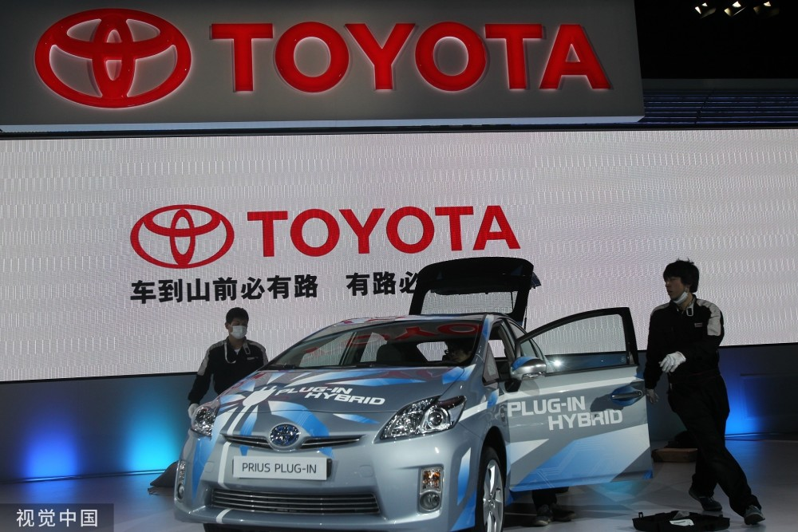

# 广汽丰田裁员超千人，广汽三菱停产，合资车企或面临更大暴风雨

腾讯新闻《车圈》 特约作者 余跃

一则广汽丰田裁员的消息，将当下合资车企承受的市场压力再度展现在外界面前。

日前有报道称，广汽丰田在上周末解雇了部分工人，并向他们提供了补偿。7月25日，广汽丰田针对此事回应称：本次是广汽丰田的正常阶段性调整，对象为部分劳务派遣员工，不涉及正式员工。广汽丰田根据市场形势变化，经慎重考虑，依照与劳务派遣公司的协议，停止部分派遣。

“裁员主要涉及的是生产一线人员，一万多的一线员工裁撤1000人左右还算是正常，毕竟现在广汽丰田工厂的自动化程度也比较高。”一位广汽集团内部人士对腾讯新闻《车圈》表示。

在广汽丰田此次“裁员”之前，同属广汽集团合资板块的广汽三菱，也传出因产品受市场转型影响，销量未达预期，于6月份正式进入临时停产阶段。而就在去年底，广汽集团还公告了旗下合资公司广汽菲克破产的消息。

作为国内颇具影响力的车企集团之一，旗下合资公司陆续传出破产、停产、裁员的消息，也让广汽集团一时呈现出山雨欲来的态势，更有网友感慨，作为国内车企集团的“南霸天”，如果连广汽都扛不住市场压力了，或许整个汽车行业也面临着更大的暴风雨。

**裁撤部分一线劳务工**

“广汽丰田只是暂时性地向劳务公司退回了一些短期劳务工，这些劳务工每个月的派遣数量都是不一样。公司会根据每个月的生产状况，设定相对应的劳务人员，所以会出现短期人员波动是属于正常现象。”在广汽丰田回应之前，广汽集团（601238.SH）投资者关系部相关人士就向腾讯新闻《车圈》证实了“裁员”消息。

该人士还表示，劳务派遣工在汽车工厂比较常见，主机厂对于劳务派遣工的安排主要是依据排那个最产量来进行安排，“集团每月都会公布各板块的产销数据，如果你去看一下具体的数据，就会理解这种针对劳务人员的增减安排。”上述人士表示。

据公开资料显示，目前广汽丰田工厂规划年产能为 100
万辆，员工约为1.9万人。此间有媒体报道称，被裁撤的工人表示，广汽丰田是在上周末解除合同并提供了补偿，公司裁员背景是“价格战压力”和“新车销量下滑”。

据广汽集团公布的产销数据，今年6月份，广汽丰田整体销量数据为87200辆，与去年同期（100866辆）同比下滑13.5%。

此外，有媒体曝出在裁员相关会议上，广汽丰田明确给出了裁员补贴标准，总共分为法定和非法定两大部分，其中，法定部分包括经济补偿金和代通知金。经济补偿金为“N（服务年限）*过去12个月的平均工资”，代通知金为6月份基本工资+住房补贴。

据悉，广汽丰田已经与劳务派遣公司协商，确保受影响员工及时、足额地获得合法合理的经济补偿。此外，广汽丰田也协同劳务派遣公司，为受影响员工推荐再就业岗位。

尽管广汽丰田这一轮针对劳务工的补偿措施比较到位，但业界更关注的是，在汽车行业新一轮价格战的大背景下，终端销量承受着较大压力的广汽丰田，接下来的发展会受到怎样的影响。

**合资板块集体承压**

得益于丰田全球众多车型的导入，以及精益生产方式的本地化执行，自合资公司成立以来，广汽丰田一直都以“淡季不淡，旺季更旺”的稳健发展著称。

即便是在全行业受疫情影响的2022年，广汽丰田依旧实现了“全年销售1005000辆，同比增长21.4%”的业绩，是去年唯一跻身“百万俱乐部”的日系合资车企。但从今年初开始，广汽丰田也感受到了来自市场的丝丝凉意。今年上半年，广汽丰田的整体销量为452800辆，较去年同期下滑了9.48%。

如果按照前述广汽投资者关系部相关人士的说法，广汽丰田依据终端销量和生产状况安排劳务工的数量，那么本次广汽丰田裁撤大约1000名的劳务工似乎有点不合常理。要知道，尽管上半年整体销量下滑，但6月份广汽丰田的排产量为89430辆，较之5月份环比增长了10197辆。

“在月度生产量环比上涨的情况下，裁撤一线劳务工，可能是广汽丰田基于对订单状况以及后续市场预警的一个结果。”上述广汽集团内部人士表示。

实际上，不光是广汽丰田正在遭遇市场压力，广汽集团旗下其他合资板块业务也乏善可陈。早在2022年12月，广汽集团旗下合资公司广汽菲克因资不抵债被法院受理了破产申请。今年6月份，也有消息称广汽与三菱的合资公司广汽三菱因销量未达预期也进入临时停产阶段。

“广汽三菱（停产）这个是真的，你们也看到，集团6月份公布的产销快报上，广汽三菱的销量数字为0。”上述广汽投资者关系部相关人士证实说。

除此之外，今年3月份坊间有未经证实消息称，广汽旗下另一家主力合资车企广汽本田库存量巨大，在2月份单月销量不足50000辆的情况下，库存量高达10万辆。而据广汽集团公布的产销快报数据，今年上半年，广汽本田整体销量为289928辆，同比下滑18.89%。相较于整体排产量，仍有着近3.2万辆的库存。

在广汽菲克和广汽三菱相继停摆的情况下，尽管自主板块业务（广汽乘用车+广汽埃安新能源）都实现了较大的增长，但目前广汽丰田和广汽本田的销量仍旧占到广汽集团总销量的一半以上。如果这两家合资公司发展受阻，也势必会影响广汽集团接下来的整体发展。

**合资车企或面临更大的暴风雨**

当然，无论是广汽丰田抑或广汽集团，其在当下的发展状态，也仅仅是国内车市整体发展状态的一个细微“注脚”。早在今年3月份，东风集团就联合旗下合资车企实施大降价进行自救；5月份，福特中国也传出裁员1300人的消息。

分析人士认为，在国内车市进入新能源汽车的发展新周期之际，包括广汽丰田在内的合资车企销量和利润被挤占的一个核心原因在于，大部分合资车企的电气化转型速度较慢，产品开发没能适应市场需求。

事实上，2022年国内新能源乘用车整体销量已经达到了650万辆的规模，国内新能源车的市场渗透率也在逐年攀升，今年最新已经达到34%。但尽管如此，包括丰田在内的外资品牌电气化转型的速度依旧缓慢。

以广汽丰田为例。目前，丰田在国内市场仅有bZ4X和bZ3两款纯电车型，且只有bZ4X一款车在售。从销量上来看，目前广汽丰田新能源车销量依旧是以双擎车型为主，今年上半年的双擎车型整体销量为137682辆，占比超30%。而纯电动车型
bZ4X的销量仅为4132辆。

据中汽协公布的统计数据显示，今年上半年，国内汽车产销分别完成1324.8万辆和1323.9万辆，同比分别增长9.3%和9.8%。“无论是2022年还是今年上半年，国内车市虽然承受着巨大的压力，但整个市场还是持续向好的。”全国乘用车市场信息联席会秘书长崔东树表示。

据乘联会公布的统计数据，今年上半年，国内新能源车渗透率一直持续上升。5月新能源车厂商批发渗透率33.7%，较2022年5月27的渗透率提升7个百分点。这其中，自主品牌的份额占到了68%，新势力品牌的份额为11%，而主流合资品牌的份额仅为4%。

一边是国内车市加速从燃油车周期往新能源车周期过渡，一边是传统的合资车企在电气化转型层面的踟蹰不前，无论是此次裁员的广汽丰田，抑或更多合资车企在当下面临的发展困境，本质上依旧是一个战略和产品转型慢的问题。如果这一方面没有快速贴靠，那接下来面临的发展压力也仍将持续。

