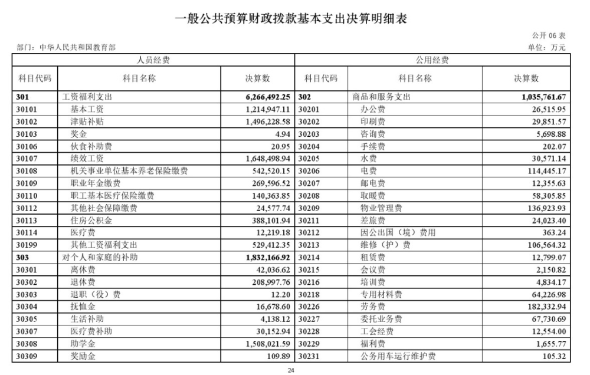

# 百余中央部门晒去年收支账单：疫情让“三公经费”省了不少

中央主要部委去年收入如何？钱花哪儿了？达到了什么样的效果？

这些问题的答案，可以从近日中央部门陆续披露的部门决算中寻找。中央部门决算反映部门所有预算收支和结余执行结果及绩效等情况，截至7月25日已有102个部门“晒”出本部门决算报告，接受社会监督。

所有中央部门的部门决算，会公开去年收入支出情况。目前绝大多数中央部门收入主要来自财政拨款收入，另外一些部门事业单位等还有事业收入、经营收入。

当然也有例外，比如中国人民银行的收入既没有财政拨款也没有事业、经营收入，而是全部来自其他收入。所谓其他收入，是指财政部核定的费用支出来源于央行依法开展业务活动取得的收入。

根据中国人民银行2022年度部门决算，2022年央行收入均来自其他收入，合计约282亿元。支出也是这一数字，收支平衡。

当然，央行的实际收入超过上述数字。央行数据显示，2022年人民银行向中央财政上缴所有结存利润1.13万亿元，主要用于留抵退税和增加对地方转移支付，支持助企纾困、稳就业、保民生，对稳定宏观经济大盘发挥了重要作用。

央行之所以与其他部委不同，是因为央行履职中拥有财务收入，包括利息收入、外汇储备经营收益等业务收入，对外投资收益等其他收入。财政部对人民银行实行独立的财务预算管理制度。人民银行各级机构每年编制财务预算逐级上报，由总行汇总报财政部审批。人民银行预算中各项收支相抵后，净额纳入国家预算。

各个中央部门大小不一，供养人数差异大，导致实际收支规模差异很大。

比如，根据教育部去年部门决算，去年收入合计约3916亿元，如果加上结转结余资金，收入总计5707亿元。而中国文联等部门，收入只有个位数，甚至有的不足1亿元。

教育部的决算中，不仅包括部本级和直属单位，还包括清华北大等75所直属高校，截至去年底教育部及所属单位实有各类工作人员（含教职工）59.23万人。

观察中央部门决算的一大重点，是看部委的钱花哪儿了，一些数字增减能反映出部委去年工作重点。

比如，面对去年疫情冲击超预期，根据国家卫健委去年部门决算报告，卫健委在卫生健康部分支出中明显超出预算数。比如卫生健康支出中的一般行政管理事务完成年初预算的242.8%，这主要是执行中追加一次性项目支出预算，并按规定统筹使用以前年度结转资金。卫生健康中的公立医院部分项目支出也超预算，主要是去年执行中追加委预算管理公立医院综合改革补助经费等。

去年疫情冲击下，一些部委部分工作不能如期开展，节省了一笔支出，尤其是“三公经费”相关支出。

比如，根据财政部去年部门决算，受疫情影响，部分培训工作、对外交流活动等不如按计划开展，相关支出远低于预算数。财政部去年因公出国经费预算约1323万元，但实际支出仅约86万元，完成预算的6.5%。这主要是受去年疫情影响，上半年暂不安排出访。

第一财经记者注意到，不少部门决算报告里相关支出中，都强调了按规定统筹使用以前年度结转资金。去年疫情冲击、叠加4万多亿元退减缓税费政策下，财政收支矛盾加大，而动用以前年度结转资金是缓解收支压力的一大重要举措。

各大部门决算中，一大看点是一般公共预算财政拨款基本支出决算明细表，它会告诉你中央部门在人员工资福利、对个人和家庭补助的人员经费支出情况，和办公、劳务、培训等公用经费支出情况。

以教育部为例，该部一般公共预算财政拨款基本支出中，工资福利支出约627亿元，办公等公用经费支出约104亿元，对个人和家庭的补助约183亿元。

_图表来自教育部去年部门决算_

今年部门决算的一大变化是，中央部门继续加大绩效信息公开力度，增加了项目绩效自评结果公开数量。数据显示，今年随同中央决算向全国人大常委会报送的项目绩效自评表的数量增长到699个，比上年增加113个。

比如，审计署去年部门决算披露了7个一级项目的绩效自评结果，财政部披露10个一级项目的绩效自评结果，多数项目评分在90分以上，但也有低于这一分数情况。

根据财政部去年部门决算，根据年初设定的绩效目标，“财税博物馆运行管理”项目自评得分为78.8分。项目全年预算数为474.29万元，执行数为367.93万元，完成预算的77.6%。
该项目存在的问题及原因是，受疫情影响，部分课题研究工作未完成，预算执行率较低。下一步计划积极推进相关研究课题在2023年结项。

审计署近期披露了《国务院2022年度中央预算执行和其他财政收支的审计工作报告》，也指出预算绩效管理较为薄弱。这主要体现在绩效目标设置不合理，绩效运行监控乏力，绩效评价结果及运用质量不高。

上述审计报告还重点审计41个部门及所属188家单位2022年收到的财政预算拨款约2286亿元，发现各类问题金额约110亿元。这包括利用部门职权或行业资源违规牟利、收费或转嫁摊派6.19亿元。依法理财依规决策意识不强，比如2个部门和8家单位套取资金约8080万元，其中约472万元被用于吃喝、送礼或涉嫌个人侵占。17家所属单位违反行业规定等开展业务或违规决策，造成损失4亿多元。

另外，审计还发现一些部门单位超编制超标准配备公车等，公务用车管理制度落实还需加强。目前审计相关问题正在整改。

上海财经大学教授邓淑莲告诉第一财经，政府预决算公开是现代财政制度的必然要求。只有财政公开透明，政府的财政行为才可见，进而得以被监督和约束。近年预决算公开工作取得明显成效，下一步应该继续加大公开力度，继续提升预决算透明度，充分接受社会监督。

