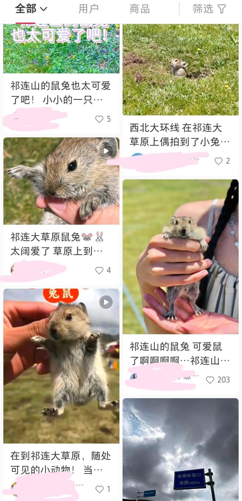
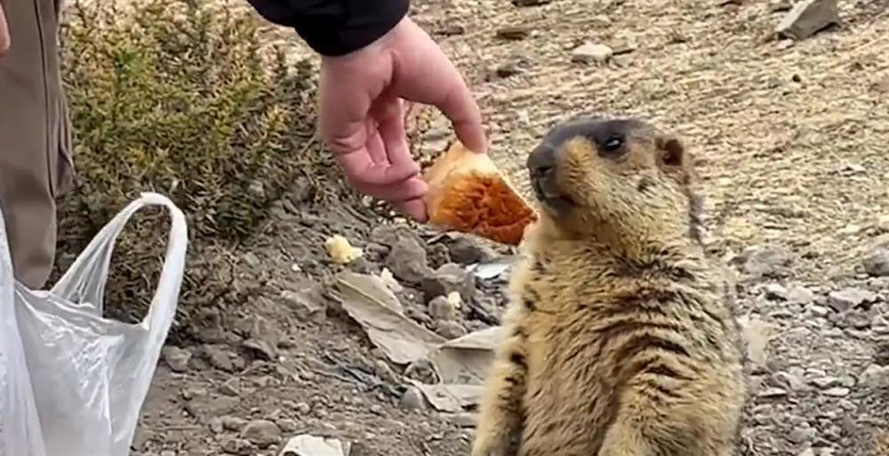

# 祁连山草原游客手抓鼠兔拍照：疾控部门提醒危险，远离鼠兔是常识

极目新闻记者 舒隆焕

近日，有科普博主发帖称，某社交平台上刷到游客晒出手持野生鼠兔的照片，并质疑，“在青海祁连山草原，抓鼠兔和喂旱獭（俗称土拨鼠）是否成为了旅游项目？”网友担心，游客这些举动有感染传播鼠疫的风险。

对此，有当地居民对极目新闻（报料邮箱：jimu1701@163.com）记者表示，远离高原鼠兔、禁止投喂旱獭在当地是基本常识。当地疾控部门表示，在鼠疫防控指南里，明确规定了禁止接触和投喂鼠兔、旱獭。当地文旅部门提醒，鼠兔和旱獭在幼年期很容易受到人为投喂的影响，而变得过度依赖人为饲养，甚至有可能导致无法在自然环境中生存。

_游客抓鼠兔拍照（媒体报道截图）_

**当地居民称远离鼠兔和旱獭是常识**

博主在贴文中称，在某社交平台上刷到游客晒出手持野生鼠兔的照片，搜索青海祁连山草原相关信息，也能看到类似图片。有游客称自己在祁连山草原抓到了鼠兔，还有人表示鼠兔很可爱。该博主表示，“看来抓鼠兔已经和喂旱獭一样，成为了旅游项目。”

极目新闻记者在上述社交平台检索关于祁连山草原网帖发现，当地居民提醒，不要轻易接触高原鼠兔和喂旱獭，也有网友担心，游客手持野生鼠兔有感染传播鼠疫的风险。

公开资料显示，祁连山草原被评为中国最美的六大草原之一，主要位于青海海北州祁连县。这里的鼠兔为高原鼠兔，又称“黑唇鼠兔”。

7月26日，与祁连县临近的海晏县居民张先生（化姓）告诉极目新闻记者，他从小在牧区长大，当地草原上的高原鼠兔较多，曾一度泛滥，旱獭倒不常见。高原鼠兔到底是草原退化的“凶手”，还是草原的“功臣”，至今仍存争议。但远离高原鼠兔和禁止投喂旱獭，在当地是基本常识，“特别是高原鼠兔，可能会携带鼠疫病毒。”

对于上述博主称“祁连山草原抓鼠兔和喂旱獭成为旅游项目”，张先生表示未曾听说。他说，高原鼠兔一般不会轻易靠近人，只要它们不进入牧民家中，无需害怕。但最近他看到社交平台有游客晒出手持高原鼠兔的图片，甚至成为旅游攻略，觉得这种行为很危险，提醒大家切勿跟风模仿。

一名曾到青海旅行的游客告诉极目新闻记者，当地的一些酒店放置的宣传册会提醒游客，禁止抓鼠兔和喂旱獭。她也呼吁游客保持清醒，这种行为有传播鼠疫的风险。

_社交平台网帖（网络截图）_

**官方呼吁游客不要捕捉鼠兔拍照**

针对博主反映的情况，青海省海北州疾控中心工作人员此前对媒体称，已关注到这个情况，该行为存在染疫风险，游客是不可以触摸投喂鼠兔的，如果发现类似情况，可以向当地疾控或卫生部门反映。祁连山国家级自然保护区工作人员表示，鼠兔分布在整个青藏高原地区，游客的个人行为很难控制，只能去劝解。

此外，祁连县文体旅游广电局工作人员回应媒体称，暂时未接到相关举报，但草原并非景区，没办法控制游客的行为，会进行温馨提示。极目新闻记者注意到，祁连县文旅局微信公号7月25日发布推文，呼吁广大游客在旅游时不要捕捉高原鼠兔并与其亲密合照，不要接近、投喂、触摸旱獭，以免传染鼠疫。

当地疾控部门工作人员对媒体表示，在鼠疫防控指南里，明确规定了禁止接触和投喂鼠兔、旱獭，“因为它们身上的跳蚤有可能会传播鼠疫耶尔森菌等细菌，你触摸后未洗手，以及通过衣服、毛发都有可能传播。”

极目新闻记者注意到，2023年6月，研究人员发表的《喜马拉雅旱獭鼠疫疫源地次要宿主高原鼠兔媒介蚤调查分析》论文显示，1953年青海黄南州河南县尕马滩地区因当地牧民捡拾死狐而引起疑似鼠疫流行，1954年工作队奔赴该地区进行疫源地调查，从一只自毙的高原鼠兔体内分离出鼠疫杆菌，即判定河南县为鼠疫疫源地，高原鼠兔被定为自然感染鼠疫的染疫动物，被列入我国鼠疫自然疫源地次要宿主名录。

论文显示，上述研究人员对海北州祁连、海晏等4县的高原鼠兔进行了抽样调查，其中祁连县鼠体染蚤率最高，为75%，海晏县最低，为35%。研究人员表示，高原鼠兔在青海疫源地普遍存在，由于和人的接触多，对人的威胁很大。在广阔的青藏高原领域次要宿主种类多的情况下，不容忽视其在造成人类鼠疫发生与流行方面所起的作用，主要传染源就是与人伴生的次要宿主引起的。

_游客投喂旱獭（网络截图）_

**人为投喂或致鼠兔旱獭无法自然生存**

据澎湃新闻报道，上述科普博主称，与鼠兔等野生动物保持距离是非常必要的，这种行为对动物个体可能产生不良影响。“有一些游客没有这些方面的知识和意识也是正常的，这个就需要大家不断地去科普。”该博主表示，这件事中责任最大的是那些自诩为“向导”“领队”的人，他们不应该带领或诱导游客捉鼠兔；其次，社交平台没有对不正确价值导向的帖子进行监管。

对此，祁连县文旅局提醒，野生动物一旦偏好接受人为投喂，虽不至于使其完全丧失野外觅食能力，但可能因此会降低对人类的警戒程度。鼠兔和旱獭，在幼年期很容易受到人为投喂的影响，而变得过度依赖人为饲养，甚至有可能导致无法在自然环境中生存。人类把食物投喂给野生动物容易使其胆固醇过高，且缺乏足够维生素及矿物质。向一些草食性动物投喂带有包装袋的食物，也会造成动物的肠胃阻塞，给动物带来严重的伤害。

此外，也有专家表示，游客去旱獭鼠疫疫源地旅行时，除了不要接近、投喂、触摸旱獭，也不要在旱獭洞周围坐卧休息。

（来源：极目新闻）

