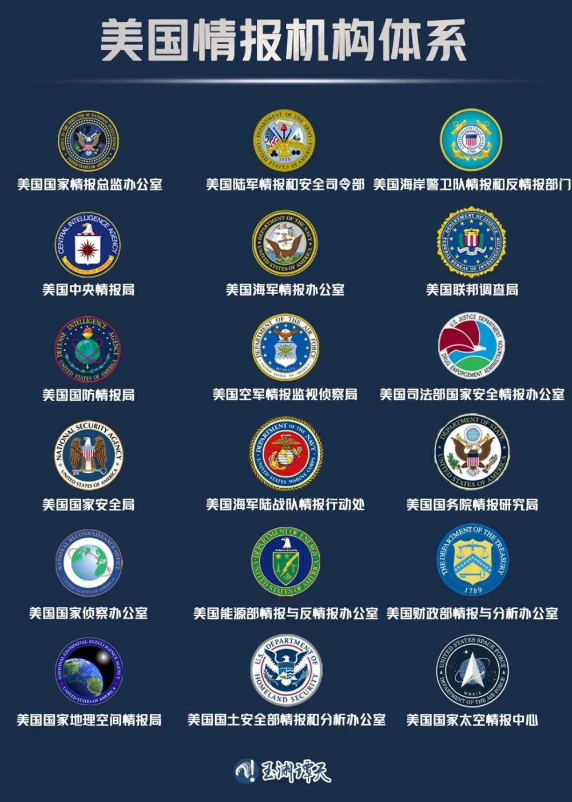

# 美国为何会攻击中国的地震监测中心？

今天上午，谭主关注到一则不寻常的消息：

湖北省武汉市公安局江汉分局发布警情通报称，武汉市应急管理局地震监测中心的部分网络设备被植入木马病毒，初步判定这一事件为境外具有政府背景的黑客组织和不法分子发起的网络攻击行为。

相信不少人和谭主一样，看到这一消息有些疑惑，很多地震数据不都是公开的么，境外黑客组织和不法分子为什么要攻击一个地震监测中心？他们又来自哪里？

谭主联系了武汉市应急管理局，对方表示，国家计算机病毒应急处理中心和360公司对木马病毒进行了溯源分析，我们从这两家机构获悉，这个境外黑客组织来自美国。

又是美国，美国对中国的地震监测中心发动网络攻击，到底想干什么？

带着这一问题，谭主和一名专业人士聊了聊。

他表示，
**地震波穿过的地下介质、结构不同时会产生波速的变化。而获取地震监测中心的相关数据可以推导出某一区域的地下结构和岩性。例如推测地下是否有大型的空洞，进而推测它是否是军事基地或者指挥所。**

他给谭主打了个比方，就好比一个人晚饭后出门，他会听到各种声音。把这些声音同时放在一起，可能会觉得很吵闹，是噪音。但对这些声音进行最简单地分析，你就会得出很多信息——有风的声音，有汽车的声音。

美国发动这次网络攻击，是想分析什么呢？谭主决定从美国情报机构入手，找找线索。

关于美国情报机构，不少人耳熟能详的，有美国联邦调查局（FBI）、美国中央情报局（CIA）、美国国家安全局（NSA）等。

但实际上，这些机构只是美国情报体系的冰山一角，当前，美国有18个情报机构：

这18个机构隶属美国不同部门，共同织起了一张情报大网。

其中，美国中央情报局（CIA）和美国国家安全局（NSA）是发动网络攻击的“惯犯”。

去年，我国西北工业大学就遭到美国国家安全局（NSA）的网络攻击。2个多月前，谭主还做了《独家解读：现实版“黑客帝国”离我们有多近》，细数美国中央情报局（CIA）是如何在网络上开展破坏行动的。

网络攻击很有可能还是这两个部门发起的，那在美国的设想中，如果获取了这些数据，谁来做分析的工作呢？

结合这次美方对地震监测中心的网络攻击行动，谭主对这18个情报机构的职能进行了梳理，而后，将目光锁定在了一个机构上——美国国防情报局（DIA）。

美国国防情报局（DIA），作为美国国防部下属的对外军事情报机构，它的雇员数量以及预算等信息都属于保密状态。

最近和它相关的报道，是DIA在去年年底成立了一个“中国任务小组”，这个小组召集了一批分析师和专家，专门为DIA提供针对中国的“工具箱”。

此外，DIA还会定时发布“中国军力报告”，这份报告对美国制定军事领域的对华政策有重要的意义。

除此之外，关于DIA的信息并不多。但在仔细查询了DIA的发展历程与组织架构后我们发现，DIA还有一项职能—— **军事地质研究** 。

从这张图上就能看到，地质学与军事有着很强的关联。

海湾战争，被称为“现代战争与传统战争的分界线”，美军将大量高科技武器投入实战，在战场上展现出压倒性的优势。

当时，很多人都将注意力集中在美国的制空权上，很少有人注意到另一个因素——美军的地质及地形情报。

在发动战争前，美军就对伊拉克的地质资料进行大规模地获取、分析，确定了伊军的指挥机构藏在地下30米处，并且，美军还对该机构所处位置的岩层进行了地质分析。

战争一开始，美军发射了带有地质信息芯片的激光制导钻地炸弹，直接摧毁了伊军的指挥机构。

看到这，再回过头看看此次武汉地震监测中心遭到网络攻击事件，是否有些细思极恐？

随着战争形态的不断发展，民用与军用设施的界限越来越模糊，精确打击变得越来越重要。

想要精确打击，就需要更多的地质与地形情报作支撑。

为了获取这些信息，美国情报机构加大了网络攻击与网络窃密的力度。当前，美国已经打造了网络攻击全套武器装备，能够随意攻击全球目标。

相关报道称，美国利用目前掌握的地质情报对全球一万多个重点地下目标进行了多次模拟打击试验，为其精确打击提供重要的参考。

而随着我国地质学的发展，地震监测中心监测的数据会越来越多维，这也意味着，一旦这些信息泄露，能够被分析出来的信息会越多。

专业人士表示， **现在监测中心还会同步监测地下水位与土壤等信息。**

谭主注意到，美国国防情报局（DIA）在几年前就开始研究土壤对军事行动的影响，相关研究已经细分到土壤含水量、温度分别会对军用车辆通行产生什么影响。

随着美国的国家安全战略将中国定义为“战略竞争对手”，美国各大情报机构也都将自己的首要任务调整为帮助美国在与中国的战略竞争中取得成功。

在美国国防情报局（DIA）总部的墙上，有这样一句话，要注意普通民众的意见、评论和玩笑。这句话是提醒他们自己，任何细微的数据和信息都具有非常大的价值。

现在，美国国防情报局（DIA）就抱着这样的态度，盯着中国，希望通过网络攻击等非法手段获取中国的信息，制定针对中国的方案。

美国情报机构研究的网络攻击武器，已经渗透到各个行业当中：

美国中央情报局（CIA）研究的黑客程序能够专门针对智能电视，并且，他们制造的一千多种黑客系统几乎可以覆盖目前市面上绝大多数的电子设备系统；

美国国家安全局（NSA）下属的“特定入侵行动办公室”（TAO）研究如何远程入侵汽车计算机系统，以暗杀特定目标；

而美国攻击地震监测中心的举动则表明，下一步美国网络攻击的对象要向日常化、生活化渗透。

网络攻击，看起来离普通人很遥远，但美国在开发网络攻击武器时，就有意识地和普通人息息相关的领域相结合，一旦其发动网络攻击，受影响的，也会是普通人。

面对这样的“敌人”，我们要做的不单单是提升自己的防护能力，更要通过跨学科、跨领域的协同，织起一张防护的“天网”。

