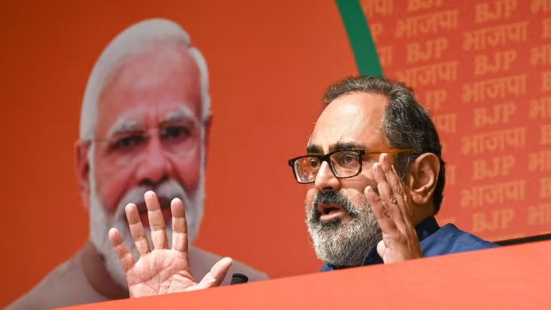

# 被问“与中国公司做生意是否持开放态度”，印度官员：当然了

（观察者网讯）近年来，印度政府炒作“中国威胁”，不断对中企“下黑手”。就在最近，还有“比亚迪合资建厂申请被拒”、“多家中企被指控逃税900亿卢比”的消息陆续传出。然而，据英国《金融时报》7月26日报道，印度电子和信息技术部部长钱德拉塞卡（Rajeev
Chandrasekhar）却在接受采访时声称，印度对来自中国的投资“持开放态度”。

“印度对与中国公司做生意持开放态度吗？当然了。”钱德拉塞卡如此说道。

钱德拉塞卡告诉《金融时报》，印度对与任何地方的任何公司做生意均“持开放态度”，“只要他们的投资和经营合法，并遵守印度法律”。他重申：“我们对所有投资持开放态度，包括中国投资。”

话虽如此，但《金融时报》指出，在钱德拉塞卡做出上述表态之际，印度政府对中国制造商和移动应用程序进行了打击，且有消息指出，来自中国企业的一些投资提议已陷入停滞。

_印度电子和信息技术部部长钱德拉塞卡，图自《金融时报》_

自中印边境冲突后，印政府借民族主义情绪炒作“中国威胁”，在经贸领域不断使出小动作，包括多次封禁中国手机应用、“暗箱操作”扣押中国集装箱、审查中企投资提案……

多家印媒称，自2020年6月以来，印度政府依据所谓“国家安全”，已经封禁了TikTok、WeChat、UC浏览器等超200个中国手机应用程序，同时多家中企相继被迫陷入税务风波。印度财政部7月21日声称，过去6年间，小米、realme、OPPO、vivo和一加等中国手机制造商共逃税900亿卢比。

《金融时报》解读称，当前，印度政府和企业推行“中国+1”战略，主张减少对华依赖。印度方面希望，该战略可以帮助印度在电动汽车和半导体等高科技领域赶上竞争对手。

此外，印度政府还于2020年4月更改了外国直接投资政策，要求来自与印度陆地接壤的国家的在印投资必须获得政府批准。有印媒表示，虽然没有提及任何国家，“但此举目的是阻止中企收购印度实体”。

对此，钱德拉塞卡向《金融时报》辩称，印度这一政策并非单独针对中国，而是适用于包括巴基斯坦、孟加拉国和尼泊尔在内的其他“周边”国家。他还说，他不认为印度此举“有什么特别之处”，而是符合世界的普遍趋势，即意识到“可信硬件、可信设备、可信电子生态系统”的重要性。

_vivo、oppo在印经销商，图自印媒_

钱德拉塞卡口口声声说“不针对中国”，但印度政府的所作所为并非如此。

首先，有知情人士和印度政府官员透露，苹果的重要中国供应商立讯精密此前已申请与一家印度国内合作伙伴在印度建厂，但尚未得到批准。该公司5月曾表示，只有在商业环境得到“充分保证”的情况下，才会寻求在印度进一步投资。《金融时报》认为，这一强硬表态与印度政策相冲突。

7月早些时候，有外媒曝出，比亚迪和总部位于印度南部城市海得拉巴的印度私营企业基建巨头Megha此前向印度政府提交申请，提议在海得拉巴建立合资工厂，合作在印生产电动汽车和电池。

但印媒《经济时报》7月22日报道称，有知情官员透露，印度监管部门以“投资安全”为由，拒绝了这一申请。另有一位直接了解情况的人士告诉《金融时报》，该申请“正在等待中（并且）仍然有效”。

 _比亚迪在印度销售，图自印媒_

近年来，印度政府不断针对在印中企增设投资和经营壁垒。我外交部发言人此前指出，中国政府一贯要求中国企业在遵守国际规则和当地法律法规的基础上开展对外合作，印度政府有责任根据市场原则维护包括中国企业在内的国际投资者的合法权益。

据外交部网站消息，7月24日，中央外办主任王毅在约翰内斯堡会见印度国家安全顾问多瓦尔。王毅指出，双方要坚持两国领导人“互不构成威胁、互为发展机遇”的战略判断，真正将稳定双边关系的共识落实到具体政策，转化为各部门、各领域协同一致的行动，增进战略互信，聚焦共识合作，克服干扰困难，推动两国关系早日重回健康稳定发展轨道。

**本文系观察者网独家稿件，未经授权，不得转载。**

