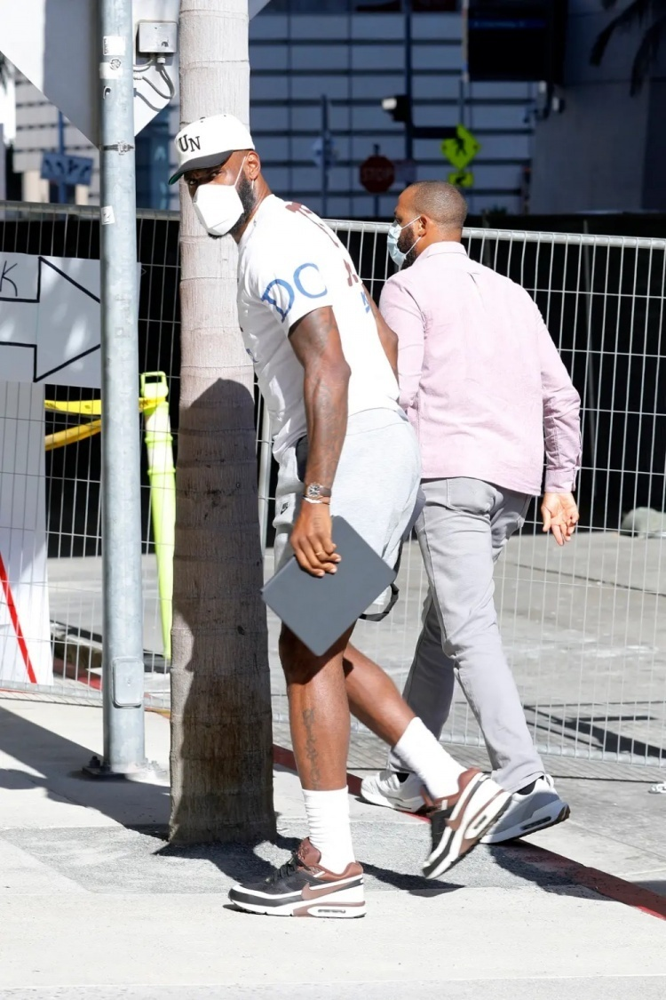
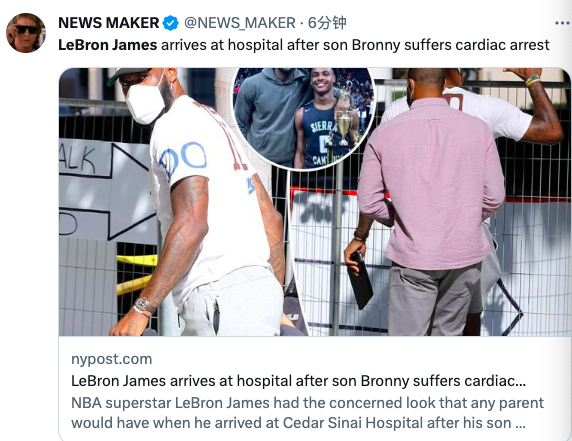
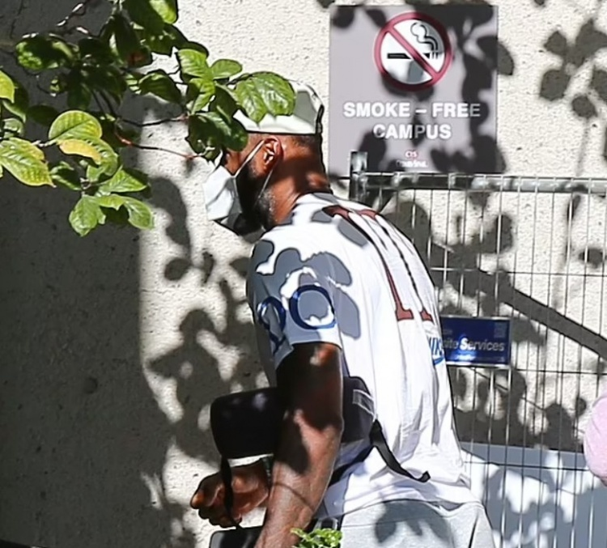
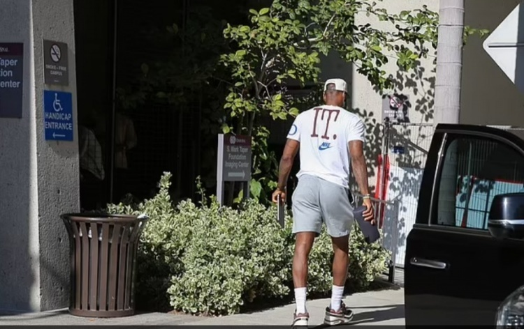
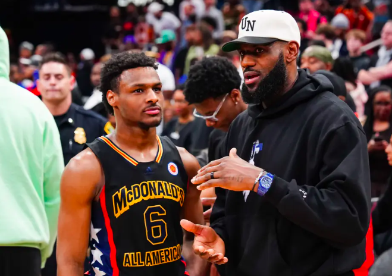
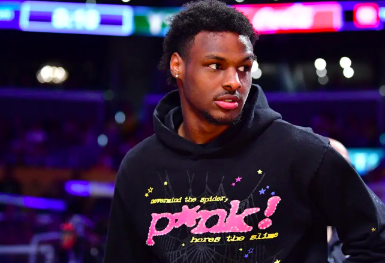
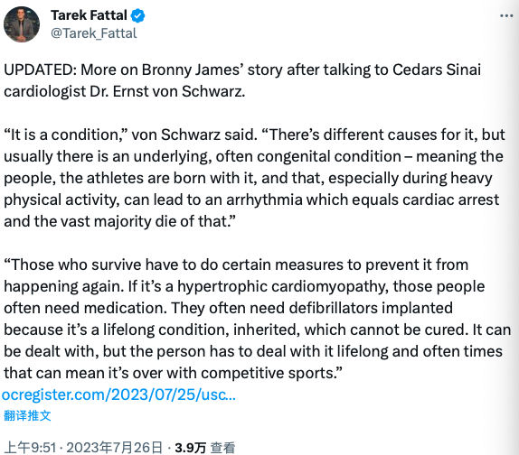

# 詹姆斯现身医院曝光：第一时间到布朗尼身边 神情焦虑父爱如山

美媒曝光了詹姆斯现身医院的照片，在布朗尼出事之后，老詹第一时间到医院陪在儿子身边，让人感叹父爱如山。

照片中，詹姆斯一身休闲装扮出现在医院的停车场，他戴着口罩，神情显得很焦虑，能让人感受到他非常关心布朗尼的健康。

布朗尼是在训练中突然倒下，心脏骤停，被紧急送医之后，脱离了危险。据报道，当时的情况非常危急，送医过程中，布朗尼昏迷不醒，救护车开启了三级响应，同时开启了救护车灯和警笛，足见情况严重。

布朗尼训练中遭遇心脏骤停也是引发了美国体育界的关注，一众球星为他祈福，希望他能平安无事。布朗尼的弟弟布莱斯也晒出两人合照，希望哥哥能早日恢复健康。

作为詹姆斯的大儿子，布朗尼年少成名，所有人都在等待父子同台出现在NBA的一幕。布朗尼出事前，也被看好进入NBA，尽管预测选秀顺位并不靠前，但是，大概率能被选中。

然而，这次意外恐怕会重创布朗尼的选秀行情，有专家称，若先天性心脏病意味生涯终结。但健康大于篮球，布朗尼能健康快乐地成长，相信是詹姆斯更想看到的。

