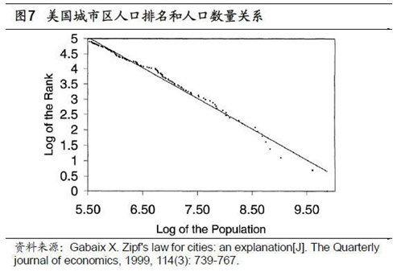

# 越来越多的地方放开户口了，这是好事，但也可能是在挖坑

刘远举（上海金融与法律研究院研究员）

​全文2600余字，阅读约需5分钟

​现在越来越多的地方放开户口了。

内蒙古乌兰浩特宣布，不管你从哪里来，只要你在当地买了房，就能入户这座县级市。湖南武冈也是，买房送户口，子女可读书。地级市中，驻马店、曲靖和淄博更容易，租房就可以入户。石家庄、贵阳、济南、福州、郑州等省会，也不同程度地接近于“零门槛落户”。

发达一些的地方，东莞是大专可落户，佛山买房可落户。放出招数最大的要数浙江。近日，浙江省政府官网发布了《浙江省推动落实常住地提供基本公共服务制度
有序推进农业转移人口市民化实施方案》，要求全省（杭州市区除外）全面取消落户限制政策，确保外地与本地农业转移人口进城落户标准统一，试行以经常居住地登记户口制度，落实合法稳定住所（含租赁）落户及配偶等直系亲属随迁政策。

简单地说，只要能租房子，就能在浙江除了杭州市区之外的地方落户。

这当然是好事，在浙江打工的外地人，可以在浙江安家落户了，医疗、孩子上学都可以解决了，活得更有尊严。安居乐业，自然会消费，可以带动经济，当然，也会买房。这也是各地抢人的很重要的一个原因。

但是，这或许也是在为将来挖一个大坑。

人类分布的历史发展规律，就是聚集。关于城市发展，有一个著名的ZIPF（齐普夫）法则。该法则认为，对于一个国家来说，城市人口与其城市大小排名之间存在简单的相关关系。一个国家最大城市的人口数量为第二大城市人口数量的两倍，是第三大城市人口数量的三倍，以此类推，为第N大城市人口数量的N倍。

实际上，全球人类城市发展的进程，也是如此。虽然发达国家的城市化程度已经很高了，但人口向大城市集聚的趋势仍然在持续。

四大世界大都市中，伦敦都市圈的人口增长最快，20年间人口增长了24.8%。其间，巴黎、东京、纽约都市圈的人口也分别增长了10.4%、9.9%和9.9%。

美国虽然是地广人稀，国土面积和中国差不多，人口数仅3.3亿人，但实际上，美国大部分人口都集中在东海岸、西海岸以及五大湖地区，人口集中程度相当高。

东京大都市圈在日本人口中所占的比率已经达到29%，是四大世界大都市中人口集中度最高的城市。人口向东京大都市圈的集中，已经成为日本国土结构上的最大特征。

法国人口为6513万，巴黎都市圈的人口，占全国人口的18.8%。英国人口6753万，伦敦都市圈的人口达到了总数的13.3%。

但是，在中国这种聚集度严重不足。虽然北京人口规模已经高达2154万，但其占全国人口的比率只有1.5%。

中国是非常需要这种集中度的。

这种聚集已经成为人类经济、技术发展的驱动中心。人口集中将使集中所在地的社会基础设施规模化，各类公共或社会产品的成本会降低，人的各种活动成本都会降低。当成本降低，市场就会扩大，创新也会扩大，创造的财富也会更多。

我们都知道，大城市机会多，收入高，但这并不是因为大城市资源多，每个人分得多，而是这里效率更高，每个人可以创造出更多的价值。

收入高了，家庭才会投入更多资源培养后代。发展经济学家、斯坦福大学国际研究所的高级研究员罗斯高认为，一个国家要想超越中等收入阶段，劳动力人口中接受高中教育的比例很重要。20世纪80年代的韩国，有将近100%的农村孩子上高中。如今，韩国成了高收入国家。而墨西哥上过高中和高中以上的人口，仅占同龄人中的20%左右，如今墨西哥正陷在中等收入陷阱中。

中国的城市里93%的孩子是上高中的，而农村有63%的孩子没有读过高中。为什么农村孩子上高中少？一个很重要的原因是家庭不愿意投入，因为反正将来是重复父辈的命运，去城里打工，然后回到农村，那么教育就不值得投入。反过来说，越是大城市，城市家长的教育投入就越高。

大城市的创新也会更高。比如，现在很多人都说，医疗资源应该更均衡地分配，老百姓看个很严重的病，不要千里迢迢地去北京、上海，最好省会都不去，在地级市，县里就把病看了。但是，一个顶级的医学专家，需要不断学习、不断交流、接触最新的前沿知识，见识最复杂的病情，这些都只有当他在一线城市生活、学习才能做到。打个比方，一种罕见病，全国每年有500例，都去北京看病，这个领域的专家就能见到500个病例，积累经验，一眼就识别出来了。如果资源平均，每个省份都有一个这个领域的专家，全国30多个省，他一年只能见到十来个病例，一个月一个，他肯定识别不出来。

收入高了，消费也更高。出口一直是中国经济发展的重要动力。中国出口的很大一部分，是面向欧美的。也就是说，中国世界工厂的体量，是欧美这种消费水平支撑的。大城市的人，有更多的欲望、收入，更高的生活标准，更高的消费，所以，只有大城市的市民，才能去替代以前的欧美消费者，继续支撑中国的制造业，才有更大的、可以替代外循环的内循环。

ZIPF法则还有一条补充规则，那就是随着国家人口规模的扩大，首位城市的人口集聚度会因国家总人口增加导致的城市数量增加而降低。简单说来，就是国家越大，人口越多，大城市的人口聚集度会减少。这是因人口变多，能够维持规模效应的城市变多。同时，距离变大，最大的城市虽然有吸引力，但离家乡太远，人们不愿意去。对于中国这样幅员辽阔、人口众多的国家，更多的地区性大型城市是符合规律的，这就为中西部城市的发展提供了空间。但大城市的数量总是有限的，京津、长三角、珠三角之外，最多也就还能出现一两个。也就是说，真正符合规律的聚集，是向几个大型城市聚集。

但是，浙江乃至其他地方的落户政策，最终会降低这种聚集度。

杭州市区很大。杭州市有十个区，分别是上城区、下城区、西湖区、拱墅区、江干区、滨江区、萧山区、余杭区、富阳区、临安区（编者按：据杭州市人民政府2021年4月29日发布的《杭州市人民政府
关于调整杭州市部分行政区划的通知》，现杭州市辖上城、拱墅、西湖、滨江、萧山、余杭、临平、钱塘、富阳、临安10个区）；有两个县：桐庐县、淳安县，还有一个县级市建德市，总面积16850平方公里。去掉三个县后，市区面积8289平方公里。东京都市圈面积多大呢？13370平方公里。

所以，某种程度上，浙江的政策，鼓励人分布在浙江省各个地方，但并不鼓励在最核心的地方落户。这就相当于日本出了一个政策，减少东京都市圈的聚集度。

中国现在还处在人口的城市化过程中，在这个过程中，人一旦落户在中小城市，就很难再向大城市聚集了，因为迁不动了。这一辈的老人是有积蓄的，可以帮年轻人六个钱包买房。30年后，他们交完按揭，六个钱包都是空的，是没有能力再提供年轻人向大城市聚集的资金的。另一方面，一个年轻人出生在农村，总会努力打拼，但出生在一个中小城市，他是没有动力迁移到大城市的。有意识去“大城市化”的落户政策，最终会使得中国人口聚集度、经济聚集度下降。这最终就会影响到中国30年后的全球竞争力。

30年后，中国人可能很自豪地说，我们每个县级市都有一个高铁站，有密集的铁路网。很可能另一些国家的人说，我们只有3条高速铁路，但我们只有3个大城市，占国土面积20%，生活了我们80%的人口。

那么，到底哪一个更好？哪一个更发达？更具有活力和创新力？

