# 韩国造出世界首个室温超导体？127度实现超导，复现即锁定诺奖

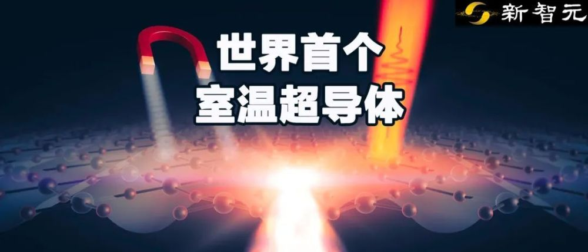

新智元报道

编辑：编辑部

**【新智元导读】** 室温超导圣杯又被摘下了？韩国的物理学家声称，发现世界首个室温常压超导体——LK-99。这次能预定诺奖吗？

室温常压超导，又被人突破了？这次，是韩国科学家。他们声称发现世界首个室温常压超导体——改性铅磷灰石晶体结构。

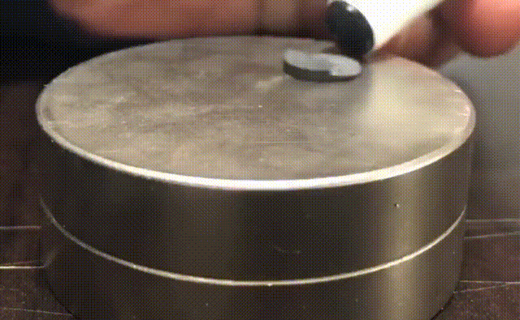

韩国物理学家在论文中表示——

所有证据都可以证明，LK-99是世界首个室温常压超导体。LK-99的诞生意味着室温超导领域的重大突破，开启了一个全新的历史时代。

消息一出，瞬间引爆互联网，分分钟登顶Hacker
News。假如这次发现为真，那么我们就能实现无损的能量传输，全球的能耗问题将从源头上解决，人类能利用电能获得巨大的力量。

如果再从根上掌握了可控核聚变，我们甚至可以进行远距离的太空旅行。而掌握这项技术的人，无疑将引领世界，简直就是科幻走进现实。

不过，这一次，是真的吗？网友们炸了：能复现不？甭管论文看没看完，网友们是先炸为敬。

**“** 如果是真的，那就是核弹级消息 **”** 。

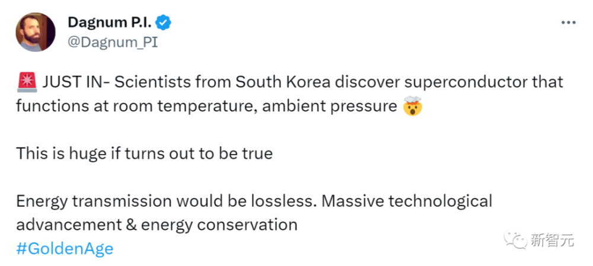

“这可太疯狂了。我对于这些科学研究通常都持怀疑态度，但这一次，似乎是可信的。接下来，就等着看实验结果能否复现了……”

“我无法抑制自己的兴奋。这感觉就像2020年1月，一场巨大的浪潮即将到来，但还没有任何人意识到。活着真是太好了！赶快读读论文。”

“大家请注意，市场目前对这篇论文持怀疑态度——即使概率能高达六分之一，都会让我惊讶。”

“如果真的能实现室温超导电子设备，太赫兹处理器速度的前景就太诱人了！”

“如果能证明这次是真的，那可真是重磅消息。”

“但如果要等到应用，估计不会很快。无数例子证明，科学研究的实现会滞后20年。”

“那些80年代中期的高温超导体现在都已大规模生产，用于核磁共振和聚变初创公司。“

我不认为所有的超导体突破都需要40年，理由很充分：“行业引导、市场发现等都已完成。”

甭管说得多么玄乎，还是让我们仔细读读论文。

世界首个室温常压超导体？

韩国科学家表示，他们在全世界首次用化学方法合成了室温常压超导体——LK99（改性铅-磷灰石）。

尽管人类很早就知晓物质的性质源于它的结构，但迄今为止，我们发现的影响超导体产生超导性的两个主要因素，是温度和压力。

它们通过引起应力使材料中的结构发生微小的变形和应变，从而为超导创造电子状态。

而LK-99的超导性是由微小的体积收缩（0.48%）导致的结构形变引起，不是由温度和压力等外部因素引起的。

通过临界温度（Tc）、零电阻率、临界电流（Ic）、临界磁场（Hc）和迈斯纳效应，都可以证明LK-99的超导性。

 _图1(a) 显示了不同温度（298K-398K）下的测量电压与施加电流，图1(b)
为LK-99薄膜的零电阻率，图1(c)
显示了外加电流对外加磁场（H）的依赖关系，在图1(e)和(f)中，显示了在400K和3000Oe以上的情况下，临界电流值仍未为零（7 mA）_

从以上实验数据可以判断，LK-99的临界温度在400K以上。

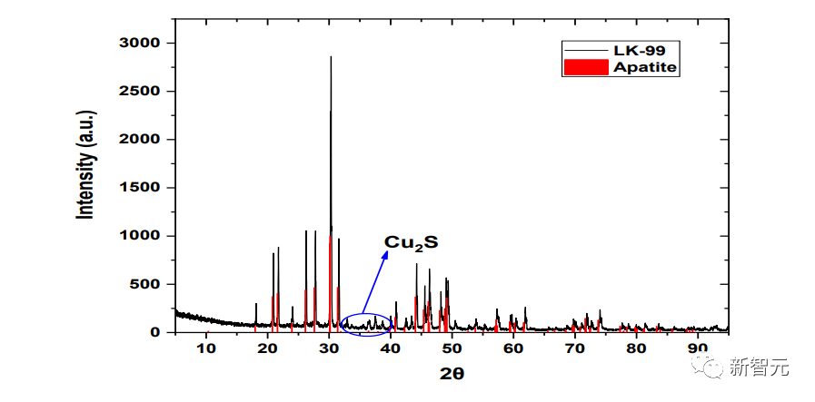

_图2：作者通过X射线衍射分析（XRD），与COD数据库进行匹配，确定了LK-99的晶体结构为多晶体（Apatite: 磷灰石）_

LK-99为灰黑色，与典型超导体的颜色相同。

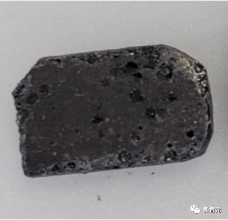

它具有三维网络结构（如下图），是一个被绝缘四面体结构包围的圆柱形柱。

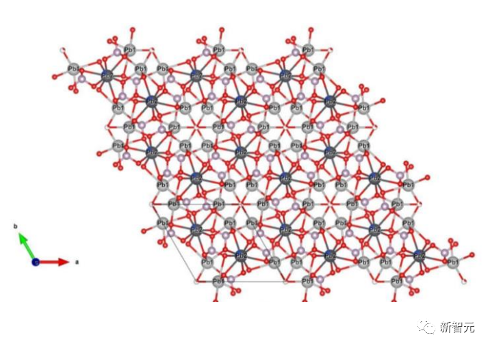

在如下侧视图中，间隔排列的这些圆柱形柱由非对称的六面体组成，包含两个对置的三角形。

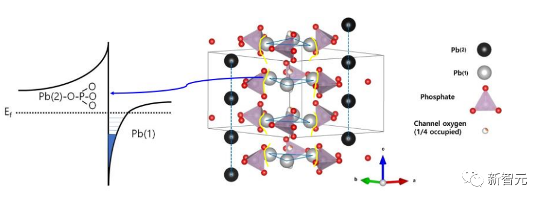

研究者发现，由于LK-99中离子的替换，导致体积减少了0.48%，因为离子（87 pm）比离子（133pm）小。

应力发生在网络部分，然后就导致了超导性的出现。

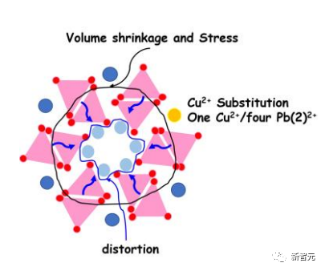

而LK-99的热容曲线（右下黑色曲线）不遵循Debye模型，证实了LK-99具有被取代而扭曲的结构。

同时，LK-99的EPR信号图（如下），证实了Pb(1)和磷酸盐界面上存在量子阱（SQW）。

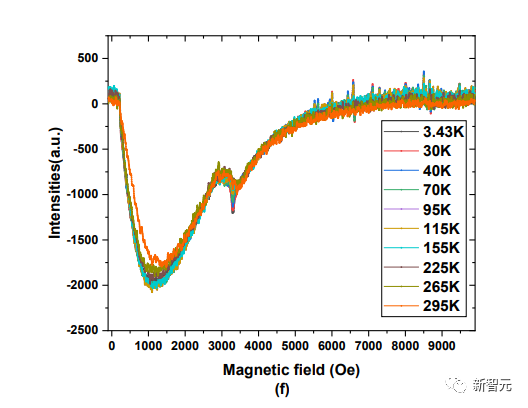

而Pb(1)和磷酸氧之间通过结构畸变和应变产生了SQW，其结构如下图所示。

与此前研究不同，LK-99的超导性的表达，与SQW的形成密切相关。Josephson等发现了超导体之间存在隧穿效应，这意味着电子通过隧穿在量子阱（SQW）之间移动时，电阻将为零。

考虑到LK-99中SQW间隔预计在，此时SQW之间的隧穿效应很可能发生，LK-99也就获得了超导性。总之，LK-99之所以在室温和环境压力下表现出超导性，就是因为LK-99中，离子的置换所产生的应力没有得到缓解，同时又被适当地传递到了柱-
柱界面上。

这种适当的变形，在界面中产生了SQW，而不会产生松弛。

在论文最后，研究者表示：所有证据都可以证明，LK-99是世界首个室温常压超导体。而LK-99的应用场景十分广阔，包括磁铁、电机、电缆、悬浮列车、电力电缆，量子计算机的量子比特和THz天线等。

总之，LK-99的诞生意味着室温超导领域的重大突破，可以说开启了一个全新的历史时代。

上一个已被打脸。

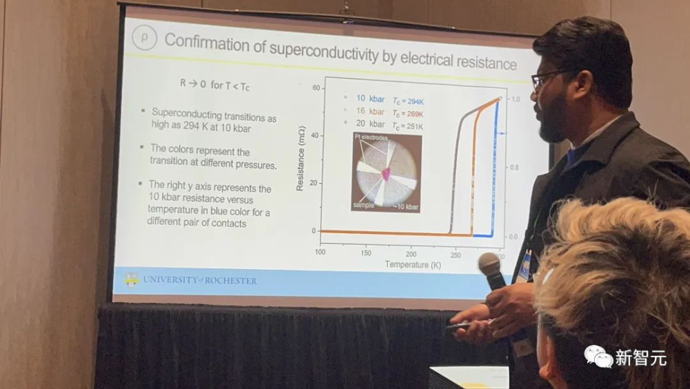

如果他所述属实，无疑是在该领域取得了颠覆性突破，相当于摘下了物理学的一座圣杯。

这样一颗惊雷在拉斯维加斯举办的物理学会上炸响，当场震惊了所有大咖。

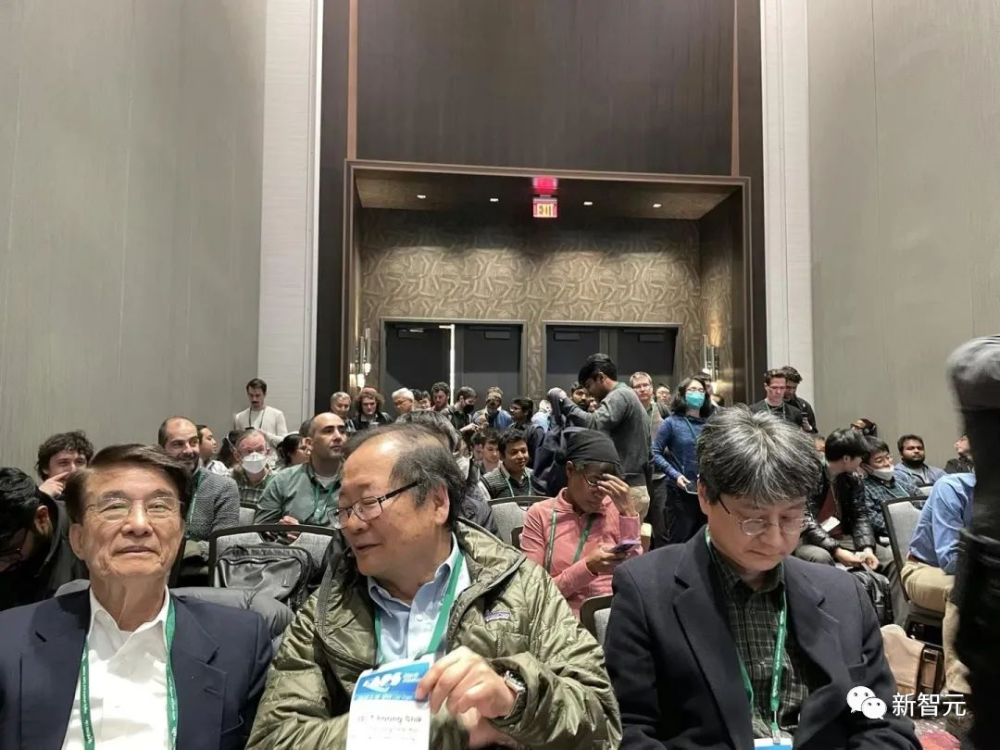

不过，很可惜的是，Ranga Dias的结果此后并未被任何一个实验室成功复现。

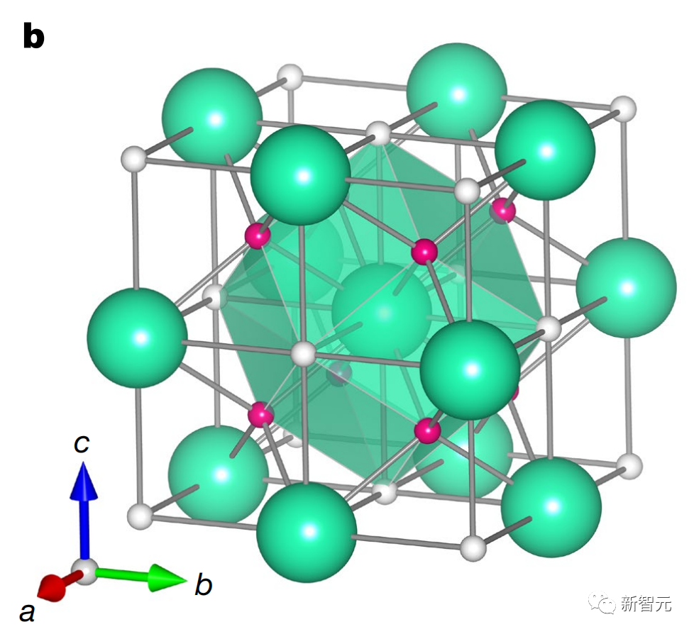

_Dias绘制的晶胞图，白色原子是氢，绿色的是镥，粉色的是不同位点的氢原子_

在更早的时候，第一个已知的超导体只能保持在高达约25K的超导状态。

在20世纪80年代末，研究人员发现了第一个所谓的高温超导体，其超导率高达90 K——液氮可以达到这种温度。

科学家认为他们正处于室温超导体革命的风口浪尖上。

_1911年发现了第一个超导体Mercury_

但是，到目前为止，这些早期实验中使用的高温超导体（主要是氧化铜）都没有显示其超导性保持在约160K以上，低于南极洲记录的最冷温度。

还有另一条预测的高温超导路径。模型表明，在巨大的压力下，氢可以转化为金属，在数百开尔文时可以超导。

包括Dias和他的哈佛大学博士后顾问Isaac Silvera在内的几组研究人员声称在实验室中制造了金属氢，但该州存在的确凿证据仍然难以捉摸。

研究人员更幸运地创造了在较低压力下凝固的金属氢合金。

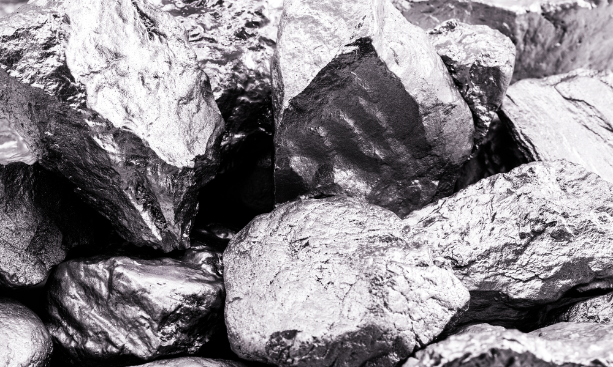

2009年，研究人员声称发现了第53种元素是超导体。在发现结果背后的数据受到操纵后，这一说法后来被撤销。

2015年，来自德国的一个团队报告了硫化氢（H(3)S）的超导性，为203 K和155 GPa。四年后，有报告称氢化镧（LaH(10)）在250 K和170
GPa实现超导。第一个室温超导体似乎触手可及。

2020年10月14日，Dias和他的同事在Nature上宣布，他们在含氢材料碳氢化合物（CSH）中发现了超导性，其含量为287 K和267
GPa——第一个室温超导体。

不过，Dias随后就被打假，并以“黑历史”而著名。

所以，这次韩国物理学家的结果，能被成功复现吗？

