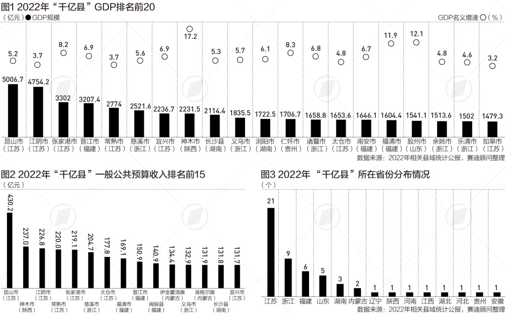

# 54个“千亿县”解码：江苏有21个，这三个地方人均GDP超江阴

县域经济是稳定宏观经济大盘的重要发力点。过去一年，以“千亿县”为代表的县域经济发展势头强劲。

赛迪顾问25日发布的《2023中国县域经济百强研究》（下称“报告”）显示，今年百强县中进入“GDP千亿俱乐部”的县域达到54个，完成GDP8.6万亿元，占全国经济总量的7.1%，比去年增加了10个。

GDP“千亿县”中，江苏拥有21席，占比38.89%；浙江跟随其后，占9席；福建6个；山东5个。与此同时，江苏、浙江GDP头部县域数量处于领先地位，且上榜县域GDP在1000亿~2000亿元区间的数量也领先于其他地区。

**“千亿县”六大发展模式**

2022年，“千亿县”经济总量实现高速增长，49县市名义增速超全国同期，10县市名义增速超10%。伊金霍洛旗、准格尔旗、神木市GDP名义增速分别以18.7%、17.6%、17.2%领跑全国，GDP同比增量分别为228.4亿元、229.2亿元、383.3亿元；海安市（2.7%）、如东县（2.6%）、宁乡市（2.2%）、荣成市（0.9%）名义增速低于3%。

福建、湖南、安徽、内蒙古等上榜百强县的县域GDP在1000亿~2000亿元区间的数量仅次于苏浙，但1000亿元以下进榜数量相对较少。这表明，这些省份头部县域发展质量较高，但区域内差异较大。山东、湖北和四川在1000亿元以下区间进榜较多，表明这三个省份发展潜力较大，发展后劲较足。

西部地区“千亿县”常住人口往往总量小，人均GDP均排名前列。比如，伊金霍洛旗、神木市、准格尔旗人均GDP分别以49.2万元、 39万元、36.2
万元超越江阴市（26.7万元）、昆山市（23.9万元）。

具体到县域排位，昆山市GDP突破5000亿元大关，成为全国首个突破5000亿元的县域。若将昆山与地级以上市比较，昆山GDP总量超过了贵阳、兰州等8个省会城市。

江阴市GDP达4754.18亿，距离榜首昆山只差200多亿；张家港市和晋江市突破3000亿元；常熟市、慈溪市、宜兴市、神木市和长沙县GDP突破2000亿元。

报告认为，以县域经济高质量发展集聚区、城市群为基础，当前“千亿县”形成了六大典型发展模式：

一是以昆山市、江阴市、慈溪市、义乌市等为代表的长三角城市群创新驱动主导模式；二是以晋江市、南安市等为代表的粤闽浙沿海城市群产业集群驱动主导模式；三是以长沙县、浏阳市、宁乡市为代表的长株潭城市群区域融合驱动主导模式；四是以龙口市、胶州市为代表的山东半岛城市群传统产业升级驱动主导模式；五是以神木市、准格尔旗为代表的呼包鄂榆城市群资源驱动主导模式；六是以仁怀市为典型的核心企业驱动主导模式。

比如，长三角城市群创新驱动主导模式的特点，是创新要素集聚效应明显，区域发展已融入全球产业体系，并且初步实现产业升级和技术创新发展，开始向知识、数据、高级创新人才等新技术、新要素驱动阶段转型，知识经济、创新经济成为发展的重要新动能。

赛迪顾问业务总监、县域经济研究中心主任余德彪接受第一财经记者采访时表示，今年的“千亿县”比上一年增加了10个，越来越多的县域经济总量超过千亿，未来更多县域经济总量超过地市将常态化。

“未来可能出现5000亿级县市、万亿级县市。因此，制定发展目标时应远中近期结合，适当拔高发展目标。而更多的县市则应该瞄准‘千亿县’发展目标。要提升‘千亿县’在强省战略中的地位与作用，突出重点区域经济强县的培育。”余德彪说。

**县域产业集群相继涌现**

县域经济是六个经济大省高质量发展的重要支撑。从经济体量看，2021年，除广东外，江苏、浙江、山东、河南、四川等所辖县域GDP占全省GDP比重均超过40%，其中，河南所辖县域GDP占全省GDP比重达59.3%。

2016~2021年，中国县域地区生产总值由33.1万亿元增长到43.2万亿元，规上工业企业数量由198256家波动增长至203465家，2021年规上工业企业数量达到近6年峰值；2018~2021年，中国县域一般公共预算收入由24176.4亿元增长到25338.6亿元。

余德彪告诉记者，今年百强县总榜呈现东部平稳、中部下降、西部有所增长的趋势。随着东中部地区产业向西部转移、区域协调发展战略进一步落实，西部县域在项目落地、资金资源流入等方面优势逐步扩大。

报告认为，近年来高能级县域产业集群相继涌现。比如，宜兴水环境产业集群、天门生物医药产业集群、常熟新能源汽车核心零部件产业集群、仙桃高新区非织造布产业集群等多个产业集群先后被科技部纳入创新型产业集群试点（培育），浙江温州市乐清电气集群成为目前唯一一个入选国家先进制造业集群竞赛决赛优胜者名单的县域产业集群。

此外，近四成中小企业特色产业集群位于县域，集中在制造领域。2022年，工业和信息化部评选出首批100家中小企业特色产业集群。其中，有39个位于县域，分布在金属制品业、电气机械和器材制造业等制造行业。

同时，县域也是地区实体经济的重要载体。从工业主体看，2021年，江苏、浙江、山东、河南等所辖县域规上工业企业数量均超过15000家。

不过，报告也指出，县域经济的区域分布仍不均衡。存在头尾部县域经济规模跨度较大、县域二产占比下降过快、新旧动能转换缓慢、产业发展所需配套要素相对滞后等问题。

谈到未来如何培育更多的经济强县，余德彪建议，要推动暂无百强县、“千亿县”等标杆县市的省份培育出核心县市；推动单核示范省份向多点引领模式发展；“雁行模式”的县域经济发展加快向“狼群模式”县域迈进；推动江苏、浙江为典型的“狼群模式”县域迈向更高发展层次。

“江苏、浙江等‘狼群模式’引领的县域发展模式，如今已初步实现全域县域的均衡发展，因此更需要关注全域各类要素配置，更加体现出公平、公正的省级县域发展导向。具体来看，江苏更应强调县域的南北协同，浙江则更应突出县域的东西部山海联动，加强对县域经济薄弱区域的政策倾斜支持，引导较为发达县域生产要素加快向薄弱县域流动。”余德彪说。

