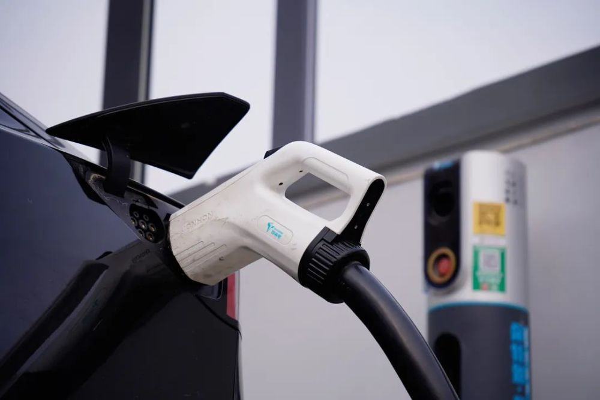
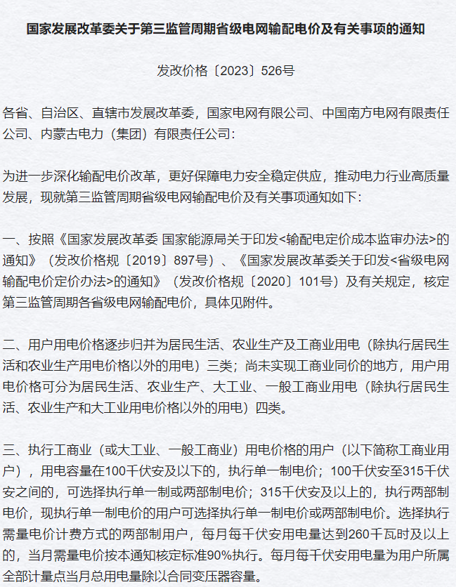
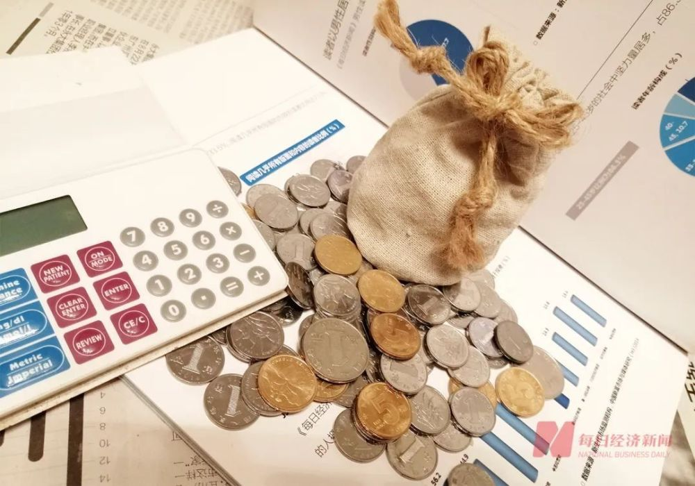
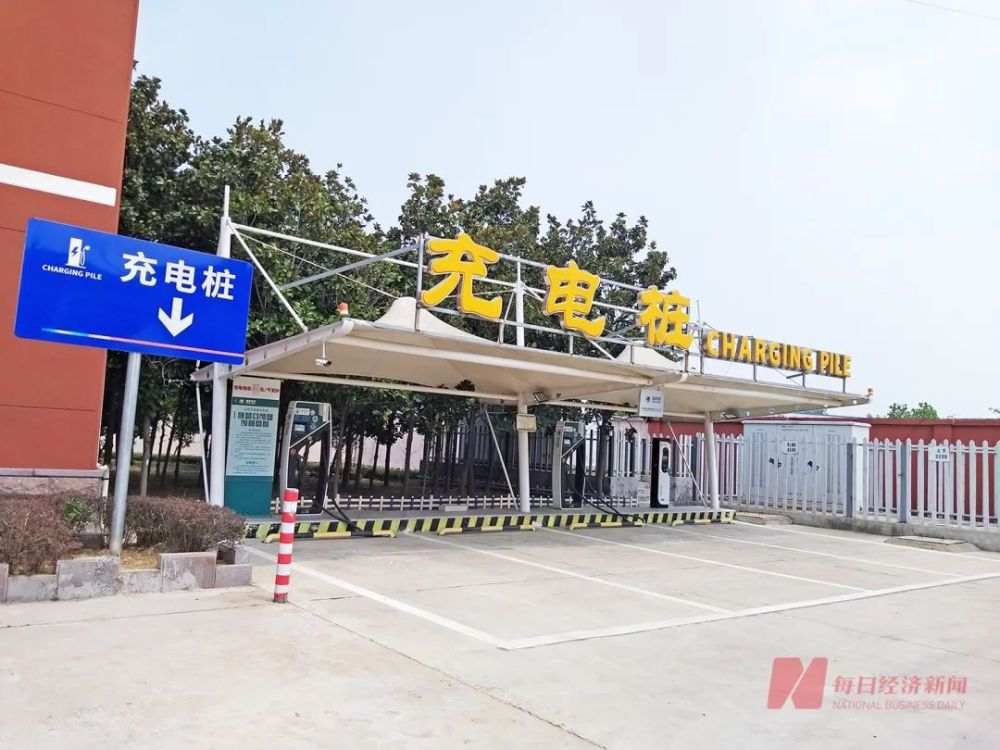
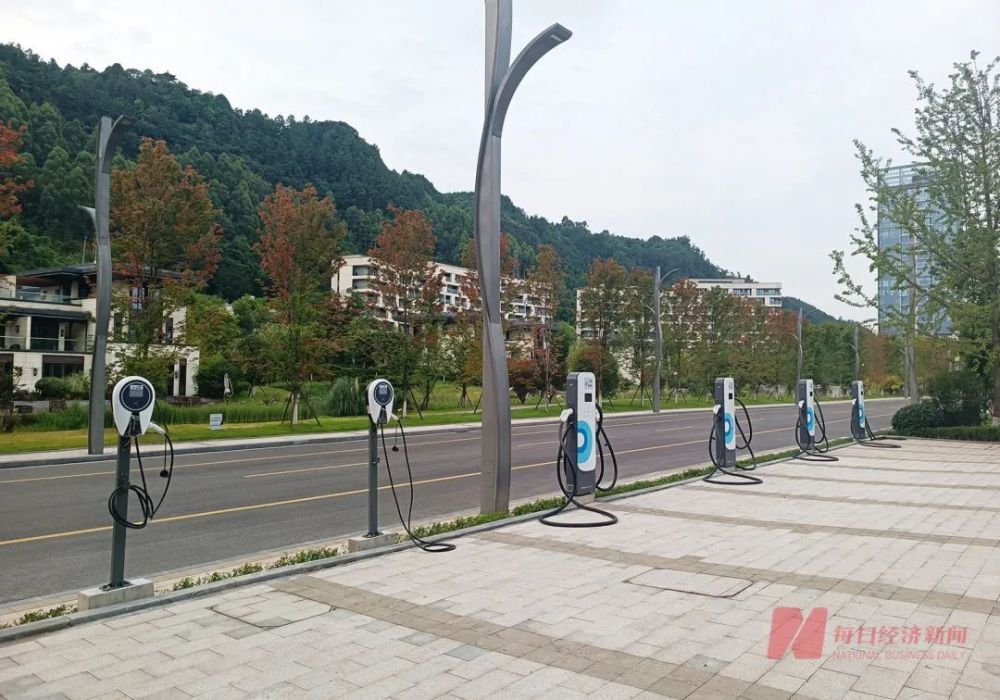

# 一个月多花400-500元，上海、青岛等多地充电费上涨，部分涨幅高达87%

“快要充不起电了！”进入7月以来，不少来自郑州的新能源车主称，郑州市域内几乎不同品牌的新能源充电站均迎来涨价。与平日最便宜的“深夜阶段”相比，充电费用涨幅接近1倍。

一位郑州出租车司机称：“（我）一天下来就要多花15~16元，一个月就得多花400~500元。”另一位出租车司机则表示：“充一次电，大约贵了一包烟钱。”

不仅是郑州，上海、青岛、重庆等地也出现了使用充电桩费用上涨的情况， **部分地区高峰涨幅甚至达到87%。**

相比于燃油车，新能源汽车的一大优势在于其补能成本低。而随着使用充电桩费用的上涨，新能源汽车的使用成本优势还能持续多久？

_图片来源：视觉中国_

**电价、服务费齐上涨**

据了解，目前面向C端的充电费包括销售电价和度电服务费两部分。其中，销售电价是指运营商从电网采购电力的成本，动态更新。同时，不同企业的采购价格会使销售电价有小幅差异，且一般采用平价与峰谷电价两种策略。

近期充电费用上涨，销售电价的波动就影响了新能源车主的补能成本。对于此次充电费用上涨的原因，有业内人士告诉《每日经济新闻》记者：
**“比较共识性的看法是，由于工商业用电政策有所调整。”**

根据今年5月国家发展改革委印发的《关于第三监管周期省级电网输配电价及有关事项的通知》（以下简称《通知》），6月1日起实行新的电价方案。《通知》中明确，新电价方案将用户用电价格逐步归并为居民生活、农业生产及工商业用电（除执行居民生活和农业生产用电价格以外的用电）三类，大型充电站的用电被划归到了工业用电中。区别于民用电和农业用电，工业用电的价格较高。

_图片来源：国家发展改革委官方网站_

此外，从用电负荷的这个角度去看， **由于今年极端高温天气频发，特别是夏季到来之后，很多地区的用电负荷明显增大。**
有分析认为，无论是上海、郑州，还是华北平原的一些地区，用电负荷随着高温天气的增多会显著升高，在这样的情况下，充电桩这种大型的商业用电区域，在用电负荷高峰期，电价也会有明显的提升。

度电服务费方面，国家发展改革委于2014年发布的《关于电动汽车用电价格政策有关问题的通知》要求，2020年前，对电动汽车充换电服务费实行政府指导价管理。充换电服务费标准上限由省级人民政府价格主管部门或其授权的单位制定并调整。此后，充电服务费逐渐市场化，服务费价格弹性上涨。

在此轮充电费用的上涨中，有些地区就出现了上涨度电服务费的现象。例如，7月12日，郑州区域特来电的服务费，由0.42元/度调整为0.6元/度，涨幅达43%。此外，青岛等地的充电桩服务费也有不同程度的上涨。

e充电相关工作人员表示，充电服务费标准上限由省级人民政府价格主管或其授权的单位制定，用于弥补充电设施运营成本。特来电充电相关工作人员则表示，该公司目前在郑州区域的服务费调控均由当地子公司直接负责。

**增加服务费可使桩企实现盈利**

多地充电费用上涨的另一个背景是，当前绝大多数充电桩运营商都处于微利甚至亏损阶段。以某充电桩龙头企业为例，其母公司公布的数据显示，2020~2022年，该公司分别实现营收15.77亿元、31.04亿元和45.70亿元，亏损则分别为3786.49万元、5132.08万元、2600.02万元。

“新能源车市场规模处于迅猛增长之中，新车渗透率在2022年乘用车市场达到了27.6%。但从整个汽车市场的保有量来看渗透率尚不足5%，对于充电桩企业而言，尚未进入消化存量的阶段。”IDC中国研究经理王博告诉记者。

此外，充电桩企业商业化进展不顺利的一大原因还在于盈利模式单一。据了解，充电桩企业的收入来源可以分为三部分：度电服务费、电费差价和增值服务。
**目前，充电服务费带来的收入占绝大部分充电桩企业总收入的90%以上。**

天风证券分析师孙潇雅在研报中表示，就单桩盈利空间而言，由于电价基本平进平出，差额收益少，现阶段盈利空间基本来自服务费，盈利模式单一。而根据中信证券研究院测算，如果保持单桩的利用效率，提升度电服务费，单桩的利润确实可以实现增长。

_图片来源：每日经济新闻 刘国梅 摄（资料图）_

以单桩利用率6%为例，当度电服务费分别为0.4元/度和0.5元/度时，单桩的利润均为负值，分别为-0.43万元和-0.2万元；而当度电服务费提升至0.6元/度、0.7元/度、0.8元/度时，单桩的利润转正，且逐步提升，分别为0.04万元、0.28万元、0.51万元。

不过需要注意的是， **一个地区的度电服务费主要是基于当地电费和当地物价局核定范围而定，因此无法大幅提升。**
有充电桩企业高管告诉记者，考虑到价格竞争力，度电服务费主要还是跟随电价调整，不会进行显著涨价。

“我们调整的话，肯定是跟着当地市场的总体趋势和智能算法定的。这个（价格调整）都要经过市场监管局报备的，不是随意定的。”星星充电方面告诉记者，对于是否提高充电费用来提升企业盈利能力这一问题，也要看区域的发展状况，因为不同地区表现不一样。

**提高充电桩利用率是盈利关键**

值得注意的是，当前我国新能源汽车行业仍处于高速发展阶段，正从一、二线城市用户向三、四线城市及广大农村地区用户扩展，而后者有相当比例属于价格敏感型群体。

有观点认为，如果充电桩费用大幅上涨现象持续，或使消费者对新能源汽车望而却步，对我国新能源汽车产业的市场拓展带来挑战。这也使得业内开始思考除调高度电服务费外，是否还有其他可提升充电桩企业盈利能力的方式。

对此，孙潇雅认为，在保持度电服务费不变的基础上，对于充电桩运营经济性的提升，企业短期要看充电桩的使用率。中信证券方面也表示，根据充电桩运营端盈利模型测算，充电桩利用效率是影响其盈利的核心因素。

 _图片来源：每日经济新闻 资料图_

根据中信证券对50kW直流单桩盈利模型的测算，假设度电服务费保持0.5元/kWh不变，当单桩利用效率从6%提升至10%时，单桩利润则从-0.20万元提升至0.59万元；平均单桩效率每提升1%，利润增长0.20万元。

此外，单桩利用效率的提升也可以缩短投资回收期。同样假设度电服务费保持0.5元/kWh不变，当单桩利用效率从6%提升至10%时，投资回收期从15年下降至5年，显著小于设备可使用年限（10年左右）。

在此背景下，充电桩利用率就成了考量充电桩盈利的最重要因素。据光大证券数据，充电站盈亏平衡点的利用率在8%左右。但根据能链研究院方面的数据，2022年，新能源汽车基础设施仍存在充电桩整体利用率较低的问题，充电桩平均利用率仅在3%~5%，未达到平衡点门槛。

“影响利用率的因素包括，地段、新能源车保有量、出行量、运营水平。我认为，其中新能源车保有量、运营水平是决定性因素。随着保有量增加，以及运营能力的提升，（单桩）利用率有望持续上升。”孙潇雅说。

**技术与运营端探索多样化商业模式**

在孙潇雅看来，要提升充电桩的利用率，本质是提升放电量，其可以通过技术端与运营端两个维度来实现。其中，在技术端可以重点关注大功率柔性充电堆技术，这是一种高效利用电源模块及合理分配充电功率的方案。

公开资料显示，传统充电桩功率固定，从而导致高功率充电设备在充低电池容量的车型时的实际利用率会非常低。而柔性堆解决了功率固定的问题，相当于集成多个充电桩及模块，同时外接多把充电枪，可实现多车共充，并根据实际车需求灵活分配充电模块数量，与传统固定功率的充电桩相比，单位时间内能放更多电。

除此之外，大功率柔性充电堆技术还具有投资成本降低、“向上兼容”（柔性堆的功率可随时向上升级）、降低重复投资，以及采用模块化集成设计，缩短维护时间，降低维护成本的特点。“相对降低公共充电桩的成本，提高充电速度，可以让消费者省钱、省时间，提高公共充电桩的竞争力。”全国乘用车市场信息联席会秘书长崔东树说。

_图片来源：每日经济新闻 资料图_

运营端方面，充电桩利用率的提升可以采用分时收费策略、服务质量的提升，以及不同运营商的营销活动来实现。其中，分时收费策略是通过调节峰谷电价与服务费，对充电需求进行跨时间调节，目的是提升桩在低峰期的翻台率。

王博则告诉记者，在盈利方面，短期内充电桩企业可以探索多样化的商业模式，包括一体化的充电桩安装、维护解决方案、桩体广告等。长期而言，充电桩企业应当充分发掘数字化运营的潜力，利用线上平台对用车者与充电桩资源实现更加充分的协调与匹配，通过智能化手段基于用户使用数据对运营提供战术层面指导，从而实现进一步盈利。

此外，未来光储充一体化后有望赚取电价利润，也被业内认为是提升充电桩盈利能力的一种可行方式。据中信证券方面介绍，光储充一体化系统是由光伏发电、储能、充电集成一体、互相协调支撑的绿色充电模式，其工作原理是利用光伏发电，余电由储能设备存储，共同承担供电充电任务。

光储充一体化系统的核心优势在于，其在电价较低的谷期利用储能装置存储电能，在用电高峰期使用存储好的电能，避免直接大规模使用高价的电网电能，可以降低企业运营成本，实现峰谷电价套利。孙潇雅认为，未来光储充一体化后，充电桩企业有望赚取电价利润。

**记者|** 孙磊

**编辑|** 程鹏 裴健如 盖源源

**校对|** 段炼

封面图片来源：视觉中国

｜每日经济新闻 nbdnews 原创文章｜

未经许可禁止转载、摘编、复制及镜像等使用

