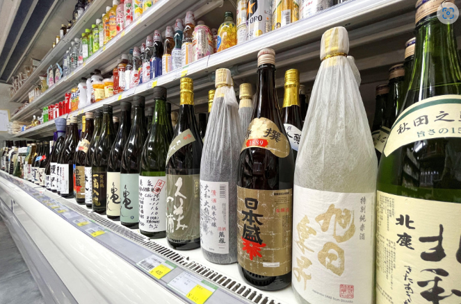

# 与中方全面辐射检测有关？日媒曝：日本对华出口食品正面临通关延迟

【环球网报道 记者
朱嘉琪】日本共同社26日援引消息人士的话称，日本对华出口的食品和饮料，包括糖果和酒类，正在通关方面临延迟，相关企业目前正调查此事是否与中方本月早些时候对从日本进口的海产品进行全面辐射检测有关。

_中国进口商店里的日本酒及其他饮料 资料图 图源：共同社报道配图_

报道声称，中方本月早些时候对从日本进口的海产品进行全面辐射检测，是为在今年夏天福岛核污染水将排海一事上向东京施压。

此前，《日本经济新闻》7月19日声称，据日本内阁官房长官透露，部分从日本出口的水产品被中国海关扣留。报道称，这是由于中国方面的进口食品辐射检查将更加严格。日本共同社称，熟悉双边关系的消息人士表示，中国7月初推出的措施延长了日本水产品在中国海关的手续办理过程，“中国已开始对从日本进口的海鲜进行全面辐射检测”。

7月4日，国际原子能机构发布综合评估，认为日本核污染水排海方案总体符合国际安全标准，机构将对日排海活动长期监督监测。事实上，这种直接向大海排放核废水的处理方法，是最简单但却是危害最大的。中国外交部发言人当天就此事回应：据了解，这份报告未能充分反映所有参加评估工作各方专家的意见，有关结论未能获得各方专家一致认可。中方对机构仓促出台报告表示遗憾。我们认为，机构报告不能成为日方排海的“护身符”和“通行证”。如果日方一意孤行，必须为此承担一切后果。中方敦促日方配合国际原子能机构，尽快建立一套包括日本邻国等利益攸关方参与的长期国际监测机制。

中国海关7月7日表示，为保护中国消费者进口食品安全，将继续禁止进口日本福岛等十个县（都）的食品，对日本其它地区食品的监管也将强化。海关总署进出口食品安全局负责人7日表示，日本核污染水排海问题引起中国消费者对自日本进口食品安全的担忧。中国海关将保持高度警惕，以对国内消费者绝对负责为原则，确保中国消费者餐桌上的安全。就中国强化监管日本食品进口一事，中国外交部发言人毛宁7月20日回应称，中国政府秉持以人民为中心的施政理念，必须对人民健康和海洋环境负责。中方反对日方排海计划有理有据，采取有关措施有理有据。

