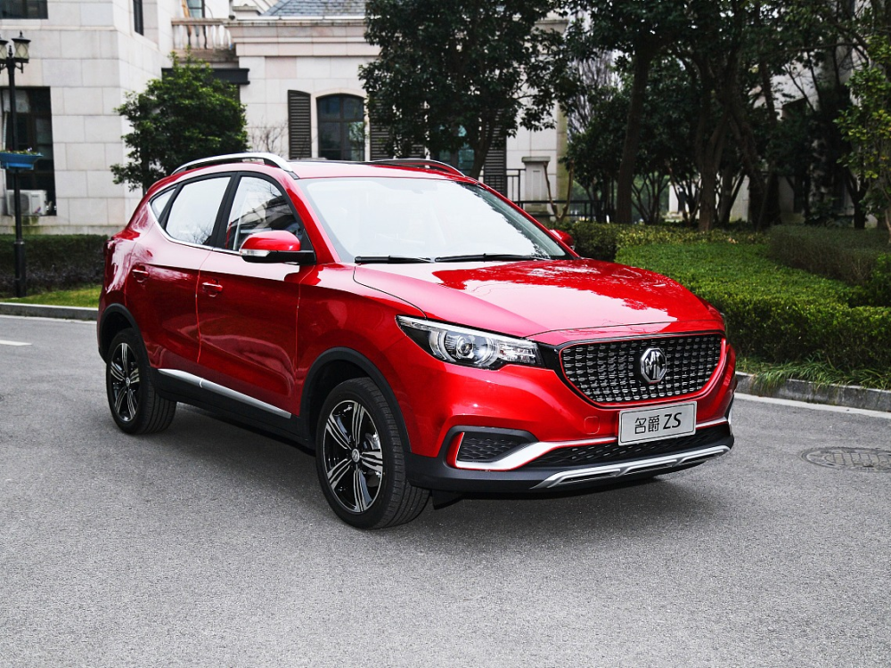
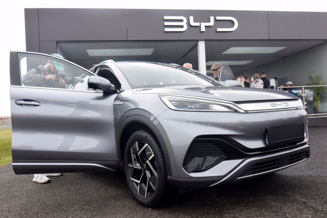

# 中国车企在印度遭打压：名爵印度被迫出售控股权 比亚迪暂未受影响

车圈7月27日消息，据外媒报道，随着印度当局对中国投资的严格监管，两家中国车企上汽名爵和比亚迪正在改变路线，为长期发展做好准备。

2019年5月，时任名爵汽车印度公司总裁兼董事总经理的陈睿奇（Rajeev
Chaba）刚刚监督了该公司首款印度产SUV的发布。在接下来的一年半时间里，这款SUV的销量超过7.2万辆，这对刚进入印度汽车市场的企业而言是一个不小的成就。

陈睿奇当时并不知道，在名爵印度大张旗鼓地成立四年后，他将不得不为这家公司寻找一个买家，名爵印度归属于中国最大的国有汽车制造商上汽集团，后者希望通过向印度投资者出售名爵印度的多数股权，“印度化”其运营。据报道，亿万富翁实业家萨詹·金达尔（Sajjan
Jindal）有意收购名爵印度48%的股份。

印度政府之前出台了一系列针对中国企业的措施--
禁止中国手机应用就是明证。这种不利的环境也延伸到了对汽车公司的投资。最大的受害者是长城汽车，该公司在进入印度市场仅仅两年后，于2022年被迫退出，理由是无法获得外国直接投资。

“在乘用车行业，中国投资近期未获批准。甚至印度本土汽车行业游说团体也反对中国汽车制造商自由发展。因此，名爵印度寻找合作伙伴是非常谨慎的，”一位资深汽车行业高管表示。

业内专家表示，名爵印度的本地化之举更像是一种被迫行为，而非自愿行为。“在印度，名爵是老牌的中国乘用车制造商。如今，印度政府不断对中国独资企业施压，希望它们让印度合作伙伴持有多数股权，”FADA汽车经销商协会联合会主席马尼什·拉吉·辛哈尼亚（Manish
Raj Singhania）说。

不过名爵印度对印度市场的承诺是坚定的。陈睿奇和他的团队已制定出计划，不仅要帮助该公司在世界第四大乘用车市场生存下来，还要攫取更大的份额。“我们计划在两到四年内稀释股权，让大部分股权归印度人所有。第二阶段包括通过新工厂扩大我们的产能。虽然我们古吉拉特邦的现有工厂每年有12万辆的产能，但很快就会达到峰值。因此，我们计划在同一地点建立第二家工厂，年产能增加18万辆，”现任名爵印度名誉首席执行官的陈睿奇说道。他补充称，名爵将会从出售名爵印度的股权中获得至少500亿卢比（约合人民币43.6亿元），将会把这笔资金投入到新工厂的建设当中。

陈睿奇认为，鉴于名爵印度的增长，扩张是必要的。2023财年，该公司销售了48866辆乘用车，比上一年的40369辆增长了21%，比第一个全年运营的2020财年的21954辆增长了一倍多。陈睿奇现在估计，2024财年的销量将超过7万辆。

据名爵印度称，其本地化计划包括完全本地化。“当我们说‘运营印度化’时，它包括了一切，比如技术本地化。我们将从明年开始在古吉拉特邦组装电池。我们行业目前进口的许多重要部件，如电池，将通过合资企业在印度生产。例如，我们将探索新技术的本地生产，如我们可以获得的氢燃料电池，”陈睿奇说。

本地化是对当前形势的一种反应。竞争对手中国汽车巨头比亚迪于2021年进入印度乘用车市场，呈现出一幅相反的画面。迄今为止，比亚迪在印度市场尚未受到影响。

比亚迪主要专注于高端市场，其两款车型定价超过300万卢比（约合人民币26万元），其在印度的乘用车业务规模小于名爵印度。比亚迪印度分公司负责电动乘用车（EPV）业务的高级副总裁桑杰·戈帕拉克里希南（Sanjay
Gopalakrishnan）表示，迄今为止，比亚迪已在印度售出约2200辆电动车。鉴于其业务规模较小，该公司尚未制定出在当地制造零部件的计划，而是专注于在当地组装车辆。

“目前，我们专注于稳定运营和分销。在全球范围内，我们是一家电动车制造商，我们希望利用自己的先进技术提高印度的知名度。最终，我们想成为这里的关键车企。比亚迪印度也是比亚迪在南亚市场的中心，我们计划从这里出口汽车。我们一直在印度按照当地标准运营，”他补充说，该公司甚至通过其合作伙伴向印度当局出售电动公交车，没有遇到太多麻烦。作为技术合作伙伴，比亚迪组装底盘和电池，而其合作伙伴Olectra向各地方政府出售电动公交车。

该公司制定了今年销售1.5万辆电动车的目标，并将其分销网络扩大一倍以上，覆盖53家经销商。“电动车在印度的销量正在快速增长，到2030年，预计将占四轮乘用车销量的30%。因此，作为电动车的全球领导者，我们肯定希望占据更大的市场份额，我们将推出更多车型，”戈帕拉克里希南说，并补充说比亚迪计划今年在印度市场推出新车型海豹。

与此同时，陈睿奇有更大的计划。凭借紧凑型双门电动掀背车彗星(Comet)，他预计到2025年电动车市场的销量将达到35%。“随着我们的下一阶段从第二家工厂开始，我们将推出另外四到五款车型，到2028年，电动车在我们总销售额中的份额将达到65%至75%。我们也计划在那之前上市，”他说。

此外，两家汽车制造商都强调他们所做的投资反映了他们的承诺。根据陈睿奇的说法，名爵已经在印度投资了400亿卢比（约合人民币35亿元）。戈帕拉克里希南则表示，比亚迪已经投资了超过160亿卢比（约合14亿元）。报道称，比亚迪还计划再投资10亿美元生产电动车和电池。不过有报道称，印度政府可能不会批准这样的建议。

印度汽车专家哈里什·比约尔（Harish
Bijoor）表示，中国汽车制造商最初的成功是因为专注于发展业务和建立可靠的形象，而不是像中国手机厂商那样制造太多噪音。“然而，鉴于印度的政策，中国汽车制造商未来仍将面临压力。”（无忌）

