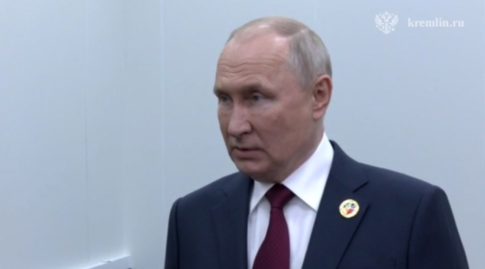

# 俄媒：普京称，乌武装部队26日在扎波罗热方向损失超200人

【环球网快讯】据俄新社27日报道，俄罗斯总统普京出席俄罗斯-
非洲峰会期间接受记者采访时称，乌克兰武装部队在多个地区加强反攻，包括在俄对乌特别军事行动扎波罗热方向，但未能成功，反攻被击退。

_俄新社27日称，这是普京出席俄罗斯-非洲峰会期间接受记者采访的画面。_

报道称，普京还称，乌武装部队26日在俄对乌特别军事行动扎波罗热方向的战斗中损失超200人。

