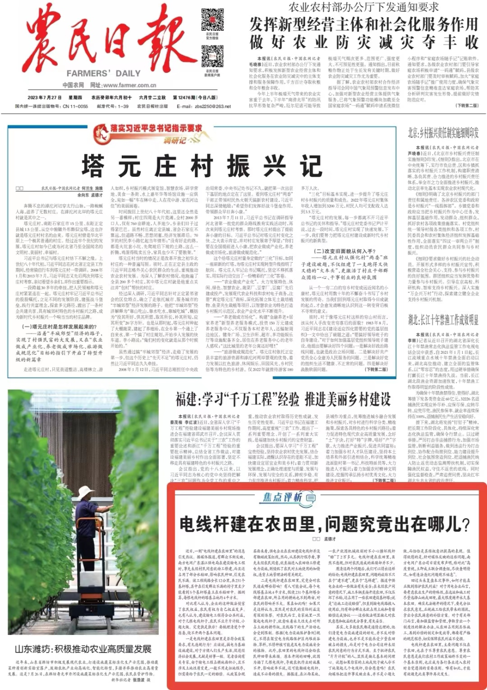
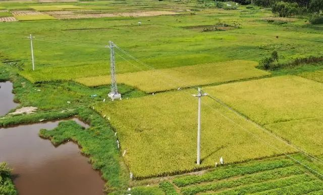

# 农民日报：电线杆建在农田里引争议，问题的症结在于不尊重农民意愿

近日，一则“电线杆建在农田里”的消息引发热议。据媒体报道，有群众不断反映，南方电网广东湛江供电局在建设输电工程时，事先未经村民同意就动工修建，而且还占用了部分水稻田，影响农民种田，引发农民不满。该工程线路全长12公里，共231个基杆塔，其中在引发群众不满的村子里至少能看到5个基杆塔矗立在水稻田中。据测算，每根电线杆的塔基占地约4平方米。

对此有人认为，企业的这种做法侵害了农民权益，农民有权为自己权益发声。也有人认为，建设输电工程符合公共利益，对于几根电线杆子，农民不应斤斤计较、小题大做。
**究竟孰是孰非？要梳理清楚个中原委，绕不开两个基本问题。**

**一是电线杆建在农田里是否符合政策要求，有无违规行为？**
应该说，搞电力基础设施建设，对于方便人们生产生活，促进经济社会发展，无疑是好事一桩。笔者咨询有关专家，由于输电工程占耕地面积小，且不涉及土地性质变更，一般不用走征地程序，但需要给予农民一定的赔偿。从政策合规层面来看，供电企业在农田建设电线杆并没有触碰政策红线，然而，
**从其执行程序看，事先未经农民同意，就直接进入农田动工修建电力设施，则侵犯了农民对土地使用的知情权，违背土地管理法的有关规定。**

**二是电线杆建在农田里，究竟会对农民造成哪些影响？**
有人可能会说，每个电线塔基占地4平方米，假使231个基杆塔全部建在农田，所占用的耕地也不到两亩，对农民的影响并不大。果真如此吗？如果只是这样认为，显然是对农民的实际利益没有深刻体察。
**对农民而言，自家地里一旦架起电线杆子，就意味着永久性失去对所占土地的耕作权，且线路下的生产活动也会受到限制。**
根据《电力设施保护条例》规定，不得在架空电力线路保护区内堆放谷物、草料，不得种植可能危及电力设施安全的植物。此外，农田里的电线杆还会给农民种田带来麻烦。原本开阔的田畴，就因为插了几根电线杆，导致农机作业时施展不开，影响效率不说，还可能触碰电线杆，造成不必要的损失。据报道，在江西某地，一农户就因机械收割时不小心撞坏线杆“赔”了2万多元。电线杆建在农田里，虽然不违规，但对农民造成的麻烦却并不少。

厘清这两个问题后，我们可以得出这样的结论： **电线杆建在农田里，问题的症结不只在于“建不建”，更在于“怎样建”。**
报道中供电企业的一些做法有失妥当：在未经农户同意的情况下，施工车辆直接开进农田，不仅压坏了水稻，还占用了一些农田建设基杆塔；说是“边施工边谈赔偿”，但直到输电线路投入使用后，仍有部分群众未就占用土地和青苗赔偿达成协议……
**这些做法明显缺乏对农民意愿和权益的充分尊重，有失妥当。**

其实，大多数农民都是通情达理的，他们清楚电力设施建设的好处，并不反对修建电力设施，也并不是不能承受少量农田被占的损失，而是对于电力公司这种未经农民同意的行为方式不满。至于批评农民“斤斤计较”的人，显然是缺乏基本的同理心。试想如果你家的土地或院子被人冷不丁地架起几个电线杆，你会愿意吗？
**农民向媒体把这件事反映出来，并不是小题大做，而恰恰是其维权意识提高的表现。**
值得欣慰的是，针对媒体反映的这些问题，南方电网广东公司日前发布声明，称对此“高度重视，立即成立联合调查组，尽快查明情况，如有违法违纪问题绝不姑息”。

回过头来复盘本次事件，如何才能真正做到维护农民利益？对于用电企业而言，要考虑农业生产的特殊性，在选址和施工时尽量选择山地或田埂，最大限度避开永久基本农田。确实无法避开的情况下，要充分征求农民意见，正视施工给农民带来的困扰，拿出令农民满意的补偿方案。对于有关部门而言，要加强监督和管理，争取拿出一个制度性的解决办法，从农田占用到具体施工，再到补偿的制定和发放等，都要有严格的规范程序，切实保障农民利益不受损。

**电线杆建在农田里，主要问题不仅在于农田，也在于不尊重农民意愿。尊重农民意愿是我们农村工作政策始终不变的一个基本准则，也应成为各行各业进入农村时自觉遵循的首要准则。**
唯有如此，才能有效避免此类事件再次发生。

**作者：孟德才**

图片：半月谈

监制：梁冰清 编辑：倪杨金子

**此前报道：**

电杆建在农田里：没跟村民事先沟通，一平米补偿几块钱

广东电网回应“电杆建在农田里”：成立联合调查组

