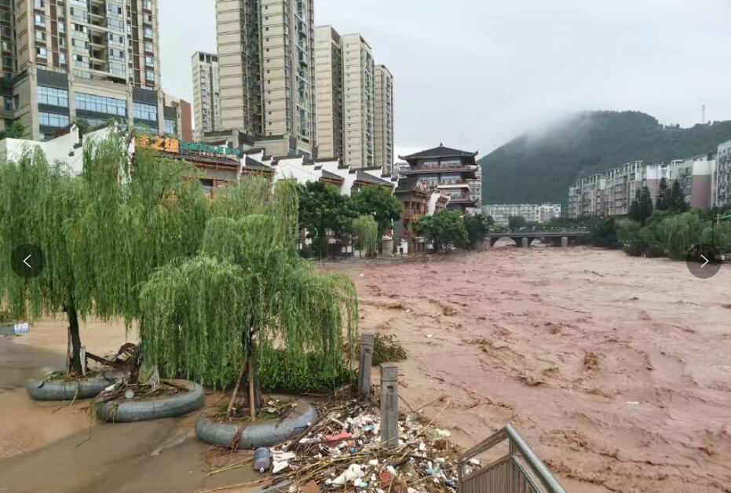
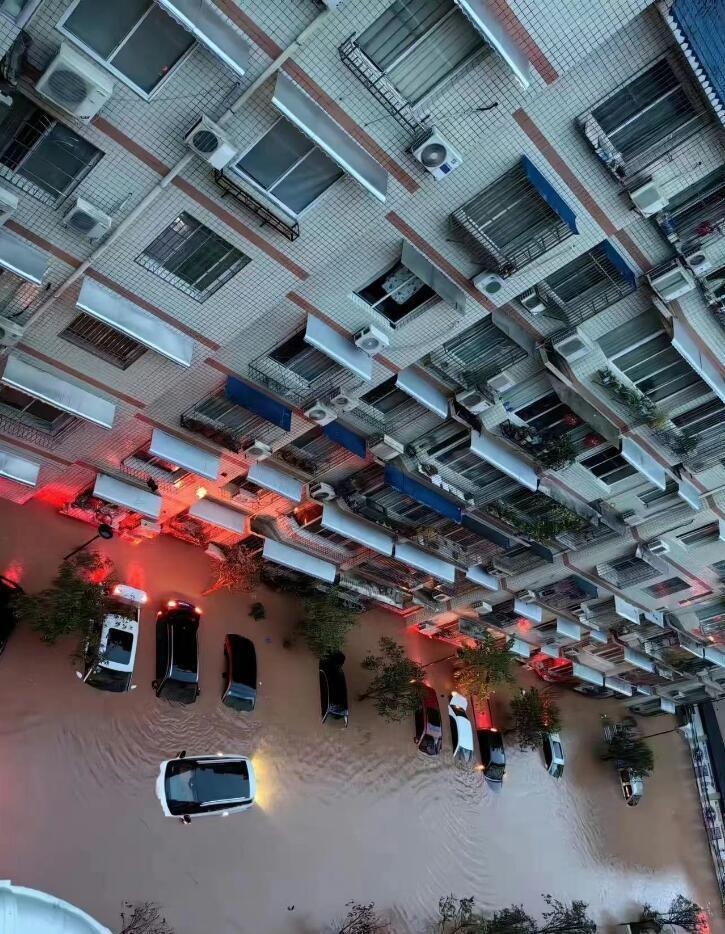

# 四川古蔺最大降雨量201毫米，超过1957年有气象记录以来历史极值

据四川古蔺县防汛抗旱与救援专项工作指挥部7月27日消息，7月27日0时至27日10时，古蔺县遭遇极端强降雨，全县大暴雨13站，暴雨4站，大雨6站，中雨7站，小雨18站。最大降雨量为古蔺县城酒街站201毫米，超过1957年有气象记录以来历史极值（163.7毫米），强降雨时段主要集中在27日03时至27日06时。

古蔺河实测最大流量1910立方米/秒，为1958年水文建站以来实测最大流量。彰德、金兰、永乐、黄荆、大寨、德耀降雨量均超100毫米，
预计未来古蔺县强降雨将持续。县城大面积停电停水，古蔺县城酒街、彰德红龙湖、古蔺建国村、德耀场镇、黄荆场镇等多处地段水位上涨，多处路段被毁，道路积水严重，交通受阻严重，部分区域通信受到影响。

截至目前，古蔺已组织全县紧急避险转移群众1902户6473人，暂未接到人员伤亡报告。其他房屋、道路、桥梁、河道、农作物等受损情况正在进一步统计中。

暴雨发生后，古蔺县立即启动防汛和地质灾害Ⅱ级应急响应，市、县有关领导连夜前往古蔺县应急指挥中心调度雨情、汛情，成立前后方指挥部指挥抢险救灾。应急、公安、消防、交通、水务等部门迅速赶赴现场开展抢险救援，各乡镇（街道）立即组织辖区力量全力开展应急处置、交通管制、人员疏散等工作，与此同时，全县广大党员干部、志愿者、民兵立即出动，正在抓紧开展抢险救灾，后续增援队伍已集结待命。

指挥部提醒：因降雨还在继续，沿途积水严重，请广大群众、车辆非必要不出行。

（北京青年报记者 戴幼卿）

