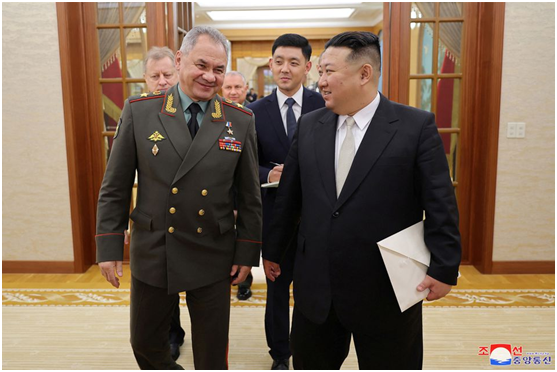
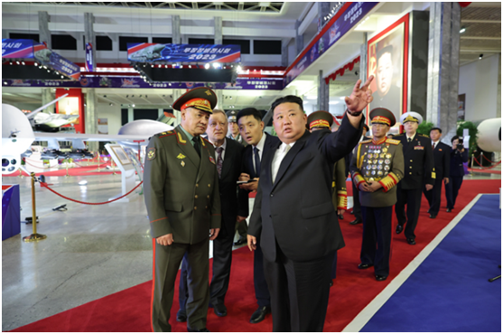
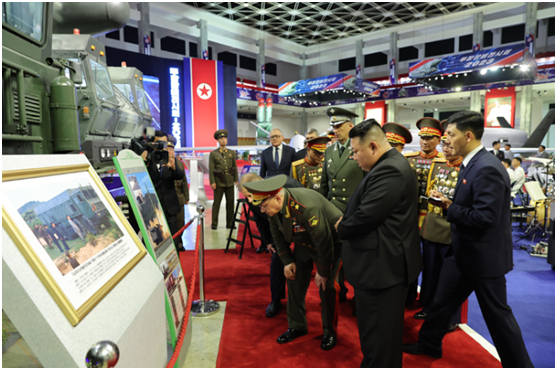
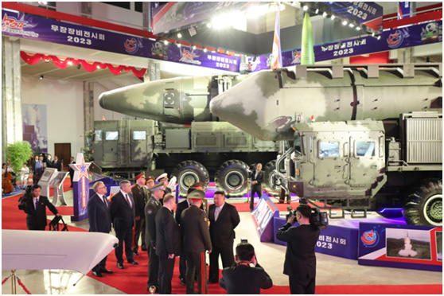
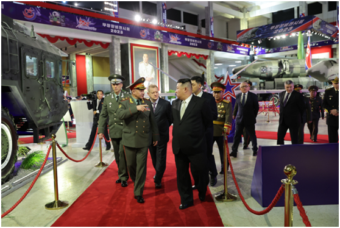
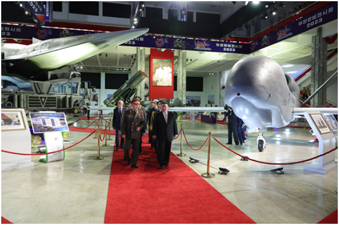
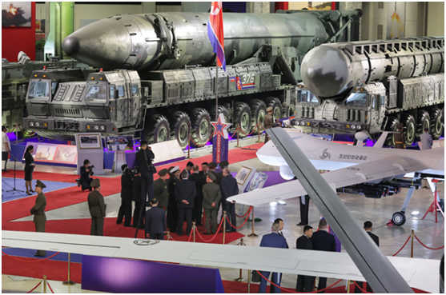

# 外媒：金正恩会见俄防长，双方一同参观朝鲜“新型武器装备”

【环球网报道】俄罗斯防长绍伊古当地时间25日率团抵达平壤，开始对朝鲜进行访问。路透社、法新社援引朝中社报道称，朝鲜劳动党总书记、国务委员长金正恩当地时间26日会见俄罗斯国防部长绍伊古，双方进行友好会谈，并承诺加强双边关系。朝中社提及，绍伊古递交给金正恩一封俄总统普京“亲笔信”，还一同参观了朝鲜“新型武器装备”。

7月27日是朝鲜战争停战70周年纪念日。朝鲜举办大型活动庆祝“祖国解放战争胜利”70周年，并邀请中国和俄罗斯代表团访问朝鲜，出席纪念活动。这是自全球新冠疫情暴发后朝鲜首次正式接待外国代表团。

就俄代表团访朝，路透社援引朝中社报道称，金正恩对普京派绍伊古率军事代表团访朝表示感谢。他说，此次会谈加深了“朝俄战略和传统关系”。绍伊古还向金正恩转交了普京亲笔信，金正恩对此表示感谢。双方互相赠送了礼物。

_朝鲜劳动党总书记、国务委员长金正恩当地时间26日会见俄罗斯国防部长绍伊古。 图源：朝中社_

法新社援引朝中社的报道还称，金正恩和绍伊古一同参观武器展览，俄国防部长参观了朝鲜“新型武器装备”。

_当地时间2023年7月26日，朝鲜平壤，朝鲜劳动党总书记、国务委员长金正恩同俄罗斯国防部长谢尔盖•绍伊古参观武器展览。 图源：朝鲜《劳动新闻》_

据朝中社此前报道，在朝鲜庆祝解放战争胜利70周年之际，以俄国防部长绍伊古为团长的俄罗斯联邦军事代表团7月25日抵达平壤，对朝鲜开始进行祝贺访问。朝中社称，朝鲜国防相强纯男等国防省指挥官和外务省副相任天一以及朝鲜人民军官兵迎接了代表团。在强纯男的陪同下，绍伊古检阅了朝鲜人民军仪仗队。

