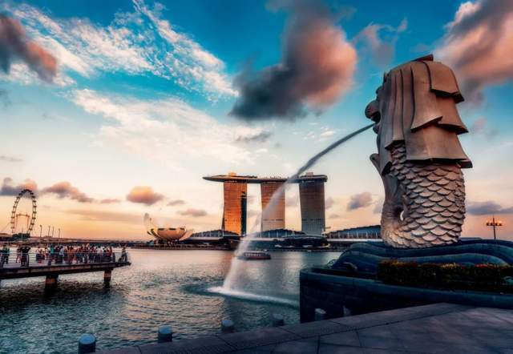

# 婚外情、贪腐丑闻连出，新加坡政坛“七月地震”

在7月17日的一场临时记者会上，新加坡总理李显龙回忆起父亲李光耀90岁生日的场景。

当时，身体已经很虚弱的新加坡建国总理李光耀只说了两三句话。他说，要记住绝对不能让体制变得腐败，永远不能让这种情况发生，必须维持公务人员的素质，确保新加坡能够运转。

新加坡国会议长陈川仁和议员钟丽慧因婚外情而退党等一系列丑闻，勾起了李显龙的此番回忆。他在向媒体和民众解释陈川仁和钟丽慧退党原因时说：“很遗憾，陈川仁在这种情况下离开政坛，但他必须为自己的行为与操守，向国会、行动党、选民和家人负责。”

 _图/视觉中国_

对于建国近60年来一直执政的新加坡人民行动党来说，过去一个月充满挑战。先是内政部长兼律政部长尚穆根和外交部长维文长租“黑白屋豪宅”引发热议，还惊动国会进行调查。随后，交通部长易华仁因涉嫌罕见的高层腐败调查而被捕。在新加坡政坛，部长级别官员遭贪污调查局调查，上一次还发生在近40年前。而最近的一场丑闻就是陈川仁与钟丽慧因婚外情双双辞职退党。

现年71岁的李显龙几年前就曾表示，自己准备在70岁时退休。去年4月，李显龙正式将第四代（4G）领导团队推向前台，称执政党正处于新旧领导层交替的关键时期。但近期接连出现的丑闻，对以廉洁著称的新加坡政坛产生了巨大冲击。有学者认为，这让新加坡面临“史上最严重的危机”，很有可能动摇选民对执政党的信心。

**丑闻频发的7月**

54岁的陈川仁一度被认为是新加坡第四代领导团队的核心成员。

24年的从军生涯中，陈川仁最高获得准将军衔。在2004年印尼海啸后，新加坡军队到印尼亚齐省参与人道主义援助，陈川仁就是当时的指挥官。时至今日，这次救援行动仍是新加坡武装部队最大规模的境外军事行动之一。

2011年，陈川仁从新加坡武装部队退役后转投政界，一路担任国家发展部高级政务部长兼人力部代理部长、人力部部长以及社会和家庭发展部长等要职。

从2017年起，陈川仁出任国会议长。一直以来，新加坡国会议长一职的任命既需要有丰富的执政经验，又要了解议会流程，更需要具备良好的公信力。

与已婚且育有两个孩子的陈川仁不同，47岁的钟丽慧至今未婚。身为议员的钟丽慧侧重于关注女性议题，曾多次提起有关选择性冷冻卵子的议程。

早在2020年大选后，李显龙总理就得知了陈川仁和钟丽慧的不正当关系，并对两人分别进行过劝诫。发现两人藕断丝连后，李显龙今年2月又分别劝说两人结束关系。

但直到本月，李显龙表示自己依然得到了一些信息，“强烈显示”这段不该开始更不该维持几年的关系还没有断绝。尽管为两人的政治前途感到惋惜，李显龙最终认为，他们辞职是必要的。

陈川仁在今年2月被谈话后，也已经有意辞职。4月，他还曾在国会失言。在盛港集选区议员林志蔚谈论政府应如何向新加坡穷人提供更多帮助，而不仅仅是有选择地只为老年穷人提供帮助时，陈川仁在忘记关闭麦克风的情况下，小声抨击对方是“他妈的民粹主义者”。

陈川仁后来表示，已经私下向林志蔚道歉，并得到了谅解。但议长在国会场合口不择言，已经让人们对议长的中立和公正提出更广泛质疑。

相较于陈川仁和钟丽慧的桃色丑闻，另一起对在任内阁部长的贪腐指控对执政党造成了更大的冲击。7月14日，新加坡贪污调查局证实，新加坡交通部长易华仁近日被逮捕，随后保释在外，正在协助该局调查。61岁的易华仁同样是第四代领导团队的核心成员，历任总理公署部长、贸工部长、通讯及新闻部长，于2021年5月转任现职。

 _从左到右：陈川仁、钟丽慧、易华仁。_

在贪污调查局对易华仁展开正式调查仅仅过去2天后，另一个浮出水面的名字是房地产大亨、新加坡上市酒店Hotel
Properties的公司执行董事王明星。根据《福布斯》2022年的排行榜，王明星夫妇在新加坡50大富豪排行榜中位居第24，资产高达17.5亿美元。

王明星是马来西亚人，定居新加坡多年，曾因在2008年将世界一级方程式F1大奖赛带到新加坡而广受赞誉，他的私营公司去年还获得和新加坡旅游局举办新加坡站大奖赛的承办权，直到2028年。另据披露，王明星在1995年就卷入过政坛贪腐风波，当时，他被指以折扣价格向前总理李光耀的妻子及时任副总理的李显龙出售两套房产。时任总理吴作栋曾专为此事举行国会辩论，最终澄清他们没有不当行为。

在调查有结果之前，易华仁暂停职务，不能进入任何政府办公场所，接触任何政府资源。据新加坡《联合早报》报道，7月18日，易华仁只身现身贪污调查局，接受了近10个小时的调查后乘车离开。

在新加坡，已经有近40年没有出现过部长级别的贪腐案。上一次还是发生在1986年，曾任国家发展部长的郑章远被指控收取贿款，涉嫌在1981年和1982年各收取50万新元贿款。但在调查过程中，郑章远否认了这些指控。

在出庭之前，郑章远突然服药自杀，并给李光耀留下一封遗书：“过去两个星期，我感到非常沮丧。对于发生这次的不幸事件，我应该负全部责任。作为一个堂堂正正的东方绅士，我应该为自己所犯的错误接受最严厉的惩罚——你的忠实的郑章远。”

自从郑章远案以来，新加坡再也没有出现过内阁部长被贪污调查局调查的事件，直到这一次交通部长易华仁涉案。

而近期，除了易华仁被捕，新加坡律政部兼内政部长尚穆根和外长维文租用“黑白屋豪宅”也因涉及贪污或受贿，遭到贪污调查局的调查。

但李显龙对尚穆根和维文所涉事件的表态是“他们没做错，我仍充分信任他们”。在调查期间，尚穆根和维文也并未暂停职务。而李显龙指示易华仁在协助调查期间休缺席假。新加坡管理大学法学院教授陈庆文认为，被命令休假是非常严重的事，这意味着贪污调查局可能在初步调查的过程中掌握了可靠的证据，足以揭露一些违法的行为。

**“比白更白”的廉洁要求**

“李光耀时代，行动党往往强调官员选拔要有高标准的道德和能力，这也抬高了国人对政治人物的期望。”新加坡国立大学政治系副教授庄嘉颖对《中国新闻周刊》表示。

庄嘉颖回忆称，直到现在仍有很多新加坡老一辈对这一幕记忆犹新，1959年，新加坡刚刚独立，在市政厅大厦会议室，李光耀带着所有团队成员一律穿白色的衬衫和白色的长裤宣誓就职，向人们承诺不会容忍腐败，并誓言政客要纯洁廉明，比白更白。

在李光耀执政初期，殖民时代遗留的贪腐风气盛行。“腐败到处盛行，从官僚政权的最高级到最低级，腐败已成为当权人物的一种生活方式。”李光耀曾这样形容当时的形势。

1960年，荷兰经济学家艾伯特·温斯缪斯率团考察新加坡时，曾悲观地表示：“新加坡即将崩溃，它只是亚洲黑暗角落里的一个狭小国家。”

李光耀上台后，新加坡建立自治政府，采取严厉举措严惩贪腐。在人民行动党的主导下，新加坡政府于1960年6月颁布了《防止贪污法》，不仅规定公务员不准利用职务之便和权力收受报酬，而且对官员如何处理那些无法推辞掉的礼品做了详细规定。同时，该法律规定，对犯有贪污罪的人除没收其全部非法所得外，还要处以罚金或判处5年以上7年以下的监禁。

不仅如此，新加坡还扩大了贪污调查局的权力。成立于1952年的贪污调查局此前在调查政府官员时经常遭遇阻挠，一些举报只能无疾而终。1960年后，贪污调查局被提升至最高等级，该局局长由总统任命，由总理直接领导。它既是行政机构，又是执法机构，任何新加坡公民，上至高官下至平民，乃至侨居海外的新加坡籍公民都属于其监察对象。

从上世纪80年代中期开始，新加坡还开始给公务员大幅加薪，进一步让腐败在新加坡成为“高风险、低回报”的犯罪行为。北京航空航天大学廉洁教育与研究中心主任任建明观察到，新加坡官员薪酬制度演变历史主要经历了四次大的调整，时间点分别是1982年、1994年、2007年、2012年。新加坡官员工资水平总体上一路走高，处于世界领先水平。据外媒报道，2012年，新加坡初级部长年薪最高达到85万美元，新加坡总理李显龙的年薪更是多达170万美元。

此外，新加坡还先后颁布《公务员法》《公务员守则和纪律条例》《财产申报法》等相关法规，实施严格的财产申报制度，其中还有最特殊也是颇受争议的一项“有罪推定”条款，即“异常财富”可以成为指控证据，无法解释的财产就算贪污。

**提升透明度的新挑战**

近年来，人民行动党不断面对反腐挑战。2017年，李显龙曾因处理首任总理李光耀故居被指滥权，麦波申单选区议员陈佩玲被指接受私企雇佣。虽然上述两起事件在调查后，官方定论是没有触犯法律，但很多人依旧认为存在疑点。

在庄嘉颖看来，一连串事件让不少新加坡人怀疑，行动党向来注重“能人”的施政路线是否需要调整。

新加坡政治分析人士楚其菲也承认，首任总理李光耀曾为新加坡执政者定下极高的标准，有可能让新一代的政治人物难以企及，甚至可能成为未来国家惹上麻烦的原因。他认为，随着社会变得更开放自由，可能会出现更多不符合标准的行为。

庄嘉颖也观察到，新加坡社会一直在改变。几乎在陈川仁、钟丽慧婚外情曝光的同期，新加坡反对党工人党也曝出议员贝理安和党中委佘雪玲的婚外情，一则15秒的亲密共进晚餐的视频流传网络。对于此事，不少新加坡人，尤其是较年轻一代，并不那么关心婚外情本身，而是贝理安和佘雪玲是否蒙骗了工人党领导层。

“他们把私德和公权力分开理解，不再神话或偶像化政治人物。在这种理解下，政治人物的行为是否影响公职，涉及利益冲突、滥权、骚扰、威迫等行为，比他们的私生活本身更为重要。”庄嘉颖表示。

与此同时，也有越来越多人开始质疑，李光耀创建的反腐体系并非无懈可击。2013年，新加坡反贪高官杨少雄“监守自盗”，涉嫌挪用170万新元公款，其中24万新元用于赌博。在贪腐丑闻败露之前，杨少雄是新加坡贪污调查局的助理司长。此案也暴露出反腐体系的某些漏洞，即挪用公款行为在个人财产申报体系中无法得到体现。

新加坡国立大学李光耀公共政策学院副教授顾清扬称，贪污调查局是新加坡国家机器的核心环节，监管部门必须进一步完善反腐制度，加强监督与防范，才能堵住新的漏洞。

近年来，新加坡政府也一直遭受透明度不足的质疑。本次在官员贪污调查中，候任总理黄循财在其脸书上表示，政府将就腐败案件坦诚相告，即使它们可能会给人民行动党带来尴尬或损害。但在社交媒体上，一些新加坡人已经在仔细研究每个细节，并提出质疑，为什么李显龙在2020年就知道两位官员的关系，而直到现在才让公众知晓？又为什么直到7月14日，人们才知道易华仁已经在7月11被逮捕？

长期跟踪新加坡政坛的澳大利亚国际关系教授迈克尔·巴尔认为，目前新加坡没有强有力的机制来追究有权势人士的责任。

庄嘉颖也表示，“我认为最大的问题围绕着对权威、监督、透明度、议会程序公正性。”而人民行动党拒绝接受一些制度，例如公开披露高级官员及其直系亲属的收入和资产。新加坡还需要提升透明度、加强对官员的公开监督，以及完善权力限制机制。他同时认为，任何制度都需要不断进行调整和革新，才能更有力地面对一直在演变的挑战。新加坡制度，包括“精英举贤”“高薪养廉”和其他反贪腐措施也一样。

“没有一个制度是真正完美的，有时候事情会出错，你必须找出来并纠正它。”在记者会上，李显龙总理向公众坦言。

**人民行动党的“最糟糕时期”**

今年9月是李光耀诞辰100周年，眼下，新加坡正处在一个新的十字路口，执政党正在经历领导层的过渡，一系列丑闻的政治影响也发生在这个微妙的时刻。

新加坡资深政治观察家比维尔·辛格直言不讳地表示，目前是人民行动党在过去50年中受到质疑的“最糟糕时期”。新加坡管理大学法学院教授陈庆文也认为，这正在让新加坡面临“史上最严重的危机”。

自新加坡1965年独立以来，人民行动党一直是执政党。但随着身为马林百列集选区议员的陈川仁和淡滨尼集选区议员的钟丽慧辞职，再加上前国务资政兼社会政策统筹部长尚达曼早前表态竞选下任总统，卸下所有政治职务和退出人民行动党，裕廊、马林百列、淡滨尼、西海岸等多个集选区都出现悬空议席。但李显龙表示，他没有计划即刻举行大选，下届大选最迟须在2025年举行。

陈庆文认为，对人民行动党来说，重新获得人们的信任将是困难的。西海岸和马林百列集选区将面临较大竞争，很有可能被反对党攻下。

迈克尔·巴尔则对《中国新闻周刊》分析称，人民行动党虽然几乎不存在败选的可能，但在下届选举中，极有可能失去更多议会席位。这可能会产生中长期影响，最终削弱其权威。

新加坡国会将在8月2日复会，李显龙近日表示会推举谢健平为新国会议长。谢健平是马林百列集选区议员，也曾在2011年10月至2016年1月担任副议长。对于临危受命，谢健平说：“无论情况如何，发生的事情已经发生了，我会向前看。若最终能够当选议长，我会专注于做好我分内的事。”

一系列丑闻也引发第四代领导团队是否能够如期接班的猜测。在新加坡政治分析人士李慧玲看来，李显龙很可能会在下一次的大选之前交棒，让黄循财副总理领导人民行动党去迎战下一次的大选。据她观察，李显龙和行动党领导人的风格是，要把最难的事情做完，包括国际、区域和外交事务等，再干干净净地交棒给下一任，践行“把运行良好的新加坡，完好地交棒给下一代”的承诺。

庄嘉颖也认为，虽然行动党可能存在不当行为，但如何处理这些行为，如何复苏执政党声望，这才是当下重要的事情。在这个时候，若以黄循财带领的第四代领导团队能够表现得更为积极，提出和推动可以正视这些问题的改革方案，展现领导魄力和担当，或许更能够得到民众的信任。但目前来说，还并未看到新领导团队站出来正面迎接挑战，负责处理党和国家现在面对的种种棘手难题。

迈克尔·巴尔猜测，本计划70岁退休的李显龙，直到现在还坚守在岗位，可能是对继任者缺乏信心的一种表现。

在7月17日的记者会上，李显龙也表达了对继任者的期望，反腐败是新加坡的关键，也是他的决心所在，他也相信第四代领导团队同样有这样的决心。

发于2023.7.31总第1102期《中国新闻周刊》杂志

杂志标题：新加坡政坛的“七月地震”

作者：郑立颖

