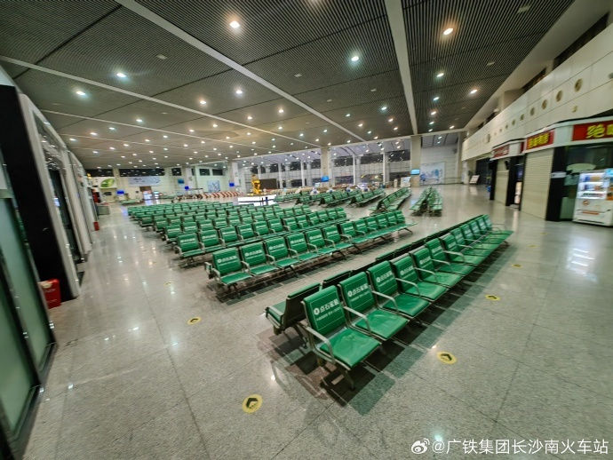

# 官方辟谣岳阳东站候车室全是按摩椅：占比13.5%，正常差异化服务

7月26日晚，就网友反映“岳阳东站候车室座椅全部换成按摩椅”的一事，@广铁集团长沙南火车站发布情况说明称，按摩椅占比13.5%，属于正常差异化服务经营范围。

关于网友反映“岳阳东站候车室座椅全部换成按摩椅”的情况说明表示：车站对此高度重视，经调查，岳阳东站二楼候车室有普通座椅1130张，按摩椅176张（占比13.5%），属于正常差异化服务经营范围。下一步，车站将进一步优化座椅布局，持续提升候车服务。欢迎广大旅客继续对铁路服务工作提出宝贵意见建议。

消息来源：@广铁集团长沙南火车站

编辑：唐文培

责编：吴忠兰

审核：冯飞

