# 日本法院判决儿子归江宏杰，江宏杰喊话福原爱放手：希望她配合

福原爱与江宏杰离婚新后续来了！

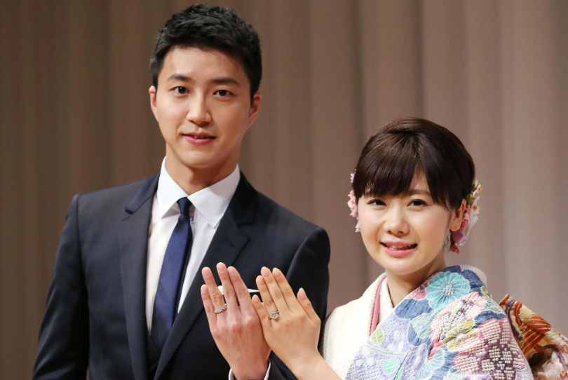

江宏杰召开记者会控诉福原爱，记者会主题也是Abduction（绑架），江宏杰先是跟大众道歉，并感谢大家聚集。接着全程围绕“要福原爱把孩子还回来”这一论点回应，他和律师团队称今年7月20日，日本法院裁判出炉，法院要求福原爱小姐将儿子交付给他的命令，希望福原爱尊重裁判决定，把儿子交还给他。法院保全命令出来后，福原爱应该立即执行，但福原爱并不同意执行，也没有沟通讲打算。

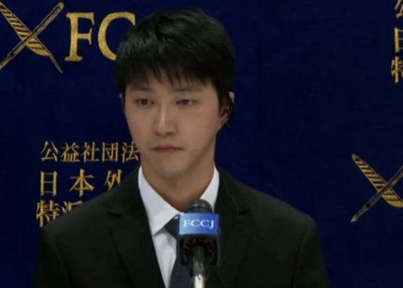

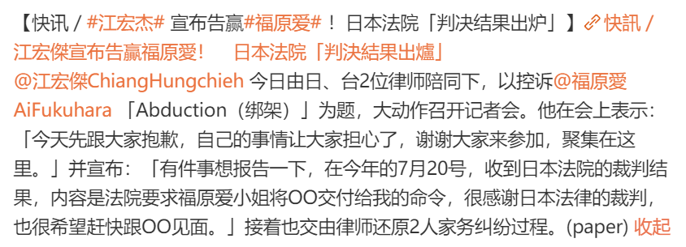

他们还称在宣布开记者会后，福原爱女士发了邮件和传真，要求终止记者发布会，但是在相关联系中，并没有提及跟江宏杰小孩相关信息，江先生不得不办发布会，要福原爱需要回顾自己的所作所为，看看自己做了哪些事情。

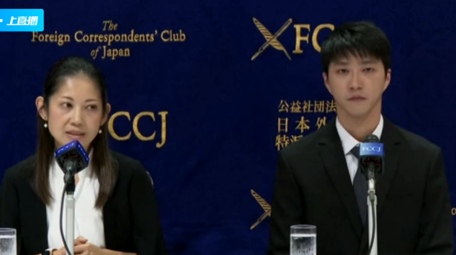

江宏杰在记者会上也哽咽落泪，他聘请的日本女律师发言时也一度哽咽，表示他们事发至今一直都有联络福原爱，但女方至今都没有回应，只好籍由记者会希望对方有所回应。会上也有讲法院的判决基于福原爱忙碌的工作情况，无法更好地照顾孩子。

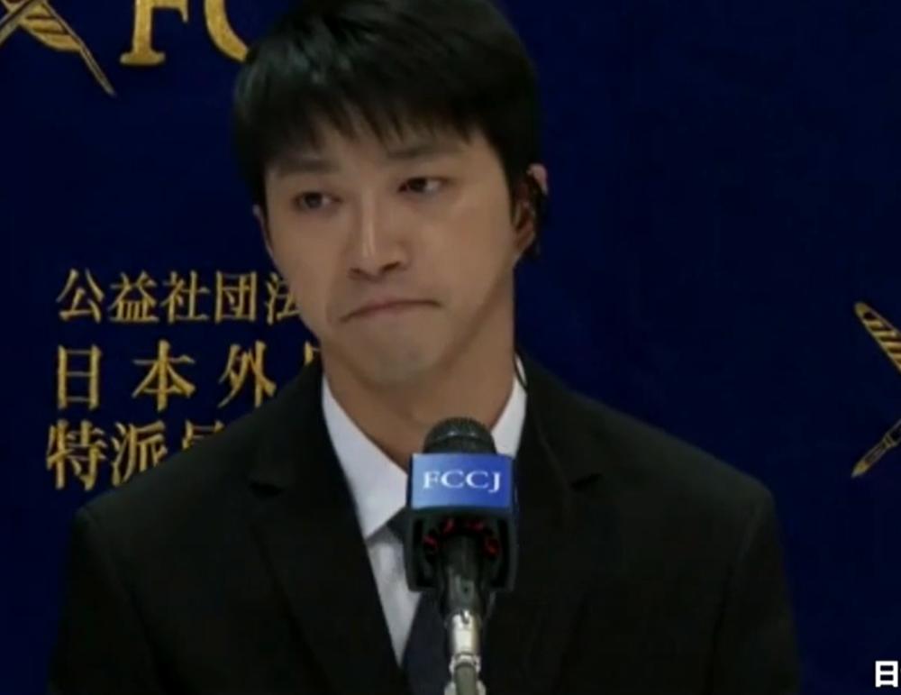

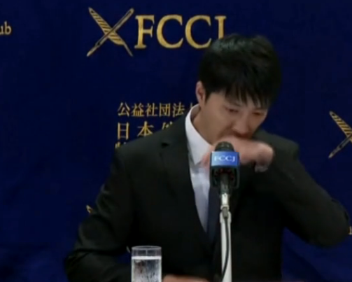

而对于自己和福原爱离婚的理由，江宏杰则拒绝回应：“关于我跟福原爱小姐离婚一段时间了，不方便再多说些什么今天的重点会是以判决来做回应。”

律师则称，福原爱疑似带着孩子去了新加坡，涉及逃避履行法院判决，希望她回日本执行判决，而他们也向法院申请了强制执行。

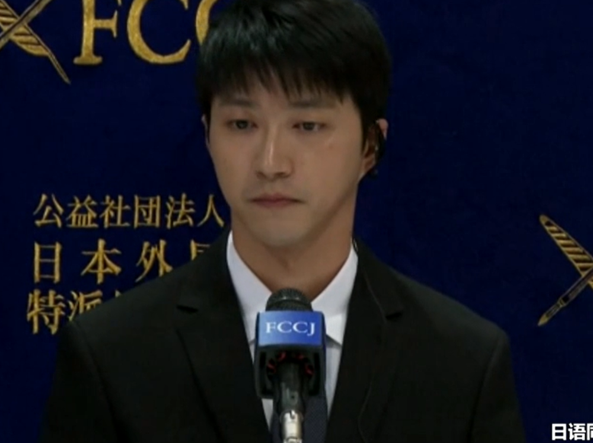

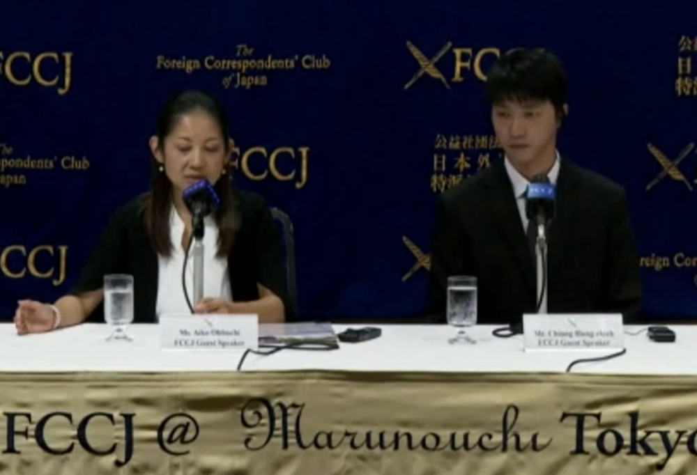

最后江宏杰表示自己不会放弃追回小孩，一定会努力到底。

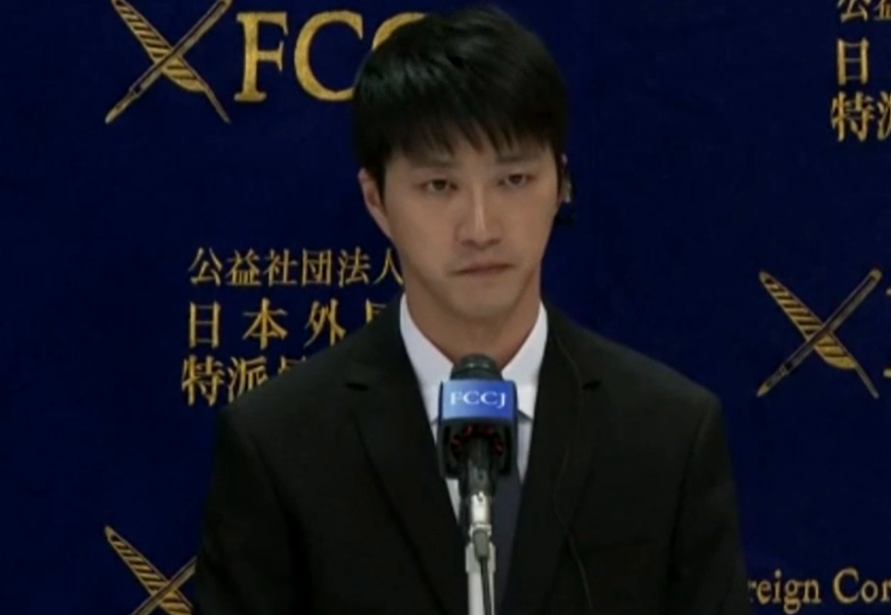

针对江宏杰宣布开记者会控诉福原爱，福原爱深夜发布中日两地律师联合声明，称3月27日开庭得知不得公开对外讨论本件家事事件，希望江宏杰切勿违反法官要求。同时，呼吁媒体遵守儿童权益保障法规定，不得报道有关未成年身份信息的内容及家事事件。

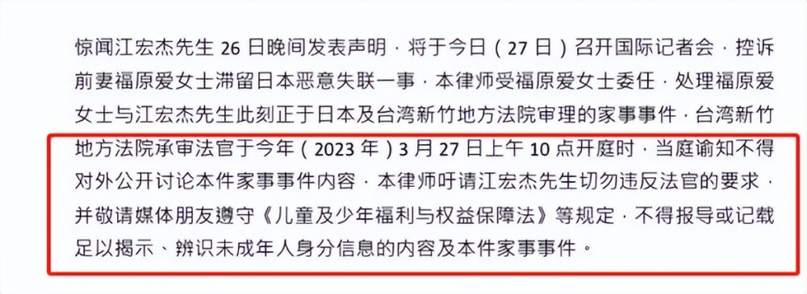

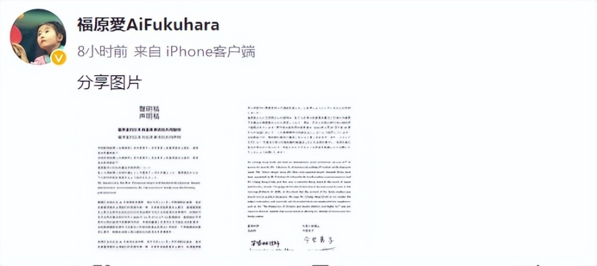

而江宏杰在受访中表示福原爱自去年7月带着儿子返回日本后，一直处于断联状态，自己一年多没有见到孩子，为了让福原爱履行她应该遵守的义务，并让大家知道福原爱究竟做了什么，才召开记者会。记者会采用中日双语进行，还有英文翻译。

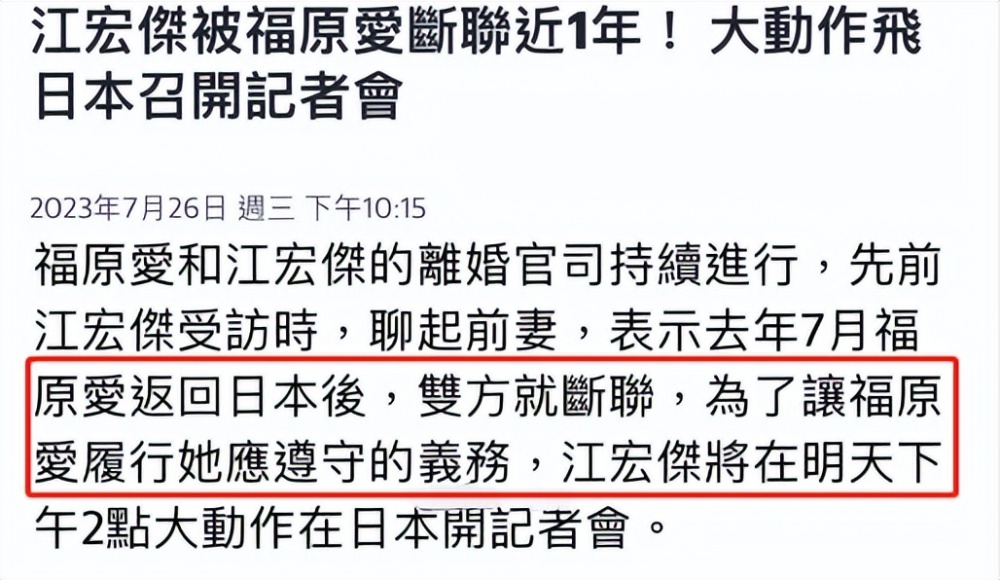

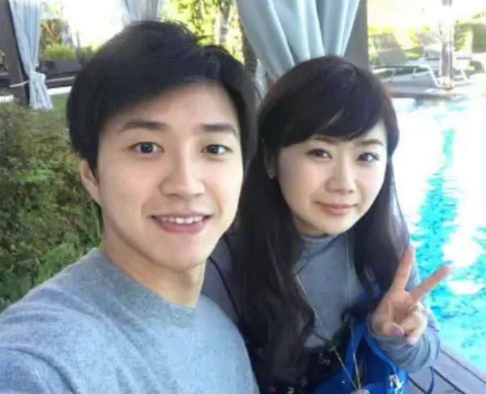

福原爱与江宏杰离婚后，双方矛盾是孩子争夺战。去年7月，福原爱与江宏杰在台湾省谈小孩抚养权问题，双方闹到找警察，后来福原爱带着儿子回日本，女儿留在台湾省。江宏杰立刻发文控诉福原爱在未告知的情况下带小孩失联，不是一个好妈妈。

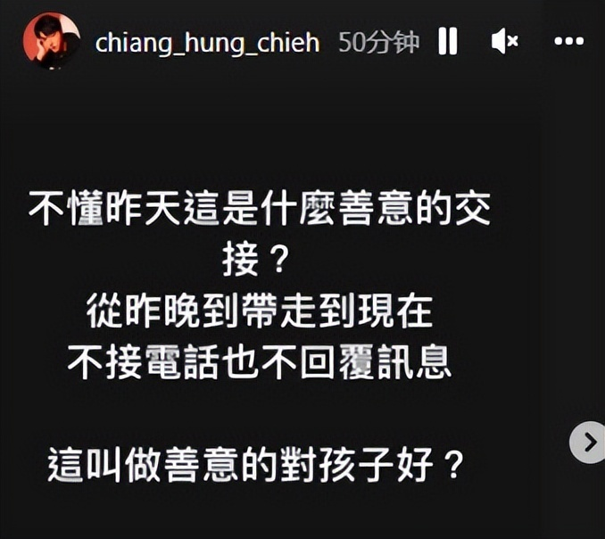

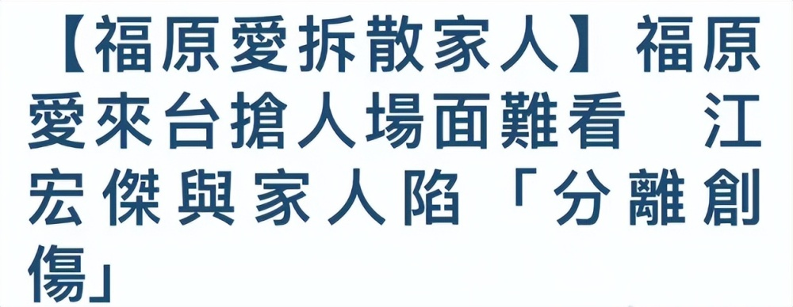

隔日，福原爱发长文指责江宏杰阻止她与小孩见面。据悉，江宏杰与福原爱婚姻维持了五年，生育有一儿一女，离婚约定的是共同监护，也规定了探视时间。但因为不顺利，福原爱向法院申请强制执行，要求他兑现共同监护约定，经由双方律师沟通，江宏杰同意福原爱带儿子去日本生活一段时间。而至于福原爱没有履行与江宏杰联络视讯谈话的约定，福原爱也有称当时在飞机上，下飞机后就解释了。

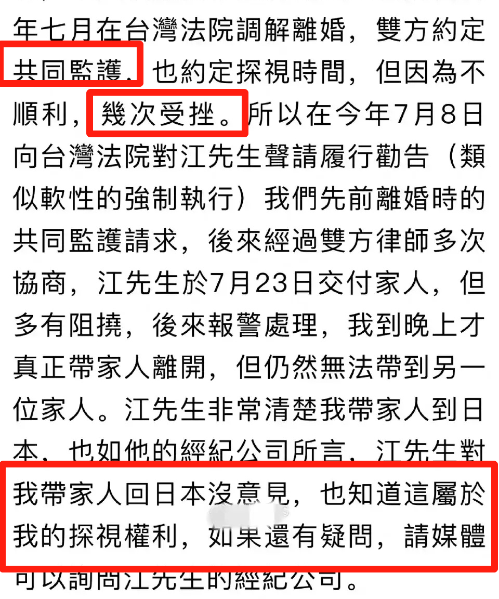

另外，也有说法称两个孩子的抚养权被法院判定归男方，但并没有看到公开报道。只有日媒称福原爱带孩子回日本后一年多不跟江宏杰联系，江宏杰准备用法律追索对孩子的抚养权。由此可见，抚养权归属还是一个谜。

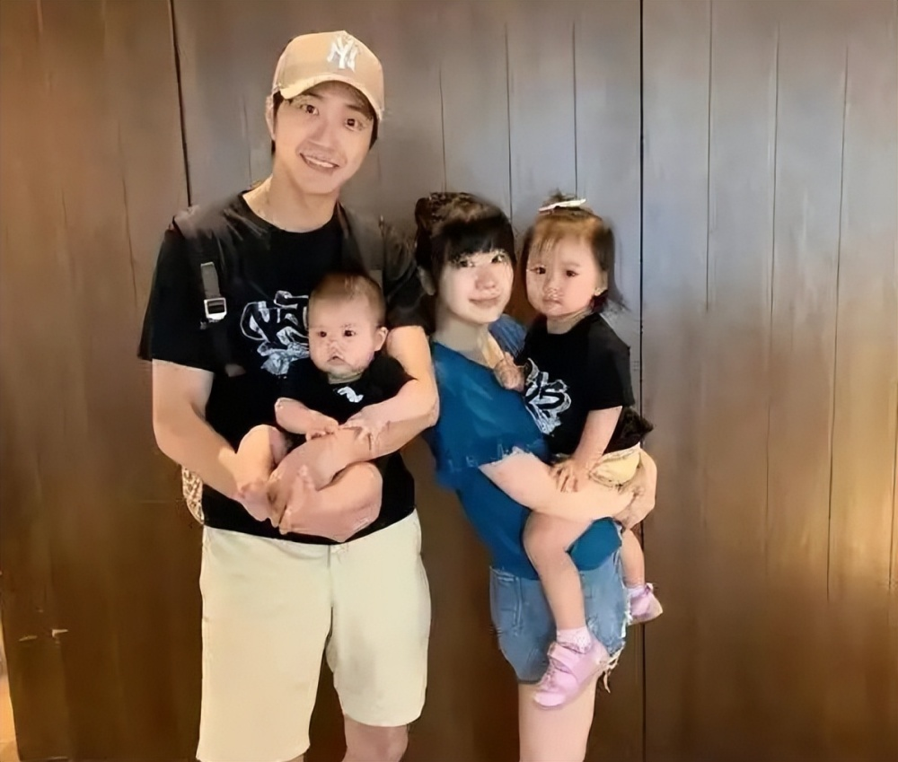

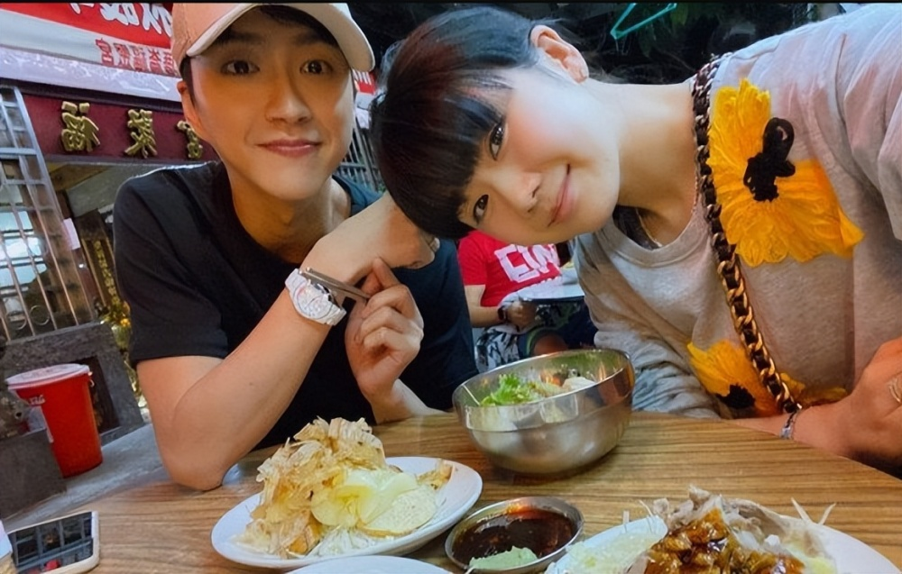

明星夫妻离婚，往往都会因为争夺孩子抚养权闹到台面上，无论如何，还是希望双方能顾及孩子隐私，尽量私下解决吧。

**本文未经授权严禁转载违者必究！**

