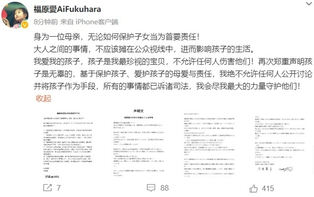
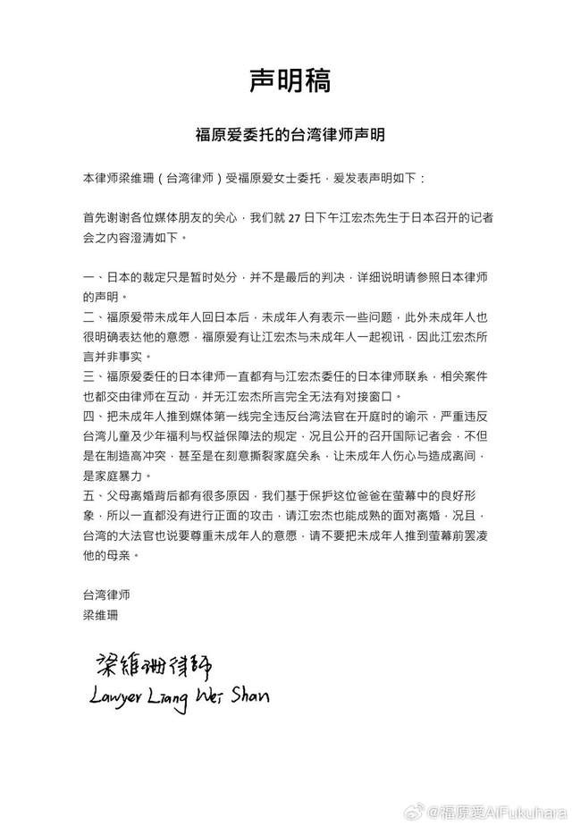
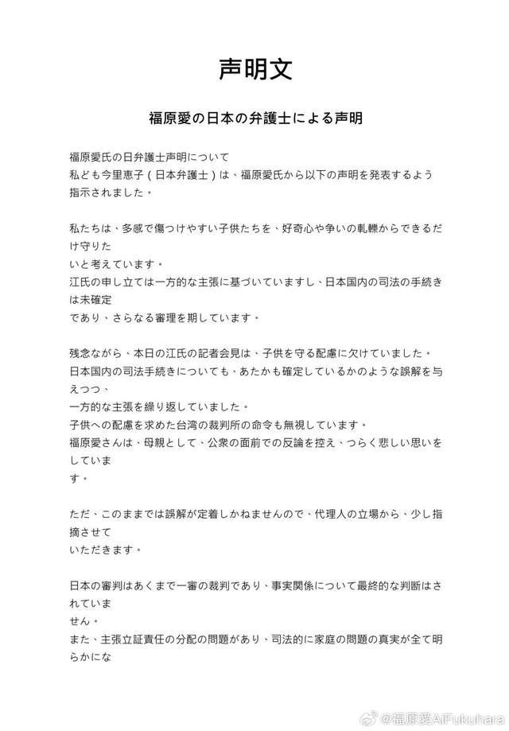
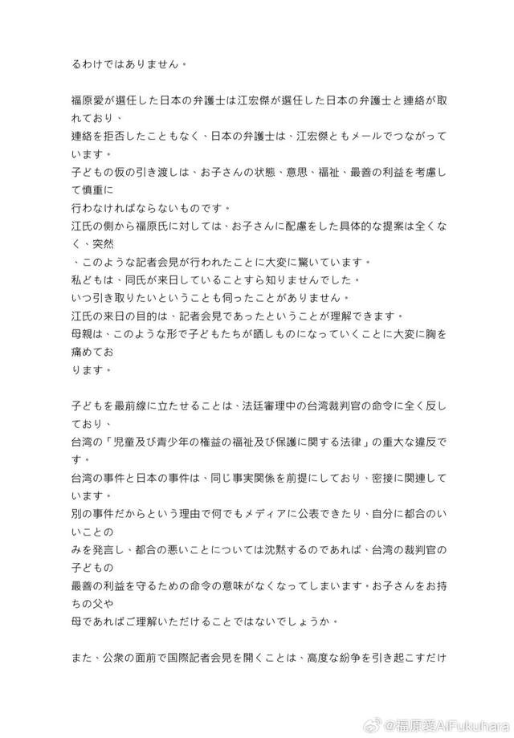
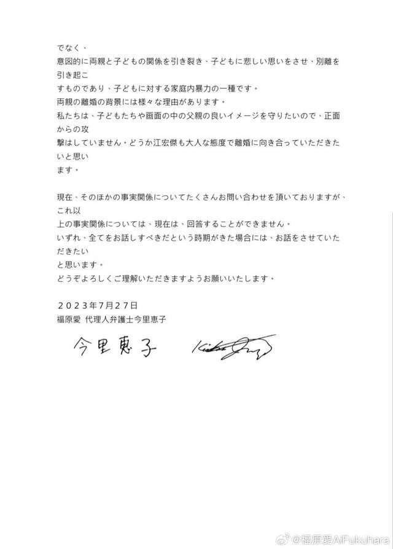

# 福原爱回应江宏杰控诉：绝不允许任何人公开讨论并将孩子作为手段

7月27日，福原爱发文：身为一位母亲，无论如何保护子女当为首要责任！大人之间的事情，不应该摊在公众视线中，进而影响孩子的生活。我爱我的孩子，孩子是我最珍视的宝贝，不允许任何人伤害他们！再次郑重声明孩子是无辜的，基于保护孩子、爱护孩子的母爱与责任，我绝不允许任何人公开讨论并将孩子作为手段，所有的事情都已诉诸司法，我会尽我最大的力量守护他们！

**【来源：当事人微博】**

**此前报道：**

日本法院判决儿子归江宏杰，江宏杰喊话福原爱放手：希望她配合

