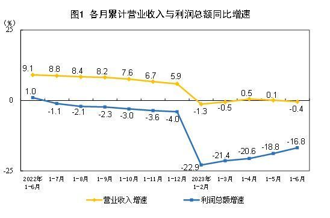
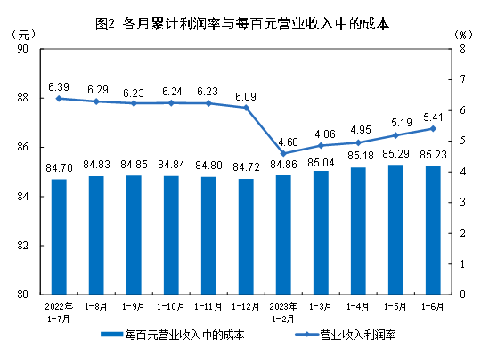
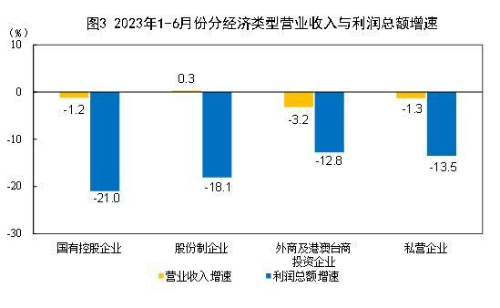

# 统计局：1-6月全国规模以上工业企业利润下降16.8%，降幅持续收窄

1—6月份，全国规模以上工业企业实现利润总额33884.6亿元，同比下降16.8%，降幅比1—5月份收窄2.0个百分点（按可比口径计算，详见附注二）。

1—6月份，规模以上工业企业中，国有控股企业实现利润总额12002.0亿元，同比下降21.0%；股份制企业实现利润总额24872.0亿元，下降18.1%；外商及港澳台商投资企业实现利润总额7966.8亿元，下降12.8%；私营企业实现利润总额8689.2亿元，下降13.5%。

1—6月份，采矿业实现利润总额6816.8亿元，同比下降19.9%；制造业实现利润总额23874.7亿元，下降20.0%；电力、热力、燃气及水生产和供应业实现利润总额3193.1亿元，增长34.1%。

1—6月份，在41个工业大类行业中，12个行业利润总额同比增长，29个行业下降。主要行业利润情况如下：电力、热力生产和供应业利润总额同比增长46.5%，电气机械和器材制造业增长29.1%，通用设备制造业增长17.9%，汽车制造业增长10.1%，专用设备制造业增长3.9%，石油和天然气开采业下降12.2%，煤炭开采和洗选业下降23.3%，纺织业下降23.8%，计算机、通信和其他电子设备制造业下降25.2%，非金属矿物制品业下降26.6%，农副食品加工业下降33.2%，有色金属冶炼和压延加工业下降44.0%，化学原料和化学制品制造业下降52.2%，石油、煤炭及其他燃料加工业下降92.3%，黑色金属冶炼和压延加工业下降97.6%。

1—6月份，规模以上工业企业实现营业收入62.62万亿元，同比下降0.4%；发生营业成本53.37万亿元，增长0.5%；营业收入利润率为5.41%，同比下降1.07个百分点。

6月末，规模以上工业企业资产总计160.31万亿元，同比增长6.6%；负债合计92.28万亿元，增长6.7%；所有者权益合计68.04万亿元，增长6.3%；资产负债率为57.6%，同比上升0.1个百分点。

6月末，规模以上工业企业应收账款22.72万亿元，同比增长10.6%；产成品存货6.05万亿元，增长2.2%。

1—6月份，规模以上工业企业每百元营业收入中的成本为85.23元，同比增加0.81元；每百元营业收入中的费用为8.34元，同比增加0.25元。

6月末，规模以上工业企业每百元资产实现的营业收入为79.1元，同比减少6.2元；人均营业收入为173.6万元，同比增加5.1万元；产成品存货周转天数为20.3天，同比增加1.1天；应收账款平均回收期为63.2天，同比增加6.4天。

6月份，规模以上工业企业实现利润总额7197.6亿元，同比下降8.3%。

**上半年工业企业利润降幅逐月收窄 6月份明显改善**

**——国家统计局工业司统计师孙晓解读工业企业利润数据**

今年以来，随着推动经济持续回升向好各项政策措施落地显效，工业生产稳步恢复，企业盈利逐月改善，工业企业效益状况呈现以下主要特点：

工业企业利润稳步恢复。6月份，全国规模以上工业企业利润同比下降8.3%，降幅较5月份收窄4.3个百分点。分季度看，二季度规上工业企业利润下降12.7%，降幅较一季度收窄8.7个百分点。上半年，规上工业企业利润同比下降16.8%，降幅较1—5月份、一季度分别收窄2.0、4.6个百分点，累计利润降幅自年初以来逐月收窄，工业企业利润稳步恢复。

七成以上行业盈利较一季度改善，制造业盈利改善明显。上半年，在41个工业大类行业中，有30个行业利润同比增速较一季度加快，或降幅收窄、由降转增，占比超七成。制造业带动工业企业利润改善作用较强。上半年，制造业利润降幅较一季度收窄9.4个百分点，带动规上工业利润降幅较一季度收窄7.4个百分点。

装备制造业累计利润增速由负转正。今年以来，高端装备制造产业培育壮大，绿色低碳产业发展势头强劲。上半年，装备制造业利润同比增长3.1%，实现由降转增，增速较一季度大幅回升20.8个百分点。装备制造业利润占规上工业的比重为34.3%，较一季度和上年同期分别提高6.8和6.7个百分点。分行业看，光伏设备、锂离子电池、新能源汽车、高铁车组等新产品生产快速增长，带动电气机械、汽车、铁路船舶航空航天运输设备行业利润分别增长29.1%、10.1%、35.3%；通用设备行业受产业链发展带动，利润增长17.9%。

消费品制造业利润加快回升。随着扩大内需政策措施发力显效，市场需求逐步释放，多数消费品制造行业利润改善。上半年，在13个主要消费品制造行业中，有10个行业利润同比降幅较一季度收窄或由降转增，占76.9%。6月份，消费品行业利润加快回升，有10个行业当月利润同比增长，较5月份增加5个，其中皮革制鞋行业利润同比增长1.07倍，化纤行业利润增长21.2%，家具、纺织服装、文教工美、医药行业利润分别增长7%—14%。

电气水行业利润持续增长。上半年，电力、热力、燃气及水生产和供应业利润同比增长34.1%，今年以来持续快速增长。其中，电力行业受国民经济持续恢复、迎峰度夏电力保供、可再生能源发电快速发展等因素带动，发电量持续增长，行业利润同比增长46.5%。

不同类型企业利润均有改善，小型、私营、外资企业改善明显。上半年，规模以上工业企业中，大型、中型、小型企业利润同比降幅较一季度分别收窄4.1、4.9和5.6个百分点，其中6月份小型企业利润同比由降转增。私营、外商及港澳台商投资企业利润降幅较一季度分别收窄9.5和12.1个百分点。

企业单位成本边际改善，利润率环比回升。随着上游矿产品价格持续下行，工业企业原料成本压力有所缓解，助推企业单位成本边际改善。6月份，规上工业企业每百元营业收入中的成本较5月份减少0.83元；营业收入利润率为6.44%，较5月份提高0.27个百分点。

总体看，工业企业利润延续恢复态势。下阶段，要坚决贯彻党中央、国务院决策部署，科学精准实施宏观政策，着力扩大有效需求，提高产销衔接水平，激发经营主体活力，培育壮大发展新动能，推动工业经济高质量发展。

**附注**

一、指标解释及相关说明

1、利润总额：指企业在生产经营过程中各种收入扣除各种耗费后的盈余，反映企业在报告期内实现的盈亏总额。

2、营业收入：指企业从事销售商品、提供劳务和让渡资产使用权等生产经营活动形成的经济利益流入。包括主营业务收入和其他业务收入。

3、营业成本：指企业从事销售商品、提供劳务和让渡资产使用权等生产经营活动发生的实际成本。包括主营业务成本和其他业务成本。营业成本应当与营业收入进行配比。

4、资产总计：指企业过去的交易或者事项形成的、由企业拥有或者控制的、预期会给企业带来经济利益的资源。

5、负债合计：指企业过去的交易或者事项形成的、预期会导致经济利益流出企业的现时义务。

6、所有者权益合计：指企业资产扣除负债后由所有者享有的剩余权益。

7、应收账款：指资产负债表日以摊余成本计量的，企业因销售商品、提供服务等经营活动应收取的款项。

8、产成品存货：指企业报告期末已经加工生产并完成全部生产过程、可以对外销售的制成产品。

9、营业收入利润率=利润总额÷营业收入×100%，单位：%。

10、每百元营业收入中的成本=营业成本÷营业收入×100，单位：元。

11、每百元营业收入中的费用=（销售费用+管理费用+研发费用+财务费用）÷营业收入×100，单位：元。

12、每百元资产实现的营业收入=营业收入÷平均资产÷累计月数×12×100，单位：元。

13、人均营业收入=营业收入÷平均用工人数÷累计月数×12，单位：万元/人。

14、资产负债率=负债合计÷资产总计×100%，单位：%。

15、产成品存货周转天数=360×平均产成品存货÷营业成本×累计月数÷12，单位：天。

16、应收账款平均回收期=360×平均应收账款÷营业收入×累计月数÷12，单位：天。

17、在各表的利润总额同比增长栏中，标“注”的表示上年同期利润总额为负数，即亏损；数值为正数的表明利润同比增长；数值在至-100%之间（不含）的表明利润同比下降；下降幅度超过100%的表明由上年同期盈利转为本期亏损；数值为的表明利润同比持平。

18、在主要分组中，国有控股企业包括国有绝对控股企业和国有相对控股（含协议控股）企业等。外商及港澳台商投资企业包括中外（或与港澳台资）合资经营企业、合作经营企业及外资（或港澳台资）的股东占公司注册资本比例达25%以上的股份有限公司等。私营企业包括私营有限责任公司、私营股份有限公司、私营合伙企业和私营独资企业等。

二、规模以上工业企业利润总额、营业收入等指标的增速均按可比口径计算。报告期数据与上年所公布的同指标数据之间有不可比因素，不能直接相比计算增速。其主要原因是：（一）根据统计制度，每年定期对规模以上工业企业调查范围进行调整。每年有部分企业达到规模标准纳入调查范围，也有部分企业因规模变小而退出调查范围，还有新建投产企业、破产、注（吊）销企业等变化。（二）加强统计执法，对统计执法检查中发现的不符合规模以上工业统计要求的企业进行了清理，对相关基数依规进行了修正。（三）加强数据质量管理，剔除跨地区、跨行业重复统计数据。

三、统计范围

规模以上工业企业，即年主营业务收入为2000万元及以上的工业法人单位。

四、调查方法

规模以上工业企业财务状况报表按月进行全面调查（1月份数据免报）。

五、行业分类标准

执行国民经济行业分类标准（GB/T4754-2017）。

