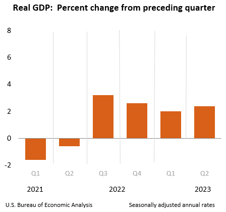
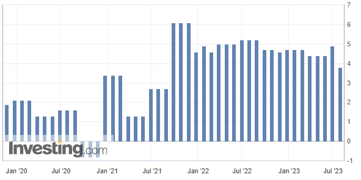

# 软着陆有戏？美国二季度GDP意外加速 通胀指标也超预期走低

**财联社7月27日讯（编辑 赵昊）** 周四（7月27日）美股盘前，美国商务部经济分析局公布的最新数据显示，美国第二季度经济增速强于市场预期。

具体数据显示，美国第二季度实际国内生产总值（GDP）首发预估值年化环比上升2.4%，较第一季度的2%高出了0.4个百分点，市场原先预计会放缓至1.8%。

美国商务部通常会根据不断完善的信息对季度经济数据进行三次估算，本次数据的修正值（第二次估算）将于8月30日公布。

与其他国家不同，美国将实际GDP年化季率作为最通用的衡量经济增长的指标，因认为其更能反映出经济的趋势。

若使用传统的同比增幅，美国第二季度GDP的同比增速则为2.6%，高于一季度1.8%的涨幅。

分项数据中，第二季度实际个人消费支出初值年化环比上升1.6%，虽不及第一季度的4.2%，但强于市场预期的1.2%；第二季度核心PCE物价指数年化环比上升3.8%，低于市场预期的4%。

核心PCE物价指数年化季率

市场分析称，表面上看这份GDP数据反映出经济非常有弹性，对正在寻求软着陆的美联储来说是件好事。一方面，如果今年秋天需要的话，美联储可以进一步加息，但另一方面来看，美联储迄今实施的紧缩政策并没有带来太多的降温。

昨日，美联储如期宣布加息25个基点，令联邦基金利率目标区间已升至5.25%-5.5%，为2001年以来的最高水平。这是美联储自去年启动本轮加息进程以来的第11次加息，累计幅度达到了525个基点。

美国无党派组织国会预算办公室（CBO）认为，尽管利率上升和失业率上升给消费者带来压力，但美国经济仍将积聚足够多的力量，从而避免陷入衰退。CBO预计，今年下半年美国GDP折合成年率将增长0.4%，2024年及之后一年将稳步改善。

联邦公开市场委员会（FOMC）在声明中写道，近期的指标表明美国的经济活动一直在以温和的速度扩张，近几个月的就业岗位增幅强劲，失业率保持在较低的水平，银行体系稳健而富有弹性。

同一时间公布的美国上周首次申领失业金人数录得22.1万人，低于市场预期的23.5万人和前值的22.8万人，另外持续申请失业金人数也有所下降，这组高频数据表明就业市场确实如美联储所述的那般强劲。

（财联社 赵昊）

