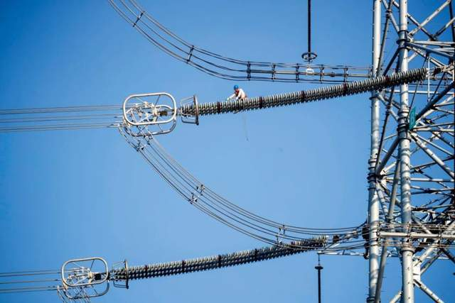
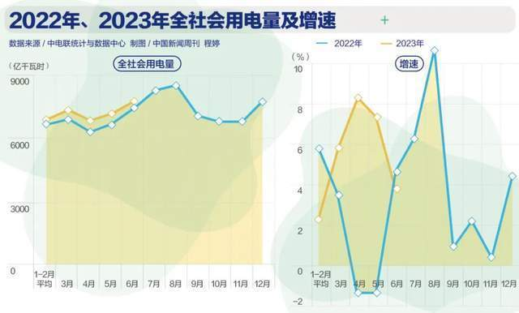

# 这个夏天还会闹“电荒”吗？

假如上海发生大停电事故，这座超大城市会经历什么？

国家电网上海电力将紧急调用、启动应急电源，组织出动应急救援队伍和应急发电车，为重点用户和重要场所提供应急供电；上海市应急处置指挥部将紧急调配救护车、消防车、电力应急发电车赶往石油化工企业，防止发生衍生事故；受停电影响的医院会紧急启动自备应急电源保障手术室、ICU等核心负荷供电，停运地铁线路的工作人员要按照预案指挥引导乘客有序疏散撤离⋯⋯

此外，南方电网也会“派电增援”。南方电网会紧急调动南方区域相关电网和发电资源增援华东，由国家电网福建电力电网组织电厂跨区受电，全力保障满送华东主网。

所幸，这并非真实事件，而是今年6月15日华东区域跨省区大面积停电事件应急演练的场景。此次演练是国家能源局首次举办的跨省区大面积停电事件应急演练。华东电网是我国规模最大、电压等级最高的区域电网，其安全稳定运行和电力可靠供应，对华东乃至全国经济高质量发展至关重要。

但回到真实世界，过去两年，中国不少省份都在下半年出现了大规模缺电事件。水电大省四川2022年8月在高温干旱下严重缺电，而2021年下半年至少有20个省份采取限电措施，东北地区红绿灯无法运行的场景也让人印象深刻。

_2022年8月19日，四川成都市实行“限电令”，春熙路关闭了大量的照明与户外显示器，一名外卖员行走在商场外的坡道上。图/视觉中国_

“电荒”焦虑延续至今已是第三年。今年是经济复苏的关键期，各级政府和电力部门早已对夏季缺电问题提高戒备。7月14日的国务院常务会议强调要加强高峰时段重点地区电力保供，坚决防范遏制重特大事故发生。

连续两年“缺电”某种程度上导致今年的焦虑被放大，即使今年不会大面积“缺电”，“缺电”焦虑背后的原因仍然需要被认真审视。

**负荷创纪录，但今年很平静**

今年夏天会缺电吗？这个“盲盒”现在还没开完。

“正常气候情况下，预计今年全国最高用电负荷13.7亿千瓦左右，比2022年增加8000万千瓦左右。若出现长时段大范围极端气候，则全国最高用电负荷可能比2022年增加1亿千瓦左右。”中国电力企业联合会统计与数据中心主任王益烜此前对外透露。

增加的1亿千瓦，会变成用电缺口吗？这是这个夏天中国在能源领域面临的最大挑战，要极力避免前两年的困境重演。

广东电力行业资深人士蒋科（化名）至今仍对两年前的那场“电荒”印象深刻。2021年8月以来，广东、江苏、内蒙古等多个省份相继出台限停电政策。在那场席卷20余个省份的“电荒”中，广东位于风暴中心。“2021年，电力供应缺口过大，广东来不及启动需求响应、有序用电，加之当时出口增长迅速，鲜有工业企业愿意主动减少用电，只能粗暴地拉闸限电。”蒋科告诉《中国新闻周刊》。

转年8月中旬，时任国务院副总理韩正到国家电网调研，强调做深做实有序用电方案，确保民生、公共服务和重点行业安全用电，坚决防止拉闸限电。在蒋科的记忆中，2022年广东只启动过次数有限的需求响应。

每当电力供应面临缺口，需要压降负荷，各地一般会采取分级管理措施。

 _送变电检修人员对特高压线路进行走线检查，确保华东电网安全可靠供电。图/中新_

首先会启动需求响应，给予主动减少用电的用户补偿。如果电力供应仍难平衡，便会启动有序用电，按照能耗等指标将企业划分为ABCD四类，根据压降负荷的需要，从D类企业开始限电，实质是有计划的拉闸限电。需求响应、有序用电、拉闸限电，选择哪种应对措施以及启用次数，被视为衡量电力供需紧张程度最直观的指标。

但在更注重采用需求响应、有序用电的2022年，“缺电”的焦虑并未消失。据国家气候中心监测评估，截至8月中旬，当年6月13日开始的区域性高温事件综合强度便已达到1961年有完整气象观测记录以来最强。高温的另一面是干旱，当年7月以来，长江流域降水量较常年同期减少四成。

高温与干旱给电力系统造成的压力，在四川得到极致体现。一方面，高温推动四川最高用电负荷超过6000万千瓦，同比增长25％；另一方面，四川水电发电能力却下降超过一半。电力缺口一度达到2000万千瓦。

2023年，整个北半球的夏天，高温屡创纪录。高温天气甚至比去年来得更早，5月以来，全国多地频繁出现40℃高温天气，各地负荷高峰提前到来。

7月3日上午10时46分，浙江电网用电负荷突破1亿千瓦。13时19分，用电负荷再次破亿，达到1.02亿千瓦，创历史新高。这是浙江电网历史上迎峰度夏最早进入负荷破亿阶段，较2022年提早了8天，成为继广东、江苏之后第三个夏季最高用电负荷超过1亿千瓦的省份。浙江省能源局预测，今年迎峰度夏期间，浙江全社会最高负荷将达到1.15亿千瓦，同比增长10％以上。

极端气候会否像去年一样导致电力供需紧张？中国电力企业联合会给出了审慎的预测，主要是南方、华东、华中区域电力供需形势偏紧。

一些省份发布了迎峰度夏电力缺口预测。国家能源局四川监管办公室（下称“四川能监办”）6月底预测，四川电力缺口约750万千瓦。山东省发改委也认为，考虑极端情况，迎峰度夏晚高峰可能存在约1000万千瓦供需缺口。

但是在中国第一用电大省、去年全社会用电量达7870亿千瓦时的广东，电力供需形势却不像外界想象的那般紧张。“对于缺口的预测有夸大的成分，当然，预测时一般会做最坏打算。”江丰（化名）是广东一家售电公司负责人，他向《中国新闻周刊》直言，广东今年甚至可能不存在“迎峰度夏”的概念。

尽管广东所属的南方电网在今年5月22日最高负荷便突破两亿千瓦，比去年提前35天。此后，更是在7月10日、11日连续两天打破最高统调负荷的历史纪录。但蒋科告诉记者，2021年5月，广东曾进行了十余次需求响应，但是今年直到7月底都没有启动过一次需求响应。“说明占比较大的工商业电力供需形势相对宽松，除非出现一些黑天鹅事件。”

广东电力现货市场的价格也能够佐证这样的观点。2015年3月出台《中共中央国务院关于进一步深化电力体制改革的若干意见》（“9号文”）启动新一轮电改后，工商业用电由过去电网企业从发电企业采购，再按照目录电价出售给用户的“统购统销”模式，逐步改变为发电企业与售电公司或工商业用户直接市场化交易的“点对点”模式，既可以签订年度中长期协议以固定价格购电，也可以通过现货市场实时购电。

作为一家售电公司的电力交易操盘手，李清（化名）很熟悉电力现货市场的价格走势，在他看来，这是判断广东电力供需紧张程度的最好指标。2021年，广东电力现货市场价格曾高达每度电1.5元，而今年7月底一个闷热的午后，李清查询到的价格是0.35元/千瓦时。

“现货价格能够反映市场真实的供需情况，一般而言，每年七八九三个月电力现货市场价格较高，如去年7月底、8月初，现货价格接近1元/千瓦时，持续一两周时间，体现了迎峰度夏的供需压力。”李清说，缺电时的现货价格至少要达到每度电八九毛钱，而当前每度电0.35元的价格甚至低于去年年底签订的中长期协议电价。

实时现货价格维持在低位的不仅有广东，作为国内较为成熟的电力现货市场，山西、山东6月实时现货交易均价分别为0.358元/千瓦时、0.379元/千瓦时。

有些出人意料的供需形势部分源自需求的疲软。“从四五月份开始，工业企业用电量明显减少，需求整体疲软。”这几乎是用户侧一致的判断。

从蒋科接触的工商业企业用户来看，相比于去年，一些商业用户，如商业综合体用电需求上涨。但是工业企业用电需求几乎没有增长，甚至出现负增长，一些钢铁、水泥等用电大户今年用电量直接减半，部分小企业甚至直接在蒋科的客户名单中消失。

**真的缺电吗？**

除去需求疲软的因素，受访者普遍认为，即使是“拉闸限电”的2021年，像广东这样的负荷大省实际上也并不真正“缺电”。

“2021年电力供需紧张并非因为缺少装机，而是电煤价格高企，作为广东主力电源的煤电机组无法向下游疏导成本，发电积极性受挫所致。”江丰告诉记者，电厂会以机械故障等名目进行检修，政府则会给发电企业负责人开会，要求其提高政治站位。

当时售电公司、用户与发电企业签订的中长期协议一般不会超过标杆电价0.463元/千瓦时，2020年年底所达成的2021年中长期协议的电价多在标杆电价基础上降价4~5分钱，低至0.41元/千瓦时，已经无法覆盖成本，“电厂发一度亏一度。”

为了应对电厂的大面积亏损，2021年10月，《国家发展改革委关于进一步深化燃煤发电上网电价市场化改革的通知》对外发布，提出将市场交易电价上下浮动范围，从上浮不超过10％、下浮原则上不超过15％，扩大为上下浮动原则上均不超过20％，高耗能企业市场交易电价不受上浮20％限制。电力现货价格不受上述幅度限制。将上浮幅度从10％调高至20％，被认为是理顺煤电机组成本传导的关键。

同时，电煤价格也在今年进一步回落。“目前广东港动力煤价格约为900元/吨，同比降幅达到百分之三四十，电厂每度电的发电成本仅有三四毛钱。目前市场交易电价可以达到0.55元/千瓦时，而且相较去年，售电公司、用户与电厂签约的电价每度反而上涨0.05元，发电企业度电的利润空间甚至可能超过0.1元。电厂‘发一度赚一度’。”江丰分析。

按照江丰的判断，只要发电企业发电意愿不存在问题，广东电力供需便不会紧张，因为广东装机量与负荷可以匹配，特别是其中的火电装机。从去年的数据看，广东火电发电量为4440.7万千瓦时，占全省发电量的72.8％。

虽然大规模“缺电”可能不会出现，但是与去年类似，部分重点地区、高峰时点的缺口仍然存在。九州能源公司董事长张传名告诉《中国新闻周刊》，2022年限电，本质上是电网缺乏储能能力与足够可调节资源导致的个别问题，并非普遍情况。

“2021年的情况是‘有电不能用’，2022年的情况则是‘无电可用’。”有电网人士告诉记者，缺电可以分为两个层面：首先，是否缺少装机，即是否存在装机“硬缺口”；其次，如果不存在“硬缺口”，就要考虑发电企业是否有发电积极性。“其实电力系统投资通常会超前3~4年，各个省份可能都不会存在装机‘硬缺口’，去年四川供需矛盾尖锐，属于受极端气候影响，也是原本足够的装机无法发电，同时缺少可调节的‘兜底电源’。”

**火电薄弱省份更容易出现供需矛盾**

四川的电源结构中，水电占比较高，可调节电源不足，导致其“缺电”的尴尬延续至今年。四川重工业已经传出限电消息，中国水泥网7月称，四川多家水泥企业近期接到相关部门通知，水泥行业7月5日至8月10日实行生产调控，水泥熟料生产企业全部停窑。

今年5月，四川能监办曾预测，四川今夏整体呈现“全省紧平衡、高峰有缺口”特点，问题的症结是“顶峰兜底电源提升有限”。

四川是水力发电大省，水电装机容量占其全部装机容量接近80％，但约有一半为无调节能力的径流式水电，直接受制于来水，“靠天吃饭”特征明显。

今年，云贵川汛期仍缺水，可能会是大概率事件。国家统计局公布的数据显示，今年上半年，所有类型的发电量中，只有水电同比下降22.9％。分月看，4月全国规模以上水电发电量同比下降25.9％；5月水电生产延续下降趋势，同比降幅扩大至32.9％。

其中，水电大省四川4月水电发电量同比下降11.9％，5月同比降幅扩大至24.4％。云南的情况也不容乐观，4月水电发电量同比下降41.9％，5月同比降幅达43.1％。云南水电已连续三个月出现同比下降，且降幅逐月扩大。贵州4月水电发电量仅有22.6亿千瓦时，同比下滑超五成。5月进一步扩大，同比下滑62.6％。

相比水电，光伏、风电等新能源“靠天吃饭”的特征更为显著，其间歇性、波动性造成的“缺电”考验更大。“下午四点之后，太阳逐渐落山，光伏出力迅速下滑，但是傍晚正是居民负荷上升的时段，这时就需要其他可调节电源迅速顶上。”前述电网人士表示。

作为光伏装机规模位居全国首位的山东，已经感受到这样的压力。山东省发改委分析，综合来看，山东用电在中午高峰期间，光伏支撑有力，电力供需基本平衡。考虑极端情况，迎峰度夏晚高峰可能存在约1000万千瓦供需缺口。

当前，山东已通过分时电价政策，引导电力用户削峰填谷。从今年开始，山东省将春季白天10时至15时调整为谷段电价，使一些用电大户将用电负荷由过去的夜间转移至白天的时段。但是更重要的还是需要可调节电源在光伏出力下滑时顶峰发电。

作为可调节电源，在水电预期出力不足的情况下，四川希望煤电发挥“兜底”作用。四川能监办表示，国能四川公司和华电四川公司在运火电装机占全川统调燃煤火电总装机的80％，是四川电网能源保供的重要支撑。

显然，煤电机组能否正常运转对于保供举足轻重。有浙江电网人士向记者举例说，去年迎峰度夏，浙江最高负荷突破1.1亿千瓦，三季度已降至7000多万千瓦，但是供需依然紧张。原因便是夏季火电机组经历高温之下的高负荷率运行，长期保持在95％左右，为准备
“迎峰度冬”进行检修，导致全省供电能力下降，因此即使负荷下降，电力供需依然紧张。

有电网调度人士向记者坦言，近年火电机组并未大规模扩建，新能源装机量却迅速上升，但是新能源具有间歇性、波动性，导致一些火电装机较为薄弱的省份出现供需矛盾。

他向记者对比了浙江与江苏的电源结构，两省负荷基本相当，浙江煤电装机约为4700万千瓦，占比三分之一，而江苏火电装机比浙江多出近50％。这使得浙江相比江苏更加依靠外来电这样的不可控电源，占比高达三分之一，而外来电在江苏的电源占比不足20％。

“相关部门决策者的观念也在转变，火电机组的兜底作用受到重视。”有电网人士向记者指出。

“2021年煤电以不足50％的装机占比，生产了全国60％的电量，承担了70％的顶峰任务，发挥了保障电力安全稳定供应的‘顶梁柱’和‘压舱石’作用。”国家能源局副局长余兵2022年4月在全国煤电“三改联动”典型案例和技术推介会上说。

_由于新能源具有间歇性、波动性，导致一些火电装机较为薄弱的省份出现供需矛盾。图/视觉中国_

**重估电力安全**

“由于‘十三五’期间煤电供给侧结构性改革政策，东部省份新增煤电机组核准受限，即使一些百万千瓦级煤电机组已经建成，也只能作为应急备用机组，而非正常发电机组。因此‘十三五’期间，东部省份新增煤电机组核准几乎没有，投产也极少。”华北电力大学经济与管理学院教授袁家海告诉《中国新闻周刊》，其实从2019年开始，一些省份已经出现迎峰度夏尖峰时段变长的问题。

电力系统由源（电源）、网（电网）、荷（负荷）、储（储能）四个方面构成。过去，煤电机组可调空间较大，可以根据负荷侧需求随时调整。但是伴随着新能源装机量上升，电源侧变得愈发不可控，需要加入储能这样的可调节资源。

“鉴于储能的商业模式尚未建立，目前手中真正可用的调节资源，主要就是火电机组。”前述电网人士告诉记者。

“‘十四五’期间规划的气电（燃气发电）新增装机量超过700万千瓦，争取到的煤电新增装机量也从632万千瓦增至1032万千瓦。2022年浙江电力缺口超过1000万千瓦，正是由于四川旱情加剧浙江保供压力，国家与浙江两个层面都在推动煤电纳入规划，因此‘十四五’期间额外争取到400万千瓦煤电，目的就是发挥煤电‘兜底’作用。”有浙江电网人士向记者透露。

浙江并非孤例，重估煤电价值之后，一些东部、中部省份纷纷自去年起核准煤电项目。

这改变了“十三五”期间火电的境遇。据中电联统计，2016年至2020年期间，国内火电投资额从1174亿元下滑至553亿元，下滑的趋势直到2021年年底。

去年新核准的煤电涉及18个省份，其中广东（1818万千瓦）、江苏（1212万千瓦）、安徽（828万千瓦）、江西（802万千瓦）、河南（735万千瓦）、河北（606万千瓦）、浙江（532万千瓦）和广西（532万千瓦）八省新核准煤电装机总量超过500万千瓦，全部超过各自在“十三五”期间合计核准新增的煤电总装机总量。

在这82个煤电项目中，共有57个项目在官方文件中公开了建设原因，出现频次最多的目的便是“保障电力安全供应”。

广东2022年核准的煤电装机超过1000万千瓦。

前述广东电力行业资深人士向记者解释说，2022年集中核准的煤电项目，大概要等待3年、也就是2025年才会陆续投产。“一方面这是2021年三季度‘缺电’后的应激反应；另一方面尽管现有煤电装机可以匹配现有需求，但余量不大，尽管今年工业负荷疲软，一旦工业负荷迅速增长，可能难以满足需求。”

袁家海认为，各地核准煤电装机的直接动因是2021年三季度大范围“缺电”，让政府认识到电力安全的重要性。

但是上马煤电项目用于兜底保供的经济性也存在争议。

“地方政府正在催促发电企业加快新增煤电机组投资进度，但是企业投资的积极性并不高，主要原因是经济性较差，如果预期一台煤电机组每年只发电几百小时，更多用于负荷尖峰时段，发电企业的投资积极性自然不会高。”有发电企业相关负责人曾到华东地区调研发现，去年迎峰度夏，“一共只停了十几个小时的电”。

有电网人士向记者直言，火电机组过去会按照最经济的方式运行，如今的作用可能更多是兜底，必然会抬高火电机组运行成本。“目前发电企业的负面情绪比较重，导致网与源的矛盾逐渐尖锐。”

其实，这样的矛盾此前在云南这样的水电大省已经显现。受成本更低的水电挤压，“十二五”期间，云南火电利用小时数极低，从2010年的4855小时下降至2015年的1550小时，火电企业亏损严重，“十二五”累计亏损额超过100亿元。

云南今年在全国率先提出建立煤电调节容量市场，按照各类电源、用户的不同需求分摊调节容量成本。所谓“容量成本”可以理解为一台机组为了兜底保供而存在，其在不发电时付出的沉默成本。

在电力市场尚不完善的情况下，有长期关注电力市场改革的学者告诉《中国新闻周刊》，迎峰度夏电力缺口实际造成的影响可能并非人们想象的那么大，但是目前似乎对此前电荒的过度反应，而忽视成本。而且解决当下的电力供需紧张，关键是如何向市场要电。

**如何向市场要电**

在不同省份的迎峰度夏保供方案中，都不乏需求侧管理的内容，也就是要求用户“节电”。

国网浙江电力今年新增加了“空调负荷”以及“移峰填谷”两项新内容。国网浙江电力回复《中国新闻周刊》称，目前，浙江空调负荷约占全社会用电负荷的33％。今年迎峰度夏期间，将通过远程柔性调控和大数据监测管控两种方式开展空调负荷调控工作。这样的调控主要针对公共机构、商业楼宇等公共场所。

“如果居民空调负荷可以通过温度控制，可以避免全部由工业企业买单的情况。”有地方供电局人士表示。

但无论是工商业用户，还是居民用户，似乎都缺少足够的价格刺激。

袁家海告诉记者，尽管工商业用电已经取消目录电价，但是中长期协议电价某种程度仍然起到目录电价作用，一般在每年年底签订明年的中长期协议，固定电价无法反映电力供应紧张时用电成本上升，如果中长期协议电价与现货价格差异较大，就无法起到通过价格信号激励工商业用户优化用电行为的作用。

在市场化交易的电量中，长协与现货的比例一直是争议的焦点。前述售电公司负责人告诉记者，为了发挥中长期协议“压舱石”的作用，国家能源局将其在电力市场中的占比确定在80％~90％之间，现货交易约占10％左右。“从规则制定者的角度而言，希望电力市场平稳过渡，如果现货交易比例过高，势必造成一些电厂、售电公司‘搏杀’现货，可能导致价格忽高忽低。”他认为，当下电力市场建设的目标不是扩大现货市场的规模，而是完善规则。

而更大的矛盾可能在于当前“计划电”与“市场电”并存的格局。

电改在工商业用户一侧的推进速度，要远快于居民、农业用户一侧的改革。2021年10月发布的“1439号文”提出，有序推动全部工商业用户进入市场，取消原来由政府制定的工商业目录电价。明确10千伏及以上的用户要全部进入，其他用户也要尽快进入。但是目前居民、农业用电仍然全部由电网企业统购统销，并且执行目录电价。

“电改，或者说建设电力市场的目的是什么？发现价格，但目前只发现了一部分价格。”有电力市场资深人士向《中国新闻周刊》感慨，用户侧的价格没有被充分发现。

这背后其实是长期存在的“交叉补贴”。2015年新一轮电改启动之初，国家发改委便曾指出，中国电价客观上存在工商业补贴居民、城市补贴农村、高电压等级补贴低电压等级等政策性交叉补贴的情况。

居民、农业用电依然是“计划电”，不仅不利于发现这部分用户的价格，而且与另一部分“市场电”的矛盾也在加剧，一个集中爆发点便是“不平衡资金”的产生。

“各个省份需要安排优先发电机组，确保居民、农业用电，再由电网企业统购统销。但是如果优先发电机组无力满足居民、农业用电需求，电网企业便需要从电力市场购电。如去年浙江、安徽等省份的电网企业便从省间现货市场购电，但这部分高价购得的保供电却无法将成本传导给居民、农业用户，最终只能由工商业用户分摊，也就是‘不平衡资金’。”前述广东电力行业资深人士告诉记者，这样的不平衡资金一直存在。

显然，电改需要在计划与市场之间取得更好的平衡。只有当市场机制理顺，用户才有更多动力节电。

发于2023.7.31总第1102期《中国新闻周刊》杂志

杂志标题：今年如何应战高温“电荒”

记者：陈惟杉

