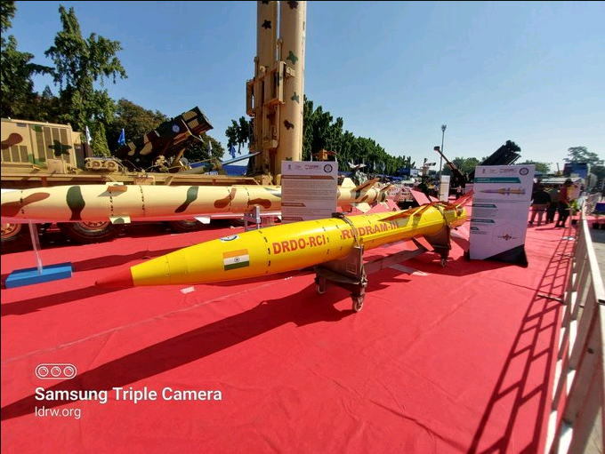

# 针对中国S-400？印度最新国产导弹成功，印媒欢呼“里程碑式突破”

俄乌冲突中，交战双方使用空射反辐射导弹压制对手防空系统的战法让印度军方非常焦虑——印度长期以来都缺乏先进的反辐射导弹。如今印度国防研究与发展组织（DRDO）的最新公告总算让印度空军长出了一口气：印度最新国产反辐射导弹获得成功！印度媒体欢呼：这是里程碑式的突破！

《印度斯坦时报》26日称，印度DRDO在国产武器方面取得了又一个里程碑式突破。DRDO主席卡马特证实了国产Rudram
II反辐射导弹的测试取得成功。这种“超级杀手”导弹是2020年印度首次成功测试的Rudram
I反辐射导弹的升级型号，可以从印度空军装备的法制“幻影-2000”和俄制苏-30MKI战斗机上发射，它标志着印度空军空射火力的“战略性增强”。

印度《欧亚时报》26日称，反辐射导弹在俄乌冲突中已经证明了其有效性，它们的战时表现受到印度国防机构的密切关注。为压制俄军防空系统，美国政府已将AGM-88“哈姆”反辐射导弹提供给乌克兰，由乌军现役米格-29等战斗机发射。而俄军苏-30SM和苏-35战斗机同样经常发射Kh-31P和Kh-58反辐射导弹，以破坏乌军防空雷达的跟踪。报道称，与美国“哈姆”反辐射导弹相比，Kh-31P的体积更大，但它携带的110公斤弹头比“哈姆”反辐射导弹的68公斤弹头重得多，飞行速度也更快，因此Kh-31P的破坏力远大于“哈姆”导弹。

印度媒体披露，2001年印度从俄罗斯采购苏-30MKI战斗机时，也一并购买约90枚Kh-31P导弹。但印度方面认为，俄制Kh-31P反辐射导弹的性能不如预期，再加上装备数量有限，因此印度开始了自行研制反辐射导弹的道路。印度国产RudraM-
I反辐射导弹的研制始于2012年，它采用被动雷达导引头，并有较宽的频段覆盖范围，可以在多频段信号中检测、分类和锁定目标。根据公开报道，该导弹的最大速度为2马赫、发射高度在0.5-1.5万米之间。2020年，印度空军首次使用苏-30MKI战斗机成功发射了RudraM-
I反辐射导弹。

 _印度还在研制Rudram III导弹_

但印度方面对RudraM-I反辐射导弹的性能并不满意，随后又启动了它的深度改进型号。据介绍，这次成功发射的Rudram
II反辐射导弹拥有远达300公里的射程和5.5马赫的飞行速度，这些指标都远超美俄同类导弹，“能够以无以伦比的精度打击遥远的目标”。此外，该导弹还有衍生型号，配备了红外成像导引头，可以携带200公斤的弹头打击飞机跑道、掩体和机库等不同目标。同时DRDO还启动了Rudram
III导弹的研制，它的射程将进一步提升到550公里，并携带更大的弹头，从而“进一步增强印度的威慑能力”。

值得注意的是，印度媒体之前多次渲染“中国将S-400等远程防空系统部署到中印边境地区附近，从而对在该区域活动的印度空军战斗机构成严重威胁”。如今印度媒体欢呼国产反辐射导弹的成功试射，显然意有所指。如果印度媒体的爆料属实，该导弹300公里的超远射程和5.5马赫的高速飞行指标，的确可以极大威胁到地面雷达的生存能力或压缩其开机时间。不过印度在国产武器研制时，夸大性能指标和推迟服役时间已经是司空见惯，因此印度国产反辐射导弹的威胁到底有多大，不妨再等等看。

